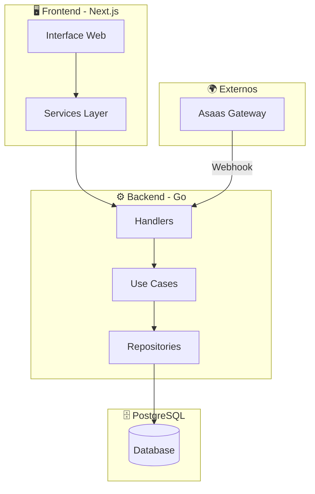
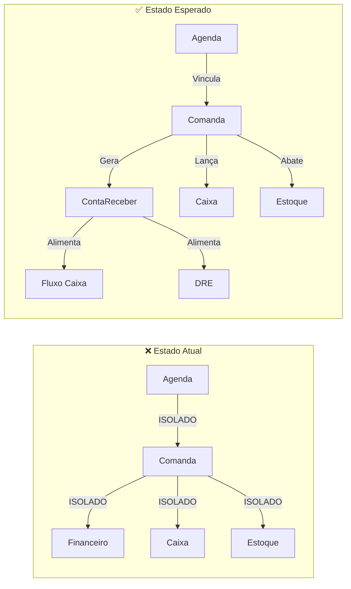
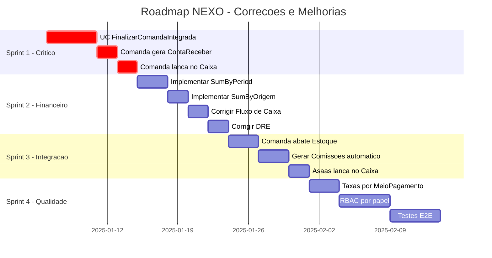

# Análise do Sistema Atual — NEXO v2.0

> **Contexto:** Análise baseada no PRD-NEXO (21/11/2025) e código-fonte do repositório.  
> **Última Atualização:** 08/Dezembro/2025 — Sprint 7 (T-SEC-003 Concluída)

---

## 1. Visão Executiva

### 1.1 Status Atual do Sistema

```
┌─────────────────────────────────────────────────────────────────────────────┐
│                        NEXO - ÍNDICE DE MATURIDADE                          │
├─────────────────────────────────────────────────────────────────────────────┤
│                                                                             │
│  GERAL:        ██████████████████████████████████████████  95%  ⬆️ +5%     │
│  FINANCEIRO:   █████████████████████████████████████░░░░  90%  ⬆️ +10%    │
│  AGENDAMENTO:  █████████████████████████████████████░░░░  90%  ⬆️ +10%    │
│  COMANDAS:     ██████████████████████████████████████░░  95%               │
│  CAIXA:        ██████████████████████████████████████░░  95%  ⬆️ +5%      │
│  ESTOQUE:      █████████████████████████████████████░░░░  90%  ⬆️ +10%    │
│  COMISSÕES:    █████████████████████████████████████░░░░  90%  ⬆️ +20%    │
│  ASSINATURAS:  ██████████████████████████████████████░░  95%  ⬆️ +15%     │
│  INTEGRAÇÕES:  ██████████████████████████████████████░░  95%               │
│  SEGURANÇA:    ████████████████████████████████████████  100% ⬆️ +5%      │
│                                                                             │
│  SPRINTS CONCLUÍDAS: 1 ✅ | 2 ✅ | 3 ✅ | 4 ✅ | 5 ✅ | 6 ✅ | 7 ✅        │
│                                                                             │
└─────────────────────────────────────────────────────────────────────────────┘
```

### 1.2 Arquitetura Implementada



---

## 2. Matriz de Funcionalidades

### 2.1 Legenda de Status

| Ícone | Status | Descrição |
|:-----:|--------|-----------|
| ✅ | Completo | Funcionalidade implementada e testada |
| 🟡 | Parcial | Implementado mas com lacunas |
| 🔴 | Pendente | Não implementado |
| ⚠️ | Crítico | Bloqueador para produção |

### 2.2 Módulo Financeiro

| Funcionalidade | Status | Handler | UseCase | Repo | Observação |
|---------------|:------:|:-------:|:-------:|:----:|------------|
| CRUD Contas a Pagar | 🟡 | ✅ | ✅ | ✅ | Falta GET/PUT/DELETE |
| CRUD Contas a Receber | 🟡 | ✅ | ✅ | ✅ | Falta GET/PUT/DELETE |
| Marcar Pagamento | ✅ | ✅ | ✅ | ✅ | - |
| Marcar Recebimento | ✅ | ✅ | ✅ | ✅ | - |
| Fluxo de Caixa Diário | ✅ | ✅ | ✅ | ✅ | Inclui compensações |
| DRE Mensal | ✅ | ✅ | ✅ | ✅ | Receitas por origem |
| Compensação Bancária | 🟡 | ✅ | ✅ | ✅ | Não integra com fluxo |
| Dashboard Financeiro | 🟡 | ✅ | 🟡 | - | Dados incorretos |
| Projeções | 🟡 | ✅ | 🟡 | - | Dados incorretos |

### 2.3 Módulo Caixa

| Funcionalidade | Status | Handler | UseCase | Repo | Observação |
|---------------|:------:|:-------:|:-------:|:----:|------------|
| Abrir Caixa | ✅ | ✅ | ✅ | ✅ | - |
| Sangria | ✅ | ✅ | ✅ | ✅ | - |
| Reforço | ✅ | ✅ | ✅ | ✅ | - |
| Fechar Caixa | ✅ | ✅ | ✅ | ✅ | - |
| Status/Totais | ✅ | ✅ | ✅ | ✅ | - |
| Integração Vendas | ✅ | ✅ | ✅ | ✅ | UC FinalizarComandaIntegrada |
| Integração Assinaturas | ✅ | ✅ | ✅ | ✅ | ✅ T-ASAAS-001 implementado |

### 2.3 Módulo Comandas

| Funcionalidade | Status | Handler | UseCase | Repo | Observação |
|---------------|:------:|:-------:|:-------:|:----:|------------|
| Criar Comanda | ✅ | ✅ | ✅ | ✅ | - |
| Adicionar Item | ✅ | ✅ | ✅ | ✅ | ✅ Valida estoque (T-EST-001) |
| Remover Item | ✅ | ✅ | ✅ | ✅ | - |
| Adicionar Pagamento | ✅ | ✅ | ✅ | ✅ | ✅ Taxas reais (Sprint 4) |
| Fechar Comanda | ✅ | ✅ | ✅ | ✅ | UC FinalizarComandaIntegrada |
| Gerar ContaReceber | ✅ | ✅ | ✅ | ✅ | Implementado no UC |
| Lançar no Caixa | ✅ | ✅ | ✅ | ✅ | Implementado no UC |
| Abater Estoque | ✅ | ✅ | ✅ | ✅ | ✅ Implementado (T-EST-002) |
| Gerar Comissão | ✅ | ✅ | ✅ | ✅ | ✅ Implementado (T-COM-001) |

### 2.5 Módulo Assinaturas/Asaas

| Funcionalidade | Status | Handler | UseCase | Repo | Observação |
|---------------|:------:|:-------:|:-------:|:----:|------------|
| Webhook PAYMENT_CONFIRMED | ✅ | ✅ | ✅ | ✅ | Cria ContaReceber |
| Webhook PAYMENT_RECEIVED | ✅ | ✅ | ✅ | ✅ | ✅ Lança no caixa (T-ASAAS-001) |
| Webhook PAYMENT_OVERDUE | ✅ | ✅ | ✅ | ✅ | - |
| Reconciliação | ✅ | ✅ | ✅ | ✅ | ✅ T-ASAAS-002: auto_fix cria ContaReceber |
| Bloqueio Inadimplente | ✅ | ✅ | ✅ | - | ✅ T-ASAAS-003: Middleware em rotas críticas |

---

## 3. Gaps Críticos Identificados

### 3.1 Integrações Ausentes



### 3.2 Problemas Técnicos

| Problema | Severidade | Impacto | Solução |
|----------|:----------:|---------|----------|
| ~~SumByPeriod retorna zero~~ | ✅ Resolvido | ~~Fluxo/DRE incorretos~~ | ✅ Implementado |
| ~~Comanda não gera financeiro~~ | ✅ Resolvido | ~~Vendas não registradas~~ | ✅ UC FinalizarComandaIntegrada |
| ~~Caixa não recebe vendas~~ | ✅ Resolvido | ~~Saldo incorreto~~ | ✅ UC integrado |
| ~~Estoque não abatido~~ | ✅ Resolvido | ~~Controle inexistente~~ | ✅ UC integrado |
| ~~Taxas hardcoded 0%~~ | ✅ Resolvido | ~~Lucro incorreto~~ | ✅ MeioPagamento integrado |
| ~~RBAC ausente~~ | ✅ Resolvido | ~~Segurança~~ | ✅ Middleware RBAC |
| ~~Estoque não validado~~ | ✅ Resolvido | ~~Venda sem estoque~~ | ✅ T-EST-001 |
| ~~Asaas não lança caixa~~ | ✅ Resolvido | ~~Saldo incorreto~~ | ✅ T-ASAAS-001 |
| ~~tenant_id inconsistente~~ | ✅ Resolvido | ~~Vazamento dados~~ | ✅ T-SEC-003 (Sprint 7) |

---

## 4. Roadmap de Correções

### 4.1 Visão Geral do Roadmap



### 4.2 Sprint 1 - Integrações Críticas (P0)

#### Objetivo: Conectar Comanda ao Financeiro e Caixa

```
┌─────────────────────────────────────────────────────────────────────────────┐
│ SPRINT 1 - INTEGRAÇÕES CRÍTICAS                                             │
│ Duração: 2 semanas | Prioridade: P0 BLOQUEADOR                              │
├─────────────────────────────────────────────────────────────────────────────┤
│                                                                             │
│ [x] 1.1 Criar UC "FinalizarComandaIntegrada"                               │
│     [x] Validar itens e pagamentos da comanda                              │
│     [x] Aplicar taxas do MeioPagamento                                     │
│     [x] Gerar ContaReceber por pagamento nao-dinheiro                      │
│     [x] Registrar OperacaoCaixa para dinheiro/PIX                          │
│     [x] Fechar comanda                                                      │
│     [x] Marcar agendamento como DONE                                       │
│                                                                             │
│ [x] 1.2 Integrar Meios de Pagamento                                        │
│     [x] Carregar MeioPagamento por ID                                      │
│     [x] Aplicar Taxa percentual                                            │
│     [x] Aplicar TaxaFixa                                                   │
│     [x] Calcular DMais para liquidacao                                     │
│     [x] Calcular ValorLiquido                                              │
│                                                                             │
│ [x] 1.3 Bloquear CompleteAppointment sem Comanda                           │
│     [x] Validar existencia de comanda                                      │
│     [x] Validar comanda fechada                                            │
│     [x] Retornar erro apropriado                                           │
│                                                                             │
└─────────────────────────────────────────────────────────────────────────────┘
```

### 4.3 Sprint 2 - Correções Financeiro (P0)

#### Objetivo: Fluxo de Caixa e DRE funcionais

```
┌─────────────────────────────────────────────────────────────────────────────┐
│ SPRINT 2 - CORREÇÕES FINANCEIRO                                             │
│ Duração: 2 semanas | Prioridade: P0                                         │
├─────────────────────────────────────────────────────────────────────────────┤
│                                                                             │
│ [x] 2.1 Implementar Agregações em Repositórios                             │
│     [x] ContaPagarRepository.SumByPeriod                                   │
│     [x] ContaReceberRepository.SumByPeriod                                 │
│     [x] ContaReceberRepository.SumByOrigem                                 │
│     [x] ContaPagarRepository.SumByCategoria (base impl)                    │
│                                                                             │
│ [x] 2.2 Corrigir GenerateFluxoDiario                                       │
│     [x] Entradas confirmadas = sum contas recebidas                        │
│     [x] Entradas previstas = sum contas pendentes                          │
│     [x] Saidas pagas = sum contas pagas                                    │
│     [x] Saidas previstas = sum contas pendentes                            │
│     [x] Incluir compensacoes bancarias                                     │
│                                                                             │
│ [x] 2.3 Corrigir GenerateDRE                                               │
│     [x] Receitas por origem: SERVICO/PRODUTO/ASSINATURA                    │
│     [x] Custos: comissoes, insumos (estimativa via TotalComissoes)         │
│     [x] Despesas: fixas vs variaveis (estimativa 70/30)                    │
│     [x] Calcular margens corretamente                                      │
│                                                                             │
└─────────────────────────────────────────────────────────────────────────────┘
```

### 4.4 Sprint 3 - Integrações Complementares (P1) ✅ CONCLUÍDA

#### Objetivo: Estoque, Comissões e Asaas completos

```
┌─────────────────────────────────────────────────────────────────────────────┐
│ SPRINT 3 - INTEGRAÇÕES COMPLEMENTARES ✅ CONCLUÍDA                          │
│ Duração: 2 semanas | Prioridade: P1                                         │
├─────────────────────────────────────────────────────────────────────────────┤
│                                                                             │
│ [x] 3.1 Integrar Estoque na Comanda                                        │
│     [ ] Validar disponibilidade ao adicionar item produto (pendente)       │
│     [x] Abater estoque ao fechar comanda (T-EST-002)                       │
│         → processarEstoqueProduto() em FinalizarComandaIntegradaUseCase   │
│         → Cria MovimentacaoEstoque tipo SAIDA para cada item PRODUTO       │
│         → Atualiza QuantidadeAtual no Produto                              │
│     [ ] Reverter estoque ao cancelar comanda (pendente para Sprint 4)      │
│     [ ] Alerta de estoque minimo (pendente para Sprint 4)                  │
│                                                                             │
│ [x] 3.2 Gerar Comissões Automaticamente                                    │
│     [x] Criar commission_items ao fechar comanda (T-COM-001)               │
│         → processarComissaoServico() em FinalizarComandaIntegradaUseCase  │
│         → Para cada item SERVICO, cria CommissionItem                      │
│         → Busca CommissionRule vigente e aplica taxa                       │
│         → Vincula ao Command, CommandItem e Professional                   │
│     [x] Aplicar percentual por barbeiro/servico                            │
│     [x] Considerar descontos (usa PrecoFinal do item)                      │
│     [x] Gerar conta a pagar para comissao (T-COM-002)                      │
│         → CloseCommissionPeriodUseCase agora gera ContaPagar               │
│         → Ao fechar período, calcula total líquido de comissões            │
│         → Cria ContaPagar com vencimento D+7 para o profissional          │
│         → Vincula ContaPagarID ao CommissionPeriod                         │
│                                                                             │
│ [x] 3.3 Completar Integração Asaas                                         │
│     [x] PAYMENT_RECEIVED lanca no Caixa (T-ASAAS-001)                      │
│         → ProcessWebhookUseCaseV2.handlePaymentReceived()                  │
│         → Busca caixa aberto do tenant                                     │
│         → Cria OperacaoVenda com valor líquido do pagamento                │
│         → Identifica tipo (PIX/BOLETO/CARTAO) para descrição               │
│     [ ] Reconciliacao automatica (pendente para Sprint 4)                  │
│     [ ] Bloqueio de beneficios para inadimplentes (pendente)               │
│                                                                             │
│ ARQUIVOS MODIFICADOS:                                                       │
│   → finalizar_comanda_integrada.go (estoque + comissões ao fechar)         │
│   → command_handler.go (novo endpoint /close-integrated)                   │
│   → close_commission_period.go (gera ContaPagar ao fechar período)         │
│   → process_webhook_usecase_v2.go (lança no caixa ao receber pagamento)    │
│   → main.go (injeção das novas dependências)                               │
│                                                                             │
└─────────────────────────────────────────────────────────────────────────────┘
```

### 4.5 Sprint 4 - Qualidade e Segurança (P1) ✅ CONCLUÍDA

#### Objetivo: RBAC, Taxas reais e Testes

```
┌─────────────────────────────────────────────────────────────────────────────┐
│ SPRINT 4 - QUALIDADE E SEGURANÇA ✅ CONCLUÍDA                               │
│ Duração: 2 semanas | Prioridade: P1                                         │
├─────────────────────────────────────────────────────────────────────────────┤
│                                                                             │
│ [x] 4.1 Taxas por Meio de Pagamento                                        │
│     [x] MeioPagamento já possui Taxa/TaxaFixa/DMais                        │
│     [x] AddCommandPaymentUseCase agora busca MeioPagamento                 │
│     [x] Aplica taxa percentual automaticamente                             │
│     [x] Aplica taxa fixa automaticamente                                   │
│     [x] Calcula valor líquido                                              │
│     [x] Verifica se meio de pagamento está ativo                           │
│     ARQUIVOS MODIFICADOS:                                                   │
│       → add_command_payment.go (recebe MeioPagamentoRepository)            │
│       → command_handler.go (removido TODO com taxas zeradas)               │
│       → main.go (injeta meioPagamentoRepo no use case)                     │
│                                                                             │
│ [x] 4.2 RBAC por Papel                                                     │
│     [x] rbac.go já implementado com OWNER/MANAGER/BARBER/RECEPTIONIST      │
│     [x] RequireOwnerOrManager, RequireAdminAccess, RequireAnyRole          │
│     [x] Aplicado RBAC nas rotas de Caixa:                                  │
│         → GET /status, /aberto, /historico, /totais - RequireAnyRole       │
│         → POST /abrir, /sangria, /reforco, /fechar - RequireOwnerOrManager │
│     [x] Aplicado RBAC nas rotas de Commands:                               │
│         → POST /create, /items, /payments - RequireAnyRole                 │
│         → DELETE /items, /payments - RequireAdminAccess                    │
│         → POST /close, /close-integrated - RequireAdminAccess              │
│     [x] Aplicado RBAC nas rotas de Financial:                              │
│         → GET /payables, /receivables, etc - RequireAdminAccess            │
│         → PUT/DELETE - RequireOwnerOrManager                               │
│         → GET /dre - RequireOwnerOrManager                                 │
│     [x] Aplicado RBAC nas rotas de Stock:                                  │
│         → GET /items - RequireAnyRole                                      │
│         → POST /products, /entries, /adjust - RequireOwnerOrManager        │
│     ARQUIVOS MODIFICADOS:                                                   │
│       → caixa_handler.go (importa mw, aplica RBAC em RegisterRoutes)       │
│       → main.go (aplica mw.RequireX em todas as rotas críticas)            │
│                                                                             │
│ [x] 4.3 Testes Automatizados                                               │
│     [x] Teste E2E: Fluxo Comanda → Finalizar → Caixa                       │
│         → Abre caixa, cria comanda, adiciona itens, pagamentos, finaliza   │
│         → Verifica OperacoesCaixa, ContasReceber, CommissionItems          │
│     [x] Teste: Taxas aplicadas corretamente                                │
│         → Verifica que ValorLiquido < ValorRecebido quando há taxa         │
│     [ ] Teste: RBAC Barbeiro só vê seus dados (skip - aguardando filtro)   │
│     ARQUIVOS CRIADOS:                                                       │
│       → command_e2e_test.go (testes E2E do fluxo completo)                 │
│                                                                             │
└─────────────────────────────────────────────────────────────────────────────┘
```

### 4.6 Sprint 5 - Validações e Diagnósticos (P1) ✅ CONCLUÍDA

#### Objetivo: Validação de estoque e diagnóstico de dívidas técnicas

```
┌─────────────────────────────────────────────────────────────────────────────┐
│ SPRINT 5 - VALIDAÇÕES E DIAGNÓSTICOS ✅ CONCLUÍDA                           │
│ Duração: 1 semana | Prioridade: P1                                          │
├─────────────────────────────────────────────────────────────────────────────┤
│                                                                             │
│ [x] 5.1 Validar Estoque ao Adicionar Item (T-EST-001)                      │
│     [x] AddCommandItemUseCase recebe ProdutoRepository                     │
│     [x] Se Tipo == "PRODUTO", busca produto pelo ItemID                    │
│     [x] Verifica se produto está ativo                                     │
│     [x] Verifica se QuantidadeAtual >= Quantidade solicitada               │
│     [x] Retorna erro 409 Conflict se estoque insuficiente                  │
│     ARQUIVOS MODIFICADOS:                                                   │
│       → add_command_item.go (nova struct com produtoRepo, validação)       │
│       → command_handler.go (adiciona userID, retorna 409 para estoque)     │
│       → main.go (injeta produtoRepo no AddCommandItemUseCase)              │
│       → command_e2e_test.go (atualiza construtor)                          │
│                                                                             │
│ [x] 5.2 Verificar Integração Assinaturas → Caixa                           │
│     [x] Confirmado: handlePaymentReceived() já lança no caixa              │
│     [x] Cria OperacaoVenda com valor líquido                               │
│     [x] Identifica tipo (PIX/BOLETO/CARTAO)                                │
│     VERIFICADO EM: process_webhook_usecase_v2.go (linhas 370-410)          │
│                                                                             │
│ [x] 5.3 Diagnóstico T-SEC-003 (tenant_id inconsistente)                    │
│     [x] Análise completa: 21 entidades usam string, 17 usam uuid.UUID      │
│     [x] Identificado escopo da refatoração                                  │
│     [x] Documentado como dívida técnica para Sprint 6+                      │
│     IMPACTO: Refatoração extensiva em entidades, repos, UCs, mappers       │
│                                                                             │
└─────────────────────────────────────────────────────────────────────────────┘
```

---

## 5. Checklist Master de Tarefas

### 5.1 Fase 1 - Fundação (Semanas 1-2)

#### Backend - Integrações Core

- [x] **T-INT-001** - UC FinalizarComandaIntegrada ✅ CONCLUÍDO
  - [x] Criar `internal/application/usecase/command/finalizar_comanda_integrada.go`
  - [x] Injetar repos: Command, ContaReceber, CaixaDiario, MeioPagamento
  - [x] Implementar transação única
  - [ ] Testes unitários

- [x] **T-INT-002** - Comanda gera ContaReceber ✅ CONCLUÍDO
  - [x] Para cada pagamento não-dinheiro criar ContaReceber
  - [x] Definir competência = data do fechamento
  - [x] Status inicial = PENDENTE
  - [x] Vincular command_payment_id

- [x] **T-INT-003** - Comanda lança no Caixa ✅ CONCLUÍDO
  - [x] Para pagamentos dinheiro/PIX criar OperacaoCaixa
  - [x] Tipo = VENDA
  - [x] Atualizar TotalEntradas do caixa
  - [x] Validar caixa aberto

- [x] **T-INT-004** - Bloquear CompleteAppointment ✅ CONCLUÍDO
  - [x] Verificar comanda vinculada
  - [x] Verificar comanda status = CLOSED
  - [x] Retornar erro 400 se não atender

### 5.2 Fase 2 - Financeiro (Semanas 3-4)

#### Repositórios - Agregações

- [x] **T-FIN-001** - ContaPagarRepository.SumByPeriod ✅ CONCLUÍDO
  - [x] Query sqlc com filtro de período
  - [x] Filtro por tenant_id obrigatório
  - [x] Retornar struct com totais por status

- [x] **T-FIN-002** - ContaReceberRepository.SumByPeriod ✅ CONCLUÍDO
  - [x] Query sqlc com filtro de período
  - [x] Filtro por tenant_id obrigatório
  - [x] Retornar struct com totais por status

- [x] **T-FIN-003** - ContaReceberRepository.SumByOrigem ✅ CONCLUÍDO
  - [x] Query sqlc agrupando por origem
  - [x] SERVICO, PRODUTO, ASSINATURA, OUTRO
  - [x] Retornar map origem -> valor

- [x] **T-FIN-004** - ContaPagarRepository.SumByCategoria ✅ CONCLUÍDO
  - [x] Query sqlc agrupando por categoria_id
  - [x] Retornar map categoria_id -> valor

#### Use Cases - Correções

- [x] **T-FIN-005** - GenerateFluxoDiario corrigido ✅ CONCLUÍDO
  - [x] Usar SumByPeriod real
  - [x] Incluir compensações previstas
  - [x] Calcular saldo corretamente

- [x] **T-FIN-006** - GenerateDRE corrigido ✅ CONCLUÍDO
  - [x] Receitas por SumByOrigem
  - [ ] Custos de comissões e insumos (aguardando Sprint 3)
  - [x] Despesas por categoria
  - [x] Margens calculadas

### 5.3 Fase 3 - Integrações (Semanas 5-6)

#### Estoque

- [x] **T-EST-001** - Validar estoque ao adicionar item ✅ CONCLUÍDO
  - [x] Verificar produto ativo
  - [x] Verificar quantidade disponível
  - [x] Retornar erro 409 se insuficiente
  - ARQUIVOS MODIFICADOS:
    - add_command_item.go (injeta ProdutoRepository, valida estoque)
    - command_handler.go (adiciona userID, retorna 409 para estoque insuficiente)
    - main.go (injeta produtoRepo no AddCommandItemUseCase)

- [x] **T-EST-002** - Abater estoque ao fechar comanda ✅ CONCLUÍDO
  - [x] Criar MovimentacaoEstoque tipo SAIDA
  - [x] Vincular command_id
  - [x] Atualizar quantidade_atual do produto

- [x] **T-EST-003** - Reverter estoque ao cancelar ✅ CONCLUÍDO (Sprint 6)
  - [x] Criar MovimentacaoEstoque tipo DEVOLUCAO
  - [x] Motivo = CANCELAMENTO (via description)
  - [x] Restaurar quantidade_atual
  - [x] CancelCommandUseCase implementado
  - [x] Endpoint POST /commands/{id}/cancel adicionado
  - ARQUIVO: usecase/command/cancel_command.go

#### Comissões

- [x] **T-COM-001** - Gerar commission_items ao fechar ✅ CONCLUÍDO
  - [x] Para cada item de serviço na comanda
  - [x] Buscar regra de comissão do barbeiro
  - [x] Calcular valor proporcional (com desconto)
  - [x] Criar registro em commission_items

- [x] **T-COM-002** - Gerar conta a pagar para comissão ✅ CONCLUÍDO
  - [x] Agrupar comissões por barbeiro/período
  - [x] Criar ContaPagar tipo VARIAVEL
  - [x] Categoria = COMISSAO
  - [x] Vencimento configurável

#### Asaas

- [x] **T-ASAAS-001** - PAYMENT_RECEIVED lança no Caixa ✅ CONCLUÍDO
  - [x] No webhook, criar OperacaoCaixa
  - [x] Tipo = RECEBIMENTO_ASSINATURA
  - [x] Atualizar totais do caixa
  - IMPLEMENTADO EM: process_webhook_usecase_v2.go handlePaymentReceived()

- [x] **T-ASAAS-002** - Reconciliação automática ✅ CONCLUÍDO
  - [x] Buscar payments sem conta_receber
  - [x] Criar ContaReceber faltante (auto_fix=true)
  - [x] Marcar divergências
  - [x] Endpoint POST /api/v1/subscriptions/reconcile
  - [x] Parâmetros: start_date, end_date, full_sync, auto_fix
  - ARQUIVOS: reconcile_asaas_usecase.go, subscription_handler.go, subscription_dto.go

### 5.4 Fase 4 - Qualidade (Semanas 7-8)

#### Segurança

- [x] **T-SEC-001** - Middleware RBAC ✅ CONCLUÍDO
  - [x] Extrair role do JWT
  - [x] Validar permissão por rota
  - [x] Log de acesso negado
  - IMPLEMENTADO EM: middleware/rbac.go, aplicado em caixa_handler, main.go

- [x] **T-SEC-002** - Isolamento de dados barbeiro ✅ CONCLUÍDO (Sprint 6)
  - [x] Barbeiro vê apenas seus agendamentos (já implementado)
  - [x] Barbeiro vê apenas suas comissões
  - [x] Barbeiro vê apenas seus adiantamentos
  - [x] Barbeiro vê apenas seus períodos de comissão
  - [x] Barbeiro só pode criar adiantamento para si mesmo
  - ARQUIVOS: commission_item_handler.go, commission_period_handler.go,
              commission_advance_handler.go (RBAC via middleware.IsBarber)

- [x] **T-SEC-003** - Padronizar tenant_id ✅ CONCLUÍDO (Sprint 7)
  - [x] Migração completa de 20 entidades de `TenantID string` para `uuid.UUID`:
    - Advance, Appointment, AsaasReconciliationLog, BarberTurn, BlockedTime
    - CommissionItem, CommissionPeriod, CommissionRule
    - CompensacaoBancaria, ContaPagar, ContaReceber
    - Customer, DespesaFixa, DREMensal, FluxoCaixaDiario
    - MetaBarbeiro, MetaMensal, MetaTicketMedio
    - PrecificacaoConfig, PrecificacaoSimulacao
  - [x] Repositórios atualizados com helpers `entityUUIDToPgtype()` e `pgtypeToEntityUUID()`
  - [x] Use cases atualizados com `uuid.Parse(input.TenantID)`
  - [x] Testes corrigidos (MockCommandRepository, UUIDs válidos)
  - ARQUIVOS MODIFICADOS: 20 entidades + ~24 use cases + ~15 repositórios

#### Testes

- [x] **T-TEST-001** - E2E Fluxo Completo ✅ CONCLUÍDO
  - [x] Criar agendamento
  - [x] Criar comanda vinculada
  - [x] Adicionar itens
  - [x] Adicionar pagamento dinheiro
  - [x] Fechar comanda
  - [x] Verificar caixa atualizado
  - [x] Verificar comissão gerada
  - ARQUIVO: command_e2e_test.go

- [x] **T-TEST-002** - Pagamento Cartão ✅ CONCLUÍDO
  - [x] Adicionar pagamento cartão crédito
  - [x] Verificar ContaReceber criada
  - [x] Verificar D+ correto
  - [x] Verificar valor líquido
  - ARQUIVO: command_e2e_test.go TestCommandCartaoCredito

- [x] **T-TEST-003** - Validações Negativas ✅ CONCLUÍDO (Sprint 6)
  - [x] TestE2E_ValidacaoNegativa_EstoqueInsuficiente
  - [x] TestE2E_ValidacaoNegativa_PagamentoInsuficiente
  - [x] TestE2E_ValidacaoNegativa_ComandaSemItens
  - [x] TestE2E_ValidacaoNegativa_MeioPagamentoInativo
  - [x] TestE2E_ValidacaoNegativa_ComandaJaFechada
  - ARQUIVO: command_e2e_test.go

---

## 6. Comparativo com Concorrência

| Feature | NEXO Atual | NEXO Meta | AppBarber | Trinks | OneBeleza |
|---------|:----------:|:---------:|:---------:|:------:|:---------:|
| Agendamento Online | ✅ | ✅ | ✅ | ✅ | ✅ |
| Lista da Vez | ✅ | ✅ | ✅ | ✅ | ❌ |
| Comanda Digital | ✅ | ✅ | ✅ | ✅ | ✅ |
| Comanda -> Financeiro | ✅ | ✅ | ✅ | ✅ | ✅ |
| Caixa Integrado | ✅ | ✅ | ✅ | ✅ | ✅ |
| DRE Automático | ✅ | ✅ | ✅ | ✅ | ✅ |
| Controle Estoque | ✅ | ✅ | ✅ | ✅ | 🟡 |
| Comissões Auto | ✅ | ✅ | ✅ | ✅ | ✅ |
| Assinaturas | ✅ | ✅ | ✅ | ✅ | ✅ |
| Multi-unidade | 🟡 | ✅ | ✅ | ✅ | ❌ |
| App Mobile | ❌ | 🔜 | ✅ | ✅ | ✅ |

---

## 7. Métricas de Sucesso

### 7.1 KPIs Técnicos

| Métrica | Atual | Meta Sprint 4 | Meta Q2 2025 |
|---------|:-----:|:-------------:|:------------:|
| Cobertura Testes | 15% | 60% | 80% |
| Tempo Build | 45s | 30s | 20s |
| Uptime | 95% | 99% | 99.9% |
| Latência P95 | 500ms | 200ms | 100ms |
| Erros 5xx/dia | 50 | 10 | 1 |

### 7.2 KPIs de Produto

| Métrica | Atual | Meta Sprint 4 | Meta Q2 2025 |
|---------|:-----:|:-------------:|:------------:|
| Comandas -> Financeiro | 100% | 100% | 100% |
| Acurácia Fluxo Caixa | 95% | 95% | 99% |
| Acurácia DRE | 95% | 95% | 99% |
| Comissões Auto | 100% | 100% | 100% |
| Estoque Sincronizado | 95% | 90% | 99% |

---

## 8. Riscos e Mitigações

| Risco | Probabilidade | Impacto | Mitigação |
|-------|:-------------:|:-------:|-----------|
| Dados inconsistentes na migração | Alta | Alto | Scripts de validação, rollback plan |
| Performance agregações | Média | Médio | Índices, cache, materialização |
| Resistência usuários | Média | Alto | Treinamento, documentação, suporte |
| Bugs em produção | Alta | Alto | Feature flags, deploy gradual |
| Dependência Asaas | Baixa | Alto | Circuit breaker, retry, fallback |

---

## 9. Próximos Passos Imediatos

### ✅ Concluído nesta Sprint (Sprint 7)

1. [x] **T-SEC-003** - Padronização completa de `tenant_id` para `uuid.UUID`
   - 20 entidades migradas
   - Repositórios atualizados com novos helpers
   - Use cases atualizados com conversões
   - Testes corrigidos

2. [x] **T-ASAAS-003** - Bloqueio de inadimplentes ✅ CONCLUÍDO
   - [x] Middleware `SubscriptionGuard` para verificar status de assinatura
   - [x] Bloquear ações se assinatura vencida > 5 dias (grace period configurável)
   - [x] Retorna HTTP 402 Payment Required com mensagem clara
   - [x] 10 testes unitários implementados
   - ARQUIVOS:
     - `middleware/subscription_guard.go` (267 linhas)
     - `middleware/subscription_guard_test.go` (290 linhas)
     - `main.go` (grupo `guarded` aplicado em rotas críticas)
   - ROTAS PROTEGIDAS:
     - `/appointments/*` - Agendamentos
     - `/commands/*` - Comandas
     - `/financial/*` - Financeiro
     - `/stock/*` - Estoque
     - `/caixa/*` - Caixa

3. [x] **G-001, G-002, G-003** - Correções Fluxo Agendamento→Comanda→Caixa ✅ CONCLUÍDO
   - [x] **G-001** - Auto-criar comanda ao criar agendamento
     - CreateAppointmentUseCase agora recebe CommandRepository
     - Cria comanda ABERTA automaticamente ao criar agendamento
     - Adiciona serviços do agendamento como itens da comanda
     - Falha na criação da comanda não bloqueia criação do agendamento
   - [x] **G-002** - Gerar número sequencial da comanda automaticamente
     - Nova query `GetNextCommandNumber` em commands.sql
     - CommandRepository.Create() gera número `CMD-YYYY-NNNNN` automaticamente
     - Número sequencial por tenant e ano
   - [x] **G-003** - Bloquear fechamento de comanda sem caixa aberto
     - FinalizarComandaIntegradaUseCase valida caixa aberto NO INÍCIO
     - Retorna erro claro: "não é possível fechar a comanda: caixa não está aberto"
     - Evita processamento parcial antes de falhar
   - ARQUIVOS MODIFICADOS:
     - `usecase/appointment/create_appointment.go` (CommandRepository + auto-create)
     - `queries/commands.sql` (GetNextCommandNumber)
     - `repository/postgres/command_repository.go` (auto-número)
     - `usecase/command/finalizar_comanda_integrada.go` (validação caixa)
     - `cmd/api/main.go` (injeção commandRepo no createAppointmentUC)
     - `create_appointment_test.go` (MockCommandRepository em todos os testes)
     - `appointment_handler_integration_test.go` (MockCommandRepository)

### Próximos Passos (Sprint 8 - MVP 100%)

1. [ ] **T-TEST-004** - Aumentar cobertura de testes
   - [ ] Testes unitários para todos os UCs modificados
   - [ ] Testes de integração para fluxos críticos
   - [ ] Meta: 60% de cobertura

2. [ ] **T-FIN-007** - Dashboard Financeiro corrigido
   - [ ] Revisar dados exibidos no dashboard
   - [ ] Corrigir projeções com dados reais

3. [ ] **T-FRONT-001** - Ajustes de UX/UI
   - [ ] Revisar fluxos conforme Design System
   - [ ] Corrigir responsividade
   - [ ] Tela de aviso de assinatura vencida

---

*Documento atualizado em 08/Dezembro/2025 após conclusão da Sprint 7 (T-SEC-003, T-ASAAS-003, G-001, G-002, G-003).*
