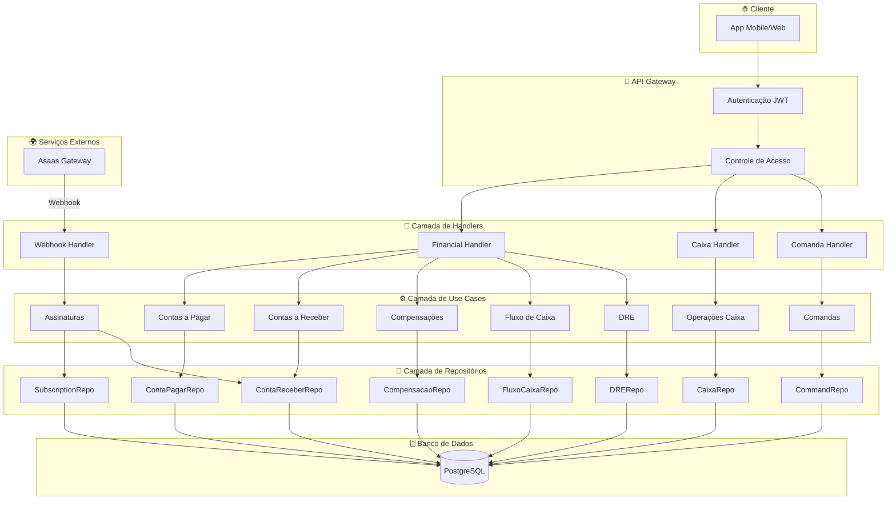
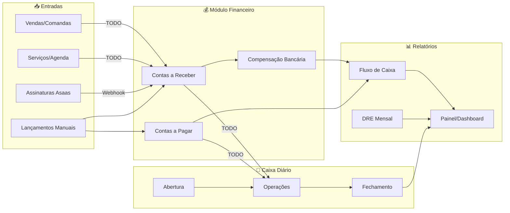
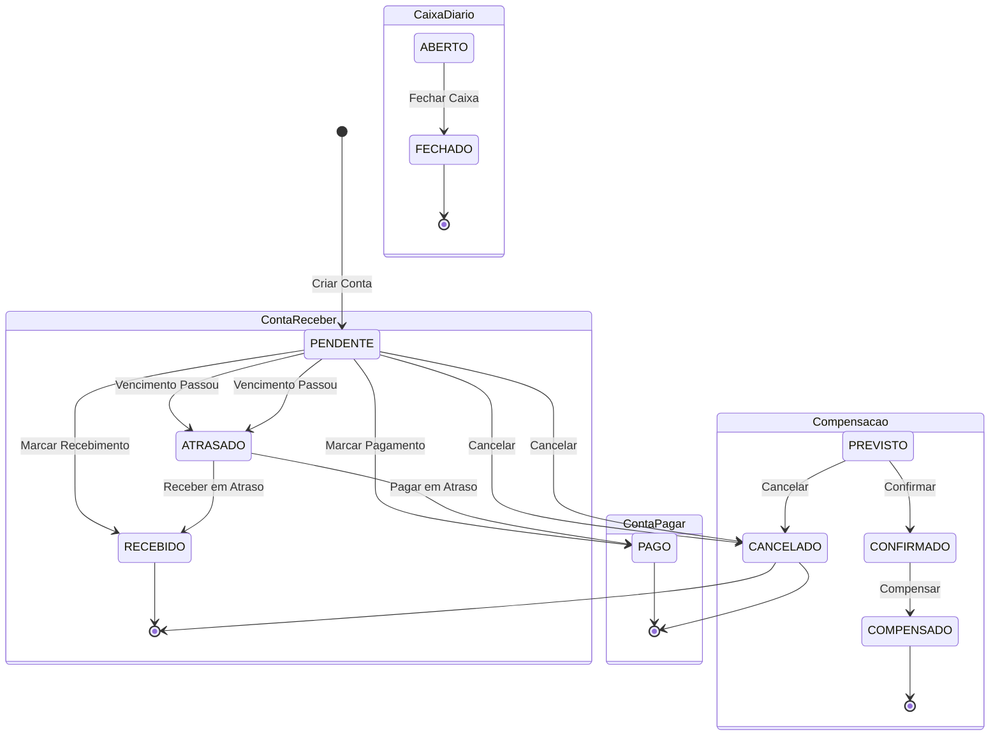
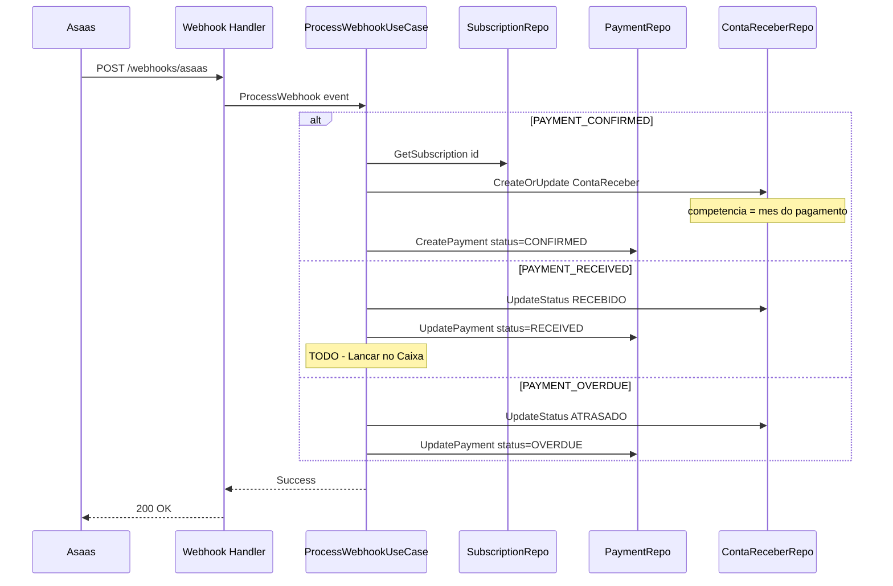
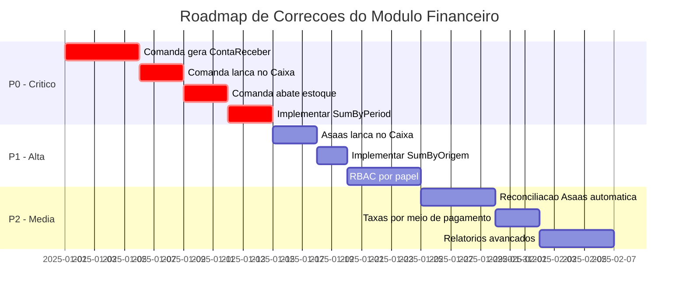

# Mapa do Módulo Financeiro — NEXO

> Fonte: código backend (handlers, use cases, entidades, repositórios) e rotas registradas em `cmd/api/main.go`.

---

## 1. Arquitetura de Alto Nível



---

## 2. Fluxo de Dados Detalhado



---

## 3. Ciclo de Vida das Entidades



---

## 4. Mapa de Rotas da API

### 4.1 Financial `/api/v1/financial`

| Método | Endpoint | Descrição |
|--------|----------|-----------|
| POST | `/payables` | Criar conta a pagar |
| GET | `/payables` | Listar contas a pagar |
| GET | `/payables/:id` | Buscar conta a pagar |
| PUT | `/payables/:id` | Atualizar conta a pagar |
| DELETE | `/payables/:id` | Excluir conta a pagar |
| POST | `/payables/:id/payment` | Marcar como pago |
| POST | `/receivables` | Criar conta a receber |
| GET | `/receivables` | Listar contas a receber |
| GET | `/receivables/:id` | Buscar conta a receber |
| PUT | `/receivables/:id` | Atualizar conta a receber |
| DELETE | `/receivables/:id` | Excluir conta a receber |
| POST | `/receivables/:id/receipt` | Marcar como recebido |
| GET | `/compensations` | Listar compensações |
| GET | `/compensations/:id` | Buscar compensação |
| DELETE | `/compensations/:id` | Excluir compensação |
| GET | `/cashflow` | Listar fluxo de caixa |
| GET | `/cashflow/:id` | Buscar fluxo específico |
| GET | `/dre` | Listar DREs |
| GET | `/dre/:month` | Buscar DRE do mês |
| GET | `/dashboard` | Painel financeiro |
| GET | `/projections` | Projeções financeiras |

### 4.2 Caixa `/api/v1/caixa`

| Método | Endpoint | Descrição |
|--------|----------|-----------|
| POST | `/abrir` | Abrir caixa |
| POST | `/sangria` | Registrar sangria |
| POST | `/reforco` | Registrar reforço |
| POST | `/fechar` | Fechar caixa |
| GET | `/status` | Status do caixa |
| GET | `/aberto` | Caixa aberto atual |
| GET | `/historico` | Histórico de caixas |
| GET | `/totais` | Totais do caixa |

### 4.3 Comandas `/api/v1/commands`

| Método | Endpoint | Descrição |
|--------|----------|-----------|
| POST | `/` | Criar comanda |
| GET | `/:id` | Buscar comanda |
| POST | `/:id/items` | Adicionar item |
| DELETE | `/:id/items/:itemId` | Remover item |
| POST | `/:id/payments` | Adicionar pagamento |
| DELETE | `/:id/payments/:paymentId` | Remover pagamento |
| POST | `/:id/close` | Fechar comanda |

---

## 5. Entidades de Domínio

### 5.1 Conta a Pagar

```
┌─────────────────────────────────────────────────────────────┐
│ ContaPagar                                                  │
├─────────────────────────────────────────────────────────────┤
│ • id: UUID                                                  │
│ • tenant_id: UUID                                           │
│ • categoria_id: UUID                                        │
│ • fornecedor: string                                        │
│ • descricao: string                                         │
│ • valor: Money                                              │
│ • tipo: FIXO | VARIAVEL                                     │
│ • recorrente: boolean                                       │
│ • vencimento: date                                          │
│ • pagamento: date?                                          │
│ • status: PENDENTE | PAGO | CANCELADO | ATRASADO            │
│ • pix_code: string?                                         │
│ • comprovante_url: string?                                  │
└─────────────────────────────────────────────────────────────┘
```

### 5.2 Conta a Receber

```
┌─────────────────────────────────────────────────────────────┐
│ ContaReceber                                                │
├─────────────────────────────────────────────────────────────┤
│ • id: UUID                                                  │
│ • tenant_id: UUID                                           │
│ • origem: ASSINATURA | SERVICO | OUTRO                      │
│ • assinatura_id: UUID?                                      │
│ • subscription_id: string?                                  │
│ • valor: Money                                              │
│ • valor_pago: Money                                         │
│ • valor_aberto: Money                                       │
│ • vencimento: date                                          │
│ • recebimento: date?                                        │
│ • status: PENDENTE | RECEBIDO | CANCELADO | ATRASADO        │
│ • asaas_payment_id: string?                                 │
│ • confirmed_at: timestamp?                                  │
│ • received_at: timestamp?                                   │
│ • competencia_mes: string?                                  │
└─────────────────────────────────────────────────────────────┘
```

### 5.3 Compensação Bancária

```
┌─────────────────────────────────────────────────────────────┐
│ CompensacaoBancaria                                         │
├─────────────────────────────────────────────────────────────┤
│ • id: UUID                                                  │
│ • receita_id: UUID                                          │
│ • d_mais: int - D+1, D+30                                   │
│ • taxa_percentual: Percentage                               │
│ • taxa_fixa: Money                                          │
│ • valor_liquido: Money                                      │
│ • data_prevista: date                                       │
│ • data_compensacao: date?                                   │
│ • status: PREVISTO | CONFIRMADO | COMPENSADO | CANCELADO    │
└─────────────────────────────────────────────────────────────┘
```

### 5.4 Fluxo de Caixa Diário

```
┌─────────────────────────────────────────────────────────────┐
│ FluxoCaixaDiario                                            │
├─────────────────────────────────────────────────────────────┤
│ • id: UUID                                                  │
│ • tenant_id: UUID                                           │
│ • data: date                                                │
│ • saldo_inicial: Money                                      │
│ • entradas_confirmadas: Money                               │
│ • entradas_previstas: Money                                 │
│ • saidas_pagas: Money                                       │
│ • saidas_previstas: Money                                   │
│ • saldo_final: Money                                        │
└─────────────────────────────────────────────────────────────┘
```

### 5.5 DRE Mensal

```
┌─────────────────────────────────────────────────────────────┐
│ DREMensal                                                   │
├─────────────────────────────────────────────────────────────┤
│ • id: UUID                                                  │
│ • tenant_id: UUID                                           │
│ • mes: string - YYYY-MM                                     │
│ • receita_servicos: Money                                   │
│ • receita_produtos: Money                                   │
│ • receita_planos: Money                                     │
│ • receita_total: Money                                      │
│ • custo_comissoes: Money                                    │
│ • custo_insumos: Money                                      │
│ • custo_total: Money                                        │
│ • despesas_fixas: Money                                     │
│ • despesas_variaveis: Money                                 │
│ • despesas_total: Money                                     │
│ • lucro_bruto: Money                                        │
│ • lucro_liquido: Money                                      │
│ • margem_bruta: Percentage                                  │
│ • margem_liquida: Percentage                                │
└─────────────────────────────────────────────────────────────┘
```

---

## 6. Integrações

### 6.1 Webhook Asaas - Fluxo de Processamento



---

## 7. Análise de Gaps e Melhorias

### 7.1 Matriz de Integrações - Atual vs Esperado

| Origem | Gera Conta Receber | Lança no Caixa | Abate Estoque | Status |
|--------|-------------------|----------------|---------------|--------|
| Comanda/Venda | ❌ Não | ❌ Não | ❌ Não | 🔴 Crítico |
| Serviço/Agenda | ❌ Não | ❌ Não | N/A | 🔴 Crítico |
| Assinatura Asaas | ✅ Sim | ❌ Não | N/A | 🟡 Parcial |
| Lançamento Manual | ✅ Sim | ❌ Não | N/A | 🟡 Parcial |

### 7.2 Funcionalidades Pendentes

| Área | Funcionalidade | Status | Prioridade |
|------|---------------|--------|------------|
| Comanda | Gerar ContaReceber ao fechar | ❌ | P0 |
| Comanda | Lançar operação no Caixa | ❌ | P0 |
| Comanda | Abater estoque de produtos | ❌ | P0 |
| Fluxo Caixa | SumByPeriod implementado | ❌ | P0 |
| DRE | SumByOrigem/Categoria | ❌ | P1 |
| Asaas | Lançar no Caixa ao RECEIVED | ❌ | P1 |
| Asaas | Reconciliação automática | ❌ | P2 |
| RBAC | Controle por papel | ❌ | P1 |
| Taxas | Taxas por meio de pagamento | ❌ | P2 |

---

## 8. Conclusão Executiva

### 8.1 Diagnóstico

O módulo financeiro do NEXO possui a **estrutura arquitetural correta** (Clean Architecture com handlers, use cases e repositories), mas apresenta **lacunas críticas de integração** entre os módulos operacionais (Comanda, Agenda, Estoque) e o financeiro (Contas, Caixa, DRE).

### 8.2 Índice de Maturidade

```
┌────────────────────────────────────────────────────────────┐
│ MATURIDADE DO MÓDULO FINANCEIRO                            │
├────────────────────────────────────────────────────────────┤
│                                                            │
│  ████████░░░░░░░░░░░░░░░░░░░░░░░░░░░░░░  3/10             │
│                                                            │
│  ✅ Estrutura de handlers/use cases/repos                  │
│  ✅ Entidades de domínio definidas                         │
│  ✅ CRUD básico de contas                                  │
│  ✅ Integração básica com Asaas                            │
│  ❌ Integrações automáticas                                │
│  ❌ Cálculos de fluxo/DRE funcionais                       │
│  ❌ Caixa integrado com operações                          │
│  ❌ RBAC por papel                                         │
│  ❌ Taxas por meio de pagamento                            │
│  ❌ Estoque integrado                                      │
└────────────────────────────────────────────────────────────┘
```

### 8.3 Roadmap de Correções



### 8.4 Comparativo com Mercado

| Feature | NEXO | AppBarber | Trinks | OneBeleza |
|---------|------|-----------|--------|-----------|
| Comanda - Financeiro | ❌ | ✅ | ✅ | ✅ |
| Caixa integrado | ❌ | ✅ | ✅ | ✅ |
| DRE automático | ❌ | ✅ | ✅ | ✅ |
| Estoque - Venda | ❌ | ✅ | ✅ | ✅ |
| Taxas por meio pgto | ❌ | ✅ | ✅ | ✅ |
| Webhook assinaturas | ✅ | ✅ | ✅ | ✅ |

---

*Documento gerado em Dezembro/2025 com base na análise do código-fonte do backend NEXO.*
