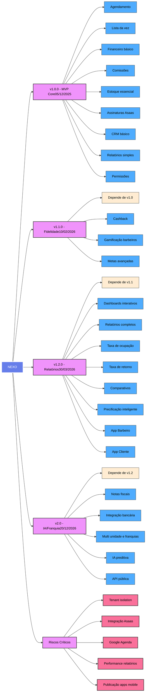

```mermaid
graph LR
    NEXO[NEXO]

    V1_0[v1.0.0 - MVP Core05/12/2025]
    V1_1[v1.1.0 - Fidelidade10/02/2026]
    V1_2[v1.2.0 - Relatórios30/03/2026]
    V2_0[v2.0 - IA/Franquia20/12/2026]

    NEXO --> V1_0
    NEXO --> V1_1
    NEXO --> V1_2
    NEXO --> V2_0

    V1_0 --> V1_0_F1[Agendamento]
    V1_0 --> V1_0_F2[Lista da vez]
    V1_0 --> V1_0_F3[Financeiro básico]
    V1_0 --> V1_0_F4[Comissões]
    V1_0 --> V1_0_F5[Estoque essencial]
    V1_0 --> V1_0_F6[Assinaturas Asaas]
    V1_0 --> V1_0_F7[CRM básico]
    V1_0 --> V1_0_F8[Relatórios simples]
    V1_0 --> V1_0_F9[Permissões]

    V1_1 --> V1_1_DEP[Depende de v1.0]
    V1_1 --> V1_1_F1[Cashback]
    V1_1 --> V1_1_F2[Gamificação barbeiros]
    V1_1 --> V1_1_F3[Metas avançadas]

    V1_2 --> V1_2_DEP[Depende de v1.1]
    V1_2 --> V1_2_F1[Dashboards interativos]
    V1_2 --> V1_2_F2[Relatórios completos]
    V1_2 --> V1_2_F3[Taxa de ocupação]
    V1_2 --> V1_2_F4[Taxa de retorno]
    V1_2 --> V1_2_F5[Comparativos]
    V1_2 --> V1_2_F6[Precificação inteligente]
    V1_2 --> V1_2_F7[App Barbeiro]
    V1_2 --> V1_2_F8[App Cliente]

    V2_0 --> V2_0_DEP[Depende de v1.2]
    V2_0 --> V2_0_F1[Notas fiscais]
    V2_0 --> V2_0_F2[Integração bancária]
    V2_0 --> V2_0_F3[Multi unidade e franquias]
    V2_0 --> V2_0_F4[IA preditiva]
    V2_0 --> V2_0_F5[API pública]

    RISCOS[Riscos Críticos]
    NEXO --> RISCOS
    RISCOS --> R1[Tenant isolation]
    RISCOS --> R2[Integração Asaas]
    RISCOS --> R3[Google Agenda]
    RISCOS --> R4[Performance relatórios]
    RISCOS --> R5[Publicação apps mobile]

    classDef versao fill:#f093fb,stroke:#333,stroke-width:2px,color:#000
    classDef feature fill:#4facfe,stroke:#333,stroke-width:1px,color:#000
    classDef risco fill:#fa709a,stroke:#333,stroke-width:2px,color:#000
    classDef dep fill:#ffecd2,stroke:#333,stroke-width:1px,color:#000
    classDef central fill:#667eea,stroke:#fff,stroke-width:3px,color:#fff

    class NEXO central
    class V1_0,V1_1,V1_2,V2_0 versao
    class V1_0_F1,V1_0_F2,V1_0_F3,V1_0_F4,V1_0_F5,V1_0_F6,V1_0_F7,V1_0_F8,V1_0_F9 feature
    class V1_1_F1,V1_1_F2,V1_1_F3 feature
    class V1_2_F1,V1_2_F2,V1_2_F3,V1_2_F4,V1_2_F5,V1_2_F6,V1_2_F7,V1_2_F8 feature
    class V2_0_F1,V2_0_F2,V2_0_F3,V2_0_F4,V2_0_F5 feature
    class V1_1_DEP,V1_2_DEP,V2_0_DEP dep
    class RISCOS versao
    class R1,R2,R3,R4,R5 risco
```
