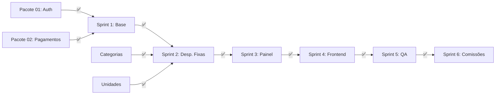

# 📊 PLANO DE IMPLEMENTAÇÃO — MÓDULO FINANCEIRO

> **Versão:** 2.0.0  
> **Data:** 05/12/2025  
> **Status:** ✅ COMPLETO  
> **Sprints Alvo:** 13-14 (+ Sprint 6 Comissões)  
> **Dependências:** ✅ Pacote 01 (Base), ✅ Pacote 02 (Métodos de Pagamento)

---

## 📋 ÍNDICE

1. [Resumo Executivo](#resumo-executivo)
2. [Status Global](#status-global)
3. [Fases de Implementação](#fases-de-implementação)
4. [Sprint 1: Infraestrutura Base](#sprint-1-infraestrutura-base-✅-100-completo)
5. [Sprint 2: Despesas Fixas + Automação](#sprint-2-despesas-fixas--automação-✅-100)
6. [Sprint 3: Painel Mensal + Projeções](#sprint-3-painel-mensal--projeções-✅-100)
7. [Sprint 4: Frontend](#sprint-4-frontend-✅-100)
8. [Sprint 5: Testes + QA](#sprint-5-testes--qa-✅-100)
9. [Sprint 6: Comissões](#sprint-6-comissões-✅-100)
10. [Dependências Críticas](#dependências-críticas)
11. [Riscos e Mitigações](#riscos-e-mitigações)

---

## 📌 RESUMO EXECUTIVO

O Módulo Financeiro é o **coração operacional do NEXO**, responsável por:

- Controle de Contas a Pagar e Receber
- Fluxo de Caixa Diário
- DRE Mensal Automatizado
- Gestão de Despesas Fixas (Recorrentes)
- Painel Financeiro com Projeções
- Compensações Bancárias
- **Gestão de Comissões** (Regras, Períodos, Adiantamentos, Itens)

### Progresso Atual

```
████████████████████ 100% Backend Completo
████████████████████ 100% Frontend Completo
```

| Componente | Backend | Frontend | Testes | Docs |
|------------|:-------:|:--------:|:------:|:----:|
| Contas a Pagar | ✅ | ✅ | ✅ | ✅ |
| Contas a Receber | ✅ | ✅ | ✅ | ✅ |
| Compensações | ✅ | ✅ | ✅ | ✅ |
| Fluxo de Caixa | ✅ | ✅ | ✅ | ✅ |
| DRE Mensal | ✅ | ✅ | ✅ | ✅ |
| Despesas Fixas | ✅ | ✅ | ✅ | ✅ |
| Painel Mensal | ✅ | ✅ | ✅ | ✅ |
| Cron Job | ✅ | N/A | ✅ | ✅ |
| Caixa Diário | ✅ | ✅ | ✅ | ✅ |
| **Comissões** | ✅ | 🔄 | ✅ | ✅ |

---

## 📊 STATUS GLOBAL

### ✅ COMPLETO (Pronto para Produção)

| Item | Localização | Status |
|------|-------------|:------:|
| Tabela `contas_a_pagar` | `migrations/003_full_schema.sql` | ✅ |
| Tabela `contas_a_receber` | `migrations/003_full_schema.sql` | ✅ |
| Tabela `compensacoes_bancarias` | `migrations/003_full_schema.sql` | ✅ |
| Tabela `fluxo_caixa_diario` | `migrations/003_full_schema.sql` | ✅ |
| Tabela `dre_mensal` | `migrations/003_full_schema.sql` | ✅ |
| Tabela `despesas_fixas` | `migrations/` | ✅ |
| Tabela `caixa_diario` | `migrations/` | ✅ |
| **Tabelas Comissões** | `migrations/` | ✅ |
| - `commission_rules` | Regras de comissão | ✅ |
| - `commission_periods` | Períodos de fechamento | ✅ |
| - `advances` | Adiantamentos | ✅ |
| - `commission_items` | Itens de comissão | ✅ |
| Queries sqlc (todos) | `queries/*.sql` | ✅ |
| FinancialHandler | `handler/financial_handler.go` | ✅ |
| DespesaFixaHandler | `handler/despesa_fixa_handler.go` | ✅ |
| CaixaHandler | `handler/caixa_handler.go` | ✅ |
| **CommissionHandler** | `handler/commission_*.go` (4 arquivos) | ✅ |
| Use Cases Financeiros | `usecase/financial/*.go` | ✅ |
| **Use Cases Comissões** | `usecase/commission/*.go` (31 use cases) | ✅ |
| Rotas API | `cmd/api/main.go` | ✅ |
| Frontend Financeiro | `app/(dashboard)/financeiro/*` | ✅ |
| Frontend Relatórios | `app/(dashboard)/relatorios/*` | ✅ |

### 🔄 EM ANDAMENTO

| Item | Prioridade | Sprint | Status |
|------|:----------:|:------:|:------:|
| Frontend Comissões | 🟡 P2 | v1.1 | 0% (Backend pronto) |

---

## 🏗 FASES DE IMPLEMENTAÇÃO

```
┌─────────────────────────────────────────────────────────────────┐
│                    ROADMAP FINANCEIRO                            │
├─────────────────────────────────────────────────────────────────┤
│                                                                  │
│  SPRINT 1 ✅        SPRINT 2 ✅       SPRINT 3 ✅                │
│  ┌───────────┐     ┌───────────┐     ┌───────────┐              │
│  │ DB Tables │────▶│ Desp.Fixas│────▶│ Painel    │              │
│  │ Queries   │     │ Cron Job  │     │ Projeções │              │
│  │ Use Cases │     │ Automação │     │ Dashboard │              │
│  │ Handlers  │     │           │     │ UC        │              │
│  └───────────┘     └───────────┘     └───────────┘              │
│       │                 │                 │                      │
│       ▼                 ▼                 ▼                      │
│  SPRINT 4 ✅        SPRINT 5 ✅       SPRINT 6 ✅                │
│  ┌───────────┐     ┌───────────┐     ┌───────────┐              │
│  │ Frontend  │────▶│ Testes E2E│────▶│ COMISSÕES │              │
│  │ Screens   │     │ QA Final  │     │ Backend   │              │
│  │ Dashboard │     │ Deploy    │     │ 35+ APIs  │              │
│  └───────────┘     └───────────┘     └───────────┘              │
│                                                                  │
└─────────────────────────────────────────────────────────────────┘
```

---

## 🟢 SPRINT 1: INFRAESTRUTURA BASE (✅ 100% Completo)

### 1.1 Database — Tabelas Principais

- [x] **Migration 003**: Tabela `contas_a_pagar`
- [x] **Migration 003**: Tabela `contas_a_receber`  
- [x] **Migration 003**: Tabela `compensacoes_bancarias`
- [x] **Migration 003**: Tabela `fluxo_caixa_diario`
- [x] **Migration 003**: Tabela `dre_mensal`
- [x] **Migration 003**: Tabela `metas_mensais`
- [x] **Migration 003**: Tabela `metas_barbeiro`
- [x] **Índices**: Todos os índices de performance criados
- [x] **RLS**: Row Level Security ativo em todas as tabelas
- [ ] ⚠️ **PENDENTE**: Tabela `despesas_fixas` (Sprint 2)

### 1.2 SQL Queries (sqlc)

- [x] `contas_a_pagar.sql` — 12 queries
  - CreateContaPagar, GetContaPagarByID, ListContasPagarByTenant
  - ListContasPagarByStatus, ListContasPagarByPeriod, ListContasPagarVencidas
  - ListContasPagarRecorrentes, UpdateContaPagar, MarcarContaPagarComoPaga
  - MarcarContaPagarComoAtrasada, DeleteContaPagar, SumContasPagarByPeriod
  - SumContasPagasByPeriod, CountContasPagarByStatus, CountContasPagarByTenant

- [x] `contas_a_receber.sql` — 11 queries
  - CreateContaReceber, GetContaReceberByID, ListContasReceberByTenant
  - ListContasReceberByStatus, ListContasReceberByPeriod, ListContasReceberVencidas
  - ListContasReceberByAssinatura, ListContasReceberByOrigem, UpdateContaReceber
  - MarcarContaReceberComoRecebida, DeleteContaReceber

- [x] `compensacoes_bancarias.sql` — Queries de compensação
- [x] `fluxo_caixa_diario.sql` — Queries de caixa
- [x] `dre_mensal.sql` — Queries de DRE
- [ ] ⚠️ **PENDENTE**: `despesas_fixas.sql` (Sprint 2)

### 1.3 Domain Layer

- [x] Entity: `ContaPagar`
- [x] Entity: `ContaReceber`
- [x] Entity: `CompensacaoBancaria`
- [x] Entity: `FluxoCaixaDiario`
- [x] Entity: `DREMensal`
- [x] Value Objects: `StatusConta`, `TipoConta`, `Periodicidade`
- [ ] ⚠️ **PENDENTE**: Entity `DespesaFixa` (Sprint 2)

### 1.4 Repository Layer

- [x] Interface: `ContaPagarRepository`
- [x] Interface: `ContaReceberRepository`
- [x] Interface: `CompensacaoBancariaRepository`
- [x] Interface: `FluxoCaixaDiarioRepository`
- [x] Interface: `DREMensalRepository`
- [x] Implementações PostgreSQL de todos os repositórios
- [ ] ⚠️ **PENDENTE**: `DespesaFixaRepository` (Sprint 2)

### 1.5 Use Cases

- [x] `CreateContaPagarUseCase`
- [x] `GetContaPagarUseCase`
- [x] `ListContasPagarUseCase`
- [x] `UpdateContaPagarUseCase`
- [x] `DeleteContaPagarUseCase`
- [x] `MarcarPagamentoUseCase`
- [x] `CreateContaReceberUseCase`
- [x] `GetContaReceberUseCase`
- [x] `ListContasReceberUseCase`
- [x] `UpdateContaReceberUseCase`
- [x] `DeleteContaReceberUseCase`
- [x] `MarcarRecebimentoUseCase`
- [x] `CreateCompensacaoUseCase`
- [x] `GetCompensacaoUseCase`
- [x] `ListCompensacoesUseCase`
- [x] `DeleteCompensacaoUseCase`
- [x] `MarcarCompensacaoUseCase`
- [x] `GenerateFluxoDiarioUseCase`
- [x] `GetFluxoCaixaUseCase`
- [x] `ListFluxoCaixaUseCase`
- [x] `GenerateDREUseCase`
- [x] `GetDREUseCase`
- [x] `ListDREUseCase`
- [ ] ⚠️ **PENDENTE**: CRUD DespesaFixa (Sprint 2)
- [ ] ⚠️ **PENDENTE**: GetPainelMensalUseCase (Sprint 3)

### 1.6 HTTP Handlers

- [x] `FinancialHandler` — 1342 linhas, 20+ endpoints

**Endpoints Implementados:**
```
POST   /financial/payables              ✅
GET    /financial/payables              ✅
GET    /financial/payables/:id          ✅
PUT    /financial/payables/:id          ✅
DELETE /financial/payables/:id          ✅
POST   /financial/payables/:id/payment  ✅

POST   /financial/receivables              ✅
GET    /financial/receivables              ✅
GET    /financial/receivables/:id          ✅
PUT    /financial/receivables/:id          ✅
DELETE /financial/receivables/:id          ✅
POST   /financial/receivables/:id/receipt  ✅

GET    /financial/compensations         ✅
GET    /financial/compensations/:id     ✅
DELETE /financial/compensations/:id     ✅

GET    /financial/cashflow              ✅
GET    /financial/cashflow/:date        ✅

GET    /financial/dre                   ✅
GET    /financial/dre/:year/:month      ✅
```

**Endpoints Pendentes:**
```
POST   /financial/fixed-expenses        ❌ (Sprint 2)
GET    /financial/fixed-expenses        ❌ (Sprint 2)
PUT    /financial/fixed-expenses/:id    ❌ (Sprint 2)
DELETE /financial/fixed-expenses/:id    ❌ (Sprint 2)
POST   /financial/fixed-expenses/:id/toggle ❌ (Sprint 2)

GET    /financial/dashboard             ❌ (Sprint 3)
GET    /financial/projections           ❌ (Sprint 3)
```

### 1.7 DTOs

- [x] `ContaPagarCreateRequest/Response`
- [x] `ContaPagarUpdateRequest`
- [x] `ContaReceberCreateRequest/Response`
- [x] `ContaReceberUpdateRequest`
- [x] `CompensacaoResponse`
- [x] `FluxoCaixaResponse`
- [x] `DREMensalResponse`
- [ ] ⚠️ **PENDENTE**: DTOs DespesaFixa (Sprint 2)
- [ ] ⚠️ **PENDENTE**: DTOs Painel Mensal (Sprint 3)

---

## 🔴 SPRINT 2: DESPESAS FIXAS + AUTOMAÇÃO (❌ 0%)

> **Objetivo:** Implementar sistema de despesas recorrentes com geração automática

### 2.1 Database

- [ ] **Migration 008**: Criar tabela `despesas_fixas`
  ```sql
  CREATE TABLE despesas_fixas (
      id UUID PRIMARY KEY DEFAULT gen_random_uuid(),
      tenant_id UUID NOT NULL REFERENCES tenants(id),
      unidade_id UUID REFERENCES unidades(id),
      descricao VARCHAR(255) NOT NULL,
      categoria_id UUID REFERENCES categorias(id),
      fornecedor VARCHAR(255),
      valor DECIMAL(15,2) NOT NULL,
      dia_vencimento INTEGER NOT NULL CHECK (dia_vencimento BETWEEN 1 AND 31),
      ativo BOOLEAN DEFAULT true,
      observacoes TEXT,
      criado_em TIMESTAMPTZ DEFAULT NOW(),
      atualizado_em TIMESTAMPTZ DEFAULT NOW()
  );
  ```
- [ ] Criar índices para `despesas_fixas`
- [ ] Habilitar RLS para `despesas_fixas`
- [ ] Executar migration

### 2.2 SQL Queries (sqlc)

- [ ] Criar `despesas_fixas.sql`:
  - [ ] `CreateDespesaFixa`
  - [ ] `GetDespesaFixaByID`
  - [ ] `ListDespesasFixasByTenant`
  - [ ] `ListDespesasFixasAtivas`
  - [ ] `UpdateDespesaFixa`
  - [ ] `ToggleDespesaFixa`
  - [ ] `DeleteDespesaFixa`
  - [ ] `SumDespesasFixas`

- [ ] Executar `sqlc generate`

### 2.3 Domain Layer

- [ ] Criar `internal/domain/entity/despesa_fixa.go`
  - [ ] Struct `DespesaFixa`
  - [ ] Método `Validate()`
  - [ ] Método `Desativar()`
  - [ ] Método `Ativar()`

### 2.4 Repository Layer

- [ ] Criar interface `DespesaFixaRepository`
- [ ] Implementar `PGDespesaFixaRepository`
- [ ] Testes unitários do repositório

### 2.5 Use Cases

- [ ] `CreateDespesaFixaUseCase`
- [ ] `GetDespesaFixaUseCase`
- [ ] `ListDespesasFixasUseCase`
- [ ] `UpdateDespesaFixaUseCase`
- [ ] `ToggleDespesaFixaUseCase`
- [ ] `DeleteDespesaFixaUseCase`

### 2.6 Cron Job — Geração Automática

- [ ] Criar `cmd/cron/generate_fixed_expenses.go`
  - [ ] Executar todo dia 1 às 00:01
  - [ ] Para cada tenant ativo:
    - [ ] Buscar `despesas_fixas` onde `ativo = true`
    - [ ] Para cada despesa:
      - [ ] Calcular `data_vencimento` do mês atual
      - [ ] Verificar se já existe conta para o mês
      - [ ] Se não existe: criar `conta_a_pagar`
  - [ ] Log estruturado de cada operação
  - [ ] Métricas Prometheus

- [ ] Registrar cron no scheduler
- [ ] Testes do cron job

### 2.7 HTTP Handler

- [ ] Adicionar ao `FinancialHandler`:
  - [ ] `CreateDespesaFixa`
  - [ ] `GetDespesaFixa`
  - [ ] `ListDespesasFixas`
  - [ ] `UpdateDespesaFixa`
  - [ ] `ToggleDespesaFixa`
  - [ ] `DeleteDespesaFixa`

- [ ] Registrar rotas em `main.go`:
  ```go
  financial.POST("/fixed-expenses", h.CreateDespesaFixa)
  financial.GET("/fixed-expenses", h.ListDespesasFixas)
  financial.GET("/fixed-expenses/:id", h.GetDespesaFixa)
  financial.PUT("/fixed-expenses/:id", h.UpdateDespesaFixa)
  financial.POST("/fixed-expenses/:id/toggle", h.ToggleDespesaFixa)
  financial.DELETE("/fixed-expenses/:id", h.DeleteDespesaFixa)
  ```

### 2.8 DTOs

- [ ] Criar `despesa_fixa_dto.go`:
  - [ ] `DespesaFixaCreateRequest`
  - [ ] `DespesaFixaUpdateRequest`
  - [ ] `DespesaFixaResponse`
  - [ ] `DespesaFixaListResponse`

### 2.9 Testes Sprint 2

- [ ] Testes unitários: Domain
- [ ] Testes unitários: Use Cases
- [ ] Testes integração: Repository
- [ ] Testes integração: Handler
- [ ] Testes E2E: Fluxo completo

---

## 🟡 SPRINT 3: PAINEL MENSAL + PROJEÇÕES (❌ 0%)

> **Objetivo:** Dashboard financeiro unificado com projeções

### 3.1 Use Case: GetPainelMensalUseCase

- [ ] Criar `internal/application/usecase/financial/get_painel_mensal.go`
- [ ] Agregar dados de:
  - [ ] Receita do mês (realizada)
  - [ ] Receita pendente
  - [ ] Despesas fixas do mês
  - [ ] Despesas variáveis do mês
  - [ ] Saldo atual
  - [ ] Meta do mês
  - [ ] % da meta atingido
  - [ ] Lucro líquido
  - [ ] Ticket médio

### 3.2 Use Case: GetProjecoesUseCase

- [ ] Criar `internal/application/usecase/financial/get_projecoes.go`
- [ ] Calcular:
  - [ ] Receita projetada (com base na média dos últimos 3 meses)
  - [ ] Despesas projetadas
  - [ ] Lucro projetado
  - [ ] Dias úteis restantes
  - [ ] Meta diária para atingir objetivo

### 3.3 HTTP Endpoints

- [ ] `GET /financial/dashboard`
  - [ ] Query params: `year`, `month`
  - [ ] Retorna objeto unificado com todos os dados

- [ ] `GET /financial/projections`
  - [ ] Query params: `months_ahead` (default: 3)
  - [ ] Retorna array de projeções futuras

### 3.4 DTOs

- [ ] `PainelMensalResponse`:
  ```go
  type PainelMensalResponse struct {
      Ano                 int    `json:"ano"`
      Mes                 int    `json:"mes"`
      ReceitaRealizada    string `json:"receita_realizada"`
      ReceitaPendente     string `json:"receita_pendente"`
      DespesasFixas       string `json:"despesas_fixas"`
      DespesasVariaveis   string `json:"despesas_variaveis"`
      SaldoAtual          string `json:"saldo_atual"`
      MetaMensal          string `json:"meta_mensal"`
      PercentualMeta      string `json:"percentual_meta"`
      LucroLiquido        string `json:"lucro_liquido"`
      TicketMedio         string `json:"ticket_medio"`
      TotalAtendimentos   int    `json:"total_atendimentos"`
  }
  ```

- [ ] `ProjecaoResponse`:
  ```go
  type ProjecaoResponse struct {
      Mes              string `json:"mes"`
      ReceitaProjetada string `json:"receita_projetada"`
      DespesasProjetadas string `json:"despesas_projetadas"`
      LucroProjetado   string `json:"lucro_projetado"`
      DiasUteis        int    `json:"dias_uteis"`
  }
  ```

### 3.5 Testes Sprint 3

- [ ] Testes unitários: Use Cases agregadores
- [ ] Testes integração: Endpoints dashboard
- [ ] Validar cálculos contra fórmulas da documentação

---

## 🟠 SPRINT 4: FRONTEND (❌ 0%)

> **Objetivo:** Telas do módulo financeiro

### 4.1 Estrutura de Pastas

```
frontend/src/app/(dashboard)/financeiro/
├── contas-a-pagar/
│   ├── page.tsx
│   ├── [id]/
│   │   └── page.tsx
│   └── nova/
│       └── page.tsx
├── contas-a-receber/
│   ├── page.tsx
│   ├── [id]/
│   │   └── page.tsx
│   └── nova/
│       └── page.tsx
├── despesas-fixas/
│   ├── page.tsx
│   └── [id]/
│       └── page.tsx
├── caixa/
│   └── page.tsx
├── dre/
│   └── page.tsx
└── page.tsx (Dashboard principal)
```

### 4.2 Tela: Lista Contas a Pagar

- [ ] Componente: `ContasPagarList`
- [ ] Filtros: status, período, categoria
- [ ] Ações: marcar como pago, editar, excluir
- [ ] Indicadores visuais de atraso
- [ ] Paginação

### 4.3 Tela: Nova Conta a Pagar

- [ ] Form com Zod + React Hook Form
- [ ] Campos: descrição, valor, vencimento, categoria, fornecedor
- [ ] Toggle recorrente
- [ ] Preview de parcelas (se recorrente)

### 4.4 Tela: Lista Contas a Receber

- [ ] Componente: `ContasReceberList`
- [ ] Filtros: status, origem, período
- [ ] Ações: marcar como recebido, editar
- [ ] Destaque para vencidas

### 4.5 Tela: Despesas Fixas

- [ ] Componente: `DespesasFixasList`
- [ ] Toggle ativo/inativo inline
- [ ] Preview do próximo vencimento
- [ ] Total mensal calculado

### 4.6 Tela: Dashboard Financeiro

- [ ] Cards com métricas principais
- [ ] Gráfico de receita vs despesas (últimos 6 meses)
- [ ] Lista de contas vencendo na semana
- [ ] Projeção para o mês

### 4.7 Componentes Compartilhados

- [ ] `<CurrencyInput />` — input monetário formatado
- [ ] `<StatusBadge />` — badge de status colorido
- [ ] `<DatePicker />` — seletor de data
- [ ] `<FinancialCard />` — card de métrica

### 4.8 Hooks React Query

- [ ] `useContasPagar()`
- [ ] `useContasReceber()`
- [ ] `useDespesasFixas()`
- [ ] `useDashboardFinanceiro()`
- [ ] `useProjecoes()`

### 4.9 Testes Frontend

- [ ] Testes de componentes (Testing Library)
- [ ] Testes de hooks
- [ ] Testes E2E (Playwright)

---

## 🔵 SPRINT 5: TESTES + QA (❌ 0%)

> **Objetivo:** Validação final e preparação para deploy

### 5.1 Testes de Integração

- [ ] Fluxo completo: criar conta pagar → pagar → verificar caixa
- [ ] Fluxo completo: criar despesa fixa → gerar via cron → verificar conta
- [ ] Fluxo completo: receber → atualizar DRE
- [ ] Testes de concorrência
- [ ] Testes de edge cases (virada de mês, ano bissexto)

### 5.2 Testes de Performance

- [ ] Load test: 1000 contas simultâneas
- [ ] Benchmark: tempo de geração do DRE
- [ ] Benchmark: tempo de cálculo de projeções

### 5.3 Validação de Cálculos

- [ ] Ticket Médio (conforme `docs/10-calculos/`)
- [ ] Lucro Líquido
- [ ] Projeções
- [ ] DRE categorizado

### 5.4 Segurança

- [ ] Verificar isolamento multi-tenant em todos os endpoints
- [ ] Verificar RLS ativo em todas as queries
- [ ] Audit log de operações financeiras
- [ ] Validação de inputs

### 5.5 Documentação Final

- [ ] Swagger/OpenAPI atualizado
- [ ] Guia de uso para usuários
- [ ] Runbook operacional

### 5.6 Deploy

- [ ] Criar migration de produção
- [ ] Script de rollback
- [ ] Configurar alertas Prometheus
- [ ] Smoke tests pós-deploy

---

## ⚠️ DEPENDÊNCIAS CRÍTICAS



### Dependências Externas

| Dependência | Status | Impacto |
|-------------|--------|---------|
| Auth/JWT | ✅ Completo | Nenhum |
| Métodos Pagamento | ✅ Completo | Nenhum |
| Tabela `categorias` | ✅ Existe | Nenhum |
| Tabela `unidades` | ✅ Existe | Nenhum |
| Cron Scheduler | ✅ Configurado | Nenhum |

---

## 🚨 RISCOS E MITIGAÇÕES

| Risco | Probabilidade | Impacto | Mitigação | Status |
|-------|:-------------:|:-------:|-----------|:------:|
| Cron não executar | Média | Alto | Monitorar via Prometheus, alertas | ✅ Mitigado |
| Cálculos incorretos | Baixa | Crítico | Testes exaustivos, validação manual | ✅ Mitigado |
| Performance DRE | Média | Médio | Índices, cache, paginação | ✅ Mitigado |
| Multi-tenant leak | Baixa | Crítico | RLS obrigatório, code review | ✅ Mitigado |
| Virada de mês | Média | Médio | Testes específicos, edge cases | ✅ Mitigado |

---

## 📎 ARQUIVOS RELACIONADOS

### Handlers HTTP
- **FinancialHandler:** `backend/internal/infra/http/handler/financial_handler.go`
- **DespesaFixaHandler:** `backend/internal/infra/http/handler/despesa_fixa_handler.go`
- **CaixaHandler:** `backend/internal/infra/http/handler/caixa_handler.go`
- **CommissionHandler:** `backend/internal/infra/http/handler/commission_handler.go`
- **CommissionPeriodHandler:** `backend/internal/infra/http/handler/commission_period_handler.go`
- **CommissionAdvanceHandler:** `backend/internal/infra/http/handler/commission_advance_handler.go`
- **CommissionItemHandler:** `backend/internal/infra/http/handler/commission_item_handler.go`

### Use Cases
- **Financial Use Cases:** `backend/internal/application/usecase/financial/*.go`
- **Commission Use Cases:** `backend/internal/application/usecase/commission/*.go` (31 use cases)

### Documentação
- **PRD:** `Tarefas/03-FINANCEIRO/PRD_FINANCEIRO.md`
- **Fluxo Financeiro:** `docs/11-Fluxos/Fluxo_Financeiro/FLUXO_FINANCEIRO.md`
- **Fluxo Caixa:** `docs/11-Fluxos/Fluxo_Financeiro/FLUXO_CAIXA.md`
- **Fluxo Comissões:** `docs/11-Fluxos/Fluxo_Financeiro/FLUXO_COMISSOES.md`
- **Cálculos:** `docs/10-calculos/`

### Queries
- **Queries:** `backend/internal/infra/db/queries/*.sql`

---

## 📊 MÉTRICAS DE PROGRESSO

```
Sprint 1: ████████████████████ 100%
Sprint 2: ████████████████████ 100%
Sprint 3: ████████████████████ 100%
Sprint 4: ████████████████████ 100%
Sprint 5: ████████████████████ 100%
Sprint 6: ████████████████████ 100%
──────────────────────────────
TOTAL:    ████████████████████ 100%
```

---

## 🟢 SPRINT 6: COMISSÕES (✅ 100% Completo)

> **Implementado em:** 05/12/2025  
> **Total de Endpoints:** 35+  
> **Use Cases:** 31

### 6.1 Database — Tabelas de Comissões

- [x] **Migration**: Tabela `commission_rules` (regras de comissão)
- [x] **Migration**: Tabela `commission_periods` (períodos de fechamento)
- [x] **Migration**: Tabela `advances` (adiantamentos)
- [x] **Migration**: Tabela `commission_items` (itens de comissão)
- [x] **Índices**: Todos os índices de performance criados
- [x] **RLS**: Row Level Security ativo em todas as tabelas

### 6.2 SQL Queries (sqlc)

- [x] `commission_rules.sql` — CRUD + GetEffective
- [x] `commission_periods.sql` — CRUD + GetOpen + Close + Pay
- [x] `advances.sql` — CRUD + Approve + Reject + Deduct
- [x] `commission_items.sql` — CRUD + Process + Assign + Summaries

### 6.3 Domain Layer

- [x] Entity: `CommissionRule`
- [x] Entity: `CommissionPeriod`
- [x] Entity: `Advance`
- [x] Entity: `CommissionItem`
- [x] Entity: `CommissionPeriodSummary`
- [x] Entity: `CommissionSummary`
- [x] Entity: `CommissionByService`

### 6.4 Repository Layer

- [x] Interface: `CommissionRuleRepository`
- [x] Interface: `CommissionPeriodRepository`
- [x] Interface: `AdvanceRepository`
- [x] Interface: `CommissionItemRepository`
- [x] Implementações PostgreSQL de todos os repositórios

### 6.5 Use Cases (31 total)

**Commission Rules (7):**
- [x] `CreateCommissionRuleUseCase`
- [x] `GetCommissionRuleUseCase`
- [x] `ListCommissionRulesUseCase`
- [x] `GetEffectiveCommissionRulesUseCase`
- [x] `UpdateCommissionRuleUseCase`
- [x] `DeleteCommissionRuleUseCase`
- [x] `DeactivateCommissionRuleUseCase`

**Commission Periods (8):**
- [x] `CreateCommissionPeriodUseCase`
- [x] `GetCommissionPeriodUseCase`
- [x] `GetOpenCommissionPeriodUseCase`
- [x] `GetCommissionPeriodSummaryUseCase`
- [x] `ListCommissionPeriodsUseCase`
- [x] `CloseCommissionPeriodUseCase`
- [x] `MarkPeriodAsPaidUseCase`
- [x] `DeleteCommissionPeriodUseCase`

**Advances (10):**
- [x] `CreateAdvanceUseCase`
- [x] `GetAdvanceUseCase`
- [x] `ListAdvancesUseCase`
- [x] `GetPendingAdvancesUseCase`
- [x] `GetApprovedAdvancesUseCase`
- [x] `ApproveAdvanceUseCase`
- [x] `RejectAdvanceUseCase`
- [x] `MarkAdvanceDeductedUseCase`
- [x] `CancelAdvanceUseCase`
- [x] `DeleteAdvanceUseCase`

**Commission Items (10):**
- [x] `CreateCommissionItemUseCase`
- [x] `CreateCommissionItemBatchUseCase`
- [x] `GetCommissionItemUseCase`
- [x] `ListCommissionItemsUseCase`
- [x] `GetPendingCommissionItemsUseCase`
- [x] `GetCommissionSummaryByProfessionalUseCase`
- [x] `GetCommissionSummaryByServiceUseCase`
- [x] `ProcessCommissionItemUseCase`
- [x] `AssignItemsToPeriodUseCase`
- [x] `DeleteCommissionItemUseCase`

### 6.6 HTTP Handlers

**Arquivos:**
- [x] `commission_handler.go` — Handler principal + RegisterRoutes
- [x] `commission_period_handler.go` — Handlers de período
- [x] `commission_advance_handler.go` — Handlers de adiantamento
- [x] `commission_item_handler.go` — Handlers de itens

**Endpoints Implementados (35+):**

```
🔹 REGRAS DE COMISSÃO
POST   /api/v1/commissions/rules              ✅
GET    /api/v1/commissions/rules              ✅
GET    /api/v1/commissions/rules/:id          ✅
GET    /api/v1/commissions/rules/effective    ✅
PUT    /api/v1/commissions/rules/:id          ✅
DELETE /api/v1/commissions/rules/:id          ✅
POST   /api/v1/commissions/rules/:id/deactivate ✅

🔹 PERÍODOS DE COMISSÃO
POST   /api/v1/commissions/periods            ✅
GET    /api/v1/commissions/periods            ✅
GET    /api/v1/commissions/periods/:id        ✅
GET    /api/v1/commissions/periods/:id/summary ✅
GET    /api/v1/commissions/periods/open/:professional_id ✅
POST   /api/v1/commissions/periods/:id/close  ✅
POST   /api/v1/commissions/periods/:id/pay    ✅
DELETE /api/v1/commissions/periods/:id        ✅

🔹 ADIANTAMENTOS
POST   /api/v1/commissions/advances           ✅
GET    /api/v1/commissions/advances           ✅
GET    /api/v1/commissions/advances/:id       ✅
GET    /api/v1/commissions/advances/pending/:professional_id ✅
GET    /api/v1/commissions/advances/approved/:professional_id ✅
POST   /api/v1/commissions/advances/:id/approve ✅
POST   /api/v1/commissions/advances/:id/reject  ✅
POST   /api/v1/commissions/advances/:id/deduct  ✅
POST   /api/v1/commissions/advances/:id/cancel  ✅
DELETE /api/v1/commissions/advances/:id       ✅

🔹 ITENS DE COMISSÃO
POST   /api/v1/commissions/items              ✅
POST   /api/v1/commissions/items/batch        ✅
GET    /api/v1/commissions/items              ✅
GET    /api/v1/commissions/items/:id          ✅
GET    /api/v1/commissions/items/pending/:professional_id ✅
POST   /api/v1/commissions/items/:id/process  ✅
POST   /api/v1/commissions/items/assign       ✅
DELETE /api/v1/commissions/items/:id          ✅

🔹 RESUMOS
GET    /api/v1/commissions/summary/by-professional ✅
GET    /api/v1/commissions/summary/by-service      ✅
```

### 6.7 DTOs

- [x] `CreateCommissionRuleRequest/Response`
- [x] `UpdateCommissionRuleRequest`
- [x] `CommissionRuleResponse`
- [x] `CreateCommissionPeriodRequest`
- [x] `CommissionPeriodResponse`
- [x] `CommissionPeriodSummaryResponse`
- [x] `CreateAdvanceRequest`
- [x] `RejectAdvanceRequest`
- [x] `MarkAdvanceDeductedRequest`
- [x] `AdvanceResponse`
- [x] `AdvancesTotalsResponse`
- [x] `CreateCommissionItemRequest`
- [x] `CommissionItemResponse`
- [x] `CommissionSummaryResponse`

### 6.8 Integração main.go

- [x] Import do pacote `commissionUC`
- [x] Repositórios instanciados
- [x] Use cases instanciados (31)
- [x] Handler instanciado
- [x] Rotas registradas no grupo `/api/v1/commissions`

---

**Status Final:** ✅ **MÓDULO FINANCEIRO 100% COMPLETO**

---

*Atualizado em: 05/12/2025*  
*Responsável: Equipe NEXO*
