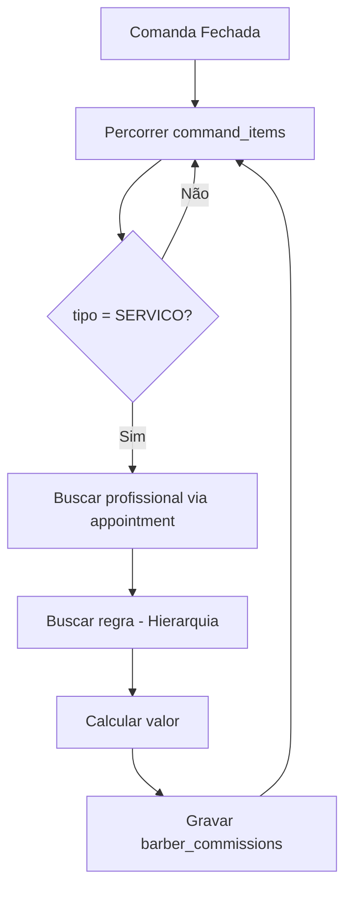
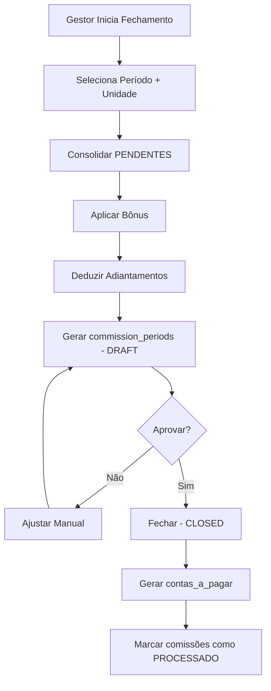

# PRD — Módulo de Comissões | NEXO v1.0

**Versão do Documento:** 1.0.0  
**Status:** 🔴 PRONTO PARA IMPLEMENTAÇÃO  
**Prioridade:** 🔴 CRÍTICA (MVP)  
**Data de Criação:** 05/12/2025  
**Última Atualização:** 05/12/2025  
**Responsável:** Andrey Viana (Product Owner)  
**Milestone:** MVP v1.0.0  

---

## 📊 Status de Implementação

| Área | Status | Progresso |
|------|--------|-----------|
| Database - commission_rules | ❌ Não iniciado | 0% |
| Database - commission_periods | ❌ Não iniciado | 0% |
| Database - advances | ❌ Não iniciado | 0% |
| Backend - Motor de Cálculo | ❌ Não iniciado | 0% |
| Backend - Fechamento de Período | ❌ Não iniciado | 0% |
| Backend - Adiantamentos | ❌ Não iniciado | 0% |
| Frontend - Config Regras | ❌ Não iniciado | 0% |
| Frontend - Fechamento | ❌ Não iniciado | 0% |
| Frontend - Dashboard Barbeiro | ❌ Não iniciado | 0% |

### ⏳ Pendente
- [ ] Migration: `commission_rules`
- [ ] Migration: `commission_periods`
- [ ] Migration: `advances`
- [ ] Ajuste: `barber_commissions` (add `command_item_id`)
- [ ] Motor de Cálculo automático
- [ ] Fechamento de período com geração de Conta a Pagar
- [ ] Dashboard individual do barbeiro
- [ ] Gestão de adiantamentos

---

## 1. Executive Summary

### 1.1 Visão Geral

O **Módulo de Comissões** é o diferencial operacional do NEXO para gestão de profissionais, automatizando todo o ciclo:

```
Atendimento → Cálculo → Consolidação → Fechamento → Pagamento
```

**Problema:** Donos de barbearia NÃO conseguem:
- ❌ Calcular comissões automaticamente baseado em regras flexíveis
- ❌ Ver quanto cada barbeiro ganhou em tempo real
- ❌ Fechar período e gerar automaticamente conta a pagar
- ❌ Controlar adiantamentos e deduções
- ❌ Dar transparência ao barbeiro sobre seus ganhos

**Contexto Técnico:**  
O NEXO já possui:
- ✅ Tabela `profissionais` com campos `comissao` e `tipo_comissao`
- ✅ Tabela `servicos` com campo `comissao`
- ✅ Tabela `barber_commissions` para registro individual
- ✅ Tabela `contas_a_pagar` para geração de títulos
- ✅ Tabela `dre_mensal` com campo `custo_comissoes`

**O que falta:** Regras flexíveis + Motor de cálculo + Fechamento + Dashboard.

### 1.2 Solução

Criar **4 novos componentes** integrados ao ecossistema:

#### **A) Regras de Comissão Flexíveis**
Hierarquia de fallback: Serviço → Profissional → Unidade → Tenant

- Modelos: Percentual, Fixo, Híbrido, Progressivo
- Bases de cálculo: Bruto, Tabela, Líquido

#### **B) Motor de Cálculo Automático**
Trigger no fechamento de comanda → Calcula e grava `barber_commissions`

#### **C) Fechamento de Período**
- Consolida comissões pendentes
- Aplica bônus/metas
- Deduz adiantamentos
- Gera `contas_a_pagar`

#### **D) Dashboard do Barbeiro**
Painel individual com:
- Comissões do mês
- Últimos atendimentos
- Extrato completo

---

## 2. Diferencial Competitivo

### 2.1 Comparação com Concorrentes

| Funcionalidade | NEXO | Trinks | AppBarber | BarberSystem |
|----------------|------|--------|-----------|--------------|
| **Cálculo Automático** | ✅ | 🟡 Manual | 🟡 Manual | ❌ |
| **Regras Flexíveis** | ✅ | ❌ | 🟡 Apenas % | ❌ |
| **Base Líquida** | ✅ | ❌ | ❌ | ❌ |
| **Progressivo por Faixa** | ✅ | ❌ | ❌ | ❌ |
| **Fechamento + Conta a Pagar** | ✅ | ❌ | ❌ | ❌ |
| **Dashboard Barbeiro** | ✅ | 🟡 Básico | 🟡 Básico | ❌ |
| **Adiantamentos** | ✅ | ❌ | ❌ | ❌ |
| **Multi-Unidade** | ✅ | ❌ | ❌ | ❌ |

🏆 **Só o NEXO oferece:**
1. Base de cálculo líquida (desconta taxa do cartão)
2. Comissão progressiva por faixa de faturamento
3. Integração automática com Contas a Pagar
4. Controle de adiantamentos com dedução automática

---

## 3. Objetivos do Produto

### 3.1 Objetivo Principal

**Automatizar 100% do ciclo de comissões, desde o cálculo até o pagamento, com transparência total para gestor e barbeiro.**

### 3.2 Objetivos Secundários

1. **Eliminar planilhas** de controle manual (meta: 0% uso de planilhas)
2. **Reduzir erros** de cálculo (meta: < 0.1% de reclamações)
3. **Aumentar transparência** (meta: 100% barbeiros com acesso ao dashboard)
4. **Acelerar fechamento** (meta: fechamento em < 5 minutos)
5. **Integrar DRE** automaticamente (meta: custo_comissoes sempre atualizado)

---

## 4. Métricas de Sucesso (KPIs)

| KPI | Baseline | Meta | Medição |
|-----|----------|------|---------|
| **Tempo de Fechamento** | 30+ min | < 5 min | Tempo médio por fechamento |
| **Acurácia do Cálculo** | N/A | > 99.9% | (Calculado - Esperado) / Esperado |
| **Adoção Dashboard** | N/A | > 80% | Barbeiros que acessam semanalmente |
| **Redução de Disputas** | N/A | < 1% | Reclamações / Total comissões |
| **Integração Financeira** | 0% | 100% | Comissões que geram conta a pagar |

---

## 5. Personas e Necessidades

### 5.1 Persona 1: Dono da Barbearia (Gestor)

**Nome:** Carlos, 38 anos  
**Cargo:** Proprietário  
**Dor Principal:** Gasta horas todo mês calculando comissões em planilhas

**Necessidades:**
- Configurar regras de comissão uma vez e esquecer
- Fechar período em poucos cliques
- Gerar conta a pagar automaticamente
- Ver custo total de comissões na DRE

### 5.2 Persona 2: Barbeiro (Profissional)

**Nome:** Lucas, 27 anos  
**Cargo:** Barbeiro Senior  
**Dor Principal:** Nunca sabe exatamente quanto vai receber

**Necessidades:**
- Ver em tempo real quanto já faturou de comissão
- Acompanhar cada atendimento que gerou comissão
- Saber se está perto de bater a meta
- Consultar extrato completo

### 5.3 Persona 3: Gerente de Unidade

**Nome:** Ana, 32 anos  
**Cargo:** Gerente de Filial  
**Dor Principal:** Dificuldade de controlar adiantamentos e deduções

**Necessidades:**
- Aprovar/rejeitar adiantamentos
- Ajustar valores quando necessário
- Fechar período por unidade
- Comparar performance entre barbeiros

---

## 6. Regras de Negócio

### 6.1 Hierarquia de Regras

```
PRIORIDADE (maior para menor):
1. Regra do Serviço (servicos.comissao)
2. Regra do Profissional (profissionais.comissao)
3. Regra da Unidade (commission_rules.unit_id IS NOT NULL)
4. Regra do Tenant (commission_rules.unit_id IS NULL)
```

### 6.2 Tipos de Comissão

| Tipo | Exemplo | Fórmula |
|------|---------|---------|
| `PERCENTAGE` | 50% | `base × (value / 100)` |
| `FIXED` | R$ 15/atendimento | `value` |
| `HYBRID` | R$ 500 + 30% | `fixed_value + (base × (value / 100))` |
| `PROGRESSIVE` | 40% até 5k, 50% acima | `faixas em tiers[]` |

### 6.3 Bases de Cálculo

| Base | Descrição | Quando Usar |
|------|-----------|-------------|
| `GROSS_TOTAL` | Valor final pago (após desconto) | Padrão |
| `TABLE_PRICE` | Preço cheio do serviço | Quando barbearia absorve desconto |
| `NET_VALUE` | Valor - Taxa do meio de pagamento | Para comissão sobre líquido |

### 6.4 Status de Comissão

```
PENDENTE → PROCESSADO → PAGO
              ↓
          CANCELADO
```

### 6.5 Status de Período

```
DRAFT → CLOSED → PAID
```

### 6.6 Status de Adiantamento

```
PENDING → APPROVED → DEDUCTED
            ↓
         REJECTED
```

---

## 7. Fluxos Principais

### 7.1 Fluxo de Cálculo Automático



### 7.2 Fluxo de Fechamento



---

## 8. Requisitos Técnicos

### 8.1 Novas Tabelas

| Tabela | Descrição |
|--------|-----------|
| `commission_rules` | Regras de comissão por tenant/unidade/profissional/serviço |
| `commission_periods` | Períodos de fechamento (folha) |
| `advances` | Adiantamentos/vales |

### 8.2 Ajustes em Tabelas Existentes

| Tabela | Ajuste |
|--------|--------|
| `barber_commissions` | Adicionar `command_item_id` |

### 8.3 Endpoints API

| Método | Endpoint | Descrição |
|--------|----------|-----------|
| `GET` | `/commission-rules` | Listar regras |
| `POST` | `/commission-rules` | Criar regra |
| `PUT` | `/commission-rules/:id` | Atualizar |
| `DELETE` | `/commission-rules/:id` | Remover |
| `GET` | `/commissions` | Listar comissões |
| `GET` | `/commissions/summary` | Resumo |
| `POST` | `/commission-periods/preview` | Prévia |
| `POST` | `/commission-periods` | Criar período |
| `POST` | `/commission-periods/:id/close` | Fechar |
| `GET` | `/advances` | Listar adiantamentos |
| `POST` | `/advances` | Criar |
| `POST` | `/advances/:id/approve` | Aprovar |
| `POST` | `/advances/:id/reject` | Rejeitar |

### 8.4 Telas Frontend

| Tela | Rota | Descrição |
|------|------|-----------|
| Config Comissões | `/admin/comissoes/config` | Regras globais e por serviço |
| Fechamento | `/financeiro/comissoes` | Gerar e fechar períodos |
| Dashboard Barbeiro | `/barbeiro/painel` | Visão individual |
| Adiantamentos | `/financeiro/adiantamentos` | Gestão de vales |

---

## 9. Critérios de Aceite

### 9.1 Cálculo Automático

- [ ] Ao fechar comanda, comissão é calculada automaticamente
- [ ] Hierarquia de regras é respeitada
- [ ] Registro gravado em `barber_commissions`
- [ ] `unit_id` sempre preenchido

### 9.2 Fechamento de Período

- [ ] Gestor consegue selecionar período e unidade
- [ ] Prévia mostra todos os profissionais com valores
- [ ] Ajuste manual é permitido (com justificativa)
- [ ] Fechar gera `contas_a_pagar` automaticamente
- [ ] DRE é atualizado com `custo_comissoes`

### 9.3 Dashboard do Barbeiro

- [ ] Barbeiro vê total de comissões do mês
- [ ] Lista de últimos atendimentos com valor
- [ ] Acesso ao extrato completo
- [ ] Não pode ver dados de outros barbeiros (RBAC)

### 9.4 Adiantamentos

- [ ] Barbeiro pode solicitar adiantamento
- [ ] Gestor aprova/rejeita
- [ ] Valor é deduzido automaticamente no próximo fechamento
- [ ] Histórico completo disponível

---

## 10. Riscos e Mitigações

| Risco | Probabilidade | Impacto | Mitigação |
|-------|---------------|---------|-----------|
| Erro de cálculo | Média | Alto | Testes unitários extensivos |
| Performance em fechamento | Baixa | Médio | Query otimizada com batch |
| RBAC incorreto | Média | Alto | Testes de segurança |
| Conflito de regras | Baixa | Médio | Prioridade explícita |

---

## 11. Cronograma

| Sprint | Escopo | Duração | Status |
|--------|--------|---------|--------|
| Sprint 1 | Migrations + Queries | 1 semana | ❌ |
| Sprint 2 | Domain + Repository + UseCases | 1 semana | ❌ |
| Sprint 3 | Handlers + Motor de Cálculo | 1 semana | ❌ |
| Sprint 4 | Frontend Config + Fechamento | 1 semana | ❌ |
| Sprint 5 | Frontend Dashboard Barbeiro | 1 semana | ❌ |
| Sprint 6 | Testes E2E + QA | 1 semana | ❌ |

**Total:** 6 semanas

---

*Documento criado em: 05/12/2025*
