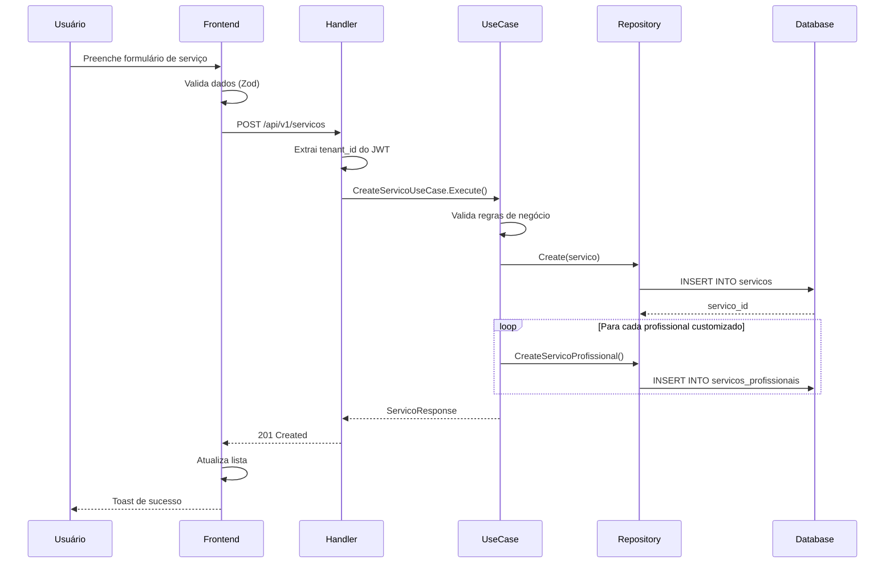

# 📖 Contexto — Módulo de Serviços

> Documento de contexto técnico e de produto para o módulo de cadastro de serviços

---

## 🎯 Visão Geral

O módulo de **Serviços** é fundamental para o funcionamento da barbearia, pois:

1. Define o **catálogo de serviços** oferecidos
2. Estabelece **preços e durações** padrão
3. Permite **customização por profissional** (diferente do Trinks/AppBarber)
4. Alimenta o sistema de **agendamentos**
5. Calcula **comissões** automaticamente
6. Gera **relatórios financeiros** precisos

---

## 🏗️ Arquitetura

### Entidades Principais

#### 1. Categoria
Agrupa serviços por tipo (Cabelo, Barba, Estética, Pacote)

**Atributos:**
- `id` (UUID)
- `tenant_id` (UUID) - Isolamento multi-tenant
- `nome` (string, obrigatório, único por tenant)
- `descricao` (text, opcional)
- `cor` (hex, opcional) - Para visual no calendário
- `icone` (string, opcional) - Emoji ou nome de ícone
- `criado_em` (timestamp)
- `atualizado_em` (timestamp)

#### 2. Serviço
Serviço oferecido pela barbearia

**Atributos:**
- `id` (UUID)
- `tenant_id` (UUID)
- `categoria_id` (UUID, FK, opcional)
- `nome` (string, obrigatório, único por tenant)
- `descricao` (text, opcional)
- `preco` (decimal, obrigatório, > 0) - Preço base padrão
- `duracao` (integer, obrigatório, >= 5) - Duração em minutos
- `comissao` (decimal, opcional, 0-100) - Comissão padrão em %
- `cor` (hex, opcional)
- `imagem` (text, opcional) - URL ou base64
- `observacoes` (text, opcional) - Notas internas
- `tags` (array, opcional) - Para busca
- `ativo` (boolean, default true)
- `criado_em` (timestamp)
- `atualizado_em` (timestamp)

#### 3. ServicoProfissional
Customização de serviço por profissional (N:N)

**Atributos:**
- `id` (UUID)
- `tenant_id` (UUID)
- `servico_id` (UUID, FK)
- `professional_id` (UUID, FK)
- `preco_custom` (decimal, opcional) - Se diferente do padrão
- `duracao_custom` (integer, opcional) - Se diferente do padrão
- `comissao_custom` (decimal, opcional) - Se diferente do padrão
- `criado_em` (timestamp)
- `atualizado_em` (timestamp)

**Constraint:** UNIQUE (tenant_id, servico_id, professional_id)

---

## 🔄 Fluxo de Dados

### Criação de Serviço



### Busca de Serviço com Customizações

```sql
-- Exemplo de query otimizada
SELECT 
    s.id,
    s.nome,
    s.preco AS preco_base,
    s.duracao AS duracao_base,
    s.comissao AS comissao_base,
    p.id AS professional_id,
    p.nome AS professional_nome,
    COALESCE(sp.preco_custom, s.preco) AS preco_final,
    COALESCE(sp.duracao_custom, s.duracao) AS duracao_final,
    COALESCE(sp.comissao_custom, s.comissao) AS comissao_final
FROM servicos s
LEFT JOIN servicos_profissionais sp ON sp.servico_id = s.id
LEFT JOIN profissionais p ON p.id = sp.professional_id
WHERE s.tenant_id = $1 AND s.id = $2;
```

---

## 🎨 UX/UI - Requisitos

### Tela Principal

**Layout:**
- Header com título e botões de ação
- Filtros: busca, categoria, status
- Tabela/cards responsivos
- Ações rápidas: editar, duplicar, deletar

**Ordenação padrão:** Por nome (A-Z)

### Modal de Serviço

**Tabs/Seções:**
1. **Básico:** Nome, categoria, descrição, status
2. **Precificação:** Preço, duração, comissão, cor
3. **Profissionais:** Lista com customização inline
4. **Avançado:** Observações, tags, imagem

**Validação em tempo real:**
- Nome duplicado
- Preço inválido
- Duração abaixo do mínimo

---

## 🔐 Segurança e Permissões

### Controle de Acesso

| Ação | Owner | Manager | Admin | Receptionist | Barbeiro |
|------|-------|---------|-------|--------------|----------|
| Listar serviços | ✅ | ✅ | ✅ | ✅ | ✅ (próprios) |
| Criar serviço | ✅ | ✅ | ✅ | ❌ | ❌ |
| Editar serviço | ✅ | ✅ | ✅ | ❌ | ❌ |
| Deletar serviço | ✅ | ✅ | ❌ | ❌ | ❌ |
| Criar categoria | ✅ | ✅ | ✅ | ❌ | ❌ |
| Deletar categoria | ✅ | ✅ | ❌ | ❌ | ❌ |

### Isolamento Multi-Tenant

**Regra CRÍTICA:** Toda query deve filtrar por `tenant_id`

```go
// ❌ ERRADO
db.Where("id = ?", servicoID).First(&servico)

// ✅ CORRETO
db.Where("id = ? AND tenant_id = ?", servicoID, tenantID).First(&servico)
```

---

## 📊 Casos de Uso

### UC-001: Criar Categoria
- **Ator:** Gerente/Owner
- **Pré-condição:** Autenticado
- **Fluxo:**
  1. Acessar "Nova Categoria"
  2. Preencher nome (obrigatório)
  3. Opcionalmente: descrição, cor, ícone
  4. Salvar
- **Pós-condição:** Categoria criada e disponível para serviços

### UC-002: Criar Serviço Básico
- **Ator:** Gerente/Owner
- **Pré-condição:** Autenticado, categorias existem
- **Fluxo:**
  1. Acessar "Novo Serviço"
  2. Preencher informações básicas
  3. Definir preço e duração padrão
  4. Marcar profissionais que executam
  5. Salvar
- **Pós-condição:** Serviço criado, disponível para agendamento

### UC-003: Customizar Serviço por Profissional
- **Ator:** Gerente/Owner
- **Pré-condição:** Serviço existe, profissionais cadastrados
- **Fluxo:**
  1. Editar serviço
  2. Na seção "Profissionais", marcar checkbox "Customizar"
  3. Definir preço/duração/comissão específicos
  4. Salvar
- **Pós-condição:** Profissional tem valores customizados salvos

### UC-004: Buscar Serviços para Agendamento
- **Ator:** Recepcionista
- **Pré-condição:** Criando agendamento
- **Fluxo:**
  1. Selecionar profissional
  2. Sistema filtra serviços ativos
  3. Sistema exibe valores customizados do profissional
  4. Usuário seleciona serviço
- **Pós-condição:** Serviço adicionado com preço/duração corretos

---

## 🧪 Cenários de Teste

### Teste 1: Validação de Nome Duplicado
```typescript
describe('Criar Serviço', () => {
  it('deve impedir nome duplicado no mesmo tenant', async () => {
    await createService({ nome: 'Corte Masculino' });
    
    const response = await createService({ nome: 'Corte Masculino' });
    
    expect(response.status).toBe(409);
    expect(response.data.error).toContain('já existe');
  });
});
```

### Teste 2: Customização por Profissional
```typescript
it('deve salvar valores customizados por profissional', async () => {
  const servico = await createService({
    nome: 'Barba',
    preco: 25.00,
    duracao: 25
  });
  
  await customizeForProfessional(servico.id, {
    professional_id: 'thiago-id',
    preco_custom: 28.00,
    duracao_custom: 20
  });
  
  const result = await getServiceForProfessional(servico.id, 'thiago-id');
  
  expect(result.preco_final).toBe(28.00);
  expect(result.duracao_final).toBe(20);
});
```

### Teste 3: Isolamento Multi-Tenant
```typescript
it('não deve retornar serviços de outro tenant', async () => {
  const tenant1Token = await login('tenant1@example.com');
  const tenant2Token = await login('tenant2@example.com');
  
  await createService({ nome: 'Corte VIP' }, tenant1Token);
  
  const response = await listServices(tenant2Token);
  
  expect(response.data.servicos).not.toContainEqual(
    expect.objectContaining({ nome: 'Corte VIP' })
  );
});
```

---

## 📈 Métricas e Monitoramento

### Métricas de Produto
- Total de serviços cadastrados por tenant
- Média de profissionais por serviço
- % de serviços com customização
- Serviços mais agendados (top 10)

### Métricas Técnicas
- Latência média de criação: < 200ms
- Latência de listagem: < 100ms
- Taxa de erro de validação: < 5%
- Cache hit rate: > 80%

### Logs Estruturados
```go
logger.Info("serviço criado",
    zap.String("tenant_id", tenantID),
    zap.String("servico_id", servicoID),
    zap.String("nome", nome),
    zap.Int("profissionais_customizados", len(customizacoes)),
)
```

---

## 🚀 Otimizações

### Cache
- Listar categorias (TTL: 1 hora)
- Listar serviços ativos (TTL: 15 minutos)
- Invalidar ao criar/editar/deletar

### Índices Necessários
```sql
-- Para busca por nome
CREATE INDEX idx_servicos_tenant_nome ON servicos(tenant_id, nome);

-- Para filtro por categoria
CREATE INDEX idx_servicos_categoria ON servicos(tenant_id, categoria_id);

-- Para filtro por status
CREATE INDEX idx_servicos_ativo ON servicos(tenant_id, ativo);

-- Para JOIN de customizações
CREATE INDEX idx_servicos_prof_servico ON servicos_profissionais(servico_id, professional_id);
```

### Queries N+1 Prevention
```go
// ❌ EVITAR: N+1 queries
servicos := repository.ListServicos(tenantID)
for _, servico := range servicos {
    profissionais := repository.GetProfissionaisByServico(servico.ID) // N queries!
}

// ✅ CORRETO: Single query com JOIN
servicos := repository.ListServicosWithProfissionais(tenantID)
```

---

## 📚 Referências Técnicas

- [Clean Architecture - Uncle Bob](https://blog.cleancoder.com/uncle-bob/2012/08/13/the-clean-architecture.html)
- [DDD - Domain-Driven Design](https://martinfowler.com/bliki/DomainDrivenDesign.html)
- [PostgreSQL COALESCE](https://www.postgresql.org/docs/current/functions-conditional.html#FUNCTIONS-COALESCE-NVL-IFNULL)
- [Next.js App Router](https://nextjs.org/docs/app)
- [Zod Validation](https://zod.dev/)

---

## 🔗 Links Relacionados

- [FLUXO_CADASTRO_SERVIÇO.md](../../docs/11-Fluxos/FLUXO_CADASTRO_SERVIÇO.md) - Fluxo completo
- [MODELO_DE_DADOS.md](../../docs/02-arquitetura/MODELO_DE_DADOS.md) - Schema do banco
- [GUIA_DEV_BACKEND.md](../../docs/04-backend/GUIA_DEV_BACKEND.md) - Padrões Go
- [DESIGN_SYSTEM.md](../../docs/03-frontend/DESIGN_SYSTEM.md) - Componentes UI

---

**Última atualização:** 26/11/2025  
**Responsável:** Tech Lead
