# Fluxo de Assinatura NEXO - Sequência Correta Asaas

## 📊 Visão Geral do Fluxo

Este fluxo representa a **sequência correta** dos webhooks do Asaas para assinaturas:

1. **PENDING** → Cobrança criada, aguardando pagamento
2. **CONFIRMED** → Pagamento confirmado (cliente pagou) - **Libera acesso ao sistema**
3. **RECEIVED** → Dinheiro compensado e disponível para saque

## 🔄 Sequência de Status

| Evento | Status | Webhook Asaas | Ação no Sistema | Regime Contábil |
|--------|--------|---------------|-----------------|-----------------|
| Cobrança Criada | `PENDING` | - | Aguardar pagamento | - |
| Cliente Pagou | `CONFIRMED` | `payment.confirmed` | ✅ **Ativar funcionalidades** | 📊 DRE (Competência) |
| Dinheiro Creditado | `RECEIVED` | `payment.received` | 💰 Disponível para saque | 💵 Fluxo de Caixa |

## 📈 Dados Atuais do Sistema

- **PENDING** (Aguardando): R$ 19.946,10 - 75 clientes / 109 cobranças
- **CONFIRMED** (Pagas): R$ 1.149,20 - 6 clientes / 8 cobranças
- **RECEIVED** (Recebidas): R$ 0,00 - 0 clientes / 0 cobranças
- **OVERDUE** (Vencidas): R$ 0,00 - 0 clientes / 0 cobranças

## 🎯 Diagrama do Fluxo

```mermaid
graph TD
    Start([👤 Cliente Contrata Assinatura]) --> CreateSub[📝 Criar Assinatura no Asaas via API]
    CreateSub --> CalcProp{💰 Calcular Valor Proporcional?}
    CalcProp -->|Sim| CreateCharge[📄 Criar Primeira Cobrança Status: PENDING]
    CalcProp -->|Não Proporcional| CreateCharge
    CreateCharge --> AwaitPay[⏳ AGUARDANDO PAGAMENTO<br/>R$ 19.946,10<br/>75 clientes / 109 cobranças<br/>Status: PENDING]
    
    AwaitPay --> CheckPay{💳 Cliente Pagou?}
    
    CheckPay -->|❌ Não| CheckDue{📅 Passou do Vencimento?}
    CheckDue -->|Não| AwaitPay
    CheckDue -->|⚠️ Sim| Overdue[🔴 VENCIDAS<br/>R$ 0,00<br/>0 clientes / 0 cobranças<br/>Status: OVERDUE]
    Overdue --> Notify[📧 Enviar Notificação de Cobrança]
    Notify --> Retry{💳 Cliente Pagou Após Vencimento?}
    Retry -->|❌ Não| Cancel[🚫 Cancelar Assinatura<br/>🔒 Bloquear Acesso ao Sistema]
    Retry -->|✅ Sim| WebhookConf
    
    CheckPay -->|✅ Sim| WebhookConf[🔔 Webhook payment.confirmed<br/>Cliente pagou confirmado]
    WebhookConf --> UpdateConf[🔄 Atualizar BD<br/>Status: CONFIRMED<br/>confirmed_at = now]
    UpdateConf --> Confirmed[🔵 CONFIRMADAS<br/>R$ 1.149,20<br/>6 clientes / 8 cobranças<br/>Status: CONFIRMED]
    
    Confirmed --> Active[✨ Ativar Funcionalidades<br/>🔓 Liberar Acesso Total<br/>Cliente pode usar sistema]
    Active --> RecordDRE[📊 Registrar no DRE<br/>Regime de Competência]
    RecordDRE --> WaitClearing[⏱️ Aguardar Compensação Bancária<br/>Prazo: D+0 a D+2]
    
    WaitClearing --> WebhookRec[🔔 Webhook payment.received<br/>Dinheiro creditado na conta]
    WebhookRec --> UpdateReceived[🔄 Atualizar BD<br/>Status: RECEIVED<br/>received_at = now]
    UpdateReceived --> Received[🟢 RECEBIDAS<br/>R$ 0,00<br/>0 clientes / 0 cobranças<br/>Status: RECEIVED]
    
    Received --> Available[💵 Valor Disponível para Saque<br/>Dinheiro Líquido]
    Available --> RecordFluxo[💰 Registrar no Fluxo de Caixa<br/>Regime de Caixa]
    
    RecordFluxo --> CheckDate{📆 Chegou Data de Vencimento<br/>da Próxima Cobrança?}
    CheckDate -->|✅ Sim| GenNext[🔄 Asaas Gera Próxima Cobrança<br/>Automaticamente - Recorrência Mensal]
    GenNext --> NextPending[📄 Nova Cobrança Criada<br/>Status: PENDING<br/>Vencimento: Próximo Mês]
    NextPending --> AwaitPay
    
    CheckDate -->|⏳ Não| Monitor[👁️ Monitorar Assinatura<br/>Status: ACTIVE<br/>Cliente usando sistema]
    Monitor --> CheckDate
    
    Cancel --> End([⛔ Fim da Assinatura<br/>Cliente Inativo])
    
    style Start fill:#e3f2fd,stroke:#1976d2,stroke-width:3px
    style AwaitPay fill:#fff3e0,stroke:#ff9800,stroke-width:4px
    style Confirmed fill:#e3f2fd,stroke:#2196f3,stroke-width:4px
    style Received fill:#e8f5e9,stroke:#4caf50,stroke-width:4px
    style Overdue fill:#ffebee,stroke:#f44336,stroke-width:4px
    style Active fill:#f3e5f5,stroke:#9c27b0,stroke-width:3px
    style Available fill:#c8e6c9,stroke:#388e3c,stroke-width:3px
    style Cancel fill:#ffcdd2,stroke:#c62828,stroke-width:3px
    style End fill:#fce4ec,stroke:#880e4f,stroke-width:3px
    style WebhookConf fill:#fff9c4,stroke:#f57f17,stroke-width:2px
    style WebhookRec fill:#fff9c4,stroke:#f57f17,stroke-width:2px
    style GenNext fill:#e1bee7,stroke:#8e24aa,stroke-width:2px
    style RecordDRE fill:#ede7f6,stroke:#5e35b1,stroke-width:2px
    style RecordFluxo fill:#e0f2f1,stroke:#00897b,stroke-width:2px
```

## 🔑 Pontos Críticos da Sequência Correta

### 1️⃣ CONFIRMED vem ANTES de RECEIVED

**Por quê?**
- `payment.confirmed` = Cliente pagou (confirmação do pagamento)
- `payment.received` = Dinheiro compensou (chegou na conta)

### 2️⃣ Liberar Acesso no CONFIRMED

**Motivo:**
- Quando o pagamento é **confirmado**, o cliente já pagou
- Não faz sentido esperar a compensação bancária (D+0 a D+2) para liberar o sistema
- O risco de estorno é baixíssimo após confirmação

### 3️⃣ Regimes Contábeis Separados

**DRE (Competência):**
- Usa `confirmed_at` (quando cliente pagou)
- Mostra receita reconhecida no período

**Fluxo de Caixa:**
- Usa `received_at` (quando dinheiro entrou)
- Mostra disponibilidade real de recursos

## 🚀 Implementação Técnica

### Backend
- `ProcessWebhookUseCaseV2`: Processa webhooks na ordem correta
- `GenerateDREV2`: Usa `confirmed_at` para DRE
- `GenerateFluxoDiarioV2`: Usa `received_at` para fluxo de caixa
- `ReconcileAsaasUseCase`: Reconcilia dados históricos

### Banco de Dados
- `subscription_payments.confirmed_at`: Data de confirmação do pagamento
- `subscription_payments.received_at`: Data de recebimento do dinheiro
- `subscription_payments.status`: PENDING → CONFIRMED → RECEIVED

## 📝 Observações Importantes

1. **Não confundir** `CONFIRMED` (DRE) com `RECEIVED` (Caixa)
2. **Sempre filtrar por `tenant_id`** em todas as queries
3. **Reconciliação periódica** com API do Asaas para garantir sincronização
4. **Script de reprocessamento** disponível em `scripts/reprocess_asaas_historical.sh`