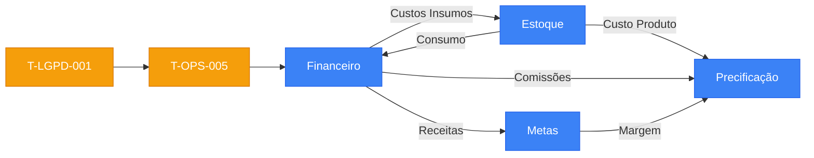

# 📋 Índice de Execução — Barber Analytics Pro v2.0

**Atualização:** 21/11/2025
**Responsável:** Tech Lead / PMO

## ⚠️ STATUS CRÍTICO - LEIA ANTES DE EXECUTAR

**🚨 SISTEMA NÃO ESTÁ PRONTO PARA EXECUÇÃO DAS TAREFAS ABAIXO**

Antes de executar as tarefas #1-19 deste índice, é **OBRIGATÓRIO** concluir as tarefas bloqueadoras em:

📁 **`Tarefas/CONCLUIR/`** (arquivos 00 a 08)

**Motivo:** Banco de dados está 100% pronto, mas backend e frontend estão apenas ~40% prontos.

**Ver análise completa:** `Tarefas/CONCLUIR/00-ANALISE_SISTEMA_ATUAL.md`

---

## Status Atual do Sistema

- ✅ Banco de Dados **100%** completo (42 tabelas, todas migrations executadas)
- ⚠️ Backend Go **~40%** (faltam 19 entities + repositories + use cases + handlers)
- ⚠️ Frontend Next.js **~30%** (faltam páginas, hooks, componentes dos novos módulos)
- Fase 5 **100%** concluída (seeds, validação, onboarding, deploy).
- Fase 6 **85%** concluída: pendente **T-OPS-005** (Backup + Restore testado). Fases 7+ bloqueadas até concluir F6.

## 🗺️ Diagrama de Execução Completo

```mermaid
flowchart TB
    START([🚀 Início do Projeto])

    subgraph BLOQUEADORES["🔴 TAREFAS BLOQUEADORAS - EXECUTAR PRIMEIRO"]
        direction TB
        B0["✅ 00 - Análise Sistema<br/>Backend 40% / Frontend 30%<br/>DB 100% pronto"]
        B1["❌ 01 - Domain Entities<br/>19 novas entities<br/>3-4 dias"]
        B2["❌ 02 - Repository Interfaces<br/>10 interfaces + extensões<br/>2 dias"]
        B3["❌ 03 - Repository Impl<br/>PostgreSQL + sqlc<br/>5 dias"]
        B4["❌ 04 - Use Cases Base<br/>Lógica de negócio<br/>4 dias"]
        B5["❌ 05 - HTTP Handlers<br/>DTOs + Rotas<br/>3 dias"]
        B6["❌ 06 - Cron Jobs<br/>DRE/Fluxo/Compensações<br/>2 dias"]
        B7["❌ 07 - Frontend Services<br/>API calls<br/>2 dias"]
        B8["❌ 08 - Frontend Hooks<br/>React Query<br/>2 dias"]

        B0 --> B1
        B1 --> B2
        B2 --> B3
        B3 --> B4
        B4 --> B5
        B5 --> B6
        B6 --> B7
        B7 --> B8
    end

    subgraph FASE5["✅ FASE 5 - Preparação Produção (100%)"]
        F5_DONE["Seeds + Validação + Onboarding + Deploy"]
    end

    subgraph FASE6["⚠️ FASE 6 - Hardening (85%)"]
        direction TB
        T_LGPD["T-LGPD-001<br/>LGPD: Consentimento<br/>/me/preferences<br/>/me/export<br/>/me delete"]
        T_OPS["T-OPS-005<br/>Backup & DR<br/>Rotinas automáticas<br/>Teste de restore"]

        T_LGPD --> T_OPS
    end

    subgraph FINANCEIRO["💰 MÓDULO FINANCEIRO (0% - BLOQUEADO)"]
        direction TB
        F1["03 - Contas a Pagar<br/>CRUD + Recorrência<br/>Notificações D-5/D-1/D0"]
        F2["04 - Contas a Receber<br/>Sync Asaas<br/>Inadimplência"]
        F3["05 - Fluxo de Caixa<br/>Compensado D+N<br/>Previsões"]
        F4["06 - Comissões<br/>Automáticas<br/>Engine + PDF"]
        F5["07 - DRE Completo<br/>Agregações mensais<br/>Comparação M/M"]
        F6["08 - Dashboard<br/>Financeiro<br/>Metas + PE + Fluxo"]

        F1 --> F2
        F2 --> F3
        F3 --> F4
        F4 --> F5
        F5 --> F6
    end

    subgraph ESTOQUE["📦 MÓDULO ESTOQUE (0% - BLOQUEADO)"]
        direction TB
        E1["09 - Entrada Estoque<br/>Registro + Fornecedor<br/>Movimentação ENTRADA"]
        E2["10 - Saída Estoque<br/>Motivo + Validação<br/>Movimentação SAIDA"]
        E3["11 - Consumo Automático<br/>Ficha Técnica<br/>Baixa por Serviço"]
        E4["12 - Inventário<br/>Contagem Física<br/>Ajustes"]
        E5["13 - Estoque Mínimo<br/>Alertas<br/>Sugestão Compra"]
        E6["14 - Curva ABC<br/>Relatório Pareto<br/>Classificação A/B/C"]

        E1 --> E2
        E2 --> E3
        E3 --> E4
        E4 --> E5
        E5 --> E6
    end

    subgraph METAS["🎯 MÓDULO METAS (0% - BLOQUEADO)"]
        direction TB
        M1["15 - Meta Geral Mês<br/>Faturamento<br/>Progresso + Alertas"]
        M2["16 - Meta por Barbeiro<br/>Individual<br/>Ranking"]
        M3["17 - Ticket Médio<br/>Geral/Barbeiro<br/>Acompanhamento"]
        M4["18 - Metas Automáticas<br/>Faturamento Mínimo<br/>Margem"]

        M1 --> M2
        M2 --> M3
        M3 --> M4
    end

    subgraph PRECIFICACAO["💲 MÓDULO PRECIFICAÇÃO (0% - BLOQUEADO)"]
        direction TB
        P1["19 - Simulador<br/>Config Defaults<br/>API Pública"]
    end

    subgraph FASE7["🚀 FASE 7 - Lançamento (0%)"]
        F7["Bloqueada até<br/>conclusão F6"]
    end

    START --> BLOQUEADORES
    BLOQUEADORES --> FASE5
    FASE5 --> FASE6
    B8 -.->|Desbloqueia| FINANCEIRO
    FASE6 --> FINANCEIRO
    FINANCEIRO --> ESTOQUE
    ESTOQUE --> METAS
    METAS --> PRECIFICACAO
    PRECIFICACAO --> FASE7

    classDef done fill:#10b981,stroke:#059669,color:#fff
    classDef pending fill:#f59e0b,stroke:#d97706,color:#fff
    classDef blocked fill:#ef4444,stroke:#dc2626,color:#fff
    classDef blocker fill:#dc2626,stroke:#991b1b,color:#fff,stroke-width:3px
    classDef module fill:#3b82f6,stroke:#2563eb,color:#fff

    class F5_DONE done
    class B0 done
    class T_LGPD done
    class T_OPS pending
    class B1,B2,B3,B4,B5,B6,B7,B8 blocker
    class F7 blocked
    class F1,F2,F3,F4,F5,F6,E1,E2,E3,E4,E5,E6,M1,M2,M3,M4,P1 module
```



## 📊 Barra de Progresso por Fase

```
Fase 5 — Preparação Produção : ██████████ 100% (4/4)
Fase 6 — Hardening           : █████████░  85% (11/13) → T-OPS-005
Fase 7 — Lançamento          : ░░░░░░░░░░   0% (bloqueada pela F6)
Fase 8 — Monitoramento       : ░░░░░░░░░░   0% (planejado)
Fase 9 — Evolução            : ░░░░░░░░░░   0% (planejado)
Fase 10 — Agendamentos       : ░░░░░░░░░░   0% (planejado)
```

## 🔗 Dependências entre Módulos



## 📋 Ordem Sequencial de Execução

### 🔒 Fase 6 - Hardening (Prioridade Máxima)

1. ~~**T-LGPD-001** — LGPD: consentimento, `/me/preferences`, `/me/export`, `/me` delete, `/privacy`~~ ✅
   📄 `Tarefas/FASE_6_HARDENING.md`

2. **T-OPS-005** — Backup & DR: rotinas automáticas + teste de restore documentado
   📄 `Tarefas/FASE_6_HARDENING.md`

---

### 💰 Módulo Financeiro

3. **Contas a Pagar** — CRUD, recorrência, notificações D-5/D-1/D0, anexos
   📄 `Tarefas/FINANCEIRO/03-contas-a-pagar.md`

4. **Contas a Receber** — Sync Asaas/assinaturas, inadimplência, conciliação manual
   📄 `Tarefas/FINANCEIRO/04-contas-a-receber.md`

5. **Fluxo de Caixa Compensado** — D+N, compensações, previsão com payables/receivables
   📄 `Tarefas/FINANCEIRO/07-fluxo-caixa-compensado.md`

6. **Comissões Automáticas** — Engine (fixo/percentual/degrau), relatórios, PDF
   📄 `Tarefas/FINANCEIRO/05-comissoes-automaticas.md`

7. **DRE** — Agregações mensais, comparação m/m, PDF
   📄 `Tarefas/FINANCEIRO/02-dre.md`, `Tarefas/FINANCEIRO/06-dre-completo.md`

8. **Dashboard Financeiro** — Endpoint agregado + UI (metas, PE, fluxo, DRE)
   📄 `Tarefas/FINANCEIRO/01-dashboard-financeiro.md`

---

### 📦 Módulo Estoque

9. **Entrada de Estoque** — Registro de entradas, fornecedor, movimentação `ENTRADA`
   📄 `Tarefas/ESTOQUE/01-entrada.md`

10. **Saída de Estoque** — Movimentação `SAIDA` com motivo, validação de saldo
    📄 `Tarefas/ESTOQUE/02-saida.md`

11. **Consumo Automático por Serviço** — Ficha técnica, baixa automática
    📄 `Tarefas/ESTOQUE/03-consumo-automatico.md`

12. **Inventário** — Contagem física, divergências, ajustes
    📄 `Tarefas/ESTOQUE/04-inventario.md`

13. **Estoque Mínimo e Alertas** — Job de baixo estoque, sugestão de compra
    📄 `Tarefas/ESTOQUE/06-estoque-minimo.md`

14. **Curva ABC** — Relatório/Pareto A/B/C
    📄 `Tarefas/ESTOQUE/05-curva-abc.md`

---

### 🎯 Módulo Metas

15. **Meta Geral do Mês** — Meta mensal, progresso e alertas
    📄 `Tarefas/METAS/01-meta-geral-mes.md`

16. **Meta por Barbeiro** — Metas individuais e ranking
    📄 `Tarefas/METAS/02-meta-por-barbeiro.md`

17. **Meta de Ticket Médio** — Meta de ticket médio (geral/barbeiro)
    📄 `Tarefas/METAS/03-meta-ticket-medio.md`

18. **Metas Automáticas** — Meta sugerida via faturamento mínimo + margem
    📄 `Tarefas/METAS/04-metas-automaticas.md`

---

### 💲 Módulo Precificação

19. **Simulador de Precificação** — Config defaults, simulações, API pública
    📄 `Tarefas/PRECIFICACAO/01-precificacao-simulador.md`

---

## ⚠️ Observações Importantes

- ✅ **Banco de Dados:** Todas as migrations necessárias já foram executadas (ver `DATABASE_MIGRATIONS_COMPLETED.md`)
- 🚨 **BLOQUEIO CRÍTICO:** Backend e Frontend NÃO estão prontos. Execute PRIMEIRO as tarefas em `Tarefas/CONCLUIR/` (estimativa: 2-3 semanas)
- 🔒 **Fase 7+:** Bloqueadas até conclusão da Fase 6 (T-LGPD-001 e T-OPS-005)
- 🔗 **Dependências:** Seguir ordem sequencial para evitar retrabalho
- 📄 **Detalhamento:** Cada tarefa possui arquivo específico com regras completas

---

## 🔴 Tarefas Bloqueadoras (EXECUTAR PRIMEIRO)

Antes de iniciar as tarefas #1-19 acima, concluir:

1. ✅ `CONCLUIR/00-ANALISE_SISTEMA_ATUAL.md` - Análise completa (já feito)
2. ❌ `CONCLUIR/01-backend-domain-entities.md` - Criar 19 entities (3-4 dias)
3. ❌ `CONCLUIR/02-backend-repository-interfaces.md` - Criar interfaces (2 dias)
4. ❌ `CONCLUIR/03-backend-repository-implementations.md` - Implementar repos PostgreSQL (5 dias)
5. ❌ `CONCLUIR/04-backend-use-cases-base.md` - Use cases essenciais (4 dias)
6. ❌ `CONCLUIR/05-backend-http-handlers.md` - HTTP handlers (3 dias)
7. ❌ `CONCLUIR/06-backend-cron-jobs.md` - Jobs agendados (2 dias)
8. ❌ `CONCLUIR/07-frontend-service-layer.md` - API services (2 dias)
9. ❌ `CONCLUIR/08-frontend-hooks-base.md` - Hooks customizados (2 dias)

**Total estimado:** ~23 dias (3 semanas full-time)

Após concluir, sistema estará pronto para executar tarefas #1-19.
