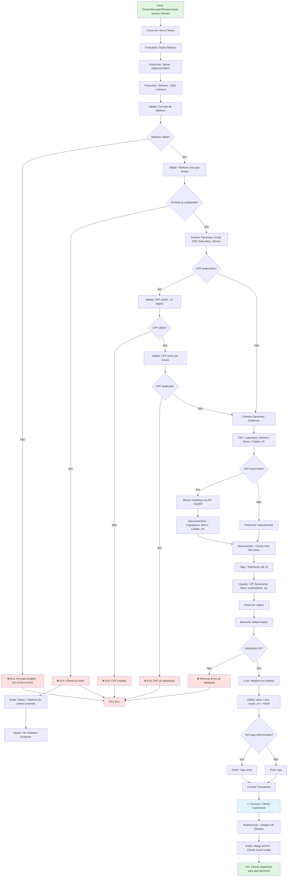

# Fluxo de Cadastro de Clientes — NEXO v1.0

**Versão:** 1.0  
**Última Atualização:** 24/11/2025  
**Status:** 📋 Planejado (MVP 1.0)  
**Responsável:** Tech Lead + Product

---

## 📋 Visão Geral

Módulo responsável pelo **cadastro e gestão de clientes** da barbearia, incluindo dados pessoais, histórico de atendimentos, preferências, tags de segmentação e integração com CRM/agendamento.

**Diferencial:**

- Cadastro simplificado (nome + telefone mínimo)
- Dados opcionais para enriquecer perfil
- Tags customizadas para segmentação (VIP, Recorrente, Inadimplente)
- Histórico completo de atendimentos
- Integração com agendamento e lista da vez
- Conformidade LGPD (soft delete + exportação de dados)
- Busca rápida por nome/telefone/CPF

**Prioridade:** 🟢 ALTA (MVP 1.0 - Módulo Core de CRM)

---

## 🎯 Objetivos do Fluxo

1. ✅ Permitir cadastro rápido (nome + telefone)
2. ✅ Campos opcionais para completude de dados
3. ✅ Validar unicidade de telefone/CPF por tenant
4. ✅ Aplicar tags de segmentação
5. ✅ Registrar preferências do cliente
6. ✅ Soft delete (conformidade LGPD)
7. ✅ Busca inteligente (nome/telefone/CPF)
8. ✅ Histórico de atendimentos/vendas
9. ✅ Exportação de dados (LGPD)
10. ✅ Integração com agendamento

---

## 🔐 Regras de Negócio (RN)

### RN-CLI-001: Campos Obrigatórios

**Mínimo para cadastro:**
- ✅ Nome (mínimo 3 caracteres)
- ✅ Telefone (DDD + número, único por tenant)

**Campos opcionais (enriquecem perfil):**
- Email
- CPF (único por tenant, se preenchido)
- Data de nascimento
- Gênero (Masculino, Feminino, Não Binário, Prefiro não informar)
- Endereço completo (logradouro, número, complemento, bairro, cidade, estado, CEP)
- Observações (anotações internas da barbearia)
- Tags (VIP, Recorrente, Inadimplente, Novo, etc.)

### RN-CLI-002: Validações de Negócio

- ✅ Telefone único por tenant (não pode duplicar)
- ✅ CPF único por tenant (se preenchido)
- ✅ CPF válido (11 dígitos numéricos)
- ✅ Email válido (formato xxx@xxx.xxx)
- ✅ CEP válido (8 dígitos numéricos)
- ✅ Data de nascimento não pode ser futura
- ✅ Nome mínimo 3 caracteres
- ✅ Telefone formato: (XX) XXXXX-XXXX ou (XX) XXXX-XXXX

### RN-CLI-003: Tags de Segmentação

**Tags padrão do sistema:**
- 🌟 **VIP:** Cliente de alto valor (ticket médio elevado)
- ♻️ **Recorrente:** Cliente com visitas regulares
- ⚠️ **Inadimplente:** Cliente com pagamentos pendentes
- 🆕 **Novo:** Cliente com primeiro atendimento recente (< 30 dias)
- 💰 **Gastador:** Cliente com gastos acima da média
- 😴 **Inativo:** Cliente sem atendimento há mais de 90 dias

**Tags customizadas:**
- ✅ Tenant pode criar tags próprias (ex: "Aniversariante", "Indicador", "Marketing")
- ✅ Máximo 10 tags por cliente
- ✅ Tags aparecem como badges coloridos na UI

### RN-CLI-004: Histórico de Atendimentos

- ✅ Registrar automaticamente ao criar agendamento
- ✅ Exibir: data, barbeiro, serviços, valor total, status
- ✅ Ordenar por data (mais recente primeiro)
- ✅ Filtrar por período (último mês, últimos 3 meses, último ano)
- ✅ Calcular métricas:
  - Total gasto
  - Ticket médio
  - Frequência (dias entre visitas)
  - Último atendimento

### RN-CLI-005: Soft Delete (LGPD)

- ✅ Ao inativar cliente → `clientes.ativo = false`
- ✅ Mantém histórico de atendimentos (auditoria)
- ✅ Remove de listagens ativas
- ✅ Permite reativação (se não houver outro ativo com mesmo CPF/telefone)
- ✅ Exclusão permanente apenas via endpoint LGPD (após 90 dias de inativação)

### RN-CLI-006: Exportação de Dados (LGPD)

**Cliente pode solicitar:**
- ✅ Dados pessoais (JSON ou PDF)
- ✅ Histórico de atendimentos
- ✅ Histórico de compras
- ✅ Dados de pagamento (quando aplicável)

**Formato:**
```json
{
  "dados_pessoais": {
    "nome": "João Silva",
    "email": "joao@email.com",
    "telefone": "(11) 98765-4321",
    "cpf": "123.456.789-00",
    "endereco": {...}
  },
  "historico_atendimentos": [
    {
      "data": "2025-11-20",
      "barbeiro": "Carlos",
      "servicos": ["Corte", "Barba"],
      "valor_total": 80.00
    }
  ],
  "total_gasto": 1250.00,
  "frequencia_media_dias": 21
}
```

### RN-CLI-007: Permissões (Integração RBAC)

**Quem pode cadastrar clientes:**
- ✅ Owner (proprietário)
- ✅ Manager (gerente)
- ✅ Recepcionista
- ❌ Barbeiro (vê apenas nome + serviços realizados)
- ❌ Contador

**Quem pode ver dados completos:**
- ✅ Owner
- ✅ Manager
- ✅ Recepcionista
- ❌ Barbeiro (dados filtrados: nome + serviços, sem telefone/email/CPF)

**Quem pode inativar:**
- ✅ Owner
- ✅ Manager
- ❌ Recepcionista (apenas marcar como "arquivado")

### RN-CLI-008: Busca Inteligente

**Permitir busca por:**
- Nome (parcial, case-insensitive)
- Telefone (parcial ou completo)
- CPF (parcial ou completo)
- Email (parcial)
- Tags

**Ordenação:**
- Nome (A-Z)
- Último atendimento (mais recente)
- Total gasto (maior valor)

**Filtros:**
- Status (Ativo, Inativo)
- Tags específicas
- Sem atendimento há X dias

### RN-CLI-009: Validação de Duplicidade

**Antes de criar:**
1. Validar se telefone já existe (ativo)
2. Se CPF preenchido → validar unicidade
3. Se duplicado:
   - Exibir: "Cliente já cadastrado: [Nome] - [Telefone]"
   - Oferecer: "Deseja visualizar cadastro existente?"
   - Bloquear criação

### RN-CLI-010: Observações Internas

- ✅ Campo livre para anotações da equipe
- ✅ Exemplos: "Prefere corte mais curto", "Alérgico a produto X"
- ✅ Visível apenas para Owner, Manager, Recepcionista
- ✅ Máximo 500 caracteres

---

## 📊 Diagrama de Fluxo (Mermaid)



---

## 🏗️ Arquitetura (Clean Architecture)

### Domain Layer

**1. Entity: Cliente**

```go
// backend/internal/domain/entity/cliente.go
package entity

import (
    "time"
    "github.com/google/uuid"
)

type Cliente struct {
    ID        uuid.UUID
    TenantID  uuid.UUID
    
    // Dados Básicos (obrigatórios)
    Nome      string
    Telefone  string
    
    // Dados Opcionais
    Email             *string
    CPF               *string
    DataNascimento    *time.Time
    Genero            *string // "M", "F", "NB", "PNI"
    
    // Endereço
    EnderecoLogradouro   *string
    EnderecoNumero       *string
    EnderecoComplemento  *string
    EnderecoBairro       *string
    EnderecoCidade       *string
    EnderecoEstado       *string
    EnderecoCEP          *string
    
    // CRM
    Observacoes *string
    Tags        []string
    
    // Status
    Ativo     bool
    
    CreatedAt time.Time
    UpdatedAt time.Time
}

// ValidarTelefone - Validação de formato brasileiro
func (c *Cliente) ValidarTelefone() error {
    // Remove caracteres não numéricos
    telefone := strings.ReplaceAll(c.Telefone, " ", "")
    telefone = strings.ReplaceAll(telefone, "(", "")
    telefone = strings.ReplaceAll(telefone, ")", "")
    telefone = strings.ReplaceAll(telefone, "-", "")
    
    // Validar: 10 ou 11 dígitos (DDD + número)
    if len(telefone) < 10 || len(telefone) > 11 {
        return fmt.Errorf("telefone deve ter 10 ou 11 dígitos")
    }
    
    return nil
}

// ValidarCPF - Validação de CPF
func (c *Cliente) ValidarCPF() error {
    if c.CPF == nil {
        return nil // CPF opcional
    }
    
    cpf := strings.ReplaceAll(*c.CPF, ".", "")
    cpf = strings.ReplaceAll(cpf, "-", "")
    
    if len(cpf) != 11 {
        return fmt.Errorf("CPF deve ter 11 dígitos")
    }
    
    // TODO: Implementar algoritmo de validação de CPF
    return nil
}

// ValidarEmail
func (c *Cliente) ValidarEmail() error {
    if c.Email == nil {
        return nil // Email opcional
    }
    
    // Regex simples para validar email
    emailRegex := regexp.MustCompile(`^[a-z0-9._%+\-]+@[a-z0-9.\-]+\.[a-z]{2,}$`)
    if !emailRegex.MatchString(*c.Email) {
        return fmt.Errorf("email inválido")
    }
    
    return nil
}

// ValidarCEP
func (c *Cliente) ValidarCEP() error {
    if c.EnderecoCEP == nil {
        return nil
    }
    
    cep := strings.ReplaceAll(*c.EnderecoCEP, "-", "")
    if len(cep) != 8 {
        return fmt.Errorf("CEP deve ter 8 dígitos")
    }
    
    return nil
}

// AdicionarTag
func (c *Cliente) AdicionarTag(tag string) error {
    if len(c.Tags) >= 10 {
        return fmt.Errorf("máximo de 10 tags por cliente")
    }
    
    // Verificar se tag já existe
    for _, t := range c.Tags {
        if t == tag {
            return nil // Já possui a tag
        }
    }
    
    c.Tags = append(c.Tags, tag)
    return nil
}

// RemoverTag
func (c *Cliente) RemoverTag(tag string) {
    for i, t := range c.Tags {
        if t == tag {
            c.Tags = append(c.Tags[:i], c.Tags[i+1:]...)
            return
        }
    }
}

// TemTag
func (c *Cliente) TemTag(tag string) bool {
    for _, t := range c.Tags {
        if t == tag {
            return true
        }
    }
    return false
}
```

---

### Application Layer

**1. Use Case: CriarCliente**

```go
// backend/internal/application/usecase/cliente/criar_cliente.go
package cliente

type CriarClienteInput struct {
    TenantID uuid.UUID
    
    // Obrigatórios
    Nome     string
    Telefone string
    
    // Opcionais
    Email             *string
    CPF               *string
    DataNascimento    *time.Time
    Genero            *string
    EnderecoLogradouro *string
    EnderecoNumero     *string
    EnderecoComplemento *string
    EnderecoBairro     *string
    EnderecoCidade     *string
    EnderecoEstado     *string
    EnderecoCEP        *string
    Observacoes        *string
    Tags               []string
}

type CriarClienteUseCase struct {
    clienteRepo repository.ClienteRepository
}

func (uc *CriarClienteUseCase) Execute(ctx context.Context, input CriarClienteInput) (*entity.Cliente, error) {
    // 1. Validar telefone único
    exists, err := uc.clienteRepo.ExistsTelefoneByTenant(ctx, input.TenantID, input.Telefone)
    if err != nil {
        return nil, fmt.Errorf("erro ao validar telefone: %w", err)
    }
    if exists {
        return nil, fmt.Errorf("telefone já cadastrado neste tenant")
    }
    
    // 2. Se CPF preenchido → validar unicidade
    if input.CPF != nil {
        exists, err := uc.clienteRepo.ExistsCPFByTenant(ctx, input.TenantID, *input.CPF)
        if err != nil {
            return nil, fmt.Errorf("erro ao validar CPF: %w", err)
        }
        if exists {
            return nil, fmt.Errorf("CPF já cadastrado neste tenant")
        }
    }
    
    // 3. Criar cliente
    cliente := &entity.Cliente{
        ID:                 uuid.New(),
        TenantID:           input.TenantID,
        Nome:               input.Nome,
        Telefone:           input.Telefone,
        Email:              input.Email,
        CPF:                input.CPF,
        DataNascimento:     input.DataNascimento,
        Genero:             input.Genero,
        EnderecoLogradouro: input.EnderecoLogradouro,
        EnderecoNumero:     input.EnderecoNumero,
        EnderecoComplemento: input.EnderecoComplemento,
        EnderecoBairro:     input.EnderecoBairro,
        EnderecoCidade:     input.EnderecoCidade,
        EnderecoEstado:     input.EnderecoEstado,
        EnderecoCEP:        input.EnderecoCEP,
        Observacoes:        input.Observacoes,
        Tags:               input.Tags,
        Ativo:              true,
        CreatedAt:          time.Now(),
        UpdatedAt:          time.Now(),
    }
    
    // 4. Validar
    if err := cliente.ValidarTelefone(); err != nil {
        return nil, err
    }
    if err := cliente.ValidarCPF(); err != nil {
        return nil, err
    }
    if err := cliente.ValidarEmail(); err != nil {
        return nil, err
    }
    if err := cliente.ValidarCEP(); err != nil {
        return nil, err
    }
    
    // 5. Salvar
    if err := uc.clienteRepo.Create(ctx, cliente); err != nil {
        return nil, fmt.Errorf("erro ao criar cliente: %w", err)
    }
    
    return cliente, nil
}
```

**2. Use Case: BuscarClientes**

```go
type BuscarClientesInput struct {
    TenantID   uuid.UUID
    Query      *string   // Busca por nome/telefone/CPF/email
    Tags       []string  // Filtrar por tags
    ApenasAtivos bool
    OrderBy    string    // "nome", "ultimo_atendimento", "total_gasto"
    Limit      int
    Offset     int
}

func (uc *BuscarClientesUseCase) Execute(ctx context.Context, input BuscarClientesInput) ([]entity.Cliente, int, error) {
    // 1. Buscar clientes com filtros
    clientes, total, err := uc.clienteRepo.Search(ctx, repository.SearchClienteParams{
        TenantID:     input.TenantID,
        Query:        input.Query,
        Tags:         input.Tags,
        ApenasAtivos: input.ApenasAtivos,
        OrderBy:      input.OrderBy,
        Limit:        input.Limit,
        Offset:       input.Offset,
    })
    
    if err != nil {
        return nil, 0, fmt.Errorf("erro ao buscar clientes: %w", err)
    }
    
    return clientes, total, nil
}
```

**3. Use Case: InativarCliente**

```go
func (uc *InativarClienteUseCase) Execute(ctx context.Context, id uuid.UUID, tenantID uuid.UUID) error {
    // 1. Buscar cliente
    cliente, err := uc.clienteRepo.FindByID(ctx, id, tenantID)
    if err != nil {
        return fmt.Errorf("cliente não encontrado: %w", err)
    }
    
    // 2. Inativar (soft delete)
    cliente.Ativo = false
    cliente.UpdatedAt = time.Now()
    
    // 3. Salvar
    if err := uc.clienteRepo.Update(ctx, cliente); err != nil {
        return fmt.Errorf("erro ao inativar cliente: %w", err)
    }
    
    return nil
}
```

**4. Use Case: ExportarDadosCliente (LGPD)**

```go
func (uc *ExportarDadosClienteUseCase) Execute(ctx context.Context, id uuid.UUID, tenantID uuid.UUID) (*ExportacaoCliente, error) {
    // 1. Buscar cliente
    cliente, err := uc.clienteRepo.FindByID(ctx, id, tenantID)
    if err != nil {
        return nil, err
    }
    
    // 2. Buscar histórico de atendimentos
    atendimentos, _ := uc.agendamentoRepo.ListByCliente(ctx, id, tenantID)
    
    // 3. Calcular métricas
    totalGasto := 0.0
    for _, atend := range atendimentos {
        totalGasto += atend.ValorTotal
    }
    
    ticketMedio := 0.0
    if len(atendimentos) > 0 {
        ticketMedio = totalGasto / float64(len(atendimentos))
    }
    
    // 4. Montar exportação
    exportacao := &ExportacaoCliente{
        DadosPessoais: cliente,
        Atendimentos:  atendimentos,
        TotalGasto:    totalGasto,
        TicketMedio:   ticketMedio,
        DataExportacao: time.Now(),
    }
    
    return exportacao, nil
}
```

---

### Infrastructure Layer

**1. Repository (PostgreSQL + sqlc)**

```sql
-- backend/internal/infra/database/queries/clientes.sql

-- name: CreateCliente :one
INSERT INTO clientes (
    id, tenant_id, nome, telefone, email, cpf,
    data_nascimento, genero,
    endereco_logradouro, endereco_numero, endereco_complemento,
    endereco_bairro, endereco_cidade, endereco_estado, endereco_cep,
    observacoes, tags, ativo, criado_em, atualizado_em
) VALUES (
    $1, $2, $3, $4, $5, $6, $7, $8, $9, $10, $11, $12, $13, $14, $15, $16, $17, $18, $19, $20
) RETURNING *;

-- name: ExistsTelefoneByTenant :one
SELECT EXISTS(
    SELECT 1 FROM clientes
    WHERE tenant_id = $1 AND telefone = $2 AND ativo = true
);

-- name: ExistsCPFByTenant :one
SELECT EXISTS(
    SELECT 1 FROM clientes
    WHERE tenant_id = $1 AND cpf = $2 AND ativo = true
);

-- name: FindClienteByID :one
SELECT * FROM clientes
WHERE id = $1 AND tenant_id = $2;

-- name: SearchClientes :many
SELECT * FROM clientes
WHERE tenant_id = $1
  AND ($2::text IS NULL OR 
       nome ILIKE '%' || $2 || '%' OR 
       telefone ILIKE '%' || $2 || '%' OR
       cpf ILIKE '%' || $2 || '%' OR
       email ILIKE '%' || $2 || '%')
  AND ($3::text[] IS NULL OR tags && $3)
  AND ($4::bool IS NULL OR ativo = $4)
ORDER BY
  CASE WHEN $5 = 'nome' THEN nome END ASC,
  CASE WHEN $5 = 'criado_em' THEN criado_em END DESC
LIMIT $6 OFFSET $7;

-- name: UpdateCliente :exec
UPDATE clientes
SET nome = $3, telefone = $4, email = $5, cpf = $6,
    data_nascimento = $7, genero = $8,
    endereco_logradouro = $9, endereco_numero = $10,
    endereco_complemento = $11, endereco_bairro = $12,
    endereco_cidade = $13, endereco_estado = $14, endereco_cep = $15,
    observacoes = $16, tags = $17, atualizado_em = $18
WHERE id = $1 AND tenant_id = $2;

-- name: InativarCliente :exec
UPDATE clientes
SET ativo = false, atualizado_em = $3
WHERE id = $1 AND tenant_id = $2;
```

---

### HTTP Layer

**1. Handler: ClienteHandler**

```go
// backend/internal/infra/http/handlers/cliente_handler.go

type ClienteHandler struct {
    criarUC       *usecase.CriarClienteUseCase
    buscarUC      *usecase.BuscarClientesUseCase
    atualizarUC   *usecase.AtualizarClienteUseCase
    inativarUC    *usecase.InativarClienteUseCase
    exportarUC    *usecase.ExportarDadosClienteUseCase
}

// POST /clientes
func (h *ClienteHandler) Create(w http.ResponseWriter, r *http.Request) {
    ctx := r.Context()
    tenantID, _ := middleware.GetTenantIDFromContext(ctx)
    
    var req dto.CriarClienteRequest
    if err := json.NewDecoder(r.Body).Decode(&req); err != nil {
        http.Error(w, "Invalid request", http.StatusBadRequest)
        return
    }
    
    input := usecase.CriarClienteInput{
        TenantID:   tenantID,
        Nome:       req.Nome,
        Telefone:   req.Telefone,
        Email:      req.Email,
        CPF:        req.CPF,
        Tags:       req.Tags,
        // ... outros campos
    }
    
    cliente, err := h.criarUC.Execute(ctx, input)
    if err != nil {
        http.Error(w, err.Error(), http.StatusBadRequest)
        return
    }
    
    response := dto.ClienteResponse{
        ID:       cliente.ID,
        Nome:     cliente.Nome,
        Telefone: cliente.Telefone,
        Email:    cliente.Email,
        Tags:     cliente.Tags,
    }
    
    w.Header().Set("Content-Type", "application/json")
    w.WriteHeader(http.StatusCreated)
    json.NewEncoder(w).Encode(response)
}

// GET /clientes (com busca)
func (h *ClienteHandler) List(w http.ResponseWriter, r *http.Request) {
    ctx := r.Context()
    tenantID, _ := middleware.GetTenantIDFromContext(ctx)
    
    query := r.URL.Query().Get("q")
    tags := r.URL.Query()["tags"]
    
    input := usecase.BuscarClientesInput{
        TenantID:     tenantID,
        Query:        &query,
        Tags:         tags,
        ApenasAtivos: true,
        OrderBy:      "nome",
        Limit:        50,
        Offset:       0,
    }
    
    clientes, total, err := h.buscarUC.Execute(ctx, input)
    if err != nil {
        http.Error(w, err.Error(), http.StatusInternalServerError)
        return
    }
    
    var response []dto.ClienteResponse
    for _, c := range clientes {
        response = append(response, dto.ClienteResponse{
            ID:       c.ID,
            Nome:     c.Nome,
            Telefone: c.Telefone,
            Email:    c.Email,
            Tags:     c.Tags,
        })
    }
    
    w.Header().Set("Content-Type", "application/json")
    json.NewEncoder(w).Encode(map[string]interface{}{
        "data":  response,
        "total": total,
    })
}

// GET /clientes/:id/exportar (LGPD)
func (h *ClienteHandler) ExportData(w http.ResponseWriter, r *http.Request) {
    ctx := r.Context()
    tenantID, _ := middleware.GetTenantIDFromContext(ctx)
    id, _ := uuid.Parse(chi.URLParam(r, "id"))
    
    exportacao, err := h.exportarUC.Execute(ctx, id, tenantID)
    if err != nil {
        http.Error(w, err.Error(), http.StatusInternalServerError)
        return
    }
    
    w.Header().Set("Content-Type", "application/json")
    w.Header().Set("Content-Disposition", "attachment; filename=cliente-dados.json")
    json.NewEncoder(w).Encode(exportacao)
}
```

**2. Rotas**

```go
// backend/cmd/api/main.go

r.Route("/api/v1/clientes", func(r chi.Router) {
    r.Use(middleware.ExtractJWT(jwtSecret))
    r.Use(middleware.RequirePermission(valueobject.PermissionClienteRead))
    
    r.Get("/", clienteHandler.List)
    r.Get("/{id}", clienteHandler.GetByID)
    r.Get("/{id}/exportar", clienteHandler.ExportData) // LGPD
    
    r.With(middleware.RequirePermission(valueobject.PermissionClienteCreate)).
        Post("/", clienteHandler.Create)
    
    r.With(middleware.RequirePermission(valueobject.PermissionClienteUpdate)).
        Put("/{id}", clienteHandler.Update)
    
    r.With(middleware.RequirePermission(valueobject.PermissionClienteDelete)).
        Delete("/{id}", clienteHandler.Delete)
})
```

---

## 📊 Modelo de Dados (SQL)

```sql
-- Tabela: clientes (já existente, com índices adicionais)

-- Index para busca de telefone único por tenant
CREATE INDEX IF NOT EXISTS idx_clientes_telefone_tenant 
  ON clientes(tenant_id, telefone) WHERE ativo = true;

-- Index para busca de CPF único por tenant
CREATE INDEX IF NOT EXISTS idx_clientes_cpf_tenant 
  ON clientes(tenant_id, cpf) WHERE ativo = true;

-- Index para busca full-text (nome, email, telefone)
CREATE INDEX IF NOT EXISTS idx_clientes_search 
  ON clientes USING gin(to_tsvector('portuguese', nome || ' ' || COALESCE(email, '') || ' ' || telefone));

-- Index para tags (busca por array)
CREATE INDEX IF NOT EXISTS idx_clientes_tags 
  ON clientes USING gin(tags);
```

---

## 🔄 Fluxos Alternativos

### FA-01: Telefone Duplicado

**Cenário:** Tentativa de cadastro com telefone já existente.

**Ação:**
1. Backend valida `ExistsTelefoneByTenant`
2. Retorna HTTP 400: `{ "error": "Telefone já cadastrado", "cliente_existente": {...} }`
3. Frontend exibe modal: "Cliente já existe. Deseja visualizar?"

---

### FA-02: CPF Inválido

**Cenário:** CPF não passa na validação.

**Ação:**
1. Backend valida com `ValidarCPF()`
2. Retorna HTTP 400: `{ "error": "CPF inválido" }`
3. Frontend destaca campo CPF em vermelho

---

### FA-03: Busca via ViaCEP

**Cenário:** Usuário preenche CEP.

**Ação:**
1. Frontend detecta CEP completo (8 dígitos)
2. Chama API ViaCEP: `https://viacep.com.br/ws/{cep}/json/`
3. Auto-preenche: logradouro, bairro, cidade, UF
4. Usuário complementa: número, complemento

---

### FA-04: Barbeiro Visualiza Cliente

**Cenário:** Barbeiro acessa endpoint `/clientes/:id`.

**Ação:**
1. Middleware valida: `RoleBarbeiro` tem `PermissionClienteRead`
2. Handler verifica role no contexto
3. Se `role == barbeiro` → filtrar dados:
   - Retornar apenas: `nome`, `tags`
   - Remover: `telefone`, `email`, `cpf`, `endereco`, `observacoes`
4. Retorna HTTP 200 com dados filtrados

---

## ✅ Critérios de Aceitação

### Backend

- [ ] Endpoint `POST /clientes` implementado
- [ ] Endpoint `GET /clientes` com busca/filtros
- [ ] Endpoint `PUT /clientes/:id` implementado
- [ ] Endpoint `DELETE /clientes/:id` (inativar)
- [ ] Endpoint `GET /clientes/:id/exportar` (LGPD)
- [ ] Validação de telefone/CPF únicos por tenant
- [ ] Validação de formatos (telefone, CPF, email, CEP)
- [ ] Busca inteligente (nome/telefone/CPF/email)
- [ ] Filtros por tags e status
- [ ] Soft delete (ativo = false)
- [ ] Testes unitários (coverage > 90%)
- [ ] Testes E2E (criar, buscar, inativar)

### Frontend

- [ ] Formulário de cadastro simplificado (nome + telefone)
- [ ] Campos opcionais expansíveis
- [ ] Validação de telefone (máscara + formato)
- [ ] Validação de CPF (máscara + validação)
- [ ] Validação de email (formato)
- [ ] Busca de CEP via ViaCEP
- [ ] Auto-preenchimento de endereço
- [ ] Seleção múltipla de tags (badges coloridos)
- [ ] Busca inteligente (campo único para nome/telefone/CPF)
- [ ] Listagem com paginação
- [ ] Confirmação antes de inativar
- [ ] Exportação de dados (botão LGPD)

### Integração

- [ ] Cliente aparece na seleção de agendamento
- [ ] Tags refletem em relatórios/segmentação
- [ ] Histórico de atendimentos vinculado
- [ ] Dados filtrados para barbeiro

---

## 📈 Métricas de Sucesso

1. **Usabilidade:** Tempo médio de cadastro < 1 minuto
2. **Confiabilidade:** 0 duplicações de telefone/CPF
3. **Adoção:** 100% dos agendamentos com cliente vinculado
4. **Performance:** Busca < 100ms (até 10.000 clientes)
5. **Compliance:** 100% de conformidade LGPD (exportação de dados)

---

## 🔗 Referências

- [FLUXO_RBAC.md](./FLUXO_RBAC.md) - Permissões e filtros de dados
- [FLUXO_AGENDAMENTO.md](./FLUXO_AGENDAMENTO.md) - Integração com agendamento
- [COMPLIANCE_LGPD.md](../06-seguranca/COMPLIANCE_LGPD.md) - Exportação de dados
- [MODELO_DE_DADOS.md](../02-arquitetura/MODELO_DE_DADOS.md) - Schema de clientes
- [PRD-NEXO.md](../../PRD-NEXO.md) - Seção 2.4 (CRM Básico)

---

**Status:** 📋 Planejado (MVP 1.0)  
**Prioridade:** ALTA (Módulo Core de CRM)  
**Dependências:** RBAC (implementado), Agendamento (em andamento)
