# Fluxo de Cadastro de Profissionais — NEXO v1.0

**Versão:** 1.0  
**Última Atualização:** 24/11/2025  
**Status:** 📋 Planejado (MVP 1.0)  
**Responsável:** Tech Lead + Product

---

## 📋 Visão Geral

Módulo responsável pelo **cadastro e gestão de profissionais** (barbeiros, recepcionistas, gerentes) dentro de cada tenant, integrando com o sistema de usuários, permissões (RBAC), comissões e agendamento.

**Diferencial:**

- Cadastro unificado (dados pessoais + credenciais + permissões)
- Configuração de comissão individual por profissional
- Definição de horário de trabalho semanal (reflete na agenda)
- Senha padrão com obrigatoriedade de troca no primeiro login
- Vínculo automático profissional ↔ usuário do sistema
- Suporte a múltiplos tipos: Barbeiro, Gerente, Recepcionista
- Gerente pode acumular função de Barbeiro

**Prioridade:** 🟢 ALTA (MVP 1.0 - Módulo Core de Operações)

---

## 🎯 Objetivos do Fluxo

1. ✅ Permitir cadastro de novos profissionais (Owner/Manager)
2. ✅ Criar automaticamente usuário vinculado ao profissional
3. ✅ Definir papel (role): Gerente, Barbeiro, Recepcionista
4. ✅ Configurar comissão (% ou valor fixo) para Barbeiros
5. ✅ Definir horário de trabalho semanal (Segunda a Sábado)
6. ✅ Gerar senha padrão (123456) e forçar troca no primeiro login
7. ✅ Validar unicidade de email/CPF por tenant
8. ✅ Integrar com sistema de permissões (RBAC)
9. ✅ Permitir edição de dados cadastrais
10. ✅ Inativar profissional (soft delete)

---

## 🔐 Regras de Negócio (RN)

### RN-PROF-001: Tipos de Profissionais

Sistema suporta **4 tipos principais**:

1. **Barbeiro (BARBEIRO)**
   - Profissional que realiza serviços de barbearia
   - Aparece na lista da vez (sistema de rodízio)
   - Tem agenda própria
   - Recebe comissões por serviços/produtos vendidos
   - Pode visualizar apenas próprios dados

2. **Gerente (GERENTE)**
   - Pode acumular função de Barbeiro
   - Se for também Barbeiro: herda configurações (comissão + horário)
   - Acesso ampliado (gerenciar operações)
   - Vê dados de todos profissionais
   - Pode criar agendamentos para qualquer barbeiro

3. **Recepcionista (RECEPCIONISTA)**
   - Focado em atendimento e agendamento
   - Sem comissão nem horário de trabalho específico
   - Não aparece na lista da vez
   - Cadastra clientes e gerencia agendamentos

4. **Outro (OUTRO)**
   - Profissionais auxiliares (limpeza, segurança, etc.)
   - Sem integração com agenda/comissões

### RN-PROF-002: Campos Obrigatórios

**Todos os profissionais:**
- ✅ Nome completo
- ✅ Email (único por tenant)
- ✅ Telefone
- ✅ CPF (único por tenant, somente números, 11 dígitos)
- ✅ Tipo de profissional (BARBEIRO, GERENTE, RECEPCIONISTA, OUTRO)
- ✅ Data de admissão (default: data atual)

**Apenas para Barbeiros/Gerentes (quando atua como barbeiro):**
- ✅ Tipo de comissão (PERCENTUAL ou FIXO)
- ✅ Valor da comissão
  - Se PERCENTUAL: 0% - 100% (ex: 30%)
  - Se FIXO: valor em R$ (ex: R$ 50,00 por atendimento)
- ✅ Comissão em produtos (%)
- ✅ Horário de trabalho semanal (JSON)
  - Segunda a Sábado
  - Horário de início e fim
  - Suporte a múltiplos turnos (ex: 08:00-12:00, 14:00-18:00)

**Opcional:**
- Foto/Avatar
- Especialidades (array: "Barba", "Corte Degradê", "Coloração")
- Observações

### RN-PROF-003: Validações de Negócio

- ✅ Email único por tenant
- ✅ CPF único por tenant
- ✅ CPF válido (11 dígitos numéricos)
- ✅ Comissão PERCENTUAL: 0% ≤ valor ≤ 100%
- ✅ Comissão FIXO: valor ≥ 0
- ✅ Horário de trabalho: `hora_inicio` < `hora_fim`
- ✅ Telefone: formato brasileiro (DDD + número)
- ✅ Data de admissão não pode ser futura
- ✅ Se tipo = RECEPCIONISTA → não exigir comissão nem horário

### RN-PROF-004: Senha Padrão e Primeiro Login

- ✅ Senha padrão: **123456**
- ✅ Ao criar profissional → criar usuário vinculado com senha hash de "123456"
- ✅ Flag `precisa_trocar_senha = true` no usuário
- ✅ No primeiro login:
  - Sistema detecta flag
  - Redireciona para tela de troca de senha
  - Bloqueia acesso ao sistema até trocar senha
  - Nova senha deve ter mínimo 8 caracteres (letras + números)

### RN-PROF-005: Vínculo Profissional ↔ Usuário

- ✅ Ao criar profissional → criar registro em `users` + `profissionais`
- ✅ Tabela `profissionais.user_id` → FK para `users.id`
- ✅ Tabela `users.role` → definido pelo tipo do profissional:
  - BARBEIRO → role: `barbeiro`
  - GERENTE → role: `manager`
  - RECEPCIONISTA → role: `recepcionista`
  - OUTRO → role: `employee`

**Mapping:**
| Tipo Profissional | Role (RBAC) | Comissão | Horário | Lista da Vez |
|------------------|-------------|----------|---------|--------------|
| BARBEIRO | `barbeiro` | ✅ Sim | ✅ Sim | ✅ Sim |
| GERENTE | `manager` | ⚠️ Opcional* | ⚠️ Opcional* | ⚠️ Opcional* |
| RECEPCIONISTA | `recepcionista` | ❌ Não | ❌ Não | ❌ Não |
| OUTRO | `employee` | ❌ Não | ❌ Não | ❌ Não |
FLUXO_CADASTROS_PROFISSIONAL.md
*Gerente pode marcar checkbox "Também atuo como Barbeiro" → herda configurações de barbeiro.

### RN-PROF-006: Horário de Trabalho (JSON)

**Formato esperado:**

```json
{
  "segunda": { "ativo": true, "turnos": [{"inicio": "08:00", "fim": "12:00"}, {"inicio": "14:00", "fim": "18:00"}] },
  "terca": { "ativo": true, "turnos": [{"inicio": "08:00", "fim": "18:00"}] },
  "quarta": { "ativo": false, "turnos": [] },
  "quinta": { "ativo": true, "turnos": [{"inicio": "08:00", "fim": "18:00"}] },
  "sexta": { "ativo": true, "turnos": [{"inicio": "08:00", "fim": "18:00"}] },
  "sabado": { "ativo": true, "turnos": [{"inicio": "08:00", "fim": "14:00"}] },
  "domingo": { "ativo": false, "turnos": [] }
}
```

**Regras:**
- ✅ Segunda a Sábado editáveis
- ✅ Domingo sempre desabilitado (padrão barbearias)
- ✅ Permitir múltiplos turnos por dia (manhã + tarde)
- ✅ Validar: `inicio` < `fim`
- ✅ Formato horário: HH:MM (24h)

**Integração com Agenda:**
- Ao criar agendamento → validar se profissional está disponível no horário
- Bloquear agendamentos fora do horário de trabalho
- Exibir apenas profissionais disponíveis no horário selecionado

### RN-PROF-007: Comissões

**Para Barbeiros:**

1. **Comissão por Serviço:**
   - **Tipo:** PERCENTUAL ou FIXO
   - **PERCENTUAL:** % do valor do serviço (ex: 30% de R$ 50 = R$ 15)
   - **FIXO:** valor fixo por serviço (ex: R$ 20 por corte, independente do preço)

2. **Comissão por Produto:**
   - Sempre PERCENTUAL
   - Aplicado sobre venda de produtos (ex: pomada, shampoo)
   - Padrão: 10%

**Hierarquia de Comissão:**
1. Comissão específica do profissional (definida no cadastro)
2. Se não definida → comissão padrão do serviço (`servicos.comissao`)
3. Se não definida → comissão global do tenant (`precificacao_config.comissao_percentual_default`)

**Cálculo:**
```
Se tipo_comissao = PERCENTUAL:
  comissao_valor = (valor_servico * comissao / 100)

Se tipo_comissao = FIXO:
  comissao_valor = comissao
```

### RN-PROF-008: Inativação (Soft Delete)

- ✅ Ao inativar profissional → `profissionais.status = 'INATIVO'`
- ✅ Usuário vinculado → `users.ativo = false`
- ✅ Remove da lista da vez (se barbeiro)
- ✅ Cancela agendamentos futuros
- ✅ Mantém histórico de comissões/serviços realizados
- ✅ Não permite reativação com mesmo CPF/Email se já existir outro ativo

### RN-PROF-009: Permissões (Integração RBAC)

**Quem pode cadastrar profissionais:**
- ✅ Owner (proprietário)
- ✅ Manager (gerente)
- ❌ Barbeiro
- ❌ Recepcionista
- ❌ Contador

**Quem pode editar:**
- ✅ Owner (todos os campos)
- ✅ Manager (exceto comissão)
- ❌ Barbeiro (pode editar apenas próprios dados básicos: telefone, foto)

**Quem pode inativar:**
- ✅ Owner
- ❌ Manager (só pode marcar como "afastado")

### RN-PROF-010: Gerente como Barbeiro

- ✅ Checkbox na UI: "Também atuo como Barbeiro"
- ✅ Se marcado:
  - Habilitar campos de comissão
  - Habilitar horário de trabalho
  - Adicionar à lista da vez
  - Criar registro em `barbers_turn_list`
- ✅ Se desmarcado:
  - Remover da lista da vez
  - Manter histórico de comissões antigas
  - Desabilitar campos de comissão/horário

---

## 📊 Diagrama de Fluxo (Mermaid)

```mermaid
flowchart TD
    A[Início: Owner/Manager acessa Cadastro de Profissionais] --> B[Clicar em: Novo Profissional]
    
    B --> C[Formulário: Dados Pessoais]
    C --> D{Preencher: Nome, Email, Telefone, CPF}
    
    D --> E[Validar: Email único por tenant]
    E --> F{Email já existe?}
    F -->|Sim| G[❌ Erro: Email já cadastrado]
    F -->|Não| H[Validar: CPF único e válido]
    
    H --> I{CPF válido e único?}
    I -->|Não| J[❌ Erro: CPF inválido ou duplicado]
    I -->|Sim| K[Selecionar: Tipo de Profissional]
    
    K --> L{Tipo selecionado?}
    L -->|BARBEIRO| M[Habilitar: Comissão + Horário]
    L -->|GERENTE| N{Checkbox: Também atuo como Barbeiro?}
    L -->|RECEPCIONISTA| O[Desabilitar: Comissão + Horário]
    L -->|OUTRO| O
    
    N -->|Sim| M
    N -->|Não| O
    
    M --> P[Preencher: Tipo Comissão - PERCENTUAL ou FIXO]
    P --> Q{Tipo Comissão?}
    Q -->|PERCENTUAL| R[Validar: 0% ≤ comissão ≤ 100%]
    Q -->|FIXO| S[Validar: comissão ≥ 0]
    
    R --> T[Preencher: Comissão Produtos %]
    S --> T
    
    T --> U[Configurar: Horário de Trabalho - Seg a Sáb]
    U --> V[Para cada dia: Ativo? Turnos?]
    V --> W[Validar: hora_inicio < hora_fim]
    
    W --> X[Opcional: Foto, Especialidades, Observações]
    O --> X
    
    X --> Y[Clicar em: Salvar]
    Y --> Z[Backend: Validar Dados]
    
    Z --> AA{Validações OK?}
    AA -->|Não| AB[❌ Retornar Erros de Validação]
    AA -->|Sim| AC[Criar: Registro em users]
    
    AC --> AD[Gerar: password_hash - 123456]
    AD --> AE[Definir: role baseado no tipo]
    AE --> AF{Tipo do Profissional?}
    
    AF -->|BARBEIRO| AG[users.role = barbeiro]
    AF -->|GERENTE| AH[users.role = manager]
    AF -->|RECEPCIONISTA| AI[users.role = recepcionista]
    AF -->|OUTRO| AJ[users.role = employee]
    
    AG --> AK[Criar: Registro em profissionais]
    AH --> AK
    AI --> AK
    AJ --> AK
    
    AK --> AL[Vincular: profissionais.user_id = users.id]
    AL --> AM{É Barbeiro ou Gerente-Barbeiro?}
    
    AM -->|Sim| AN[Criar: Registro em barbers_turn_list]
    AM -->|Não| AO[Pular lista da vez]
    
    AN --> AP[Inicializar: current_points = 0]
    AO --> AQ[Commit Transaction]
    AP --> AQ
    
    AQ --> AR[✅ Sucesso: Profissional Cadastrado]
    AR --> AS[Enviar: Email com credenciais]
    AS --> AT[Email: - Usuário: email - Senha: 123456 - Aviso: Trocar no primeiro login]
    
    AT --> AU[Fim: Profissional criado]
    
    G --> AV[Fim: Erro]
    J --> AV
    AB --> AV
    
    style A fill:#e1f5e1
    style AR fill:#e1f5ff
    style AU fill:#e1f5e1
    style G fill:#ffe1e1
    style J fill:#ffe1e1
    style AB fill:#ffe1e1
    style AV fill:#ffe1e1
```



---

## 🏗️ Arquitetura (Clean Architecture)

### Domain Layer

**1. Entity: Profissional**

```go
// backend/internal/domain/entity/profissional.go
package entity

import (
    "time"
    "github.com/google/uuid"
)

type TipoProfissional string

const (
    TipoBarbeiro      TipoProfissional = "BARBEIRO"
    TipoGerente       TipoProfissional = "GERENTE"
    TipoRecepcionista TipoProfissional = "RECEPCIONISTA"
    TipoOutro         TipoProfissional = "OUTRO"
)

type StatusProfissional string

const (
    StatusAtivo    StatusProfissional = "ATIVO"
    StatusInativo  StatusProfissional = "INATIVO"
    StatusAfastado StatusProfissional = "AFASTADO"
    StatusDemitido StatusProfissional = "DEMITIDO"
)

type TipoComissao string

const (
    ComissaoPercentual TipoComissao = "PERCENTUAL"
    ComissaoFixo       TipoComissao = "FIXO"
)

type Profissional struct {
    ID             uuid.UUID
    TenantID       uuid.UUID
    UserID         *uuid.UUID // FK para users
    
    // Dados Pessoais
    Nome           string
    Email          string
    Telefone       string
    CPF            string
    Foto           *string
    
    // Dados Profissionais
    Tipo           TipoProfissional
    Status         StatusProfissional
    DataAdmissao   time.Time
    DataDemissao   *time.Time
    Especialidades []string
    Observacoes    *string
    
    // Comissão (apenas Barbeiro/Gerente)
    TipoComissao      *TipoComissao
    Comissao          *float64 // % ou valor fixo
    ComissaoProdutos  *float64 // % em produtos
    
    // Horário de Trabalho (JSON)
    HorarioTrabalho *HorarioTrabalho
    
    CreatedAt      time.Time
    UpdatedAt      time.Time
}

type HorarioTrabalho struct {
    Segunda  DiaSemana `json:"segunda"`
    Terca    DiaSemana `json:"terca"`
    Quarta   DiaSemana `json:"quarta"`
    Quinta   DiaSemana `json:"quinta"`
    Sexta    DiaSemana `json:"sexta"`
    Sabado   DiaSemana `json:"sabado"`
    Domingo  DiaSemana `json:"domingo"`
}

type DiaSemana struct {
    Ativo  bool     `json:"ativo"`
    Turnos []Turno  `json:"turnos"`
}

type Turno struct {
    Inicio string `json:"inicio"` // HH:MM
    Fim    string `json:"fim"`    // HH:MM
}

// ValidarCPF - Validação de CPF
func (p *Profissional) ValidarCPF() error {
    if len(p.CPF) != 11 {
        return fmt.Errorf("CPF deve ter 11 dígitos")
    }
    // TODO: Implementar algoritmo de validação de CPF
    return nil
}

// ValidarComissao
func (p *Profissional) ValidarComissao() error {
    if p.TipoComissao == nil {
        return nil // Comissão opcional para recepcionista/outro
    }
    
    if *p.TipoComissao == ComissaoPercentual {
        if *p.Comissao < 0 || *p.Comissao > 100 {
            return fmt.Errorf("comissão percentual deve estar entre 0%% e 100%%")
        }
    } else if *p.TipoComissao == ComissaoFixo {
        if *p.Comissao < 0 {
            return fmt.Errorf("comissão fixa não pode ser negativa")
        }
    }
    
    return nil
}

// ValidarHorario
func (p *Profissional) ValidarHorario() error {
    if p.HorarioTrabalho == nil {
        return nil
    }
    
    dias := []DiaSemana{
        p.HorarioTrabalho.Segunda,
        p.HorarioTrabalho.Terca,
        p.HorarioTrabalho.Quarta,
        p.HorarioTrabalho.Quinta,
        p.HorarioTrabalho.Sexta,
        p.HorarioTrabalho.Sabado,
    }
    
    for _, dia := range dias {
        if !dia.Ativo {
            continue
        }
        
        for _, turno := range dia.Turnos {
            if turno.Inicio >= turno.Fim {
                return fmt.Errorf("horário de início deve ser menor que horário de fim")
            }
        }
    }
    
    return nil
}

// EhBarbeiro
func (p *Profissional) EhBarbeiro() bool {
    return p.Tipo == TipoBarbeiro || (p.Tipo == TipoGerente && p.TipoComissao != nil)
}

// ObterRole - Mapeia tipo profissional para role RBAC
func (p *Profissional) ObterRole() Role {
    switch p.Tipo {
    case TipoBarbeiro:
        return RoleBarbeiro
    case TipoGerente:
        return RoleManager
    case TipoRecepcionista:
        return RoleRecepcionista
    case TipoOutro:
        return RoleEmployee
    default:
        return RoleEmployee
    }
}
```

---

### Application Layer

**1. Use Case: CriarProfissional**

```go
// backend/internal/application/usecase/profissional/criar_profissional.go
package profissional

type CriarProfissionalInput struct {
    TenantID       uuid.UUID
    Nome           string
    Email          string
    Telefone       string
    CPF            string
    Foto           *string
    Tipo           entity.TipoProfissional
    Especialidades []string
    Observacoes    *string
    
    // Campos condicionais (apenas Barbeiro/Gerente)
    TipoComissao      *entity.TipoComissao
    Comissao          *float64
    ComissaoProdutos  *float64
    HorarioTrabalho   *entity.HorarioTrabalho
}

type CriarProfissionalUseCase struct {
    profissionalRepo repository.ProfissionalRepository
    userRepo         repository.UserRepository
    turnListRepo     repository.TurnListRepository
    txManager        repository.TransactionManager
}

func (uc *CriarProfissionalUseCase) Execute(ctx context.Context, input CriarProfissionalInput) (*entity.Profissional, error) {
    // 1. Validar email único
    exists, err := uc.profissionalRepo.ExistsEmailByTenant(ctx, input.TenantID, input.Email)
    if err != nil {
        return nil, fmt.Errorf("erro ao validar email: %w", err)
    }
    if exists {
        return nil, fmt.Errorf("email já cadastrado neste tenant")
    }
    
    // 2. Validar CPF único
    exists, err = uc.profissionalRepo.ExistsCPFByTenant(ctx, input.TenantID, input.CPF)
    if err != nil {
        return nil, fmt.Errorf("erro ao validar CPF: %w", err)
    }
    if exists {
        return nil, fmt.Errorf("CPF já cadastrado neste tenant")
    }
    
    // 3. Criar profissional
    profissional := &entity.Profissional{
        ID:             uuid.New(),
        TenantID:       input.TenantID,
        Nome:           input.Nome,
        Email:          input.Email,
        Telefone:       input.Telefone,
        CPF:            input.CPF,
        Foto:           input.Foto,
        Tipo:           input.Tipo,
        Status:         entity.StatusAtivo,
        DataAdmissao:   time.Now(),
        Especialidades: input.Especialidades,
        Observacoes:    input.Observacoes,
        TipoComissao:   input.TipoComissao,
        Comissao:       input.Comissao,
        ComissaoProdutos: input.ComissaoProdutos,
        HorarioTrabalho: input.HorarioTrabalho,
        CreatedAt:      time.Now(),
        UpdatedAt:      time.Now(),
    }
    
    // 4. Validar
    if err := profissional.ValidarCPF(); err != nil {
        return nil, err
    }
    if err := profissional.ValidarComissao(); err != nil {
        return nil, err
    }
    if err := profissional.ValidarHorario(); err != nil {
        return nil, err
    }
    
    // 5. Iniciar transação
    tx, err := uc.txManager.Begin(ctx)
    if err != nil {
        return nil, err
    }
    defer tx.Rollback()
    
    // 6. Criar usuário vinculado
    passwordHash, _ := bcrypt.GenerateFromPassword([]byte("123456"), bcrypt.DefaultCost)
    
    user := &entity.User{
        ID:           uuid.New(),
        TenantID:     input.TenantID,
        Email:        input.Email,
        PasswordHash: string(passwordHash),
        Nome:         input.Nome,
        Role:         profissional.ObterRole(),
        Ativo:        true,
        PrecisaTrocarSenha: true, // Força troca no primeiro login
        CreatedAt:    time.Now(),
        UpdatedAt:    time.Now(),
    }
    
    if err := uc.userRepo.CreateWithTx(ctx, tx, user); err != nil {
        return nil, fmt.Errorf("erro ao criar usuário: %w", err)
    }
    
    // 7. Vincular user_id
    profissional.UserID = &user.ID
    
    // 8. Salvar profissional
    if err := uc.profissionalRepo.CreateWithTx(ctx, tx, profissional); err != nil {
        return nil, fmt.Errorf("erro ao criar profissional: %w", err)
    }
    
    // 9. Se for barbeiro → adicionar à lista da vez
    if profissional.EhBarbeiro() {
        turnEntry := &entity.BarberTurnList{
            ID:            uuid.New(),
            TenantID:      input.TenantID,
            ProfissionalID: profissional.ID,
            CurrentPoints: 0,
            IsActive:      true,
            CreatedAt:     time.Now(),
            UpdatedAt:     time.Now(),
        }
        
        if err := uc.turnListRepo.CreateWithTx(ctx, tx, turnEntry); err != nil {
            return nil, fmt.Errorf("erro ao adicionar à lista da vez: %w", err)
        }
    }
    
    // 10. Commit
    if err := tx.Commit(); err != nil {
        return nil, err
    }
    
    // 11. Enviar email com credenciais (async)
    go uc.enviarEmailCredenciais(profissional.Email, "123456")
    
    return profissional, nil
}

func (uc *CriarProfissionalUseCase) enviarEmailCredenciais(email, senha string) {
    // TODO: Implementar envio de email
    // Assunto: Bem-vindo ao Sistema Barber Analytics
    // Corpo:
    //   Olá!
    //   Suas credenciais de acesso:
    //   Usuário: {email}
    //   Senha: {senha}
    //   
    //   ⚠️ Por segurança, você será solicitado a trocar a senha no primeiro login.
}
```

**2. Use Case: AtualizarProfissional**

```go
func (uc *AtualizarProfissionalUseCase) Execute(ctx context.Context, id uuid.UUID, input AtualizarProfissionalInput) error {
    // 1. Buscar profissional existente
    profissional, err := uc.profissionalRepo.FindByID(ctx, id, input.TenantID)
    if err != nil {
        return fmt.Errorf("profissional não encontrado: %w", err)
    }
    
    // 2. Validar se email mudou → validar unicidade
    if profissional.Email != input.Email {
        exists, _ := uc.profissionalRepo.ExistsEmailByTenant(ctx, input.TenantID, input.Email)
        if exists {
            return fmt.Errorf("email já cadastrado")
        }
    }
    
    // 3. Atualizar campos
    profissional.Nome = input.Nome
    profissional.Email = input.Email
    profissional.Telefone = input.Telefone
    profissional.Foto = input.Foto
    profissional.Especialidades = input.Especialidades
    profissional.TipoComissao = input.TipoComissao
    profissional.Comissao = input.Comissao
    profissional.ComissaoProdutos = input.ComissaoProdutos
    profissional.HorarioTrabalho = input.HorarioTrabalho
    profissional.UpdatedAt = time.Now()
    
    // 4. Validar
    if err := profissional.ValidarComissao(); err != nil {
        return err
    }
    if err := profissional.ValidarHorario(); err != nil {
        return err
    }
    
    // 5. Salvar
    return uc.profissionalRepo.Update(ctx, profissional)
}
```

**3. Use Case: InativarProfissional**

```go
func (uc *InativarProfissionalUseCase) Execute(ctx context.Context, id uuid.UUID, tenantID uuid.UUID) error {
    // 1. Buscar profissional
    profissional, err := uc.profissionalRepo.FindByID(ctx, id, tenantID)
    if err != nil {
        return err
    }
    
    // 2. Iniciar transação
    tx, _ := uc.txManager.Begin(ctx)
    defer tx.Rollback()
    
    // 3. Atualizar status
    profissional.Status = entity.StatusInativo
    profissional.DataDemissao = &time.Now()
    profissional.UpdatedAt = time.Now()
    
    if err := uc.profissionalRepo.UpdateWithTx(ctx, tx, profissional); err != nil {
        return err
    }
    
    // 4. Inativar usuário vinculado
    if profissional.UserID != nil {
        if err := uc.userRepo.InactivateWithTx(ctx, tx, *profissional.UserID); err != nil {
            return err
        }
    }
    
    // 5. Remover da lista da vez (se barbeiro)
    if profissional.EhBarbeiro() {
        if err := uc.turnListRepo.RemoveByProfissionalWithTx(ctx, tx, profissional.ID); err != nil {
            return err
        }
    }
    
    // 6. Cancelar agendamentos futuros
    if err := uc.agendamentoRepo.CancelFutureByProfissional(ctx, tx, profissional.ID); err != nil {
        return err
    }
    
    // 7. Commit
    return tx.Commit()
}
```

---

### Infrastructure Layer

**1. Repository (PostgreSQL + sqlc)**

```sql
-- backend/internal/infra/database/queries/profissionais.sql

-- name: CreateProfissional :one
INSERT INTO profissionais (
    id, tenant_id, user_id, nome, email, telefone, cpf,
    tipo, status, data_admissao, especialidades, observacoes,
    tipo_comissao, comissao, horario_trabalho, foto,
    criado_em, atualizado_em
) VALUES (
    $1, $2, $3, $4, $5, $6, $7, $8, $9, $10, $11, $12, $13, $14, $15, $16, $17, $18
) RETURNING *;

-- name: ExistsEmailByTenant :one
SELECT EXISTS(
    SELECT 1 FROM profissionais
    WHERE tenant_id = $1 AND email = $2 AND status != 'INATIVO'
);

-- name: ExistsCPFByTenant :one
SELECT EXISTS(
    SELECT 1 FROM profissionais
    WHERE tenant_id = $1 AND cpf = $2 AND status != 'INATIVO'
);

-- name: FindProfissionalByID :one
SELECT * FROM profissionais
WHERE id = $1 AND tenant_id = $2;

-- name: ListProfissionaisByTenant :many
SELECT * FROM profissionais
WHERE tenant_id = $1 AND status != 'INATIVO'
ORDER BY nome ASC;

-- name: UpdateProfissional :exec
UPDATE profissionais
SET nome = $3, email = $4, telefone = $5, foto = $6,
    especialidades = $7, tipo_comissao = $8, comissao = $9,
    horario_trabalho = $10, atualizado_em = $11
WHERE id = $1 AND tenant_id = $2;

-- name: InativarProfissional :exec
UPDATE profissionais
SET status = 'INATIVO', data_demissao = $3, atualizado_em = $4
WHERE id = $1 AND tenant_id = $2;
```

---

### HTTP Layer

**1. Handler: ProfissionalHandler**

```go
// backend/internal/infra/http/handlers/profissional_handler.go

type ProfissionalHandler struct {
    criarUC    *usecase.CriarProfissionalUseCase
    atualizarUC *usecase.AtualizarProfissionalUseCase
    listarUC   *usecase.ListarProfissionaisUseCase
    inativarUC *usecase.InativarProfissionalUseCase
}

// POST /profissionais
func (h *ProfissionalHandler) Create(w http.ResponseWriter, r *http.Request) {
    ctx := r.Context()
    tenantID, _ := middleware.GetTenantIDFromContext(ctx)
    
    var req dto.CriarProfissionalRequest
    if err := json.NewDecoder(r.Body).Decode(&req); err != nil {
        http.Error(w, "Invalid request", http.StatusBadRequest)
        return
    }
    
    input := usecase.CriarProfissionalInput{
        TenantID:       tenantID,
        Nome:           req.Nome,
        Email:          req.Email,
        Telefone:       req.Telefone,
        CPF:            req.CPF,
        Foto:           req.Foto,
        Tipo:           entity.TipoProfissional(req.Tipo),
        Especialidades: req.Especialidades,
        TipoComissao:   req.TipoComissao,
        Comissao:       req.Comissao,
        HorarioTrabalho: req.HorarioTrabalho,
    }
    
    profissional, err := h.criarUC.Execute(ctx, input)
    if err != nil {
        http.Error(w, err.Error(), http.StatusBadRequest)
        return
    }
    
    response := dto.ProfissionalResponse{
        ID:       profissional.ID,
        Nome:     profissional.Nome,
        Email:    profissional.Email,
        Telefone: profissional.Telefone,
        CPF:      profissional.CPF,
        Tipo:     string(profissional.Tipo),
        Status:   string(profissional.Status),
    }
    
    w.Header().Set("Content-Type", "application/json")
    w.WriteHeader(http.StatusCreated)
    json.NewEncoder(w).Encode(response)
}

// GET /profissionais
func (h *ProfissionalHandler) List(w http.ResponseWriter, r *http.Request) {
    ctx := r.Context()
    tenantID, _ := middleware.GetTenantIDFromContext(ctx)
    
    profissionais, err := h.listarUC.Execute(ctx, tenantID)
    if err != nil {
        http.Error(w, err.Error(), http.StatusInternalServerError)
        return
    }
    
    var response []dto.ProfissionalResponse
    for _, p := range profissionais {
        response = append(response, dto.ProfissionalResponse{
            ID:       p.ID,
            Nome:     p.Nome,
            Email:    p.Email,
            Telefone: p.Telefone,
            Tipo:     string(p.Tipo),
            Status:   string(p.Status),
        })
    }
    
    w.Header().Set("Content-Type", "application/json")
    json.NewEncoder(w).Encode(response)
}

// PUT /profissionais/:id
func (h *ProfissionalHandler) Update(w http.ResponseWriter, r *http.Request) {
    // Similar ao Create
}

// DELETE /profissionais/:id (inativar)
func (h *ProfissionalHandler) Delete(w http.ResponseWriter, r *http.Request) {
    ctx := r.Context()
    tenantID, _ := middleware.GetTenantIDFromContext(ctx)
    
    id, _ := uuid.Parse(chi.URLParam(r, "id"))
    
    if err := h.inativarUC.Execute(ctx, id, tenantID); err != nil {
        http.Error(w, err.Error(), http.StatusInternalServerError)
        return
    }
    
    w.WriteHeader(http.StatusNoContent)
}
```

**2. Rotas**

```go
// backend/cmd/api/main.go

r.Route("/api/v1/profissionais", func(r chi.Router) {
    r.Use(middleware.ExtractJWT(jwtSecret))
    r.Use(middleware.RequirePermission(valueobject.PermissionProfissionalCreate))
    
    r.Get("/", profissionalHandler.List)
    r.Post("/", profissionalHandler.Create)
    r.Put("/{id}", profissionalHandler.Update)
    r.Delete("/{id}", profissionalHandler.Delete)
})
```

---

## 📊 Modelo de Dados (SQL)

```sql
-- Tabela: profissionais (já existente, com ajustes)
ALTER TABLE profissionais 
  ADD COLUMN IF NOT EXISTS tipo VARCHAR(30) DEFAULT 'BARBEIRO' NOT NULL,
  ADD CONSTRAINT chk_tipo_profissional_valido 
    CHECK (tipo IN ('BARBEIRO', 'GERENTE', 'RECEPCIONISTA', 'OUTRO'));

-- Index para busca de email/CPF único por tenant
CREATE INDEX IF NOT EXISTS idx_profissionais_email_tenant 
  ON profissionais(tenant_id, email) WHERE status != 'INATIVO';

CREATE INDEX IF NOT EXISTS idx_profissionais_cpf_tenant 
  ON profissionais(tenant_id, cpf) WHERE status != 'INATIVO';

-- Constraint: CPF válido (11 dígitos)
ALTER TABLE profissionais 
  ADD CONSTRAINT chk_cpf_valido CHECK (LENGTH(cpf) = 11);

-- Tabela: users (adicionar flag de troca de senha)
ALTER TABLE users 
  ADD COLUMN IF NOT EXISTS precisa_trocar_senha BOOLEAN DEFAULT false;

COMMENT ON COLUMN users.precisa_trocar_senha IS 'Força usuário a trocar senha no próximo login';
```

---

## 🔄 Fluxos Alternativos

### FA-01: Email Duplicado

**Cenário:** Tentativa de cadastro com email já existente.

**Ação:**
1. Backend valida `ExistsEmailByTenant`
2. Retorna HTTP 400: `{ "error": "Email já cadastrado neste tenant" }`
3. Frontend exibe mensagem no campo Email

---

### FA-02: CPF Inválido

**Cenário:** CPF não possui 11 dígitos ou falha na validação do algoritmo.

**Ação:**
1. Backend valida com `ValidarCPF()`
2. Retorna HTTP 400: `{ "error": "CPF inválido" }`
3. Frontend destaca campo CPF em vermelho

---

### FA-03: Comissão Fora do Range

**Cenário:** Comissão percentual > 100% ou < 0%.

**Ação:**
1. Backend valida com `ValidarComissao()`
2. Retorna HTTP 400: `{ "error": "Comissão percentual deve estar entre 0% e 100%" }`

---

### FA-04: Horário Inválido

**Cenário:** Hora início ≥ hora fim.

**Ação:**
1. Backend valida com `ValidarHorario()`
2. Retorna HTTP 400: `{ "error": "Horário de início deve ser menor que horário de fim" }`

---

### FA-05: Edição de Comissão por Manager

**Cenário:** Manager tenta alterar comissão de barbeiro (não tem permissão).

**Ação:**
1. Frontend desabilita campos de comissão para Manager
2. Se tentar enviar → Backend valida role
3. Retorna HTTP 403: `{ "error": "Apenas Owner pode alterar comissões" }`

---

## ✅ Critérios de Aceitação

### Backend

- [ ] Endpoint `POST /profissionais` implementado
- [ ] Endpoint `GET /profissionais` implementado
- [ ] Endpoint `PUT /profissionais/:id` implementado
- [ ] Endpoint `DELETE /profissionais/:id` (inativar) implementado
- [ ] Validação de email/CPF único por tenant
- [ ] Validação de CPF (11 dígitos)
- [ ] Validação de comissão (range 0-100% ou ≥ 0 fixo)
- [ ] Validação de horário de trabalho
- [ ] Criação de usuário vinculado com senha "123456"
- [ ] Flag `precisa_trocar_senha = true` no usuário
- [ ] Adição à lista da vez se barbeiro
- [ ] Transação atômica (user + profissional + turn_list)
- [ ] Testes unitários (coverage > 90%)
- [ ] Testes E2E (criar profissional completo)

### Frontend

- [ ] Formulário de cadastro de profissional
- [ ] Campos condicionais (comissão/horário se Barbeiro/Gerente)
- [ ] Checkbox "Também atuo como Barbeiro" para Gerente
- [ ] Validação de CPF (máscara + validação)
- [ ] Validação de email (formato válido)
- [ ] Configurador de horário semanal (Segunda a Sábado)
- [ ] Suporte a múltiplos turnos por dia
- [ ] Upload de foto (avatar)
- [ ] Listagem de profissionais com filtro por tipo/status
- [ ] Edição inline ou modal
- [ ] Confirmação antes de inativar
- [ ] Feedback visual de sucesso/erro

### Integração

- [ ] Profissional criado aparece na lista da vez (se barbeiro)
- [ ] Profissional aparece na seleção de barbeiros no agendamento
- [ ] Horário de trabalho reflete na disponibilidade da agenda
- [ ] Comissões calculadas corretamente após vendas

---

## 📈 Métricas de Sucesso

1. **Usabilidade:** Tempo médio de cadastro < 2 minutos
2. **Confiabilidade:** 0 duplicações de email/CPF
3. **Segurança:** 100% dos profissionais com senha padrão trocada
4. **Performance:** Endpoint de criação < 200ms
5. **Adoção:** 100% dos tenants com pelo menos 1 barbeiro cadastrado

---

## 🔗 Referências

- [FLUXO_RBAC.md](./FLUXO_RBAC.md) - Permissões e roles
- [FLUXO_COMISSOES.md](./FLUXO_COMISSOES.md) - Cálculo de comissões
- [FLUXO_AGENDAMENTO.md](./FLUXO_AGENDAMENTO.md) - Validação de horário
- [FLUXO_LISTA_DA_VEZ.md](./FLUXO_LISTA_DA_VEZ.md) - Sistema de rodízio
- [MODELO_DE_DADOS.md](../02-arquitetura/MODELO_DE_DADOS.md) - Schema de profissionais
- [PRD-NEXO.md](../../PRD-NEXO.md) - Seção 2.3 (Gestão de Profissionais)

---

**Status:** 📋 Planejado (MVP 1.0)  
**Prioridade:** ALTA (Módulo Core de Operações)  
**Dependências:** RBAC (implementado), Users (implementado)
