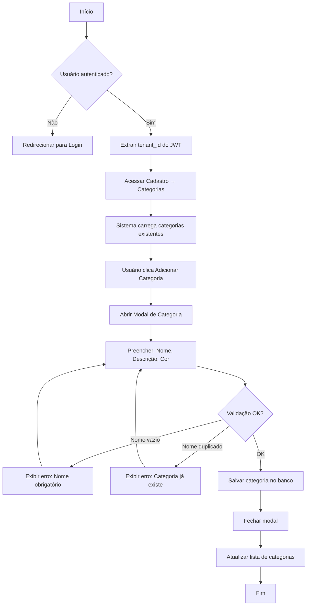
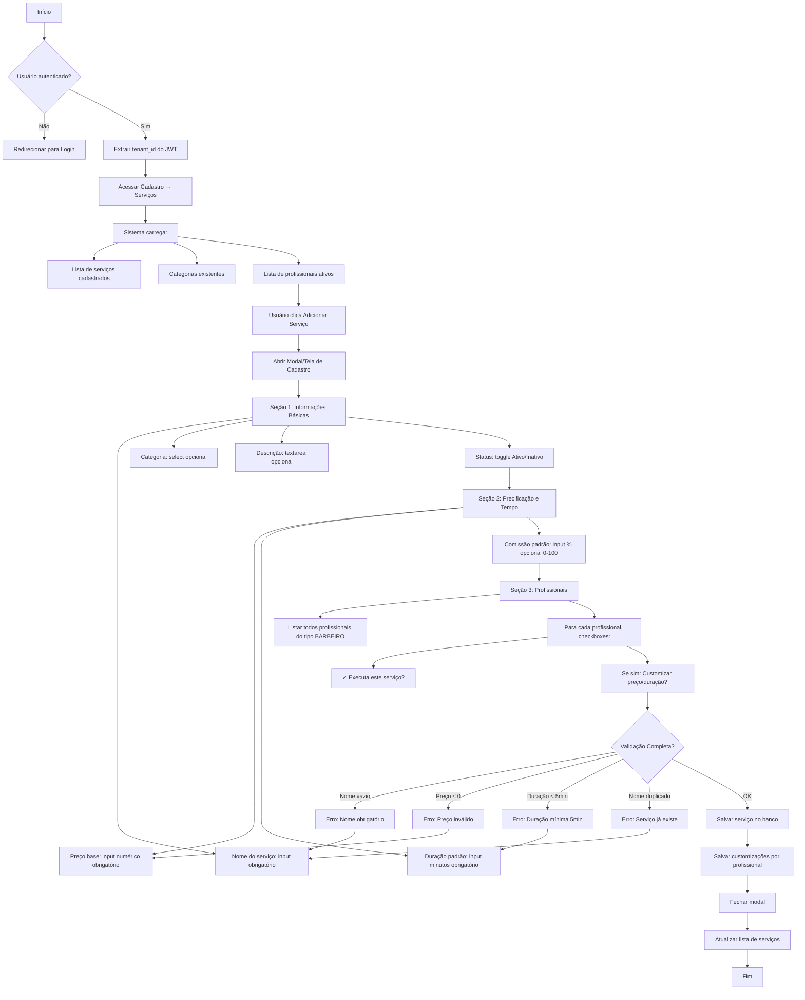

# Fluxo de Cadastro de Serviço — NEXO v1.0

**Versão:** 1.0  
**Última Atualização:** 26/11/2025  
**Status:** Planejado (v1.0.0 - Milestone 1.4)  
**Responsável:** Product + Tech Lead

---

## 📋 Visão Geral

Módulo responsável pelo **cadastro e gerenciamento de serviços** oferecidos pela barbearia, com suporte a:

- ✅ Categorização de serviços
- ✅ Precificação e duração
- ✅ Customização por profissional (preço e tempo diferentes)
- ✅ Controle de disponibilidade (ativo/inativo)
- ✅ Isolamento multi-tenant

**Prioridade:** 🟡 MÉDIA (Milestone 1.4 - necessário antes de Agendamentos)

---

## 🎯 Objetivos do Fluxo

1. ✅ Permitir criação e edição de categorias de serviço
2. ✅ Permitir criação e edição de serviços
3. ✅ Customizar preço e duração por profissional
4. ✅ Controlar quais profissionais executam cada serviço
5. ✅ Validar dados obrigatórios e regras de negócio
6. ✅ Respeitar isolamento multi-tenant
7. ✅ Fornecer listagem visual e funcional

---

## 🔐 Regras de Negócio (RN)

### RN-SRV-001: Validação de Categoria

- ✅ Nome da categoria é obrigatório
- ✅ Categoria deve ser única por tenant
- ❌ Não pode deletar categoria com serviços vinculados
- ✅ Categorias padrão: Cabelo, Barba, Estética, Pacote, Outros

### RN-SRV-002: Validação de Serviço

- ✅ Nome do serviço é obrigatório
- ✅ Preço base deve ser maior que zero
- ✅ Duração mínima: 5 minutos
- ✅ Comissão padrão: 0% a 100%
- ✅ Nome do serviço deve ser único por tenant
- ✅ Serviço pode existir sem categoria (opcional)

### RN-SRV-003: Customização por Profissional

- ✅ Cada profissional pode ter:
  - Preço diferente do padrão
  - Duração diferente do padrão
  - Comissão diferente do padrão
- ✅ Se não customizado, usa valores padrão do serviço
- ✅ Profissional pode ser marcado como "não executa este serviço"

### RN-SRV-004: Status do Serviço

- ✅ Serviço ativo: disponível para agendamento
- ❌ Serviço inativo: não aparece na listagem de agendamento
- ✅ Inativar serviço não afeta agendamentos já existentes

### RN-SRV-005: Permissões de Acesso

- **Dono:** Acesso total (criar, editar, deletar)
- **Gerente:** Acesso total (criar, editar, deletar)
- **Admin:** Pode criar e editar, não pode deletar
- **Recepção:** Apenas visualização
- **Barbeiro:** Apenas visualização dos próprios serviços

### RN-SRV-006: Dados Opcionais Avançados

- Cor (hex) para exibição visual no calendário
- Imagem/ícone do serviço
- Tags para busca rápida
- Observações internas

---

## 📊 Diagrama de Fluxo Principal

### Fluxo de Cadastro de Categoria



### Fluxo de Cadastro de Serviço



---

## 🧩 Componentes e Telas

### Tela Principal: Listagem de Serviços

**Rota:** `/cadastro/servicos`

**Elementos:**

- Header com título "Gerenciamento de Serviços"
- Botão "Nova Categoria" (secundário)
- Botão "Novo Serviço" (primário)
- Filtros:
  - Busca por nome
  - Filtro por categoria
  - Filtro por status (Ativo/Inativo/Todos)
- Tabela de serviços:
  - Nome
  - Categoria
  - Preço base
  - Duração padrão
  - Profissionais vinculados
  - Status (badge)
  - Ações (editar, duplicar, deletar)

---

### Modal: Nova Categoria

**Campos:**

```typescript
{
  nome: string;           // obrigatório, max 100 chars
  descricao?: string;     // opcional
  cor?: string;           // opcional, hex color picker
  icone?: string;         // opcional, emoji ou icon name
}
```

**Validações:**

- Nome obrigatório
- Nome único por tenant
- Cor no formato hex (#RRGGBB)

---

### Modal/Tela: Novo Serviço

**Seção 1: Informações Básicas**

```typescript
{
  nome: string;               // obrigatório, max 255 chars
  categoria_id?: UUID;        // opcional, select
  descricao?: string;         // opcional, textarea
  ativo: boolean;             // toggle, default true
}
```

**Seção 2: Precificação e Tempo**

```typescript
{
  preco: number;              // obrigatório, > 0, BRL
  duracao: number;            // obrigatório, minutos, >= 5
  comissao?: number;          // opcional, %, 0-100, default 0
  cor?: string;               // opcional, hex para calendário
  imagem?: string;            // opcional, URL ou base64
}
```

**Seção 3: Profissionais**

Para cada profissional do tipo `BARBEIRO`:

```typescript
{
  professional_id: UUID;
  executa: boolean;           // checkbox principal
  customizado: boolean;       // toggle "Customizar"
  preco_custom?: number;      // se customizado
  duracao_custom?: number;    // se customizado, minutos
  comissao_custom?: number;   // se customizado, %
}
```

**Seção 4: Dados Avançados (Opcional)**

```typescript
{
  observacoes?: string;       // textarea para uso interno
  tags?: string[];            // array de tags para busca
}
```

---

## 🔄 Fluxo Detalhado - Passo a Passo

### [1] Acesso ao Módulo

**Ação do usuário:**
- Dono/Gerente/Admin acessa: **Cadastro → Serviços**

**Sistema carrega:**
- Lista de serviços já cadastrados
- Categorias existentes
- Profissionais ativos tipo BARBEIRO
- Preços, durações e status atuais

---

### [2] Criar Nova Categoria (Opcional)

**Ação do usuário:**
- Clica em "Nova Categoria"

**Sistema abre modal:**
- Campo: Nome (obrigatório)
- Campo: Descrição (opcional)
- Campo: Cor (color picker, opcional)
- Campo: Ícone (emoji picker, opcional)

**Usuário preenche e clica "Salvar"**

**Sistema valida:**
- ✅ Nome não vazio
- ✅ Nome único no tenant
- ✅ Cor em formato hex válido

**Sistema executa:**
```sql
INSERT INTO categorias (id, tenant_id, nome, descricao, cor, icone)
VALUES (gen_random_uuid(), :tenant_id, :nome, :descricao, :cor, :icone);
```

**Sistema retorna:**
- Categoria criada com sucesso
- Atualiza select de categorias

---

### [3] Criar Novo Serviço

**Ação do usuário:**
- Clica em "Novo Serviço"

**Sistema abre modal/tela com formulário em seções:**

---

#### 📝 Seção 1: Informações Básicas

**Campos exibidos:**

| Campo | Tipo | Obrigatório | Exemplo |
|-------|------|-------------|---------|
| Nome do serviço | Text input | ✅ Sim | "Corte Masculino" |
| Categoria | Select | ❌ Não | "Cabelo" |
| Descrição | Textarea | ❌ Não | "Corte tradicional com máquina e tesoura" |
| Status | Toggle | ✅ Sim | Ativo / Inativo |

---

#### 💰 Seção 2: Precificação e Tempo

**Campos exibidos:**

| Campo | Tipo | Obrigatório | Validação | Exemplo |
|-------|------|-------------|-----------|---------|
| Preço base | Number (BRL) | ✅ Sim | > 0 | R$ 35,00 |
| Duração padrão | Number (min) | ✅ Sim | >= 5 | 30 minutos |
| Comissão padrão | Number (%) | ❌ Não | 0-100 | 40% |
| Cor (calendário) | Color picker | ❌ Não | hex | #4A90E2 |

---

#### 👥 Seção 3: Profissionais que Executam

**Sistema lista:**
- Todos profissionais com `tipo = 'BARBEIRO'` e `status = 'ATIVO'`

**Para cada profissional, exibe:**

```
┌─────────────────────────────────────────────────────┐
│ ☑ João Silva (Barbeiro)                             │
│   └─ ☐ Customizar preço e duração                   │
│       ├─ Preço: R$ [____] (vazio = usar padrão)     │
│       ├─ Duração: [____] min (vazio = usar padrão)  │
│       └─ Comissão: [____] % (vazio = usar padrão)   │
└─────────────────────────────────────────────────────┘
```

**Regras:**
- ✅ Checkbox marcado = profissional executa o serviço
- ❌ Checkbox desmarcado = profissional NÃO executa
- Se checkbox "Customizar" marcado:
  - Campos ficam habilitados
  - Valores customizados são salvos
- Se checkbox "Customizar" desmarcado:
  - Campos ficam desabilitados/ocultos
  - Usa valores padrão do serviço

**Exemplo prático:**

```
Serviço: Barba Completa
Preço base: R$ 25,00
Duração padrão: 25 minutos

Profissionais:
☑ Thiago (Barbeiro)
  └─ ☑ Customizar
      ├─ Preço: R$ 28,00
      ├─ Duração: 25 min
      └─ Comissão: 50%

☑ João (Barbeiro)
  └─ ☑ Customizar
      ├─ Preço: R$ 25,00 (usa padrão)
      ├─ Duração: 30 min (João é mais lento)
      └─ Comissão: 40%

☐ Maria (Manicure) → NÃO executa este serviço
```

---

#### 🏷️ Seção 4: Dados Avançados (Collapsible)

**Campos opcionais:**

| Campo | Tipo | Descrição |
|-------|------|-----------|
| Observações | Textarea | Notas internas, não visíveis ao cliente |
| Tags | Tag input | Ex: "promocao", "combo", "popular" |
| Imagem | Upload | Logo/foto do serviço |

---

### [4] Validação e Salvamento

**Usuário clica "Salvar Serviço"**

**Sistema valida:**

```typescript
// Validação com Zod
const servicoSchema = z.object({
  nome: z.string().min(1, "Nome obrigatório").max(255),
  categoria_id: z.string().uuid().optional().nullable(),
  descricao: z.string().optional(),
  preco: z.number().positive("Preço deve ser maior que zero"),
  duracao: z.number().int().min(5, "Duração mínima: 5 minutos"),
  comissao: z.number().min(0).max(100).optional().default(0),
  cor: z.string().regex(/^#[0-9A-F]{6}$/i).optional(),
  ativo: z.boolean().default(true),
  profissionais: z.array(z.object({
    professional_id: z.string().uuid(),
    executa: z.boolean(),
    preco_custom: z.number().positive().optional(),
    duracao_custom: z.number().int().min(5).optional(),
    comissao_custom: z.number().min(0).max(100).optional(),
  })),
});
```

**Se validação OK:**

**Backend executa (transação):**

```sql
BEGIN;

-- 1. Inserir serviço
INSERT INTO servicos (
    id, tenant_id, categoria_id, nome, descricao,
    preco, duracao, comissao, cor, imagem,
    observacoes, tags, ativo, criado_em, atualizado_em
) VALUES (
    gen_random_uuid(), :tenant_id, :categoria_id, :nome, :descricao,
    :preco, :duracao, :comissao, :cor, :imagem,
    :observacoes, :tags, :ativo, NOW(), NOW()
) RETURNING id;

-- 2. Para cada profissional marcado como "executa":
INSERT INTO servicos_profissionais (
    id, tenant_id, servico_id, professional_id,
    preco_custom, duracao_custom, comissao_custom,
    criado_em, atualizado_em
) VALUES (
    gen_random_uuid(), :tenant_id, :servico_id, :professional_id,
    :preco_custom, :duracao_custom, :comissao_custom,
    NOW(), NOW()
);

COMMIT;
```

**Sistema retorna:**
- ✅ Serviço criado com sucesso
- Fecha modal
- Atualiza lista de serviços
- Exibe toast: "Serviço 'Corte Masculino' criado com sucesso!"

---

### [5] Editar Serviço Existente

**Ação do usuário:**
- Clica em "Editar" na linha do serviço

**Sistema:**
- Carrega dados atuais do serviço
- Carrega customizações por profissional
- Abre modal preenchido
- Usuário altera campos desejados
- Clica "Salvar Alterações"

**Backend executa (transação):**

```sql
BEGIN;

-- 1. Atualizar serviço
UPDATE servicos SET
    categoria_id = :categoria_id,
    nome = :nome,
    descricao = :descricao,
    preco = :preco,
    duracao = :duracao,
    comissao = :comissao,
    cor = :cor,
    ativo = :ativo,
    atualizado_em = NOW()
WHERE id = :servico_id AND tenant_id = :tenant_id;

-- 2. Deletar todas customizações antigas
DELETE FROM servicos_profissionais
WHERE servico_id = :servico_id AND tenant_id = :tenant_id;

-- 3. Inserir novas customizações
INSERT INTO servicos_profissionais (...) VALUES (...);

COMMIT;
```

---

### [6] Deletar Serviço

**Ação do usuário:**
- Clica em "Deletar" na linha do serviço

**Sistema:**
- Exibe confirmação: "Tem certeza que deseja excluir 'Corte Masculino'?"
- Usuário confirma

**Backend valida:**
- ✅ Verifica se existem agendamentos futuros usando este serviço
- ❌ Se existir, impede exclusão e sugere inativar

**Se OK:**

```sql
BEGIN;

-- 1. Deletar customizações
DELETE FROM servicos_profissionais
WHERE servico_id = :servico_id AND tenant_id = :tenant_id;

-- 2. Deletar serviço
DELETE FROM servicos
WHERE id = :servico_id AND tenant_id = :tenant_id;

COMMIT;
```

---

## 🗄️ Estrutura de Dados

### Tabela: `categorias`

```sql
CREATE TABLE IF NOT EXISTS categorias (
    id UUID PRIMARY KEY DEFAULT gen_random_uuid(),
    tenant_id UUID NOT NULL REFERENCES tenants(id) ON DELETE CASCADE,
    nome VARCHAR(100) NOT NULL,
    descricao TEXT,
    cor VARCHAR(7),
    icone VARCHAR(50),
    criado_em TIMESTAMPTZ DEFAULT now(),
    atualizado_em TIMESTAMPTZ DEFAULT now(),
    CONSTRAINT idx_categorias_tenant_nome UNIQUE (tenant_id, nome)
);
```

### Tabela: `servicos`

```sql
CREATE TABLE IF NOT EXISTS servicos (
    id UUID PRIMARY KEY DEFAULT gen_random_uuid(),
    tenant_id UUID NOT NULL REFERENCES tenants(id) ON DELETE CASCADE,
    categoria_id UUID REFERENCES categorias(id) ON DELETE SET NULL,
    nome VARCHAR(255) NOT NULL,
    descricao TEXT,
    preco NUMERIC(10,2) NOT NULL CHECK (preco > 0),
    duracao INTEGER NOT NULL CHECK (duracao >= 5),
    comissao NUMERIC(5,2) DEFAULT 0.00 CHECK (comissao >= 0 AND comissao <= 100),
    cor VARCHAR(7),
    imagem TEXT,
    observacoes TEXT,
    tags TEXT[],
    ativo BOOLEAN DEFAULT true,
    criado_em TIMESTAMPTZ DEFAULT now(),
    atualizado_em TIMESTAMPTZ DEFAULT now(),
    CONSTRAINT idx_servicos_tenant_nome UNIQUE (tenant_id, nome)
);
```

### Tabela: `servicos_profissionais`

```sql
CREATE TABLE IF NOT EXISTS servicos_profissionais (
    id UUID PRIMARY KEY DEFAULT gen_random_uuid(),
    tenant_id UUID NOT NULL REFERENCES tenants(id) ON DELETE CASCADE,
    servico_id UUID NOT NULL REFERENCES servicos(id) ON DELETE CASCADE,
    professional_id UUID NOT NULL REFERENCES profissionais(id) ON DELETE CASCADE,
    preco_custom NUMERIC(10,2),
    duracao_custom INTEGER CHECK (duracao_custom >= 5),
    comissao_custom NUMERIC(5,2) CHECK (comissao_custom >= 0 AND comissao_custom <= 100),
    criado_em TIMESTAMPTZ DEFAULT now(),
    atualizado_em TIMESTAMPTZ DEFAULT now(),
    CONSTRAINT idx_servicos_prof_unique UNIQUE (tenant_id, servico_id, professional_id)
);
```

---

## 🔍 Queries Essenciais

### Listar Serviços com Categorias

```sql
SELECT 
    s.id,
    s.nome,
    s.descricao,
    s.preco,
    s.duracao,
    s.comissao,
    s.ativo,
    c.nome AS categoria_nome,
    c.cor AS categoria_cor,
    COUNT(DISTINCT sp.professional_id) AS total_profissionais
FROM servicos s
LEFT JOIN categorias c ON c.id = s.categoria_id
LEFT JOIN servicos_profissionais sp ON sp.servico_id = s.id
WHERE s.tenant_id = $1
  AND (s.ativo = $2 OR $2 IS NULL)
GROUP BY s.id, c.nome, c.cor
ORDER BY s.nome ASC;
```

### Listar Profissionais de um Serviço

```sql
SELECT 
    p.id,
    p.nome,
    p.foto,
    sp.preco_custom,
    sp.duracao_custom,
    sp.comissao_custom,
    COALESCE(sp.preco_custom, s.preco) AS preco_final,
    COALESCE(sp.duracao_custom, s.duracao) AS duracao_final,
    COALESCE(sp.comissao_custom, s.comissao) AS comissao_final
FROM profissionais p
INNER JOIN servicos_profissionais sp ON sp.professional_id = p.id
INNER JOIN servicos s ON s.id = sp.servico_id
WHERE sp.servico_id = $1
  AND sp.tenant_id = $2
  AND p.status = 'ATIVO'
ORDER BY p.nome ASC;
```

### Buscar Serviços para Agendamento

```sql
SELECT 
    s.id,
    s.nome,
    s.preco,
    s.duracao,
    s.cor,
    c.nome AS categoria
FROM servicos s
LEFT JOIN categorias c ON c.id = s.categoria_id
WHERE s.tenant_id = $1
  AND s.ativo = true
ORDER BY c.nome ASC, s.nome ASC;
```

---

## 🎨 UX/UI - Componentes Visuais

### Card de Serviço na Listagem

```
┌──────────────────────────────────────────────────┐
│ 🟦 Corte Masculino                    [Ativo ✓] │
│ Categoria: Cabelo                                │
│ R$ 35,00 • 30 min • 40% comissão                 │
│ 👥 3 profissionais                                │
│ ─────────────────────────────────────────────── │
│ [✏️ Editar] [📋 Duplicar] [🗑️ Deletar]           │
└──────────────────────────────────────────────────┘
```

### Modal - Seção Profissionais (Exemplo Visual)

```
┌─────────────────────────────────────────────────────────┐
│ Profissionais que Executam Este Serviço                │
├─────────────────────────────────────────────────────────┤
│                                                         │
│ ☑ Thiago Silva (Barbeiro)                              │
│   └─ ☑ Customizar valores                              │
│       ├─ Preço: R$ 28,00                               │
│       ├─ Duração: 25 minutos                           │
│       └─ Comissão: 50%                                 │
│                                                         │
│ ☑ João Oliveira (Barbeiro)                             │
│   └─ ☐ Customizar valores (usa valores padrão)        │
│                                                         │
│ ☐ Vinicius Costa (Barbeiro)                            │
│   (não executa este serviço)                           │
│                                                         │
└─────────────────────────────────────────────────────────┘
```

---

## ⚠️ Validações e Mensagens de Erro

| Cenário | Mensagem | Tipo |
|---------|----------|------|
| Nome vazio | "Nome do serviço é obrigatório" | error |
| Preço ≤ 0 | "Preço deve ser maior que zero" | error |
| Duração < 5 | "Duração mínima é 5 minutos" | error |
| Nome duplicado | "Já existe um serviço com este nome" | error |
| Comissão inválida | "Comissão deve estar entre 0% e 100%" | error |
| Cor inválida | "Cor deve estar no formato #RRGGBB" | error |
| Deletar com agendamentos | "Não é possível deletar. Existem 3 agendamentos futuros usando este serviço. Deseja inativá-lo?" | warning |
| Sucesso ao criar | "Serviço 'Corte Masculino' criado com sucesso!" | success |
| Sucesso ao editar | "Serviço 'Barba Completa' atualizado com sucesso!" | success |

---

## 🔒 Segurança e Permissões

### Middleware de Autenticação

Todos os endpoints devem:
1. Validar JWT
2. Extrair `tenant_id` do token
3. Filtrar dados sempre por `tenant_id`

### Controle de Acesso por Role

```typescript
// Criar/Editar Serviços
roles: ['owner', 'admin', 'manager']

// Deletar Serviços
roles: ['owner', 'manager']

// Visualizar Serviços
roles: ['owner', 'admin', 'manager', 'receptionist', 'barbeiro']
```

---

## 📱 API Endpoints

### Categorias

```http
GET    /api/v1/categorias           # Listar categorias
POST   /api/v1/categorias           # Criar categoria
PUT    /api/v1/categorias/:id       # Editar categoria
DELETE /api/v1/categorias/:id       # Deletar categoria
```

### Serviços

```http
GET    /api/v1/servicos                    # Listar serviços
GET    /api/v1/servicos/:id                # Buscar serviço por ID
POST   /api/v1/servicos                    # Criar serviço
PUT    /api/v1/servicos/:id                # Editar serviço
DELETE /api/v1/servicos/:id                # Deletar serviço
GET    /api/v1/servicos/:id/profissionais  # Listar profissionais do serviço
```

---

## 🧪 Casos de Teste

### CT-SRV-001: Criar Serviço Básico

**Given:** Usuário autenticado como gerente  
**When:** Preenche nome "Corte", preço R$ 30, duração 30min  
**Then:** Serviço criado, aparece na listagem

### CT-SRV-002: Criar Serviço com Categoria

**Given:** Categoria "Cabelo" existe  
**When:** Cria serviço "Corte" vinculado à categoria  
**Then:** Serviço aparece filtrado pela categoria

### CT-SRV-003: Customizar por Profissional

**Given:** Serviço "Barba" com preço R$ 25, duração 25min  
**When:** Define Thiago com preço R$ 28, João com duração 30min  
**Then:** Cada profissional tem valores customizados salvos

### CT-SRV-004: Validar Nome Duplicado

**Given:** Serviço "Corte Masculino" já existe  
**When:** Tenta criar outro com mesmo nome  
**Then:** Erro: "Já existe um serviço com este nome"

### CT-SRV-005: Inativar Serviço

**Given:** Serviço "Barba" está ativo  
**When:** Altera status para inativo  
**Then:** Não aparece mais na listagem de agendamento

### CT-SRV-006: Deletar com Agendamentos

**Given:** Serviço "Corte" tem 5 agendamentos futuros  
**When:** Tenta deletar  
**Then:** Erro: sugestão de inativar ao invés de deletar

---

## 📈 Métricas de Sucesso

- ✅ Tempo médio de cadastro de serviço < 2 minutos
- ✅ Taxa de erro na validação < 5%
- ✅ 100% dos serviços com categoria definida
- ✅ Média de 3+ profissionais por serviço
- ✅ 90% dos serviços com valores customizados por profissional

---

## 🚀 Roadmap de Implementação

### Fase 1: Categorias (Sprint 1.4.1)
- [ ] Criar migration de `categorias`
- [ ] CRUD backend de categorias
- [ ] Tela frontend de categorias
- [ ] Validações e testes

### Fase 2: Serviços Básicos (Sprint 1.4.2)
- [ ] Criar migration de `servicos`
- [ ] CRUD backend de serviços
- [ ] Tela frontend de serviços
- [ ] Validações e testes

### Fase 3: Customização por Profissional (Sprint 1.4.3)
- [ ] Criar migration de `servicos_profissionais`
- [ ] Lógica de customização backend
- [ ] UI de seleção de profissionais
- [ ] Queries otimizadas
- [ ] Testes E2E completos

### Fase 4: Recursos Avançados (Sprint 1.4.4)
- [ ] Upload de imagens
- [ ] Sistema de tags
- [ ] Busca avançada
- [ ] Duplicar serviços
- [ ] Importação em lote

---

## 📚 Referências

- [PRD-VALTARIS.md](../07-produto-e-funcionalidades/PRD-VALTARIS.md)
- [MODELO_DE_DADOS.md](../02-arquitetura/MODELO_DE_DADOS.md)
- [ARQUITETURA.md](../02-arquitetura/ARQUITETURA.md)
- [FLUXO_AGENDAMENTO.md](./FLUXO_AGENDAMENTO.md)

---

**Documento mantido por:** Product Team  
**Próxima revisão:** 10/12/2025
