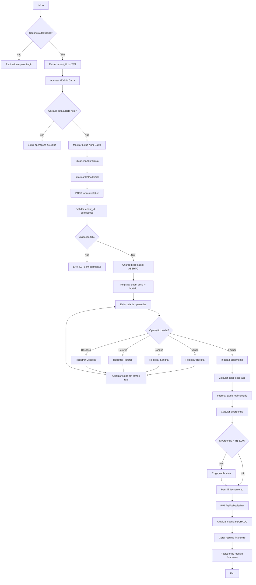

# Fluxo de Caixa Diário — NEXO v1.0

**Versão:** 1.0
**Última Atualização:** 24/11/2025
**Status:** ✅ Implementado Parcialmente (Fluxo de Caixa Compensado completo)
**Responsável:** Tech Lead + Produto

---

## 📋 Visão Geral

Módulo responsável pelo **controle diário do caixa** da barbearia, incluindo abertura, operações (sangrias/reforços), fechamento e reconciliação com movimentações financeiras.

**Diferença entre Caixa Diário e Fluxo de Caixa Compensado:**

- **Caixa Diário:** Operação física do caixa (abertura/fechamento/sangrias)
- **Fluxo Compensado:** Visão financeira completa com contas a pagar/receber

**Status Implementação (22/11/2025):**

- ✅ Fluxo de Caixa Compensado (2 endpoints backend)
- ✅ Cron de geração automática diária
- 🟡 Caixa Diário (operacional) - Pendente

---

## 🎯 Objetivos do Fluxo

1. ✅ Permitir abertura de caixa com saldo inicial
2. ✅ Registrar todas operações do dia (receitas/despesas)
3. ✅ Controlar sangrias (retiradas) e reforços (adições)
4. ✅ Calcular saldo em tempo real
5. ✅ Fechar caixa com conferência
6. ✅ Detectar divergências (esperado vs real)
7. ✅ Gerar snapshot automático diário (cron)
8. ✅ Integrar com módulo financeiro
9. ✅ Respeitar isolamento multi-tenant

---

## 🔐 Regras de Negócio (RN)

### RN-CAI-001: Abertura de Caixa

- ✅ Somente 1 caixa aberto por vez por unidade
- ✅ Deve informar saldo inicial (conferência de valores)
- ✅ Registrar quem abriu (usuário) e horário
- ✅ Status inicial: `ABERTO`

### RN-CAI-002: Operações Permitidas

Durante o dia, pode registrar:

- **Receitas:** Vendas de serviços/produtos (à vista)
- **Sangrias:** Retiradas de dinheiro (banco, despesas urgentes)
- **Reforços:** Adições de dinheiro (troco, capital de giro)
- **Despesas:** Pequenas despesas à vista

### RN-CAI-003: Sangrias e Reforços

- ✅ Sangria **reduz** saldo do caixa
- ✅ Reforço **aumenta** saldo do caixa
- ✅ Ambos exigem justificativa obrigatória
- ✅ Registrar responsável pela operação

### RN-CAI-004: Fechamento de Caixa

- ✅ Calcular saldo esperado: `saldo_inicial + entradas - saídas - sangrias + reforços`
- ✅ Conferir com saldo real (contagem física)
- ✅ Divergência = `saldo_real - saldo_esperado`
- ✅ Se divergência > R$ 5,00 → exigir justificativa
- ✅ Status final: `FECHADO`

### RN-CAI-005: Snapshot Automático (Cron)

- ✅ Executa diariamente às 02:00
- ✅ Gera registro em `fluxo_caixa_diario`
- ✅ Calcula saldo acumulado do dia
- ✅ Usado para relatórios e DRE

### RN-CAI-006: Permissões

- **Gerente/Dono:** Pode abrir, fechar, sangrar, reforçar
- **Recepção:** Pode registrar vendas, visualizar saldo
- **Barbeiro:** Não tem acesso ao caixa
- **Contador:** Visualização read-only

---

## 📊 Diagrama de Fluxo Principal



---

## 🏗️ Arquitetura Técnica

### Backend (Go - Clean Architecture)

**Domain Layer:**

```go
// internal/domain/caixa/caixa.go
type CaixaDiario struct {
    ID                string
    TenantID          string
    UnitID            string
    UsuarioAberturaID string
    UsuarioFechamentoID string
    DataAbertura      time.Time
    DataFechamento    *time.Time
    SaldoInicial      Money
    TotalEntradas     Money
    TotalSaidas       Money
    TotalSangrias     Money
    TotalReforcos     Money
    SaldoEsperado     Money
    SaldoReal         Money
    Divergencia       Money
    Status            StatusCaixa
    Justificativa     string
    CreatedAt         time.Time
    UpdatedAt         time.Time
}

type StatusCaixa string
const (
    StatusAberto  StatusCaixa = "ABERTO"
    StatusFechado StatusCaixa = "FECHADO"
)

type OperacaoCaixa struct {
    ID          string
    CaixaID     string
    TenantID    string
    Tipo        TipoOperacao
    Valor       Money
    Descricao   string
    UsuarioID   string
    CreatedAt   time.Time
}

type TipoOperacao string
const (
    TipoVenda    TipoOperacao = "VENDA"
    TipoSangria  TipoOperacao = "SANGRIA"
    TipoReforco  TipoOperacao = "REFORCO"
    TipoDespesa  TipoOperacao = "DESPESA"
)
```

**Application Layer:**

```go
// internal/application/usecase/caixa/abrir_caixa.go
type AbrirCaixaUseCase struct {
    caixaRepo    domain.CaixaRepository
    userRepo     domain.UserRepository
    validator    *validator.Validate
}

func (uc *AbrirCaixaUseCase) Execute(
    ctx context.Context,
    tenantID, userID string,
    req *dto.AbrirCaixaRequest,
) (*dto.AbrirCaixaResponse, error) {
    // 1. Verificar se já existe caixa aberto
    caixaAberto, err := uc.caixaRepo.FindAberto(ctx, tenantID, req.UnitID)
    if err == nil && caixaAberto != nil {
        return nil, ErrCaixaJaAberto
    }

    // 2. Validar permissões do usuário
    user, err := uc.userRepo.FindByID(ctx, tenantID, userID)
    if err != nil {
        return nil, ErrUserNotFound
    }

    if !user.CanOpenCaixa() {
        return nil, ErrSemPermissao
    }

    // 3. Criar caixa
    caixa := &domain.CaixaDiario{
        ID:                uuid.New().String(),
        TenantID:          tenantID,
        UnitID:            req.UnitID,
        UsuarioAberturaID: userID,
        DataAbertura:      time.Now(),
        SaldoInicial:      domain.NewMoney(req.SaldoInicial),
        Status:            domain.StatusAberto,
    }

    // 4. Persistir
    if err := uc.caixaRepo.Save(ctx, tenantID, caixa); err != nil {
        return nil, err
    }

    return mapper.ToCaixaResponse(caixa), nil
}
```

**Repository:**

```go
// internal/infrastructure/repository/caixa_repository.go
type PostgresCaixaRepository struct {
    db *sql.DB
}

func (r *PostgresCaixaRepository) FindAberto(
    ctx context.Context,
    tenantID, unitID string,
) (*domain.CaixaDiario, error) {
    query := `
        SELECT id, tenant_id, unit_id, usuario_abertura_id,
               data_abertura, saldo_inicial, status
        FROM caixa_diario
        WHERE tenant_id = $1
          AND unit_id = $2
          AND status = 'ABERTO'
          AND DATE(data_abertura) = CURRENT_DATE
        LIMIT 1
    `

    var caixa domain.CaixaDiario
    err := r.db.QueryRowContext(ctx, query, tenantID, unitID).Scan(...)
    return &caixa, err
}

func (r *PostgresCaixaRepository) RegistrarOperacao(
    ctx context.Context,
    tenantID string,
    op *domain.OperacaoCaixa,
) error {
    // Inserir operação
    query := `
        INSERT INTO operacoes_caixa (
            id, caixa_id, tenant_id, tipo, valor, descricao, usuario_id
        ) VALUES ($1, $2, $3, $4, $5, $6, $7)
    `
    _, err := r.db.ExecContext(ctx, query,
        op.ID, op.CaixaID, tenantID, op.Tipo,
        op.Valor.Amount(), op.Descricao, op.UsuarioID,
    )
    if err != nil {
        return err
    }

    // Atualizar totais no caixa
    return r.AtualizarTotais(ctx, tenantID, op.CaixaID)
}
```

**HTTP Handler:**

```go
// internal/infrastructure/http/handler/caixa_handler.go
func (h *CaixaHandler) Abrir(c echo.Context) error {
    tenantID := c.Get("tenant_id").(string)
    userID := c.Get("user_id").(string)

    var req dto.AbrirCaixaRequest
    if err := c.Bind(&req); err != nil {
        return c.JSON(400, ErrorResponse{Message: "Invalid request"})
    }

    resp, err := h.abrirUC.Execute(c.Request().Context(), tenantID, userID, &req)
    if err != nil {
        if errors.Is(err, ErrCaixaJaAberto) {
            return c.JSON(409, ErrorResponse{Message: "Caixa já está aberto"})
        }
        return handleError(c, err)
    }

    return c.JSON(201, resp)
}

func (h *CaixaHandler) RegistrarSangria(c echo.Context) error {
    tenantID := c.Get("tenant_id").(string)
    userID := c.Get("user_id").(string)
    caixaID := c.Param("caixa_id")

    var req dto.RegistrarSangriaRequest
    if err := c.Bind(&req); err != nil {
        return c.JSON(400, ErrorResponse{Message: "Invalid request"})
    }

    op := &domain.OperacaoCaixa{
        ID:        uuid.New().String(),
        CaixaID:   caixaID,
        TenantID:  tenantID,
        Tipo:      domain.TipoSangria,
        Valor:     domain.NewMoney(req.Valor),
        Descricao: req.Justificativa,
        UsuarioID: userID,
    }

    if err := h.caixaRepo.RegistrarOperacao(c.Request().Context(), tenantID, op); err != nil {
        return handleError(c, err)
    }

    return c.JSON(201, map[string]string{"status": "ok"})
}
```

### Frontend (Next.js + React Query)

**Service:**

```typescript
// frontend/app/lib/services/caixaService.ts
export const caixaService = {
  abrirCaixa: async (data: AbrirCaixaDTO) => {
    const response = await apiClient.post('/api/caixa/abrir', data);
    return AbrirCaixaResponseSchema.parse(response.data);
  },

  getCaixaAberto: async () => {
    const response = await apiClient.get('/api/caixa/aberto');
    return CaixaResponseSchema.parse(response.data);
  },

  registrarSangria: async (caixaId: string, data: SangriaDTO) => {
    await apiClient.post(`/api/caixa/${caixaId}/sangria`, data);
  },

  registrarReforco: async (caixaId: string, data: ReforcoDTO) => {
    await apiClient.post(`/api/caixa/${caixaId}/reforco`, data);
  },

  fecharCaixa: async (caixaId: string, data: FecharCaixaDTO) => {
    const response = await apiClient.put(`/api/caixa/${caixaId}/fechar`, data);
    return FecharCaixaResponseSchema.parse(response.data);
  },
};
```

**Hook:**

```typescript
// frontend/app/hooks/useCaixa.ts
export function useCaixaAberto() {
  return useQuery({
    queryKey: ['caixa', 'aberto'],
    queryFn: caixaService.getCaixaAberto,
    refetchInterval: 30000, // Atualizar a cada 30s
  });
}

export function useAbrirCaixa() {
  const queryClient = useQueryClient();

  return useMutation({
    mutationFn: caixaService.abrirCaixa,
    onSuccess: () => {
      toast.success('Caixa aberto com sucesso!');
      queryClient.invalidateQueries(['caixa']);
    },
  });
}

export function useRegistrarSangria() {
  const queryClient = useQueryClient();

  return useMutation({
    mutationFn: ({ caixaId, data }: { caixaId: string; data: SangriaDTO }) =>
      caixaService.registrarSangria(caixaId, data),
    onSuccess: () => {
      toast.success('Sangria registrada!');
      queryClient.invalidateQueries(['caixa']);
    },
  });
}
```

---

## 🗄️ Modelo de Dados

### Tabela: `caixa_diario`

```sql
CREATE TABLE caixa_diario (
    id UUID PRIMARY KEY DEFAULT gen_random_uuid(),
    tenant_id UUID NOT NULL REFERENCES tenants(id) ON DELETE CASCADE,
    unit_id UUID REFERENCES units(id) ON DELETE SET NULL,
    usuario_abertura_id UUID NOT NULL REFERENCES users(id) ON DELETE RESTRICT,
    usuario_fechamento_id UUID REFERENCES users(id) ON DELETE RESTRICT,
    data_abertura TIMESTAMP NOT NULL DEFAULT NOW(),
    data_fechamento TIMESTAMP,
    saldo_inicial DECIMAL(15,2) NOT NULL CHECK (saldo_inicial >= 0),
    total_entradas DECIMAL(15,2) DEFAULT 0,
    total_saidas DECIMAL(15,2) DEFAULT 0,
    total_sangrias DECIMAL(15,2) DEFAULT 0,
    total_reforcos DECIMAL(15,2) DEFAULT 0,
    saldo_esperado DECIMAL(15,2) DEFAULT 0,
    saldo_real DECIMAL(15,2),
    divergencia DECIMAL(15,2),
    status VARCHAR(50) NOT NULL DEFAULT 'ABERTO',
    justificativa_divergencia TEXT,
    created_at TIMESTAMP DEFAULT NOW(),
    updated_at TIMESTAMP DEFAULT NOW()
);

CREATE INDEX idx_caixa_tenant_status ON caixa_diario(tenant_id, status);
CREATE INDEX idx_caixa_tenant_data ON caixa_diario(tenant_id, DATE(data_abertura) DESC);
CREATE UNIQUE INDEX idx_caixa_aberto_unit ON caixa_diario(tenant_id, unit_id)
    WHERE status = 'ABERTO';
```

### Tabela: `operacoes_caixa`

```sql
CREATE TABLE operacoes_caixa (
    id UUID PRIMARY KEY DEFAULT gen_random_uuid(),
    caixa_id UUID NOT NULL REFERENCES caixa_diario(id) ON DELETE CASCADE,
    tenant_id UUID NOT NULL REFERENCES tenants(id) ON DELETE CASCADE,
    tipo VARCHAR(50) NOT NULL, -- VENDA, SANGRIA, REFORCO, DESPESA
    valor DECIMAL(15,2) NOT NULL CHECK (valor > 0),
    descricao TEXT NOT NULL,
    usuario_id UUID NOT NULL REFERENCES users(id) ON DELETE RESTRICT,
    created_at TIMESTAMP DEFAULT NOW()
);

CREATE INDEX idx_operacoes_caixa_id ON operacoes_caixa(caixa_id);
CREATE INDEX idx_operacoes_tenant_tipo ON operacoes_caixa(tenant_id, tipo);
```

### Tabela: `fluxo_caixa_diario` (Snapshot Automático)

```sql
CREATE TABLE fluxo_caixa_diario (
    id UUID PRIMARY KEY DEFAULT gen_random_uuid(),
    tenant_id UUID NOT NULL REFERENCES tenants(id) ON DELETE CASCADE,
    data DATE NOT NULL,
    saldo_inicial DECIMAL(15,2) NOT NULL DEFAULT 0,
    total_entradas DECIMAL(15,2) NOT NULL DEFAULT 0,
    total_saidas DECIMAL(15,2) NOT NULL DEFAULT 0,
    saldo_final DECIMAL(15,2) NOT NULL DEFAULT 0,
    created_at TIMESTAMP DEFAULT NOW(),
    updated_at TIMESTAMP DEFAULT NOW(),
    UNIQUE(tenant_id, data)
);

CREATE INDEX idx_fluxo_tenant_data ON fluxo_caixa_diario(tenant_id, data DESC);
```

---

## 📡 Endpoints da API

### POST `/api/caixa/abrir`

**Descrição:** Abrir caixa do dia
**Auth:** JWT (gerente/dono)
**Body:**

```json
{
  "unit_id": "uuid",
  "saldo_inicial": "150.00"
}
```

**Response:** `201 Created`

### GET `/api/caixa/aberto`

**Descrição:** Buscar caixa aberto (hoje)

### POST `/api/caixa/:caixa_id/sangria`

**Descrição:** Registrar sangria
**Body:**

```json
{
  "valor": "200.00",
  "justificativa": "Depósito bancário"
}
```

### POST `/api/caixa/:caixa_id/reforco`

**Descrição:** Registrar reforço
**Body:**

```json
{
  "valor": "100.00",
  "justificativa": "Troco para caixa"
}
```

### PUT `/api/caixa/:caixa_id/fechar`

**Descrição:** Fechar caixa
**Body:**

```json
{
  "saldo_real": "1850.00",
  "justificativa_divergencia": "Diferença de R$ 3,50 em troco"
}
```

### GET `/api/caixa/:caixa_id/operacoes`

**Descrição:** Listar operações do caixa

### GET `/api/caixa/historico`

**Descrição:** Histórico de caixas fechados
**Query:** `date_from`, `date_to`

---

## 🔄 Fluxos Alternativos

### Fluxo 2: Registrar Sangria

```
[Usuário clica em Sangria]
   ↓
[Informar valor + justificativa]
   ↓
[POST /api/caixa/:id/sangria]
   ↓
[Validar caixa está ABERTO]
   ↓
[Criar operação tipo SANGRIA]
   ↓
[Atualizar total_sangrias do caixa]
   ↓
[Recalcular saldo_esperado]
   ↓
[Atualizar UI em tempo real]
   ↓
[Fim]
```

### Fluxo 3: Divergência no Fechamento

```
[Usuário informa saldo_real]
   ↓
[Calcular divergência]
   ↓
{Divergência > R$ 5,00?}
   → Sim → [Exibir modal: Justificativa obrigatória]
   → Não → [Permitir fechamento direto]
   ↓
[Salvar justificativa]
   ↓
[Fechar caixa: status=FECHADO]
   ↓
[Registrar no histórico]
   ↓
[Gerar alerta para gerente (se divergência alta)]
   ↓
[Fim]
```

### Fluxo 4: Cron - Snapshot Automático (02:00)

```
[Cron executa às 02:00]
   ↓
[Buscar todos tenants ativos]
   ↓
[Para cada tenant:]
   ↓
[Calcular totais do dia:
  - Receitas (soma)
  - Despesas (soma)
  - Saldo inicial (do dia anterior)
  - Saldo final = inicial + receitas - despesas]
   ↓
[Upsert em fluxo_caixa_diario]
   ↓
[Registrar log de execução]
   ↓
[Fim]
```

---

## ✅ Critérios de Aceite

Para considerar o módulo **PRONTO** na v1.0:

- [ ] ✅ Backend CRUD de caixa implementado
- [ ] ✅ Validação de caixa único aberto por dia/unidade
- [ ] ✅ Sangrias e reforços funcionais
- [ ] ✅ Cálculo automático de divergência
- [ ] ✅ Cron de snapshot diário ativo
- [ ] ✅ Frontend com UI de abertura/fechamento
- [ ] ✅ Relatório de divergências para auditoria
- [ ] ✅ Integração com módulo financeiro
- [ ] ✅ Multi-tenant isolamento garantido
- [ ] ✅ Testes E2E de fluxo completo

---

## 📊 Métricas de Sucesso

**Operacionais:**

- Divergências < 2% do total movimentado
- 100% dos caixas fechados com conferência
- Tempo médio de fechamento < 5 minutos

**Técnicas:**

- Latência API < 100ms
- Cron executado sem falhas > 99.9%
- Auditoria completa de todas operações

---

## 📚 Referências

- `docs/02-arquitetura/MODELO_DE_DADOS.md` - Schema completo
- `docs/11-Fluxos/FLUXO_FINANCEIRO.md` - Integração com financeiro
- `docs/04-backend/GUIA_DEV_BACKEND.md` - Padrões Go
- `PRD-NEXO.md` - Requisitos de produto

---

**Status:** 🟡 Parcialmente Implementado (Fluxo Compensado OK)
**Próximo Marco:** Caixa Diário Completo (Milestone 1.3)
**Última Revisão:** 24/11/2025
