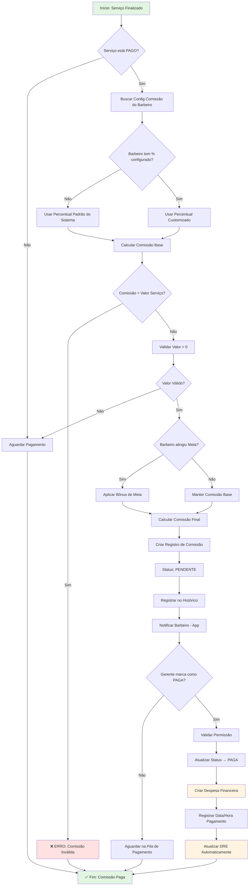

# Fluxo de Comissões — NEXO v1.0

**Versão:** 1.0
**Última Atualização:** 24/11/2025
**Status:** 🟡 Planejado (v1.1.0 - Milestone 2)
**Responsável:** Product + Tech Lead

---

## 📋 Visão Geral

Módulo responsável pelo **cálculo, controle e pagamento de comissões** dos barbeiros de forma justa, transparente e automática. Integra-se diretamente com os módulos Financeiro, Agendamento, Metas e Assinaturas.

**Diferencial:**

- Cálculo automático por serviço realizado
- Percentual configurável por barbeiro
- Bônus por atingimento de metas
- Integração com DRE (despesa operacional)
- Rastreabilidade completa (quem calculou, quando, valor base)

**Prioridade:** 🟡 MÉDIA (v1.1.0 - previsto para Janeiro/2026)

---

## 🎯 Objetivos do Fluxo

1. ✅ Permitir configuração de percentual de comissão por barbeiro
2. ✅ Calcular comissão automaticamente ao finalizar serviço
3. ✅ Validar que comissão nunca ultrapassa valor do serviço
4. ✅ Registrar comissões pendentes (a pagar)
5. ✅ Aplicar bônus por atingimento de metas
6. ✅ Gerar relatórios por barbeiro/período/unidade
7. ✅ Integrar com Financeiro (despesa operacional)
8. ✅ Registrar pagamentos e histórico
9. ✅ Respeitar isolamento multi-tenant
10. ✅ Permitir ajustes manuais com auditoria

---

## 🔐 Regras de Negócio (RN)

### RN-COM-001: Configuração de Comissão

- ✅ Comissão **sempre percentual**, configurada por barbeiro
- ✅ Percentual padrão: configurável no sistema (ex: 40%)
- ✅ Cada barbeiro pode ter percentual customizado
- ✅ Percentual válido: **0% a 100%** (validação backend)
- ✅ Mudança de percentual não afeta comissões já calculadas
- ❌ **Não existe comissão fixa** (somente percentual)

### RN-COM-002: Cálculo Automático

- ✅ Comissão calculada **por serviço** (unitário)
- ✅ Disparo automático quando serviço muda status para `DONE`
- ✅ Somente serviços **pagos** geram comissão
- ✅ Fórmula básica: `comissao = valor_servico * (percentual / 100)`
- ✅ Comissão **nunca pode ultrapassar** valor do serviço
- ✅ Múltiplos serviços no mesmo agendamento = múltiplas comissões

### RN-COM-003: Validação de Valor

- ✅ Se `comissao_calculada > valor_servico` → rejeitar
- ✅ Se `valor_servico <= 0` → não gera comissão
- ✅ Se `percentual == 0` → comissão = 0 (barbeiro sem comissão)
- ✅ Usar **2 casas decimais** para valores monetários

### RN-COM-004: Bônus por Metas

- ✅ Bônus aplicado ao bater meta mensal (configurável)
- ✅ Exemplo: atingiu meta → +10% na comissão do mês
- ✅ Bônus registrado separadamente (rastreabilidade)
- ✅ Fórmula: `comissao_final = comissao_base + bonus_meta`
- 🟡 **Implementação futura** (v1.1.0 - Gamificação)

### RN-COM-005: Status de Comissão

Status permitidos:

- `PENDENTE` - Calculada, aguardando pagamento
- `PAGA` - Comissão paga ao barbeiro
- `CANCELADA` - Serviço cancelado/estornado
- `AJUSTADA` - Valor ajustado manualmente (auditoria obrigatória)

### RN-COM-006: Integração Financeiro

- ✅ Ao pagar comissão → criar **despesa operacional** no financeiro
- ✅ Categoria: "Comissões" (tipo: DESPESA_FIXA ou DESPESA_VARIAVEL)
- ✅ Despesa deve referenciar `comissao_id` (rastreabilidade)
- ✅ Impacta DRE automaticamente
- ✅ Filtro por período no DRE mostra total de comissões pagas

### RN-COM-007: Permissões de Acesso

- **Dono/Gerente:**

  - Ver todas comissões de todos barbeiros
  - Configurar percentuais
  - Marcar como paga
  - Ajustar valores (com justificativa)
  - Exportar relatórios

- **Barbeiro:**

  - Ver **apenas suas próprias** comissões
  - Visualizar histórico de pagamentos
  - Ver percentual configurado
  - Não pode editar

- **Recepcionista/Contador:**
  - Sem acesso ao módulo de comissões

### RN-COM-008: Assinaturas e Comissão

- ✅ Assinaturas (planos recorrentes via Asaas) **podem** gerar comissão
- ✅ Cálculo proporcional: `comissao = valor_fatura * percentual_barbeiro`
- ✅ Comissão gerada ao receber webhook `PAYMENT_RECEIVED` do Asaas
- ✅ Se assinatura cancelada → comissão do ciclo atual mantida
- 🟡 **Configurável:** dono pode desabilitar comissão de assinaturas

---

## 📊 Diagrama de Fluxo (Mermaid)



---

## 🏗️ Arquitetura (Clean Architecture)

### Domain Layer

**1. Entity: Comissao**

```go
// backend/internal/domain/entity/comissao.go
package entity

import (
    "time"
    "github.com/google/uuid"
    "barber-analytics-pro/backend/internal/domain/valueobject"
)

type StatusComissao string

const (
    StatusComissaoPendente  StatusComissao = "PENDENTE"
    StatusComissaoPaga      StatusComissao = "PAGA"
    StatusComissaoCancelada StatusComissao = "CANCELADA"
    StatusComissaoAjustada  StatusComissao = "AJUSTADA"
)

type Comissao struct {
    ID              uuid.UUID
    TenantID        uuid.UUID
    BarbeiroID      uuid.UUID
    ServicoID       *uuid.UUID // Opcional: pode ser de assinatura
    AssinaturaID    *uuid.UUID // Opcional: se for comissão de plano

    // Valores
    ValorServico    valueobject.Money
    PercentualUsado valueobject.Percentage
    ComissaoBase    valueobject.Money
    BonusMeta       valueobject.Money // Bônus adicional por meta
    ComissaoFinal   valueobject.Money

    // Controle
    Status          StatusComissao
    DataCalculo     time.Time
    DataPagamento   *time.Time

    // Auditoria
    CalculadoPor    uuid.UUID // UserID que disparou o cálculo
    PagoPor         *uuid.UUID
    Observacoes     string // Para ajustes manuais

    CreatedAt       time.Time
    UpdatedAt       time.Time
}

// NewComissao - Factory method
func NewComissao(
    tenantID, barbeiroID, servicoID uuid.UUID,
    valorServico valueobject.Money,
    percentual valueobject.Percentage,
    calculadoPor uuid.UUID,
) (*Comissao, error) {
    // Validações
    if valorServico.Value().Sign() <= 0 {
        return nil, ErrValorServicoInvalido
    }

    comissaoBase := valorServico.Percentage(percentual)

    // RN-COM-003: Comissão não pode ultrapassar valor do serviço
    if comissaoBase.GreaterThan(valorServico) {
        return nil, ErrComissaoExcedeValor
    }

    now := time.Now()

    return &Comissao{
        ID:              uuid.New(),
        TenantID:        tenantID,
        BarbeiroID:      barbeiroID,
        ServicoID:       &servicoID,
        ValorServico:    valorServico,
        PercentualUsado: percentual,
        ComissaoBase:    comissaoBase,
        BonusMeta:       valueobject.NewMoney(0),
        ComissaoFinal:   comissaoBase,
        Status:          StatusComissaoPendente,
        DataCalculo:     now,
        CalculadoPor:    calculadoPor,
        CreatedAt:       now,
        UpdatedAt:       now,
    }, nil
}

// AplicarBonusMeta - RN-COM-004
func (c *Comissao) AplicarBonusMeta(bonus valueobject.Money) error {
    if bonus.Value().Sign() < 0 {
        return ErrBonusInvalido
    }

    c.BonusMeta = bonus
    c.ComissaoFinal = c.ComissaoBase.Add(bonus)
    c.UpdatedAt = time.Now()

    return nil
}

// MarcarComoPaga - RN-COM-005
func (c *Comissao) MarcarComoPaga(pagoPorUserID uuid.UUID) error {
    if c.Status == StatusComissaoPaga {
        return ErrComissaoJaPaga
    }

    if c.Status == StatusComissaoCancelada {
        return ErrComissaoCancelada
    }

    now := time.Now()
    c.Status = StatusComissaoPaga
    c.DataPagamento = &now
    c.PagoPor = &pagoPorUserID
    c.UpdatedAt = now

    return nil
}

// Cancelar - Status = CANCELADA
func (c *Comissao) Cancelar(motivo string) error {
    if c.Status == StatusComissaoPaga {
        return ErrNaoPodeCancelarComissaoPaga
    }

    c.Status = StatusComissaoCancelada
    c.Observacoes = motivo
    c.UpdatedAt = time.Now()

    return nil
}

// AjustarValor - Para ajustes manuais (auditoria obrigatória)
func (c *Comissao) AjustarValor(novoValor valueobject.Money, justificativa string, ajustadoPor uuid.UUID) error {
    if justificativa == "" {
        return ErrJustificativaObrigatoria
    }

    if novoValor.GreaterThan(c.ValorServico) {
        return ErrComissaoExcedeValor
    }

    c.ComissaoFinal = novoValor
    c.Status = StatusComissaoAjustada
    c.Observacoes = justificativa
    c.UpdatedAt = time.Now()

    return nil
}
```

**2. Value Object: ConfigComissaoBarbeiro**

```go
// backend/internal/domain/entity/config_comissao_barbeiro.go
package entity

import (
    "time"
    "github.com/google/uuid"
    "barber-analytics-pro/backend/internal/domain/valueobject"
)

type ConfigComissaoBarbeiro struct {
    ID                      uuid.UUID
    TenantID                uuid.UUID
    BarbeiroID              uuid.UUID
    PercentualComissao      valueobject.Percentage
    BonusMetaPercentual     valueobject.Percentage // Ex: +10% ao bater meta
    ComissaoAssinaturaAtiva bool                   // Permite comissão de planos

    CreatedAt               time.Time
    UpdatedAt               time.Time
}

func NewConfigComissaoBarbeiro(
    tenantID, barbeiroID uuid.UUID,
    percentual valueobject.Percentage,
) (*ConfigComissaoBarbeiro, error) {
    // Validar range (0-100%)
    if percentual.Value().Sign() < 0 || percentual.Value().Cmp(decimal.NewFromInt(100)) > 0 {
        return nil, ErrPercentualInvalido
    }

    now := time.Now()

    return &ConfigComissaoBarbeiro{
        ID:                      uuid.New(),
        TenantID:                tenantID,
        BarbeiroID:              barbeiroID,
        PercentualComissao:      percentual,
        BonusMetaPercentual:     valueobject.NewPercentage(0), // Padrão: sem bônus
        ComissaoAssinaturaAtiva: true, // Padrão: permite comissão de assinatura
        CreatedAt:               now,
        UpdatedAt:               now,
    }, nil
}

func (c *ConfigComissaoBarbeiro) AtualizarPercentual(novo valueobject.Percentage) error {
    if novo.Value().Sign() < 0 || novo.Value().Cmp(decimal.NewFromInt(100)) > 0 {
        return ErrPercentualInvalido
    }

    c.PercentualComissao = novo
    c.UpdatedAt = time.Now()
    return nil
}
```

---

### Application Layer

**Use Case: CalcularComissaoServicoUseCase**

```go
// backend/internal/application/usecase/calcular_comissao_servico_usecase.go
package usecase

import (
    "context"
    "fmt"
    "github.com/google/uuid"
    "barber-analytics-pro/backend/internal/domain/entity"
    "barber-analytics-pro/backend/internal/domain/valueobject"
)

type CalcularComissaoServicoInput struct {
    TenantID      uuid.UUID
    BarbeiroID    uuid.UUID
    ServicoID     uuid.UUID
    ValorServico  string // "150.00"
    CalculadoPor  uuid.UUID
}

type CalcularComissaoServicoOutput struct {
    ComissaoID    uuid.UUID
    ComissaoFinal string
    Percentual    string
}

type CalcularComissaoServicoUseCase struct {
    comissaoRepo      ComissaoRepository
    configComissaoRepo ConfigComissaoRepository
}

func NewCalcularComissaoServicoUseCase(
    comissaoRepo ComissaoRepository,
    configRepo ConfigComissaoRepository,
) *CalcularComissaoServicoUseCase {
    return &CalcularComissaoServicoUseCase{
        comissaoRepo:      comissaoRepo,
        configComissaoRepo: configRepo,
    }
}

func (uc *CalcularComissaoServicoUseCase) Execute(
    ctx context.Context,
    input CalcularComissaoServicoInput,
) (*CalcularComissaoServicoOutput, error) {
    // 1. Converter valor do serviço
    valorServico, err := valueobject.NewMoneyFromString(input.ValorServico)
    if err != nil {
        return nil, fmt.Errorf("valor inválido: %w", err)
    }

    // 2. Buscar configuração de comissão do barbeiro
    config, err := uc.configComissaoRepo.FindByBarbeiroID(ctx, input.TenantID, input.BarbeiroID)
    if err != nil {
        // Se não encontrar, usar percentual padrão (ex: 40%)
        config = &entity.ConfigComissaoBarbeiro{
            PercentualComissao: valueobject.NewPercentage(40),
        }
    }

    // 3. Criar entidade Comissao (validações internas)
    comissao, err := entity.NewComissao(
        input.TenantID,
        input.BarbeiroID,
        input.ServicoID,
        valorServico,
        config.PercentualComissao,
        input.CalculadoPor,
    )
    if err != nil {
        return nil, fmt.Errorf("erro ao criar comissão: %w", err)
    }

    // 4. Persistir
    if err := uc.comissaoRepo.Create(ctx, comissao); err != nil {
        return nil, fmt.Errorf("erro ao salvar comissão: %w", err)
    }

    return &CalcularComissaoServicoOutput{
        ComissaoID:    comissao.ID,
        ComissaoFinal: comissao.ComissaoFinal.String(),
        Percentual:    config.PercentualComissao.String(),
    }, nil
}
```

**Use Case: MarcarComissaoComoPagaUseCase**

```go
// backend/internal/application/usecase/marcar_comissao_paga_usecase.go
package usecase

type MarcarComissaoComoPagaInput struct {
    TenantID    uuid.UUID
    ComissaoID  uuid.UUID
    PagoPor     uuid.UUID // UserID de quem está marcando
}

type MarcarComissaoComoPagaUseCase struct {
    comissaoRepo      ComissaoRepository
    despesaRepo       DespesaRepository
    categoriaRepo     CategoriaRepository
}

func (uc *MarcarComissaoComoPagaUseCase) Execute(
    ctx context.Context,
    input MarcarComissaoComoPagaInput,
) error {
    // 1. Buscar comissão
    comissao, err := uc.comissaoRepo.FindByID(ctx, input.TenantID, input.ComissaoID)
    if err != nil {
        return fmt.Errorf("comissão não encontrada: %w", err)
    }

    // 2. Validar status
    if err := comissao.MarcarComoPaga(input.PagoPor); err != nil {
        return err
    }

    // 3. Atualizar comissão
    if err := uc.comissaoRepo.Update(ctx, comissao); err != nil {
        return fmt.Errorf("erro ao atualizar comissão: %w", err)
    }

    // 4. RN-COM-006: Criar despesa operacional no financeiro
    categoriaDespesa, err := uc.categoriaRepo.FindByNome(ctx, input.TenantID, "Comissões")
    if err != nil {
        return fmt.Errorf("categoria 'Comissões' não encontrada: %w", err)
    }

    despesa := &entity.Despesa{
        TenantID:    input.TenantID,
        CategoriaID: categoriaDespesa.ID,
        Descricao:   fmt.Sprintf("Comissão - Barbeiro ID %s", comissao.BarbeiroID),
        Valor:       comissao.ComissaoFinal,
        DataPagamento: comissao.DataPagamento,
        Status:      entity.StatusDespesaPaga,
        ComissaoID:  &comissao.ID, // Rastreabilidade
    }

    if err := uc.despesaRepo.Create(ctx, despesa); err != nil {
        return fmt.Errorf("erro ao criar despesa: %w", err)
    }

    return nil
}
```

---

### Infrastructure Layer

**Repository Port (Interface)**

```go
// backend/internal/domain/port/comissao_repository.go
package port

type ComissaoRepository interface {
    Create(ctx context.Context, comissao *entity.Comissao) error
    FindByID(ctx context.Context, tenantID, comissaoID uuid.UUID) (*entity.Comissao, error)
    Update(ctx context.Context, comissao *entity.Comissao) error
    Delete(ctx context.Context, tenantID, comissaoID uuid.UUID) error

    // Queries
    ListByBarbeiro(ctx context.Context, tenantID, barbeiroID uuid.UUID, periodo Periodo) ([]*entity.Comissao, error)
    ListByStatus(ctx context.Context, tenantID uuid.UUID, status entity.StatusComissao) ([]*entity.Comissao, error)
    ListByPeriodo(ctx context.Context, tenantID uuid.UUID, periodo Periodo) ([]*entity.Comissao, error)

    // Aggregations
    SumByBarbeiro(ctx context.Context, tenantID, barbeiroID uuid.UUID, periodo Periodo) (valueobject.Money, error)
    SumByUnidade(ctx context.Context, tenantID, unidadeID uuid.UUID, periodo Periodo) (valueobject.Money, error)
}
```

**PostgreSQL Repository (sqlc)**

```sql
-- backend/internal/infra/db/queries/comissoes.sql

-- name: CreateComissao :one
INSERT INTO comissoes (
    id, tenant_id, barbeiro_id, servico_id, assinatura_id,
    valor_servico, percentual_usado, comissao_base, bonus_meta, comissao_final,
    status, data_calculo, calculado_por, observacoes,
    created_at, updated_at
) VALUES (
    $1, $2, $3, $4, $5,
    $6, $7, $8, $9, $10,
    $11, $12, $13, $14,
    $15, $16
) RETURNING *;

-- name: FindComissaoByID :one
SELECT * FROM comissoes
WHERE tenant_id = $1 AND id = $2
LIMIT 1;

-- name: UpdateComissao :exec
UPDATE comissoes
SET
    status = $3,
    data_pagamento = $4,
    pago_por = $5,
    bonus_meta = $6,
    comissao_final = $7,
    observacoes = $8,
    updated_at = $9
WHERE tenant_id = $1 AND id = $2;

-- name: ListComissoesByBarbeiro :many
SELECT * FROM comissoes
WHERE tenant_id = $1
  AND barbeiro_id = $2
  AND data_calculo >= $3
  AND data_calculo <= $4
ORDER BY data_calculo DESC;

-- name: ListComissoesByStatus :many
SELECT * FROM comissoes
WHERE tenant_id = $1 AND status = $2
ORDER BY data_calculo DESC;

-- name: SumComissoesByBarbeiro :one
SELECT COALESCE(SUM(comissao_final), 0) as total
FROM comissoes
WHERE tenant_id = $1
  AND barbeiro_id = $2
  AND status = 'PAGA'
  AND data_calculo >= $3
  AND data_calculo <= $4;
```

---

### HTTP Layer

**Handler**

```go
// backend/internal/infra/http/handler/comissao_handler.go
package handler

func (h *ComissaoHandler) CalcularComissaoServico(c echo.Context) error {
    tenantID := middleware.GetTenantID(c)
    userID := middleware.GetUserID(c)

    var req dto.CalcularComissaoRequest
    if err := c.Bind(&req); err != nil {
        return c.JSON(400, ErrorResponse{Error: "Invalid request"})
    }

    // Validação Zod-like
    if err := h.validator.Struct(req); err != nil {
        return c.JSON(400, ErrorResponse{Error: err.Error()})
    }

    input := usecase.CalcularComissaoServicoInput{
        TenantID:     tenantID,
        BarbeiroID:   uuid.MustParse(req.BarbeiroID),
        ServicoID:    uuid.MustParse(req.ServicoID),
        ValorServico: req.ValorServico,
        CalculadoPor: userID,
    }

    output, err := h.calcularComissaoUC.Execute(c.Request().Context(), input)
    if err != nil {
        return c.JSON(500, ErrorResponse{Error: err.Error()})
    }

    return c.JSON(201, dto.ComissaoResponse{
        ID:            output.ComissaoID.String(),
        ComissaoFinal: output.ComissaoFinal,
        Percentual:    output.Percentual,
    })
}
```

---

## 📊 Modelo de Dados (SQL)

```sql
-- Tabela: comissoes
CREATE TABLE IF NOT EXISTS comissoes (
    id UUID PRIMARY KEY DEFAULT gen_random_uuid(),
    tenant_id UUID NOT NULL REFERENCES tenants(id) ON DELETE CASCADE,
    barbeiro_id UUID NOT NULL REFERENCES users(id) ON DELETE CASCADE,
    servico_id UUID REFERENCES servicos(id) ON DELETE SET NULL,
    assinatura_id UUID REFERENCES assinaturas(id) ON DELETE SET NULL,

    -- Valores
    valor_servico NUMERIC(15,2) NOT NULL CHECK (valor_servico >= 0),
    percentual_usado NUMERIC(5,2) NOT NULL CHECK (percentual_usado >= 0 AND percentual_usado <= 100),
    comissao_base NUMERIC(15,2) NOT NULL CHECK (comissao_base >= 0),
    bonus_meta NUMERIC(15,2) DEFAULT 0 CHECK (bonus_meta >= 0),
    comissao_final NUMERIC(15,2) NOT NULL CHECK (comissao_final >= 0),

    -- Controle
    status VARCHAR(20) NOT NULL DEFAULT 'PENDENTE' CHECK (status IN ('PENDENTE', 'PAGA', 'CANCELADA', 'AJUSTADA')),
    data_calculo TIMESTAMP NOT NULL DEFAULT NOW(),
    data_pagamento TIMESTAMP,

    -- Auditoria
    calculado_por UUID NOT NULL REFERENCES users(id),
    pago_por UUID REFERENCES users(id),
    observacoes TEXT,

    created_at TIMESTAMP NOT NULL DEFAULT NOW(),
    updated_at TIMESTAMP NOT NULL DEFAULT NOW(),

    -- Constraints
    CONSTRAINT comissoes_tenant_id_fkey FOREIGN KEY (tenant_id) REFERENCES tenants(id) ON DELETE CASCADE,
    CONSTRAINT comissoes_barbeiro_id_fkey FOREIGN KEY (barbeiro_id) REFERENCES users(id) ON DELETE CASCADE,
    CONSTRAINT comissoes_valor_valido CHECK (comissao_final <= valor_servico)
);

-- Índices
CREATE INDEX idx_comissoes_tenant ON comissoes(tenant_id);
CREATE INDEX idx_comissoes_barbeiro ON comissoes(tenant_id, barbeiro_id);
CREATE INDEX idx_comissoes_status ON comissoes(tenant_id, status);
CREATE INDEX idx_comissoes_data_calculo ON comissoes(tenant_id, data_calculo DESC);
CREATE INDEX idx_comissoes_servico ON comissoes(servico_id) WHERE servico_id IS NOT NULL;

-- Tabela: config_comissao_barbeiro
CREATE TABLE IF NOT EXISTS config_comissao_barbeiro (
    id UUID PRIMARY KEY DEFAULT gen_random_uuid(),
    tenant_id UUID NOT NULL REFERENCES tenants(id) ON DELETE CASCADE,
    barbeiro_id UUID NOT NULL REFERENCES users(id) ON DELETE CASCADE,

    percentual_comissao NUMERIC(5,2) NOT NULL DEFAULT 40 CHECK (percentual_comissao >= 0 AND percentual_comissao <= 100),
    bonus_meta_percentual NUMERIC(5,2) DEFAULT 0 CHECK (bonus_meta_percentual >= 0),
    comissao_assinatura_ativa BOOLEAN DEFAULT true,

    created_at TIMESTAMP NOT NULL DEFAULT NOW(),
    updated_at TIMESTAMP NOT NULL DEFAULT NOW(),

    -- Unique constraint
    CONSTRAINT config_comissao_barbeiro_unique UNIQUE (tenant_id, barbeiro_id)
);

CREATE INDEX idx_config_comissao_tenant ON config_comissao_barbeiro(tenant_id);
CREATE UNIQUE INDEX idx_config_comissao_barbeiro_unique ON config_comissao_barbeiro(tenant_id, barbeiro_id);
```

---

## 🌐 Endpoints da API

### 1. POST /api/v1/comissoes/calcular

Calcular comissão para um serviço finalizado.

**Request:**

```json
{
  "barbeiro_id": "uuid",
  "servico_id": "uuid",
  "valor_servico": "150.00"
}
```

**Response 201:**

```json
{
  "id": "uuid",
  "comissao_final": "60.00",
  "percentual": "40.00",
  "status": "PENDENTE"
}
```

---

### 2. GET /api/v1/comissoes/barbeiro/:barbeiro_id

Listar comissões de um barbeiro específico.

**Query Params:**

- `mes_ano` (opcional): "2025-11"
- `status` (opcional): "PENDENTE" | "PAGA"

**Response 200:**

```json
{
  "data": [
    {
      "id": "uuid",
      "servico_id": "uuid",
      "valor_servico": "150.00",
      "percentual": "40.00",
      "comissao_base": "60.00",
      "bonus_meta": "6.00",
      "comissao_final": "66.00",
      "status": "PAGA",
      "data_calculo": "2025-11-20T10:30:00Z",
      "data_pagamento": "2025-11-25T14:00:00Z"
    }
  ],
  "total": 1,
  "total_comissoes": "66.00"
}
```

---

### 3. PUT /api/v1/comissoes/:id/pagar

Marcar comissão como paga (cria despesa no financeiro).

**Request:**

```json
{
  "data_pagamento": "2025-11-25"
}
```

**Response 200:**

```json
{
  "id": "uuid",
  "status": "PAGA",
  "data_pagamento": "2025-11-25T14:00:00Z",
  "despesa_id": "uuid"
}
```

---

### 4. PUT /api/v1/comissoes/:id/ajustar

Ajustar valor manualmente (requer justificativa).

**Request:**

```json
{
  "novo_valor": "55.00",
  "justificativa": "Desconto aplicado por acordo com barbeiro"
}
```

**Response 200:**

```json
{
  "id": "uuid",
  "comissao_final": "55.00",
  "status": "AJUSTADA",
  "observacoes": "Desconto aplicado por acordo com barbeiro"
}
```

---

### 5. GET /api/v1/comissoes/relatorio

Relatório consolidado de comissões (Dono/Gerente).

**Query Params:**

- `mes_ano`: "2025-11"
- `unidade_id` (opcional): UUID

**Response 200:**

```json
{
  "periodo": "2025-11",
  "total_comissoes_pagas": "12500.00",
  "total_comissoes_pendentes": "3200.00",
  "barbeiros": [
    {
      "barbeiro_id": "uuid",
      "nome": "João Silva",
      "total_servicos": 45,
      "comissoes_pagas": "2800.00",
      "comissoes_pendentes": "400.00",
      "percentual_medio": "40.00"
    }
  ]
}
```

---

### 6. POST /api/v1/comissoes/config

Configurar percentual de comissão do barbeiro (Dono/Gerente).

**Request:**

```json
{
  "barbeiro_id": "uuid",
  "percentual_comissao": "45.00",
  "bonus_meta_percentual": "10.00",
  "comissao_assinatura_ativa": true
}
```

**Response 201:**

```json
{
  "id": "uuid",
  "barbeiro_id": "uuid",
  "percentual_comissao": "45.00",
  "bonus_meta_percentual": "10.00"
}
```

---

### 7. GET /api/v1/comissoes/config/:barbeiro_id

Buscar configuração de comissão do barbeiro.

**Response 200:**

```json
{
  "barbeiro_id": "uuid",
  "percentual_comissao": "40.00",
  "bonus_meta_percentual": "0.00",
  "comissao_assinatura_ativa": true
}
```

---

## 🔄 Fluxos Alternativos

### FA-01: Barbeiro sem Configuração de Comissão

**Cenário:** Barbeiro novo, sem percentual configurado.

**Ação:** Sistema usa percentual padrão (40%) definido nas configurações gerais.

---

### FA-02: Serviço Cancelado após Cálculo

**Cenário:** Comissão já calculada, mas serviço foi cancelado.

**Ação:**

1. Marcar comissão como `CANCELADA`
2. Registrar motivo em `observacoes`
3. Não criar despesa financeira

---

### FA-03: Ajuste Manual de Valor

**Cenário:** Gerente precisa ajustar comissão por acordo com barbeiro.

**Ação:**

1. Validar permissão (apenas Dono/Gerente)
2. Exigir justificativa obrigatória
3. Atualizar valor e status → `AJUSTADA`
4. Registrar no audit_log

---

### FA-04: Comissão de Assinatura (Plano Recorrente)

**Cenário:** Cliente assina plano mensal, barbeiro deve receber comissão.

**Ação:**

1. Webhook Asaas `PAYMENT_RECEIVED` dispara cálculo
2. Verificar se `config.comissao_assinatura_ativa == true`
3. Calcular: `comissao = valor_fatura * percentual_barbeiro`
4. Criar registro com `assinatura_id` preenchido

---

### FA-05: Bônus por Meta Atingida

**Cenário:** Barbeiro bateu meta mensal → +10% bônus.

**Ação:**

1. Cron job mensal verifica metas atingidas
2. Para cada barbeiro com meta batida:
   - Buscar todas comissões do mês
   - Calcular bônus: `bonus = sum(comissoes) * 10%`
   - Atualizar campo `bonus_meta`
   - Recalcular `comissao_final`

---

## ✅ Critérios de Aceitação

### Backend

- [ ] Entidade `Comissao` criada com validações (RN-COM-001 a RN-COM-008)
- [ ] Entity `ConfigComissaoBarbeiro` com CRUD completo
- [ ] Use Cases implementados:
  - [ ] CalcularComissaoServicoUseCase
  - [ ] MarcarComissaoComoPagaUseCase
  - [ ] AjustarComissaoUseCase
  - [ ] ListarComissoesPorBarbeiroUseCase
- [ ] Repositório PostgreSQL com sqlc (7 queries mínimo)
- [ ] Handlers HTTP (7 endpoints mínimo)
- [ ] Integração com Financeiro (criar despesa ao pagar)
- [ ] Testes unitários para Use Cases (coverage > 80%)

### Frontend

- [ ] Tela "Comissões" (lista por barbeiro)
- [ ] Filtros: período, status, barbeiro
- [ ] Ação: "Marcar como Paga" (com confirmação)
- [ ] Modal de ajuste manual (justificativa obrigatória)
- [ ] Tela "Configurar Comissão" (percentual por barbeiro)
- [ ] Relatório consolidado (exportação CSV)
- [ ] Dashboard: widget "Comissões a Pagar"

### Integrações

- [ ] Disparo automático ao finalizar serviço (status `DONE`)
- [ ] Webhook Asaas `PAYMENT_RECEIVED` → calcular comissão de assinatura
- [ ] Cron mensal: calcular bônus de meta
- [ ] Criar despesa no financeiro ao marcar como paga

---

## 📈 Métricas de Sucesso

1. **Tempo de Cálculo:** < 500ms por comissão
2. **Acurácia:** 100% (nenhuma comissão > valor do serviço)
3. **Auditoria:** 100% rastreável (quem calculou, quem pagou, quando)
4. **Integração Financeiro:** 100% das comissões pagas viram despesa automaticamente
5. **Transparência:** Barbeiros podem ver comissões em tempo real (app)

---

## 🔗 Referências

- [PRD-NEXO.md](../PRD-NEXO.md) - Seção 4.5 (Comissões)
- [FLUXO_FINANCEIRO.md](./FLUXO_FINANCEIRO.md) - Integração com DRE
- [FLUXO_METAS.md](./FLUXO_METAS.md) - Bônus por atingimento
- [FLUXO_ASSINATURA.md](./FLUXO_ASSINATURA.md) - Comissão de planos recorrentes
- [MODELO_DE_DADOS.md](../02-arquitetura/MODELO_DE_DADOS.md) - Schema completo
- [GUIA_DEV_BACKEND.md](../04-backend/GUIA_DEV_BACKEND.md) - Clean Architecture

---

**Status:** 🟡 Aguardando Implementação (v1.1.0 - Janeiro/2026)
**Prioridade:** MÉDIA (após MVP Core v1.0.0)
**Dependências:** Módulos Financeiro, Agendamento, Metas (já implementados)
