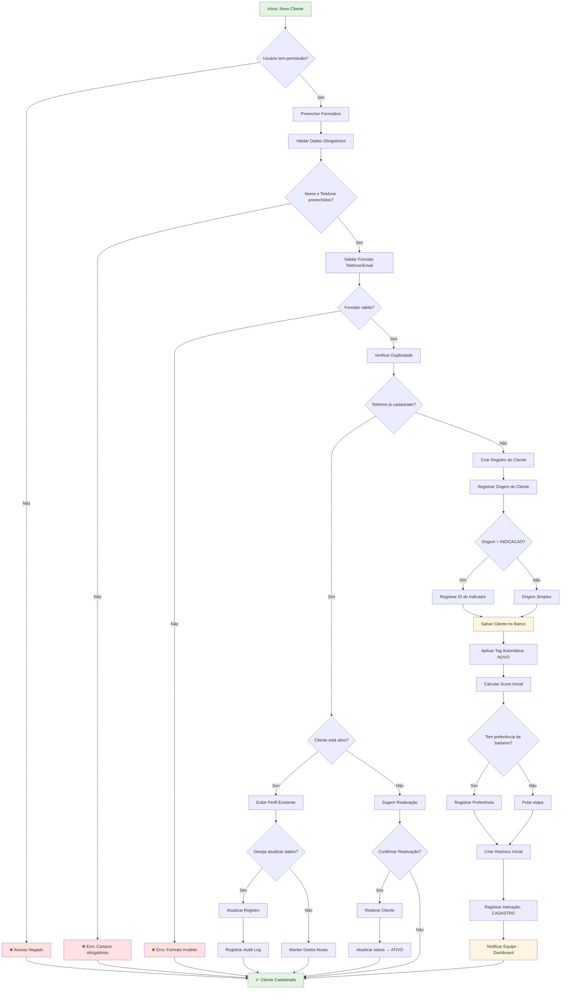

# Fluxo de CRM — NEXO v1.0

**Versão:** 1.0
**Última Atualização:** 24/11/2025
**Status:** 🟡 Planejado (v1.0.0 - Milestone 3)
**Responsável:** Product + Tech Lead

---

## 📋 Visão Geral

Módulo responsável pela **gestão completa de clientes**, centralizando dados, histórico de interações, comportamento de consumo, origem, tags de segmentação e pontuação de engajamento.

**Diferencial:**

- Perfil 360º do cliente (histórico completo)
- Rastreamento de origem (marketing attribution)
- Tags personalizadas (VIP, Risco, Novo, etc.)
- Score de engajamento automático
- Histórico de visitas/compras/avaliações
- **Privacy by design:** Barbeiros não veem dados sensíveis
- **🔥 Previsão automática de retorno** - Sistema aprende padrões (barbeiro preferido, serviço favorito, dia/horário de costume) e recomenda agendamento no melhor período
- **📊 Relatórios de origem pré-prontos** - Análise completa de canais de aquisição
- **🛒 Histórico de produtos usados** - Rastreia compras e permite envio de mensagens personalizadas ("Gostou do produto?")
- **⭐ Barbeiro preferido + Blacklist** - Cliente pode bloquear profissional que não gostou
- **⏰ Lembretes personalizados** - "Seu cabelo já está na hora de manutenção" baseado em histórico

**Prioridade:** 🟡 MÉDIA (v1.0.0 - Milestone 3 - previsto para Dezembro/2025)

---

## 🎯 Objetivos do Fluxo

1. ✅ Permitir cadastro completo de clientes (CRUD)
2. ✅ Validar duplicidade (telefone/email)
3. ✅ Registrar origem do cliente (indicação, Instagram, Google, etc.)
4. ✅ Armazenar preferência de barbeiro
5. ✅ Rastrear histórico de agendamentos
6. ✅ Rastrear histórico de compras (serviços/produtos)
7. ✅ Aplicar tags personalizadas (VIP, Risco, Novo, Inativo)
8. ✅ Calcular score de engajamento automático
9. ✅ Controlar privacidade (LGPD/RBAC)
10. ✅ Respeitar isolamento multi-tenant
11. ✅ **Prever próximo retorno do cliente** (Machine Learning baseado em padrões)
12. ✅ **Histórico de produtos comprados** (rastreamento + follow-up)
13. ✅ **Blacklist de profissionais** (cliente pode bloquear barbeiro)
14. ✅ **Lembretes automáticos personalizados** (baseado em ciclo de manutenção)
15. ✅ **Relatórios de origem pré-prontos** (ROI de marketing)

---

## 🔐 Regras de Negócio (RN)

### RN-CRM-001: Cadastro de Cliente

- ✅ Campos obrigatórios: **nome** e **telefone**
- ✅ Email opcional (mas recomendado)
- ✅ CPF opcional (para nota fiscal futura)
- ✅ Data de nascimento opcional (para campanhas de aniversário)
- ✅ Validar formato de telefone (BR: 11 dígitos com DDD)
- ✅ Validar formato de email (regex padrão)
- ✅ Validar CPF se preenchido (algoritmo padrão)

### RN-CRM-002: Validação de Duplicidade

- ✅ Não permitir **mesmo telefone** para clientes ativos no mesmo tenant
- ✅ Se email preenchido, não permitir duplicidade
- ✅ Ao tentar cadastrar duplicado → exibir perfil existente
- ✅ Permitir reativar cliente inativo com mesmo telefone

### RN-CRM-003: Origem do Cliente

Origens permitidas (configurável):

- `INDICACAO` - Indicado por cliente existente
- `INSTAGRAM` - Redes sociais
- `GOOGLE` - Busca orgânica/Google Ads
- `FACEBOOK` - Facebook/Meta Ads
- `WHATSAPP` - Contato direto
- `WALK_IN` - Passou na frente e entrou
- `OUTDOOR` - Mídia física (outdoor, panfleto)
- `OUTRO` - Outras fontes

**Regra:**

- Se origem = `INDICACAO` → registrar `cliente_indicador_id` (rastreabilidade)
- Origem é imutável após criação (auditoria de marketing)

### RN-CRM-004: Tags de Segmentação

Tags permitidas (sistema + customizadas):

- `VIP` - Cliente premium (alto ticket/frequência)
- `NOVO` - Primeira visita há menos de 30 dias
- `RISCO_CHURN` - Não visita há mais de 60 dias
- `INATIVO` - Não visita há mais de 90 dias
- `ASSINANTE` - Possui assinatura ativa
- `FIEL` - Mais de 10 visitas nos últimos 6 meses

**Regras:**

- Tags automáticas atualizadas por cron diário
- Gerente pode adicionar/remover tags manuais
- Tags usadas para filtros e campanhas

### RN-CRM-005: Score de Engajamento

Cálculo automático baseado em:

1. **Frequência de Visitas** (40 pontos)

   - 0-30 dias desde última visita: +40 pts
   - 31-60 dias: +20 pts
   - 61-90 dias: +5 pts
   - > 90 dias: 0 pts

2. **Ticket Médio** (30 pontos)

   - Acima da média geral: +30 pts
   - Média: +15 pts
   - Abaixo: +5 pts

3. **Total de Visitas** (20 pontos)

   - > 20 visitas: +20 pts
   - 10-20 visitas: +15 pts
   - 5-10 visitas: +10 pts
   - <5 visitas: +5 pts

4. **Avaliações Positivas** (10 pontos)
   - Média >=4.5 estrelas: +10 pts
   - Média >=3.5: +5 pts
   - Sem avaliações: 0 pts

**Score Total:** 0-100 pontos (atualizado semanalmente via cron)

### RN-CRM-006: Preferência de Barbeiro

- ✅ Cliente pode ter barbeiro preferido (opcional)
- ✅ Atualizado automaticamente após 3+ atendimentos com mesmo barbeiro
- ✅ Usado para sugestões no agendamento
- ✅ Não obriga agendamento (cliente pode escolher outro)
- ✅ **NOVO:** Cliente pode bloquear barbeiros indesejados (blacklist)
- ✅ **NOVO:** Blacklist impede agendamento com profissional bloqueado
- ✅ **NOVO:** Apenas cliente/recepcionista podem adicionar/remover da blacklist

### RN-CRM-006-A: Blacklist de Profissionais

**Regra:** Cliente pode bloquear profissionais que não gostou.

- ✅ Blacklist armazenada em tabela `cliente_blacklist_profissionais`
- ✅ Ao tentar agendar com barbeiro bloqueado → sistema impede + exibe mensagem
- ✅ Recepcionista pode adicionar/remover bloqueio a pedido do cliente
- ✅ Barbeiro **não vê** que foi bloqueado (privacidade)
- ✅ Gerente pode visualizar estatísticas de bloqueios (insight de desempenho)

### RN-CRM-007: Histórico de Interações

Tipos de interação rastreados:

- `AGENDAMENTO` - Agendamento criado/confirmado/cancelado
- `ATENDIMENTO` - Serviço finalizado
- `COMPRA_PRODUTO` - Produto comprado
- `ASSINATURA` - Plano assinado/renovado/cancelado
- `AVALIACAO` - Avaliação de atendimento enviada
- `CAMPANHA` - Interação com campanha de marketing

**Regra:** Todas interações têm timestamp, user_id (quem registrou) e dados JSON (flexível)

### RN-CRM-007-A: Histórico de Produtos Comprados

**Regra:** Rastrear produtos comprados + permitir follow-up automatizado.

- ✅ Ao registrar venda de produto → criar interação `COMPRA_PRODUTO`
- ✅ Dados JSON contém: `produto_id`, `quantidade`, `valor`, `barbeiro_id`
- ✅ Sistema agenda follow-up automático (7 dias após compra):
  - Enviar mensagem: "Olá [nome], gostou do [produto]? Está conseguindo usar corretamente?"
- ✅ Recepcionista pode visualizar histórico de produtos por cliente
- ✅ Usado para recomendações futuras (cross-sell)

### RN-CRM-008: Controle de Privacidade (LGPD/RBAC)

**Permissões por Perfil:**

| Perfil        | Pode Ver                                | Pode Editar           |
| ------------- | --------------------------------------- | --------------------- |
| Dono          | Todos os dados (incluindo CPF/telefone) | Sim (tudo)            |
| Gerente       | Todos os dados da unidade               | Sim (exceto exclusão) |
| Recepcionista | Nome, telefone, histórico, preferências | Sim (dados básicos)   |
| Barbeiro      | **Apenas nome e serviços realizados**   | **Não** (read-only)   |
| Contador      | Sem acesso ao CRM                       | Não                   |

**Regra Crítica:**

- ❌ Barbeiro **NUNCA** vê telefone, email, CPF, endereço
- ✅ Barbeiro vê apenas histórico de serviços que ele mesmo realizou

---

## 📊 Diagrama de Fluxo (Mermaid)


```mermaid
flowchart TD
    A[Início: Novo Cliente] --> B{Usuário tem permissão?}
    B -->|Não| Z1[❌ Acesso Negado]
    B -->|Sim| C[Preencher Formulário]

    C --> D[Validar Dados Obrigatórios]
    D --> E{Nome e Telefone preenchidos?}
    E -->|Não| F[❌ Erro: Campos obrigatórios]
    E -->|Sim| G[Validar Formato Telefone/Email]

    G --> H{Formato válido?}
    H -->|Não| I[❌ Erro: Formato inválido]
    H -->|Sim| J[Verificar Duplicidade]

    J --> K{Telefone já cadastrado?}
    K -->|Sim| L{Cliente está ativo?}
    L -->|Sim| M[Exibir Perfil Existente]
    L -->|Não| N[Sugerir Reativação]

    K -->|Não| O[Criar Registro do Cliente]

    O --> P[Registrar Origem do Cliente]
    P --> Q{Origem = INDICACAO?}
    Q -->|Sim| R[Registrar ID do Indicador]
    Q -->|Não| S[Origem Simples]

    R --> T[Salvar Cliente no Banco]
    S --> T

    T --> U[Aplicar Tag Automática: NOVO]
    U --> V[Calcular Score Inicial]

    V --> W{Tem preferência de barbeiro?}
    W -->|Sim| X[Registrar Preferência]
    W -->|Não| Y[Pular etapa]

    X --> AA[Criar Histórico Inicial]
    Y --> AA

    AA --> AB[Registrar Interação: CADASTRO]
    AB --> AC[Notificar Equipe - Dashboard]

    AC --> AD[✅ Cliente Cadastrado]

    M --> AE{Deseja atualizar dados?}
    AE -->|Sim| AF[Atualizar Registro]
    AE -->|Não| AG[Manter Dados Atuais]

    AF --> AH[Registrar Audit Log]
    AG --> AD
    AH --> AD

    N --> AI{Confirmar Reativação?}
    AI -->|Sim| AJ[Reativar Cliente]
    AI -->|Não| AD

    AJ --> AK[Atualizar status → ATIVO]
    AK --> AD

    F --> AD
    I --> AD
    Z1 --> AD

    style A fill:#e1f5e1
    style AD fill:#e1f5e1
    style F fill:#ffe1e1
    style I fill:#ffe1e1
    style Z1 fill:#ffe1e1
    style T fill:#fff4e1
    style AC fill:#fff4e1
```

---

## 🏗️ Arquitetura (Clean Architecture)

### Domain Layer

**1. Entity: Cliente**

```go
// backend/internal/domain/entity/cliente.go
package entity

import (
    "time"
    "github.com/google/uuid"
    "barber-analytics-pro/backend/internal/domain/valueobject"
)

type OrigemCliente string

const (
    OrigemIndicacao  OrigemCliente = "INDICACAO"
    OrigemInstagram  OrigemCliente = "INSTAGRAM"
    OrigemGoogle     OrigemCliente = "GOOGLE"
    OrigemFacebook   OrigemCliente = "FACEBOOK"
    OrigemWhatsApp   OrigemCliente = "WHATSAPP"
    OrigemWalkIn     OrigemCliente = "WALK_IN"
    OrigemOutdoor    OrigemCliente = "OUTDOOR"
    OrigemOutro      OrigemCliente = "OUTRO"
)

type TagCliente string

const (
    TagVIP         TagCliente = "VIP"
    TagNovo        TagCliente = "NOVO"
    TagRiscoChurn  TagCliente = "RISCO_CHURN"
    TagInativo     TagCliente = "INATIVO"
    TagAssinante   TagCliente = "ASSINANTE"
    TagFiel        TagCliente = "FIEL"
)

type Cliente struct {
    ID                  uuid.UUID
    TenantID            uuid.UUID

    // Dados Pessoais
    Nome                string
    Telefone            valueobject.Telefone
    Email               *valueobject.Email // Opcional
    CPF                 *valueobject.CPF   // Opcional
    DataNascimento      *time.Time         // Opcional

    // Marketing & Segmentação
    Origem              OrigemCliente
    ClienteIndicadorID  *uuid.UUID // Se origem = INDICACAO
    Tags                []TagCliente
    ScoreEngajamento    int // 0-100

    // Preferências
    BarbeiroPreferidoID *uuid.UUID
    Observacoes         string

    // Controle
    Ativo               bool
    UltimaVisita        *time.Time
    TotalVisitas        int
    TicketMedio         valueobject.Money

    CreatedAt           time.Time
    UpdatedAt           time.Time
}

// NewCliente - Factory method
func NewCliente(
    tenantID uuid.UUID,
    nome string,
    telefone valueobject.Telefone,
    origem OrigemCliente,
) (*Cliente, error) {
    // Validações
    if nome == "" {
        return nil, ErrNomeObrigatorio
    }

    if err := telefone.Validate(); err != nil {
        return nil, err
    }

    now := time.Now()

    return &Cliente{
        ID:               uuid.New(),
        TenantID:         tenantID,
        Nome:             nome,
        Telefone:         telefone,
        Origem:           origem,
        Tags:             []TagCliente{TagNovo}, // Tag automática
        ScoreEngajamento: 0,
        Ativo:            true,
        TotalVisitas:     0,
        TicketMedio:      valueobject.NewMoney(0),
        CreatedAt:        now,
        UpdatedAt:        now,
    }, nil
}

// AdicionarTag - RN-CRM-004
func (c *Cliente) AdicionarTag(tag TagCliente) {
    for _, t := range c.Tags {
        if t == tag {
            return // Já possui
        }
    }
    c.Tags = append(c.Tags, tag)
    c.UpdatedAt = time.Now()
}

// RemoverTag
func (c *Cliente) RemoverTag(tag TagCliente) {
    newTags := []TagCliente{}
    for _, t := range c.Tags {
        if t != tag {
            newTags = append(newTags, t)
        }
    }
    c.Tags = newTags
    c.UpdatedAt = time.Now()
}

// AtualizarScoreEngajamento - RN-CRM-005
func (c *Cliente) AtualizarScoreEngajamento(
    diasDesdeUltimaVisita int,
    ticketMedioGeral valueobject.Money,
) {
    score := 0

    // 1. Frequência (40 pts)
    if diasDesdeUltimaVisita <= 30 {
        score += 40
    } else if diasDesdeUltimaVisita <= 60 {
        score += 20
    } else if diasDesdeUltimaVisita <= 90 {
        score += 5
    }

    // 2. Ticket Médio (30 pts)
    if c.TicketMedio.GreaterThan(ticketMedioGeral) {
        score += 30
    } else if c.TicketMedio.Equals(ticketMedioGeral) {
        score += 15
    } else {
        score += 5
    }

    // 3. Total de Visitas (20 pts)
    if c.TotalVisitas > 20 {
        score += 20
    } else if c.TotalVisitas >= 10 {
        score += 15
    } else if c.TotalVisitas >= 5 {
        score += 10
    } else {
        score += 5
    }

    // 4. Avaliações (10 pts) - implementar depois

    c.ScoreEngajamento = score
    c.UpdatedAt = time.Now()
}

// RegistrarVisita - Atualizar contadores
func (c *Cliente) RegistrarVisita(valorGasto valueobject.Money) {
    c.TotalVisitas++
    now := time.Now()
    c.UltimaVisita = &now

    // Recalcular ticket médio
    totalGasto := c.TicketMedio.Multiply(float64(c.TotalVisitas - 1))
    totalGasto = totalGasto.Add(valorGasto)
    c.TicketMedio = totalGasto.Divide(float64(c.TotalVisitas))

    c.UpdatedAt = now
}

// Desativar - Soft delete
func (c *Cliente) Desativar(motivo string) {
    c.Ativo = false
    c.Observacoes = fmt.Sprintf("[DESATIVADO] %s | %s", motivo, c.Observacoes)
    c.UpdatedAt = time.Now()
}

// Reativar
func (c *Cliente) Reativar() {
    c.Ativo = true
    c.UpdatedAt = time.Now()
}
```

**2. Entity: HistoricoCliente**

```go
// backend/internal/domain/entity/historico_cliente.go
package entity

type TipoInteracao string

const (
    InteracaoAgendamento    TipoInteracao = "AGENDAMENTO"
    InteracaoAtendimento    TipoInteracao = "ATENDIMENTO"
    InteracaoCompraProduto  TipoInteracao = "COMPRA_PRODUTO"
    InteracaoAssinatura     TipoInteracao = "ASSINATURA"
    InteracaoAvaliacao      TipoInteracao = "AVALIACAO"
    InteracaoCampanha       TipoInteracao = "CAMPANHA"
    InteracaoCadastro       TipoInteracao = "CADASTRO"
)

type HistoricoCliente struct {
    ID              uuid.UUID
    TenantID        uuid.UUID
    ClienteID       uuid.UUID

    Tipo            TipoInteracao
    Descricao       string
    DadosJSON       string // JSON flexível por tipo

    RegistradoPor   uuid.UUID // UserID
    CreatedAt       time.Time
}

func NewHistoricoCliente(
    tenantID, clienteID, registradoPor uuid.UUID,
    tipo TipoInteracao,
    descricao string,
    dadosJSON string,
) *HistoricoCliente {
    return &HistoricoCliente{
        ID:            uuid.New(),
        TenantID:      tenantID,
        ClienteID:     clienteID,
        Tipo:          tipo,
        Descricao:     descricao,
        DadosJSON:     dadosJSON,
        RegistradoPor: registradoPor,
        CreatedAt:     time.Now(),
    }
}
```

**3. Value Object: Telefone**

```go
// backend/internal/domain/valueobject/telefone.go
package valueobject

import (
    "fmt"
    "regexp"
)

type Telefone struct {
    valor string
}

func NewTelefone(tel string) (Telefone, error) {
    // Remove caracteres não numéricos
    re := regexp.MustCompile(`[^0-9]`)
    telLimpo := re.ReplaceAllString(tel, "")

    // Valida formato BR (11 dígitos: DDD + número)
    if len(telLimpo) != 11 {
        return Telefone{}, fmt.Errorf("telefone inválido: deve ter 11 dígitos")
    }

    return Telefone{valor: telLimpo}, nil
}

func (t Telefone) String() string {
    return t.valor
}

func (t Telefone) Formatado() string {
    // (11) 98765-4321
    if len(t.valor) == 11 {
        return fmt.Sprintf("(%s) %s-%s",
            t.valor[0:2],
            t.valor[2:7],
            t.valor[7:11],
        )
    }
    return t.valor
}

func (t Telefone) Validate() error {
    if len(t.valor) != 11 {
        return fmt.Errorf("telefone inválido")
    }
    return nil
}
```

---

### Application Layer

**Use Case: CriarClienteUseCase**

```go
// backend/internal/application/usecase/criar_cliente_usecase.go
package usecase

import (
    "context"
    "fmt"
    "github.com/google/uuid"
    "barber-analytics-pro/backend/internal/domain/entity"
    "barber-analytics-pro/backend/internal/domain/valueobject"
)

type CriarClienteInput struct {
    TenantID           uuid.UUID
    Nome               string
    Telefone           string
    Email              string // Opcional
    CPF                string // Opcional
    DataNascimento     string // Opcional (ISO 8601)
    Origem             string
    ClienteIndicadorID string // Opcional (UUID)
    RegistradoPor      uuid.UUID
}

type CriarClienteOutput struct {
    ID               uuid.UUID
    Nome             string
    Telefone         string
    ScoreEngajamento int
}

type CriarClienteUseCase struct {
    clienteRepo  ClienteRepository
    historicoRepo HistoricoClienteRepository
}

func NewCriarClienteUseCase(
    clienteRepo ClienteRepository,
    historicoRepo HistoricoClienteRepository,
) *CriarClienteUseCase {
    return &CriarClienteUseCase{
        clienteRepo:  clienteRepo,
        historicoRepo: historicoRepo,
    }
}

func (uc *CriarClienteUseCase) Execute(
    ctx context.Context,
    input CriarClienteInput,
) (*CriarClienteOutput, error) {
    // 1. Validar e criar Value Object Telefone
    telefone, err := valueobject.NewTelefone(input.Telefone)
    if err != nil {
        return nil, fmt.Errorf("telefone inválido: %w", err)
    }

    // 2. RN-CRM-002: Verificar duplicidade
    existente, err := uc.clienteRepo.FindByTelefone(ctx, input.TenantID, telefone)
    if err == nil && existente != nil {
        if existente.Ativo {
            return nil, ErrClienteJaCadastrado
        }
        // Cliente inativo → sugerir reativação
        return nil, ErrClienteInativoExiste
    }

    // 3. Criar entidade Cliente
    origem := entity.OrigemCliente(input.Origem)
    cliente, err := entity.NewCliente(input.TenantID, input.Nome, telefone, origem)
    if err != nil {
        return nil, err
    }

    // 4. Email opcional
    if input.Email != "" {
        email, err := valueobject.NewEmail(input.Email)
        if err == nil {
            cliente.Email = &email
        }
    }

    // 5. CPF opcional
    if input.CPF != "" {
        cpf, err := valueobject.NewCPF(input.CPF)
        if err == nil {
            cliente.CPF = &cpf
        }
    }

    // 6. Cliente Indicador (se origem = INDICACAO)
    if input.ClienteIndicadorID != "" {
        indicadorID := uuid.MustParse(input.ClienteIndicadorID)
        cliente.ClienteIndicadorID = &indicadorID
    }

    // 7. Persistir
    if err := uc.clienteRepo.Create(ctx, cliente); err != nil {
        return nil, fmt.Errorf("erro ao salvar cliente: %w", err)
    }

    // 8. RN-CRM-007: Criar histórico inicial
    historico := entity.NewHistoricoCliente(
        input.TenantID,
        cliente.ID,
        input.RegistradoPor,
        entity.InteracaoCadastro,
        "Cliente cadastrado no sistema",
        fmt.Sprintf(`{"origem": "%s"}`, origem),
    )

    if err := uc.historicoRepo.Create(ctx, historico); err != nil {
        // Log error mas não falha (histórico é secundário)
        fmt.Printf("Erro ao criar histórico: %v\n", err)
    }

    return &CriarClienteOutput{
        ID:               cliente.ID,
        Nome:             cliente.Nome,
        Telefone:         cliente.Telefone.Formatado(),
        ScoreEngajamento: cliente.ScoreEngajamento,
    }, nil
}
```

---

### Infrastructure Layer

**Repository Port**

```go
// backend/internal/domain/port/cliente_repository.go
package port

type ClienteRepository interface {
    Create(ctx context.Context, cliente *entity.Cliente) error
    FindByID(ctx context.Context, tenantID, clienteID uuid.UUID) (*entity.Cliente, error)
    FindByTelefone(ctx context.Context, tenantID uuid.UUID, telefone valueobject.Telefone) (*entity.Cliente, error)
    Update(ctx context.Context, cliente *entity.Cliente) error
    Delete(ctx context.Context, tenantID, clienteID uuid.UUID) error

    // Queries
    List(ctx context.Context, tenantID uuid.UUID, filtros FiltrosCliente) ([]*entity.Cliente, error)
    ListByTag(ctx context.Context, tenantID uuid.UUID, tag entity.TagCliente) ([]*entity.Cliente, error)
    ListInativos(ctx context.Context, tenantID uuid.UUID, diasSemVisita int) ([]*entity.Cliente, error)

    // Aggregations
    CountAtivos(ctx context.Context, tenantID uuid.UUID) (int, error)
    CalcularTicketMedioGeral(ctx context.Context, tenantID uuid.UUID) (valueobject.Money, error)
}
```

**PostgreSQL Queries (sqlc)**

```sql
-- backend/internal/infra/db/queries/clientes.sql

-- name: CreateCliente :one
INSERT INTO clientes (
    id, tenant_id, nome, telefone, email, cpf, data_nascimento,
    origem, cliente_indicador_id, tags, score_engajamento,
    barbeiro_preferido_id, observacoes, ativo,
    ultima_visita, total_visitas, ticket_medio,
    created_at, updated_at
) VALUES (
    $1, $2, $3, $4, $5, $6, $7,
    $8, $9, $10, $11,
    $12, $13, $14,
    $15, $16, $17,
    $18, $19
) RETURNING *;

-- name: FindClienteByID :one
SELECT * FROM clientes
WHERE tenant_id = $1 AND id = $2
LIMIT 1;

-- name: FindClienteByTelefone :one
SELECT * FROM clientes
WHERE tenant_id = $1 AND telefone = $2
LIMIT 1;

-- name: UpdateCliente :exec
UPDATE clientes
SET
    nome = $3,
    email = $4,
    cpf = $5,
    data_nascimento = $6,
    tags = $7,
    score_engajamento = $8,
    barbeiro_preferido_id = $9,
    observacoes = $10,
    ativo = $11,
    ultima_visita = $12,
    total_visitas = $13,
    ticket_medio = $14,
    updated_at = $15
WHERE tenant_id = $1 AND id = $2;

-- name: ListClientes :many
SELECT * FROM clientes
WHERE tenant_id = $1 AND ativo = true
ORDER BY nome ASC;

-- name: ListClientesByTag :many
SELECT * FROM clientes
WHERE tenant_id = $1
  AND $2 = ANY(tags)
  AND ativo = true
ORDER BY score_engajamento DESC;

-- name: CountClientesAtivos :one
SELECT COUNT(*) FROM clientes
WHERE tenant_id = $1 AND ativo = true;
```

---

## 📊 Modelo de Dados (SQL)

```sql
-- Tabela: clientes
CREATE TABLE IF NOT EXISTS clientes (
    id UUID PRIMARY KEY DEFAULT gen_random_uuid(),
    tenant_id UUID NOT NULL REFERENCES tenants(id) ON DELETE CASCADE,

    -- Dados Pessoais
    nome VARCHAR(255) NOT NULL,
    telefone VARCHAR(11) NOT NULL, -- Apenas números (11 dígitos BR)
    email VARCHAR(255),
    cpf VARCHAR(11),
    data_nascimento DATE,

    -- Marketing & Segmentação
    origem VARCHAR(50) NOT NULL DEFAULT 'OUTRO',
    cliente_indicador_id UUID REFERENCES clientes(id) ON DELETE SET NULL,
    tags TEXT[] DEFAULT '{}', -- Array de tags
    score_engajamento INT DEFAULT 0 CHECK (score_engajamento >= 0 AND score_engajamento <= 100),

    -- Preferências
    barbeiro_preferido_id UUID REFERENCES users(id) ON DELETE SET NULL,
    observacoes TEXT,

    -- Controle
    ativo BOOLEAN DEFAULT true,
    ultima_visita TIMESTAMP,
    total_visitas INT DEFAULT 0 CHECK (total_visitas >= 0),
    ticket_medio NUMERIC(15,2) DEFAULT 0 CHECK (ticket_medio >= 0),

    created_at TIMESTAMP NOT NULL DEFAULT NOW(),
    updated_at TIMESTAMP NOT NULL DEFAULT NOW(),

    -- Constraints
    CONSTRAINT clientes_tenant_id_fkey FOREIGN KEY (tenant_id) REFERENCES tenants(id) ON DELETE CASCADE,
    CONSTRAINT clientes_telefone_unique UNIQUE (tenant_id, telefone)
);

-- Índices
CREATE INDEX idx_clientes_tenant ON clientes(tenant_id);
CREATE INDEX idx_clientes_telefone ON clientes(tenant_id, telefone);
CREATE INDEX idx_clientes_email ON clientes(email) WHERE email IS NOT NULL;
CREATE INDEX idx_clientes_ativo ON clientes(tenant_id, ativo);
CREATE INDEX idx_clientes_tags ON clientes USING GIN(tags);
CREATE INDEX idx_clientes_score ON clientes(tenant_id, score_engajamento DESC);
CREATE INDEX idx_clientes_ultima_visita ON clientes(tenant_id, ultima_visita DESC NULLS LAST);

-- Tabela: historico_clientes
CREATE TABLE IF NOT EXISTS historico_clientes (
    id UUID PRIMARY KEY DEFAULT gen_random_uuid(),
    tenant_id UUID NOT NULL REFERENCES tenants(id) ON DELETE CASCADE,
    cliente_id UUID NOT NULL REFERENCES clientes(id) ON DELETE CASCADE,

    tipo VARCHAR(50) NOT NULL CHECK (tipo IN (
        'AGENDAMENTO', 'ATENDIMENTO', 'COMPRA_PRODUTO',
        'ASSINATURA', 'AVALIACAO', 'CAMPANHA', 'CADASTRO'
    )),
    descricao TEXT NOT NULL,
    dados_json JSONB,

    registrado_por UUID NOT NULL REFERENCES users(id),
    created_at TIMESTAMP NOT NULL DEFAULT NOW()
);

CREATE INDEX idx_historico_tenant ON historico_clientes(tenant_id);
CREATE INDEX idx_historico_cliente ON historico_clientes(cliente_id, created_at DESC);
CREATE INDEX idx_historico_tipo ON historico_clientes(tenant_id, tipo);
```

---

## 🌐 Endpoints da API

### 1. POST /api/v1/clientes

Criar novo cliente.

**Request:**

```json
{
  "nome": "João Silva",
  "telefone": "11987654321",
  "email": "joao@example.com",
  "cpf": "12345678901",
  "data_nascimento": "1990-05-15",
  "origem": "INSTAGRAM",
  "cliente_indicador_id": "uuid"
}
```

**Response 201:**

```json
{
  "id": "uuid",
  "nome": "João Silva",
  "telefone": "(11) 98765-4321",
  "score_engajamento": 0,
  "tags": ["NOVO"]
}
```

---

### 2. GET /api/v1/clientes

Listar clientes (com filtros).

**Query Params:**

- `tag` (opcional): "VIP" | "NOVO" | "RISCO_CHURN"
- `ativo` (opcional): true | false
- `search` (opcional): busca por nome/telefone

**Response 200:**

```json
{
  "data": [
    {
      "id": "uuid",
      "nome": "João Silva",
      "telefone": "(11) 98765-4321",
      "email": "joao@example.com",
      "tags": ["VIP", "FIEL"],
      "score_engajamento": 85,
      "ultima_visita": "2025-11-20T10:00:00Z",
      "total_visitas": 25,
      "ticket_medio": "120.00"
    }
  ],
  "total": 1
}
```

---

### 3. GET /api/v1/clientes/:id

Buscar cliente por ID (perfil completo).

**Response 200:**

```json
{
  "id": "uuid",
  "nome": "João Silva",
  "telefone": "(11) 98765-4321",
  "email": "joao@example.com",
  "cpf": "123.456.789-01",
  "data_nascimento": "1990-05-15",
  "origem": "INSTAGRAM",
  "tags": ["VIP", "FIEL"],
  "score_engajamento": 85,
  "barbeiro_preferido": {
    "id": "uuid",
    "nome": "Carlos Barbeiro"
  },
  "ultima_visita": "2025-11-20T10:00:00Z",
  "total_visitas": 25,
  "ticket_medio": "120.00",
  "historico": [
    {
      "tipo": "ATENDIMENTO",
      "descricao": "Corte + Barba",
      "data": "2025-11-20T10:00:00Z"
    }
  ]
}
```

---

### 4. PUT /api/v1/clientes/:id

Atualizar dados do cliente.

**Request:**

```json
{
  "nome": "João Silva Santos",
  "email": "joao.novo@example.com",
  "barbeiro_preferido_id": "uuid",
  "observacoes": "Cliente VIP - priorizar atendimento"
}
```

**Response 200:**

```json
{
  "id": "uuid",
  "nome": "João Silva Santos",
  "updated_at": "2025-11-24T15:30:00Z"
}
```

---

### 5. DELETE /api/v1/clientes/:id

Desativar cliente (soft delete).

**Request:**

```json
{
  "motivo": "Cliente solicitou remoção de dados (LGPD)"
}
```

**Response 200:**

```json
{
  "id": "uuid",
  "ativo": false,
  "message": "Cliente desativado com sucesso"
}
```

---

### 6. POST /api/v1/clientes/:id/tags

Adicionar tag ao cliente.

**Request:**

```json
{
  "tag": "VIP"
}
```

**Response 200:**

```json
{
  "id": "uuid",
  "tags": ["NOVO", "VIP"]
}
```

---

### 7. GET /api/v1/clientes/:id/historico

Buscar histórico de interações do cliente.

**Query Params:**

- `tipo` (opcional): "ATENDIMENTO" | "AGENDAMENTO"
- `limit` (opcional): 50

**Response 200:**

```json
{
  "cliente_id": "uuid",
  "historico": [
    {
      "id": "uuid",
      "tipo": "ATENDIMENTO",
      "descricao": "Corte + Barba - R$ 80,00",
      "dados_json": { "servicos": ["Corte", "Barba"], "total": "80.00" },
      "created_at": "2025-11-20T10:00:00Z"
    }
  ],
  "total": 1
}
```

---

## 🔄 Fluxos Alternativos

### FA-01: Cliente Duplicado (Telefone Existente)

**Cenário:** Recepcionista tenta cadastrar cliente com telefone já cadastrado.

**Ação:**

1. Sistema detecta duplicidade (query `FindByTelefone`)
2. Exibe modal: "Cliente já cadastrado. Deseja visualizar?"
3. Se sim → redireciona para perfil existente
4. Se não → cancela operação

---

### FA-02: Reativação de Cliente Inativo

**Cenário:** Cliente inativo tenta agendar novamente.

**Ação:**

1. Sistema detecta status `ativo = false`
2. Exibe modal: "Cliente inativo. Deseja reativar?"
3. Se sim → chamar método `Reativar()` + atualizar banco
4. Se não → impedir agendamento

---

### FA-03: Atualização Automática de Tags

**Cenário:** Cron job roda diariamente para atualizar tags.

**Ação:**

1. Buscar todos clientes ativos
2. Para cada cliente:
   - Remover tag `NOVO` se `created_at > 30 dias`
   - Adicionar `RISCO_CHURN` se `dias_sem_visita > 60`
   - Adicionar `INATIVO` se `dias_sem_visita > 90`
   - Adicionar `FIEL` se `total_visitas > 10` nos últimos 6 meses
3. Atualizar score de engajamento (RN-CRM-005)

---

### FA-04: Histórico Visível para Barbeiro (Privacy)

**Cenário:** Barbeiro tenta acessar perfil completo do cliente.

**Ação:**

1. Middleware valida `role == "barbeiro"`
2. Retorna **apenas**:
   - Nome
   - Serviços realizados por ele mesmo
   - Data dos atendimentos
3. **Oculta:** telefone, email, CPF, endereço, tags

---

### FA-05: Cliente Indica Outro Cliente

**Cenário:** Cliente A indica cliente B (rastreamento de marketing).

**Ação:**

1. Cadastrar cliente B com `origem = INDICACAO`
2. Preencher `cliente_indicador_id = ID do Cliente A`
3. Registrar histórico no cliente A: "Indicou cliente [nome B]"
4. Futuro: Gerar cashback/desconto para cliente A (programa de indicação)

---

## ✅ Critérios de Aceitação

### Backend

- [ ] Entidade `Cliente` criada com validações (RN-CRM-001 a RN-CRM-008)
- [ ] Entity `HistoricoCliente` com tipos de interação
- [ ] Value Objects: `Telefone`, `Email`, `CPF`
- [ ] Use Cases implementados:
  - [ ] CriarClienteUseCase
  - [ ] AtualizarClienteUseCase
  - [ ] BuscarClienteUseCase
  - [ ] ListarClientesUseCase
  - [ ] AdicionarTagUseCase
- [ ] Repositório PostgreSQL com sqlc (8+ queries)
- [ ] Handlers HTTP (7 endpoints mínimo)
- [ ] Middleware RBAC (barbeiro não vê dados sensíveis)
- [ ] Cron job: atualizar tags/score diariamente
- [ ] Testes unitários (coverage > 80%)

### Frontend

- [ ] Tela "Clientes" (lista com filtros)
- [ ] Tela "Novo Cliente" (formulário com validação Zod)
- [ ] Tela "Perfil do Cliente" (linha do tempo + histórico)
- [ ] Modal "Cliente Duplicado" (sugestão de visualizar)
- [ ] Modal "Reativar Cliente Inativo"
- [ ] Filtros: tags, origem, ativo/inativo, search
- [ ] Exportação CSV (Dono/Gerente)
- [ ] Dashboard: widgets "Total Clientes", "Novos este Mês", "Risco de Churn"

### Integrações

- [ ] Criar histórico ao finalizar agendamento
- [ ] Criar histórico ao comprar produto
- [ ] Criar histórico ao assinar plano
- [ ] Cron diário: atualizar tags e score
- [ ] LGPD: permitir exportação/exclusão de dados

---

## 📈 Métricas de Sucesso

1. **Duplicidade:** 0% de clientes duplicados (validação por telefone)
2. **Engajamento:** Score médio > 50 pontos
3. **Retenção:** <15% de clientes com tag `RISCO_CHURN`
4. **Privacy:** 100% de barbeiros sem acesso a dados sensíveis (auditoria)
5. **Performance:** Listagem de 10k clientes < 1s

---

## 🔗 Referências

- [FLUXO_AGENDAMENTO.md](./FLUXO_AGENDAMENTO.md) - Integração com histórico de visitas
- [FLUXO_ASSINATURA.md](./FLUXO_ASSINATURA.md) - Tag `ASSINANTE` automática
- [FLUXO_COMISSOES.md](./FLUXO_COMISSOES.md) - Ticket médio do cliente
- [MODELO_DE_DADOS.md](../02-arquitetura/MODELO_DE_DADOS.md) - Schema completo
- [RBAC.md](../06-seguranca/RBAC.md) - Permissões por perfil
- [COMPLIANCE_LGPD.md](../06-seguranca/COMPLIANCE_LGPD.md) - Privacidade de dados

---

**Status:** 🟡 Aguardando Implementação (v1.0.0 - Milestone 3)
**Prioridade:** MÉDIA (após Agendamento e Financeiro)
**Dependências:** Módulo de Usuários (RBAC) já implementado
