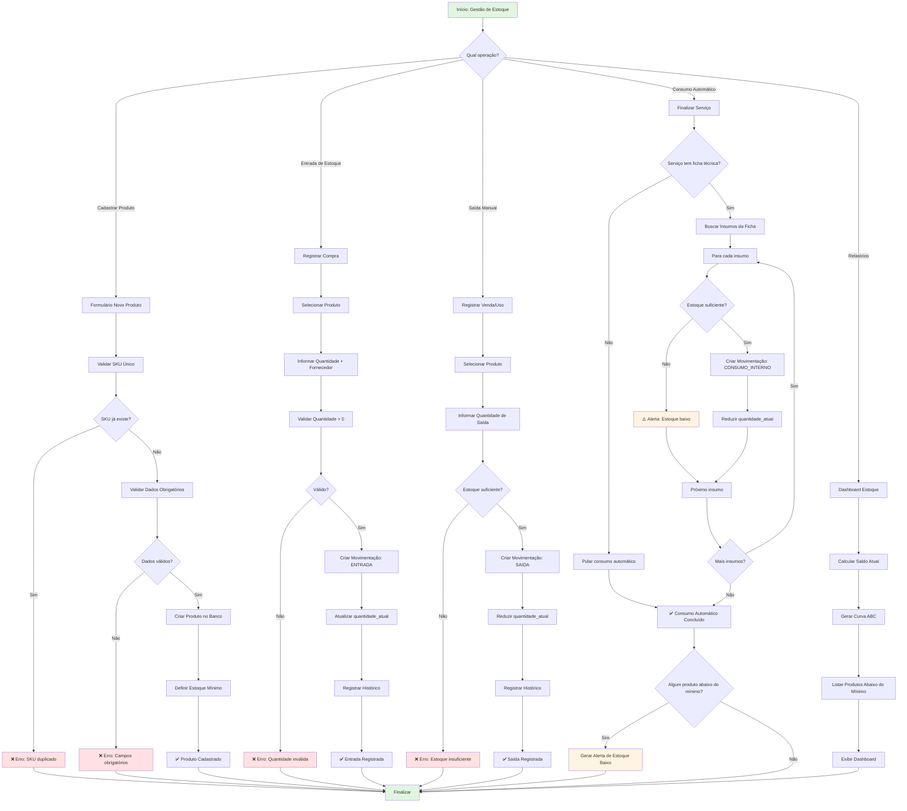

# Fluxo de Estoque — NEXO v1.0

**Versão:** 1.0
**Última Atualização:** 24/11/2025
**Status:** 🔴 Planejado (v1.2.0 - Fase Posterior)
**Responsável:** Product + Tech Lead

---

## 📋 Visão Geral

Módulo responsável pelo **gerenciamento completo de estoque** de produtos e insumos (shampoos, cremes, pomadas, lâminas, etc.), incluindo controle de entradas, saídas, consumo automático por serviço, alertas de baixa e curva ABC.

**Diferencial:**

- Consumo automático via ficha técnica de serviços
- Alertas inteligentes de estoque mínimo
- Curva ABC para priorização de reposição
- Rastreamento completo de movimentações
- Controle de fornecedores
- Integração com precificação (custo de insumos)

**Prioridade:** 🔴 BAIXA (v1.2.0 - após MVP Core + Financeiro + Metas)

---

## 🎯 Objetivos do Fluxo

1. ✅ Permitir cadastro de produtos/insumos (CRUD)
2. ✅ Registrar entradas (compras) e saídas (vendas/uso)
3. ✅ Validar estoque negativo (bloqueio)
4. ✅ Consumo automático ao finalizar serviço (ficha técnica)
5. ✅ Alertar quando estoque < estoque mínimo
6. ✅ Gerar relatório de saldo atual
7. ✅ Calcular Curva ABC de produtos
8. ✅ Controlar fornecedores
9. ✅ Integrar com Precificação (custo de insumos)
10. ✅ Respeitar isolamento multi-tenant

---

## 🔐 Regras de Negócio (RN)

### RN-EST-001: Cadastro de Produto

- ✅ Campos obrigatórios: **nome**, **SKU**, **categoria**, **unidade de medida**
- ✅ SKU único por tenant (constraint)
- ✅ Valor unitário deve ser > 0
- ✅ Quantidade atual nunca pode ser negativa
- ✅ Estoque mínimo padrão: 0 (configurável por produto)
- ✅ Categorias sugeridas: `POMADA`, `SHAMPOO`, `CREME`, `LAMINA`, `TOALHA`, `CONSUMIVEL`, `REVENDA`

### RN-EST-002: Validação de Estoque Negativo

- ❌ **PROIBIDO** estoque negativo
- ✅ Ao tentar remover quantidade > disponível → bloquear operação
- ✅ Exibir erro: "Estoque insuficiente. Disponível: X unidades"
- ✅ Sugerir ajuste de estoque se necessário

### RN-EST-003: Tipos de Movimentação

Tipos permitidos:

- `ENTRADA` - Compra de fornecedor
- `SAIDA` - Venda ao cliente
- `CONSUMO_INTERNO` - Uso em serviço (automático)
- `AJUSTE` - Correção manual (inventário)
- `DEVOLUCAO` - Devolução de produto
- `PERDA` - Quebra/vencimento

**Regra:**

- Toda movimentação deve ter **motivo** (observações obrigatórias para `AJUSTE` e `PERDA`)
- `CONSUMO_INTERNO` é automático ao finalizar serviço (se ficha técnica configurada)

### RN-EST-004: Ficha Técnica de Serviços

- ✅ Cada serviço pode ter ficha técnica com insumos consumidos
- ✅ Exemplo: Serviço "Corte + Barba" consome:
  - 0.2 un de Pomada
  - 0.1 un de Pó Modelador
  - 0.05 un de Creme Pós-Barba
- ✅ Ao finalizar serviço → sistema baixa automaticamente insumos
- ✅ Se estoque insuficiente → alerta (mas não bloqueia atendimento)

### RN-EST-005: Alertas de Estoque Baixo

- ✅ Produto com `quantidade_atual <= quantidade_minima` → ativa alerta
- ✅ Alerta visível no dashboard (widget "Estoque Baixo")
- ✅ Notificação push para Gerente/Dono (configurável)
- ✅ Cron diário verifica todos produtos e envia resumo

### RN-EST-006: Curva ABC de Produtos

Classificação automática por valor movimentado (últimos 90 dias):

- **Classe A:** Produtos que representam até 80% do valor total (alta prioridade)
- **Classe B:** Produtos que representam 80-95% do valor total (média prioridade)
- **Classe C:** Produtos que representam 95-100% do valor total (baixa prioridade)

**Fórmula:**

```
Valor Total do Item = Quantidade Vendida × Valor Unitário
% Representatividade = (Valor Total do Item / Valor Total Geral) × 100
```

**Uso:** Priorizar reposição de itens classe A

### RN-EST-007: Controle de Fornecedores

- ✅ Fornecedor pode ter múltiplos produtos
- ✅ Campos obrigatórios: razão social, CNPJ (opcional), telefone
- ✅ CNPJ único (se preenchido)
- ✅ Fornecedor pode ser desativado (soft delete)
- ✅ Histórico de compras por fornecedor

### RN-EST-008: Integração com Precificação

- ✅ Custo de insumos por serviço calculado via ficha técnica
- ✅ Fórmula: `Custo Total = Σ (Quantidade Consumida × Custo Unitário)`
- ✅ Usado em simulação de precificação (módulo Precificação)
- ✅ Atualizar custo ao alterar valor unitário do produto

---

## 📊 Diagrama de Fluxo (Mermaid)



---

## 🏗️ Arquitetura (Clean Architecture)

### Domain Layer

**1. Entity: Produto**

```go
// backend/internal/domain/entity/produto.go
package entity

import (
    "time"
    "fmt"
    "github.com/google/uuid"
    "barber-analytics-pro/backend/internal/domain/valueobject"
)

type CategoriaProduto string

const (
    CategoriaPomada      CategoriaProduto = "POMADA"
    CategoriaShampoo     CategoriaProduto = "SHAMPOO"
    CategoriaCreme       CategoriaProduto = "CREME"
    CategoriaLamina      CategoriaProduto = "LAMINA"
    CategoriaToalha      CategoriaProduto = "TOALHA"
    CategoriaConsumivel  CategoriaProduto = "CONSUMIVEL"
    CategoriaRevenda     CategoriaProduto = "REVENDA"
)

type UnidadeMedida string

const (
    UnidadeUnidade     UnidadeMedida = "UN"   // Unidade
    UnidadeMililitro   UnidadeMedida = "ML"   // Mililitro
    UnidadeGrama       UnidadeMedida = "G"    // Grama
    UnidadeKilo        UnidadeMedida = "KG"   // Quilograma
    UnidadeLitro       UnidadeMedida = "L"    // Litro
)

type Produto struct {
    ID               uuid.UUID
    TenantID         uuid.UUID

    // Identificação
    SKU              string // Código único por tenant
    Nome             string
    Descricao        string
    Categoria        CategoriaProduto

    // Controle de Estoque
    QuantidadeAtual  int
    QuantidadeMinima int

    // Precificação
    ValorUnitario    valueobject.Money
    UnidadeMedida    UnidadeMedida

    // Controle
    Ativa            bool

    CreatedAt        time.Time
    UpdatedAt        time.Time
}

// NewProduto - Factory method
func NewProduto(
    tenantID uuid.UUID,
    sku, nome string,
    categoria CategoriaProduto,
    valorUnitario valueobject.Money,
    unidadeMedida UnidadeMedida,
) (*Produto, error) {
    // Validações
    if sku == "" {
        return nil, ErrSKUObrigatorio
    }

    if nome == "" {
        return nil, ErrNomeObrigatorio
    }

    if valorUnitario.Value().Sign() <= 0 {
        return nil, ErrValorUnitarioInvalido
    }

    now := time.Now()

    return &Produto{
        ID:               uuid.New(),
        TenantID:         tenantID,
        SKU:              sku,
        Nome:             nome,
        Descricao:        "",
        Categoria:        categoria,
        QuantidadeAtual:  0,
        QuantidadeMinima: 0,
        ValorUnitario:    valorUnitario,
        UnidadeMedida:    unidadeMedida,
        Ativa:            true,
        CreatedAt:        now,
        UpdatedAt:        now,
    }, nil
}

// EstaBaixo - RN-EST-005
func (p *Produto) EstaBaixo() bool {
    return p.QuantidadeAtual <= p.QuantidadeMinima
}

// AdicionarEstoque - RN-EST-003 (ENTRADA)
func (p *Produto) AdicionarEstoque(quantidade int) error {
    if quantidade <= 0 {
        return ErrQuantidadeInvalida
    }

    p.QuantidadeAtual += quantidade
    p.UpdatedAt = time.Now()

    return nil
}

// RemoverEstoque - RN-EST-002
func (p *Produto) RemoverEstoque(quantidade int) error {
    if quantidade <= 0 {
        return ErrQuantidadeInvalida
    }

    // RN-EST-002: Proibido estoque negativo
    if p.QuantidadeAtual < quantidade {
        return fmt.Errorf("estoque insuficiente. Disponível: %d", p.QuantidadeAtual)
    }

    p.QuantidadeAtual -= quantidade
    p.UpdatedAt = time.Now()

    return nil
}

// AjustarEstoque - Correção manual (inventário)
func (p *Produto) AjustarEstoque(novaQuantidade int, motivo string) error {
    if novaQuantidade < 0 {
        return ErrQuantidadeInvalida
    }

    if motivo == "" {
        return ErrMotivoObrigatorio
    }

    p.QuantidadeAtual = novaQuantidade
    p.UpdatedAt = time.Now()

    return nil
}

// Desativar - Soft delete
func (p *Produto) Desativar() {
    p.Ativa = false
    p.UpdatedAt = time.Now()
}

// Reativar
func (p *Produto) Reativar() {
    p.Ativa = true
    p.UpdatedAt = time.Now()
}
```

**2. Entity: MovimentacaoEstoque**

```go
// backend/internal/domain/entity/movimentacao_estoque.go
package entity

import (
    "time"
    "github.com/google/uuid"
)

type TipoMovimentacao string

const (
    MovimentacaoEntrada        TipoMovimentacao = "ENTRADA"
    MovimentacaoSaida          TipoMovimentacao = "SAIDA"
    MovimentacaoConsumoInterno TipoMovimentacao = "CONSUMO_INTERNO"
    MovimentacaoAjuste         TipoMovimentacao = "AJUSTE"
    MovimentacaoDevolucao      TipoMovimentacao = "DEVOLUCAO"
    MovimentacaoPerda          TipoMovimentacao = "PERDA"
)

type MovimentacaoEstoque struct {
    ID              uuid.UUID
    TenantID        uuid.UUID
    ProdutoID       uuid.UUID

    Tipo            TipoMovimentacao
    Quantidade      int

    // Rastreabilidade
    FornecedorID    *uuid.UUID // Se ENTRADA
    ServicoID       *uuid.UUID // Se CONSUMO_INTERNO
    UsuarioID       uuid.UUID  // Quem registrou

    Observacoes     string
    CreatedAt       time.Time
}

func NewMovimentacaoEstoque(
    tenantID, produtoID, usuarioID uuid.UUID,
    tipo TipoMovimentacao,
    quantidade int,
    observacoes string,
) (*MovimentacaoEstoque, error) {
    if quantidade <= 0 {
        return nil, ErrQuantidadeInvalida
    }

    // RN-EST-003: AJUSTE e PERDA exigem motivo
    if (tipo == MovimentacaoAjuste || tipo == MovimentacaoPerda) && observacoes == "" {
        return nil, ErrMotivoObrigatorio
    }

    return &MovimentacaoEstoque{
        ID:          uuid.New(),
        TenantID:    tenantID,
        ProdutoID:   produtoID,
        Tipo:        tipo,
        Quantidade:  quantidade,
        UsuarioID:   usuarioID,
        Observacoes: observacoes,
        CreatedAt:   time.Now(),
    }, nil
}
```

**3. Entity: FichaTecnicaServico**

```go
// backend/internal/domain/entity/ficha_tecnica_servico.go
package entity

type InsumoFichaTecnica struct {
    ProdutoID      uuid.UUID
    Quantidade     float64 // Quantidade consumida (ex: 0.2 un)
}

type FichaTecnicaServico struct {
    ID         uuid.UUID
    TenantID   uuid.UUID
    ServicoID  uuid.UUID

    Insumos    []InsumoFichaTecnica

    CreatedAt  time.Time
    UpdatedAt  time.Time
}

// CalcularCustoInsumos - RN-EST-008
func (f *FichaTecnicaServico) CalcularCustoInsumos(
    produtos map[uuid.UUID]*Produto,
) (valueobject.Money, error) {
    custoTotal := valueobject.NewMoney(0)

    for _, insumo := range f.Insumos {
        produto, ok := produtos[insumo.ProdutoID]
        if !ok {
            return custoTotal, fmt.Errorf("produto %s não encontrado", insumo.ProdutoID)
        }

        custoInsumo := produto.ValorUnitario.MultiplyFloat(insumo.Quantidade)
        custoTotal = custoTotal.Add(custoInsumo)
    }

    return custoTotal, nil
}
```

**4. Entity: Fornecedor**

```go
// backend/internal/domain/entity/fornecedor.go
package entity

type Fornecedor struct {
    ID           uuid.UUID
    TenantID     uuid.UUID

    RazaoSocial  string
    CNPJ         *valueobject.CNPJ // Opcional
    Email        *valueobject.Email
    Telefone     valueobject.Telefone

    // Endereço
    Rua          string
    Numero       string
    Cidade       string
    Estado       string
    CEP          string

    Ativo        bool
    CreatedAt    time.Time
    UpdatedAt    time.Time
}

func NewFornecedor(
    tenantID uuid.UUID,
    razaoSocial string,
    telefone valueobject.Telefone,
) (*Fornecedor, error) {
    if razaoSocial == "" {
        return nil, ErrRazaoSocialObrigatoria
    }

    now := time.Now()

    return &Fornecedor{
        ID:          uuid.New(),
        TenantID:    tenantID,
        RazaoSocial: razaoSocial,
        Telefone:    telefone,
        Ativo:       true,
        CreatedAt:   now,
        UpdatedAt:   now,
    }, nil
}
```

---

### Application Layer

**Use Case: RegistrarEntradaEstoqueUseCase**

```go
// backend/internal/application/usecase/registrar_entrada_estoque_usecase.go
package usecase

import (
    "context"
    "fmt"
    "github.com/google/uuid"
    "barber-analytics-pro/backend/internal/domain/entity"
)

type RegistrarEntradaEstoqueInput struct {
    TenantID      uuid.UUID
    ProdutoID     uuid.UUID
    Quantidade    int
    FornecedorID  string // Opcional (UUID)
    Observacoes   string
    UsuarioID     uuid.UUID
}

type RegistrarEntradaEstoqueOutput struct {
    MovimentacaoID    uuid.UUID
    QuantidadeNova    int
}

type RegistrarEntradaEstoqueUseCase struct {
    produtoRepo      ProdutoRepository
    movimentacaoRepo MovimentacaoEstoqueRepository
}

func NewRegistrarEntradaEstoqueUseCase(
    produtoRepo ProdutoRepository,
    movimentacaoRepo MovimentacaoEstoqueRepository,
) *RegistrarEntradaEstoqueUseCase {
    return &RegistrarEntradaEstoqueUseCase{
        produtoRepo:      produtoRepo,
        movimentacaoRepo: movimentacaoRepo,
    }
}

func (uc *RegistrarEntradaEstoqueUseCase) Execute(
    ctx context.Context,
    input RegistrarEntradaEstoqueInput,
) (*RegistrarEntradaEstoqueOutput, error) {
    // 1. Buscar produto
    produto, err := uc.produtoRepo.FindByID(ctx, input.TenantID, input.ProdutoID)
    if err != nil {
        return nil, fmt.Errorf("produto não encontrado: %w", err)
    }

    // 2. Adicionar estoque (validação interna)
    if err := produto.AdicionarEstoque(input.Quantidade); err != nil {
        return nil, err
    }

    // 3. Atualizar produto
    if err := uc.produtoRepo.Update(ctx, produto); err != nil {
        return nil, fmt.Errorf("erro ao atualizar produto: %w", err)
    }

    // 4. Criar movimentação
    movimentacao, err := entity.NewMovimentacaoEstoque(
        input.TenantID,
        input.ProdutoID,
        input.UsuarioID,
        entity.MovimentacaoEntrada,
        input.Quantidade,
        input.Observacoes,
    )
    if err != nil {
        return nil, err
    }

    // 5. Fornecedor opcional
    if input.FornecedorID != "" {
        fornecedorID := uuid.MustParse(input.FornecedorID)
        movimentacao.FornecedorID = &fornecedorID
    }

    // 6. Persistir movimentação
    if err := uc.movimentacaoRepo.Create(ctx, movimentacao); err != nil {
        return nil, fmt.Errorf("erro ao salvar movimentação: %w", err)
    }

    return &RegistrarEntradaEstoqueOutput{
        MovimentacaoID: movimentacao.ID,
        QuantidadeNova: produto.QuantidadeAtual,
    }, nil
}
```

**Use Case: ConsumirInsumosServicoUseCase**

```go
// backend/internal/application/usecase/consumir_insumos_servico_usecase.go
package usecase

type ConsumirInsumosServicoInput struct {
    TenantID   uuid.UUID
    ServicoID  uuid.UUID
    UsuarioID  uuid.UUID
}

type ConsumirInsumosServicoUseCase struct {
    fichaTecnicaRepo FichaTecnicaRepository
    produtoRepo      ProdutoRepository
    movimentacaoRepo MovimentacaoEstoqueRepository
}

func (uc *ConsumirInsumosServicoUseCase) Execute(
    ctx context.Context,
    input ConsumirInsumosServicoInput,
) error {
    // 1. Buscar ficha técnica do serviço
    ficha, err := uc.fichaTecnicaRepo.FindByServicoID(ctx, input.TenantID, input.ServicoID)
    if err != nil {
        // Se não tem ficha, não faz nada
        return nil
    }

    // 2. Para cada insumo da ficha
    for _, insumo := range ficha.Insumos {
        produto, err := uc.produtoRepo.FindByID(ctx, input.TenantID, insumo.ProdutoID)
        if err != nil {
            // Log erro mas continua
            fmt.Printf("Produto %s não encontrado\n", insumo.ProdutoID)
            continue
        }

        // 3. Remover estoque (validação interna)
        quantidadeInt := int(insumo.Quantidade)
        if err := produto.RemoverEstoque(quantidadeInt); err != nil {
            // RN-EST-005: Alerta mas não bloqueia
            fmt.Printf("⚠️ Estoque insuficiente: %s\n", produto.Nome)
            continue
        }

        // 4. Atualizar produto
        if err := uc.produtoRepo.Update(ctx, produto); err != nil {
            return err
        }

        // 5. Registrar movimentação: CONSUMO_INTERNO
        movimentacao, _ := entity.NewMovimentacaoEstoque(
            input.TenantID,
            insumo.ProdutoID,
            input.UsuarioID,
            entity.MovimentacaoConsumoInterno,
            quantidadeInt,
            fmt.Sprintf("Consumo automático - Serviço %s", input.ServicoID),
        )
        movimentacao.ServicoID = &input.ServicoID

        if err := uc.movimentacaoRepo.Create(ctx, movimentacao); err != nil {
            return err
        }
    }

    return nil
}
```

---

### Infrastructure Layer

**Repository Port**

```go
// backend/internal/domain/port/produto_repository.go
package port

type ProdutoRepository interface {
    Create(ctx context.Context, produto *entity.Produto) error
    FindByID(ctx context.Context, tenantID, produtoID uuid.UUID) (*entity.Produto, error)
    FindBySKU(ctx context.Context, tenantID uuid.UUID, sku string) (*entity.Produto, error)
    Update(ctx context.Context, produto *entity.Produto) error
    Delete(ctx context.Context, tenantID, produtoID uuid.UUID) error

    // Queries
    List(ctx context.Context, tenantID uuid.UUID, filtros FiltrosProduto) ([]*entity.Produto, error)
    ListAbaixoDoMinimo(ctx context.Context, tenantID uuid.UUID) ([]*entity.Produto, error)
    CalcularCurvaABC(ctx context.Context, tenantID uuid.UUID, periodo Periodo) ([]ItemCurvaABC, error)
}

type ItemCurvaABC struct {
    ProdutoID            uuid.UUID
    Nome                 string
    QuantidadeVendida    int
    ValorTotal           valueobject.Money
    PercentualAcumulado  float64
    Classe               string // "A", "B", "C"
}
```

**PostgreSQL Queries (sqlc)**

```sql
-- backend/internal/infra/db/queries/produtos.sql

-- name: CreateProduto :one
INSERT INTO produtos (
    id, tenant_id, sku, nome, descricao, categoria,
    quantidade_atual, quantidade_minima, valor_unitario, unidade_medida,
    ativa, created_at, updated_at
) VALUES (
    $1, $2, $3, $4, $5, $6,
    $7, $8, $9, $10,
    $11, $12, $13
) RETURNING *;

-- name: FindProdutoByID :one
SELECT * FROM produtos
WHERE tenant_id = $1 AND id = $2
LIMIT 1;

-- name: FindProdutoBySKU :one
SELECT * FROM produtos
WHERE tenant_id = $1 AND sku = $2
LIMIT 1;

-- name: UpdateProduto :exec
UPDATE produtos
SET
    nome = $3,
    descricao = $4,
    categoria = $5,
    quantidade_atual = $6,
    quantidade_minima = $7,
    valor_unitario = $8,
    ativa = $9,
    updated_at = $10
WHERE tenant_id = $1 AND id = $2;

-- name: ListProdutosAbaixoDoMinimo :many
SELECT * FROM produtos
WHERE tenant_id = $1
  AND ativa = true
  AND quantidade_atual <= quantidade_minima
ORDER BY quantidade_atual ASC;

-- name: ListProdutos :many
SELECT * FROM produtos
WHERE tenant_id = $1 AND ativa = true
ORDER BY nome ASC;

-- Movimentações
-- name: CreateMovimentacao :one
INSERT INTO movimentacoes_estoque (
    id, tenant_id, produto_id, tipo, quantidade,
    fornecedor_id, servico_id, usuario_id, observacoes,
    created_at
) VALUES (
    $1, $2, $3, $4, $5,
    $6, $7, $8, $9,
    $10
) RETURNING *;

-- name: ListMovimentacoesByProduto :many
SELECT * FROM movimentacoes_estoque
WHERE tenant_id = $1 AND produto_id = $2
ORDER BY created_at DESC
LIMIT $3;
```

---

## 📊 Modelo de Dados (SQL)

```sql
-- Tabela: produtos
CREATE TABLE IF NOT EXISTS produtos (
    id UUID PRIMARY KEY DEFAULT gen_random_uuid(),
    tenant_id UUID NOT NULL REFERENCES tenants(id) ON DELETE CASCADE,

    -- Identificação
    sku VARCHAR(100) NOT NULL,
    nome VARCHAR(255) NOT NULL,
    descricao TEXT,
    categoria VARCHAR(50) NOT NULL CHECK (categoria IN (
        'POMADA', 'SHAMPOO', 'CREME', 'LAMINA', 'TOALHA', 'CONSUMIVEL', 'REVENDA'
    )),

    -- Controle de Estoque
    quantidade_atual INT NOT NULL DEFAULT 0 CHECK (quantidade_atual >= 0),
    quantidade_minima INT DEFAULT 0 CHECK (quantidade_minima >= 0),

    -- Precificação
    valor_unitario NUMERIC(15,2) NOT NULL CHECK (valor_unitario > 0),
    unidade_medida VARCHAR(20) NOT NULL CHECK (unidade_medida IN ('UN', 'ML', 'G', 'KG', 'L')),

    -- Controle
    ativa BOOLEAN DEFAULT true,

    created_at TIMESTAMP NOT NULL DEFAULT NOW(),
    updated_at TIMESTAMP NOT NULL DEFAULT NOW(),

    -- Constraints
    CONSTRAINT produtos_tenant_id_fkey FOREIGN KEY (tenant_id) REFERENCES tenants(id) ON DELETE CASCADE,
    CONSTRAINT produtos_sku_unique UNIQUE (tenant_id, sku)
);

-- Índices
CREATE INDEX idx_produtos_tenant ON produtos(tenant_id);
CREATE INDEX idx_produtos_sku ON produtos(tenant_id, sku);
CREATE INDEX idx_produtos_categoria ON produtos(tenant_id, categoria);
CREATE INDEX idx_produtos_ativa ON produtos(tenant_id, ativa);
CREATE INDEX idx_produtos_baixo ON produtos(tenant_id) WHERE quantidade_atual <= quantidade_minima;

-- Tabela: movimentacoes_estoque
CREATE TABLE IF NOT EXISTS movimentacoes_estoque (
    id UUID PRIMARY KEY DEFAULT gen_random_uuid(),
    tenant_id UUID NOT NULL REFERENCES tenants(id) ON DELETE CASCADE,
    produto_id UUID NOT NULL REFERENCES produtos(id) ON DELETE RESTRICT,

    tipo VARCHAR(50) NOT NULL CHECK (tipo IN (
        'ENTRADA', 'SAIDA', 'CONSUMO_INTERNO', 'AJUSTE', 'DEVOLUCAO', 'PERDA'
    )),
    quantidade INT NOT NULL CHECK (quantidade > 0),

    -- Rastreabilidade
    fornecedor_id UUID REFERENCES fornecedores(id) ON DELETE SET NULL,
    servico_id UUID REFERENCES servicos(id) ON DELETE SET NULL,
    usuario_id UUID NOT NULL REFERENCES users(id),

    observacoes TEXT,
    created_at TIMESTAMP NOT NULL DEFAULT NOW()
);

CREATE INDEX idx_movimentacoes_tenant ON movimentacoes_estoque(tenant_id);
CREATE INDEX idx_movimentacoes_produto ON movimentacoes_estoque(produto_id, created_at DESC);
CREATE INDEX idx_movimentacoes_tipo ON movimentacoes_estoque(tenant_id, tipo);

-- Tabela: fornecedores
CREATE TABLE IF NOT EXISTS fornecedores (
    id UUID PRIMARY KEY DEFAULT gen_random_uuid(),
    tenant_id UUID NOT NULL REFERENCES tenants(id) ON DELETE CASCADE,

    razao_social VARCHAR(255) NOT NULL,
    cnpj VARCHAR(14),
    email VARCHAR(255),
    telefone VARCHAR(11) NOT NULL,

    -- Endereço
    rua VARCHAR(255),
    numero VARCHAR(20),
    cidade VARCHAR(100),
    estado VARCHAR(2),
    cep VARCHAR(8),

    ativo BOOLEAN DEFAULT true,
    created_at TIMESTAMP NOT NULL DEFAULT NOW(),
    updated_at TIMESTAMP NOT NULL DEFAULT NOW(),

    CONSTRAINT fornecedores_cnpj_unique UNIQUE (cnpj)
);

CREATE INDEX idx_fornecedores_tenant ON fornecedores(tenant_id);
CREATE INDEX idx_fornecedores_ativo ON fornecedores(tenant_id, ativo);

-- Tabela: fichas_tecnicas (futuro)
CREATE TABLE IF NOT EXISTS fichas_tecnicas (
    id UUID PRIMARY KEY DEFAULT gen_random_uuid(),
    tenant_id UUID NOT NULL REFERENCES tenants(id) ON DELETE CASCADE,
    servico_id UUID NOT NULL REFERENCES servicos(id) ON DELETE CASCADE,

    insumos JSONB NOT NULL, -- Array de {produto_id, quantidade}

    created_at TIMESTAMP NOT NULL DEFAULT NOW(),
    updated_at TIMESTAMP NOT NULL DEFAULT NOW(),

    CONSTRAINT fichas_tecnicas_servico_unique UNIQUE (tenant_id, servico_id)
);
```

---

## 🌐 Endpoints da API

### 1. POST /api/v1/estoque/produtos

Criar novo produto.

**Request:**

```json
{
  "sku": "POMD-001",
  "nome": "Pomada Modeladora Premium",
  "descricao": "Pomada para finalização",
  "categoria": "POMADA",
  "valor_unitario": "50.00",
  "unidade_medida": "UN",
  "quantidade_minima": 5
}
```

**Response 201:**

```json
{
  "id": "uuid",
  "sku": "POMD-001",
  "nome": "Pomada Modeladora Premium",
  "quantidade_atual": 0
}
```

---

### 2. GET /api/v1/estoque/produtos

Listar produtos.

**Query Params:**

- `categoria` (opcional): "POMADA" | "SHAMPOO"
- `abaixo_minimo` (opcional): true

**Response 200:**

```json
{
  "data": [
    {
      "id": "uuid",
      "sku": "POMD-001",
      "nome": "Pomada Modeladora Premium",
      "categoria": "POMADA",
      "quantidade_atual": 3,
      "quantidade_minima": 5,
      "valor_unitario": "50.00",
      "esta_baixo": true
    }
  ],
  "total": 1
}
```

---

### 3. POST /api/v1/estoque/movimentacoes/entrada

Registrar entrada de estoque (compra).

**Request:**

```json
{
  "produto_id": "uuid",
  "quantidade": 20,
  "fornecedor_id": "uuid",
  "observacoes": "Compra mensal de pomadas"
}
```

**Response 201:**

```json
{
  "movimentacao_id": "uuid",
  "quantidade_nova": 23,
  "tipo": "ENTRADA"
}
```

---

### 4. POST /api/v1/estoque/movimentacoes/saida

Registrar saída manual de estoque.

**Request:**

```json
{
  "produto_id": "uuid",
  "quantidade": 2,
  "observacoes": "Venda ao cliente João"
}
```

**Response 201:**

```json
{
  "movimentacao_id": "uuid",
  "quantidade_nova": 21,
  "tipo": "SAIDA"
}
```

---

### 5. GET /api/v1/estoque/alertas

Listar produtos abaixo do estoque mínimo.

**Response 200:**

```json
{
  "alertas": [
    {
      "produto_id": "uuid",
      "sku": "POMD-001",
      "nome": "Pomada Modeladora Premium",
      "quantidade_atual": 3,
      "quantidade_minima": 5,
      "diferenca": -2
    }
  ],
  "total": 1
}
```

---

### 6. GET /api/v1/estoque/curva-abc

Gerar Curva ABC de produtos (últimos 90 dias).

**Response 200:**

```json
{
  "periodo": "2025-08-25 a 2025-11-24",
  "itens": [
    {
      "produto_id": "uuid",
      "nome": "Pomada Premium",
      "quantidade_vendida": 150,
      "valor_total": "7500.00",
      "percentual_acumulado": 45.5,
      "classe": "A"
    },
    {
      "produto_id": "uuid2",
      "nome": "Shampoo Anti-Resíduo",
      "quantidade_vendida": 80,
      "valor_total": "2400.00",
      "percentual_acumulado": 60.2,
      "classe": "A"
    }
  ]
}
```

---

### 7. POST /api/v1/estoque/fornecedores

Cadastrar fornecedor.

**Request:**

```json
{
  "razao_social": "Distribuidora XYZ Ltda",
  "cnpj": "12345678000190",
  "telefone": "11987654321",
  "email": "contato@xyz.com.br"
}
```

**Response 201:**

```json
{
  "id": "uuid",
  "razao_social": "Distribuidora XYZ Ltda"
}
```

---

## 🔄 Fluxos Alternativos

### FA-01: Tentativa de Remoção com Estoque Insuficiente

**Cenário:** Usuário tenta registrar saída de 10 unidades, mas há apenas 5 em estoque.

**Ação:**

1. Sistema valida via `produto.RemoverEstoque(10)`
2. Método retorna erro: `ErrEstoqueInsuficiente`
3. Handler retorna HTTP 400: "Estoque insuficiente. Disponível: 5 unidades"
4. Sugerir ajuste de estoque (inventário)

---

### FA-02: Consumo Automático com Estoque Insuficiente

**Cenário:** Serviço finalizado, ficha técnica pede 0.5 un de pomada, mas estoque tem 0.

**Ação:**

1. Use case `ConsumirInsumosServicoUseCase` tenta remover
2. Método `RemoverEstoque` retorna erro
3. Sistema **NÃO bloqueia** atendimento (RN-EST-005)
4. Gera alerta: "⚠️ Estoque de Pomada insuficiente"
5. Notifica Gerente no dashboard

---

### FA-03: Cadastro de Produto com SKU Duplicado

**Cenário:** Usuário tenta cadastrar produto com SKU já existente.

**Ação:**

1. Constraint unique (`produtos_sku_unique`) bloqueia insert
2. PostgreSQL retorna erro de duplicação
3. Handler captura e retorna HTTP 409: "SKU já cadastrado"
4. Sugerir visualizar produto existente

---

### FA-04: Alerta Diário de Estoque Baixo (Cron)

**Cenário:** Cron job roda todo dia às 8h para verificar estoque.

**Ação:**

1. Query: `ListProdutosAbaixoDoMinimo`
2. Para cada produto retornado:
   - Gerar notificação push (Gerente/Dono)
   - Criar registro em tabela `alertas_estoque`
3. Enviar email resumo (opcional)

---

### FA-05: Geração de Curva ABC

**Cenário:** Gerente acessa relatório de Curva ABC.

**Ação:**

1. Buscar todas movimentações tipo `SAIDA` dos últimos 90 dias
2. Agrupar por `produto_id`
3. Calcular: `valor_total = SUM(quantidade × valor_unitario)`
4. Ordenar DESC por `valor_total`
5. Calcular percentual acumulado
6. Classificar:
   - Até 80%: Classe A
   - 80-95%: Classe B
   - 95-100%: Classe C

---

## ✅ Critérios de Aceitação

### Backend

- [ ] Entidade `Produto` criada com validações (RN-EST-001 e RN-EST-002)
- [ ] Entity `MovimentacaoEstoque` com 6 tipos
- [ ] Entity `FichaTecnicaServico` (ficha técnica de insumos)
- [ ] Entity `Fornecedor` com CRUD
- [ ] Use Cases implementados:
  - [ ] CriarProdutoUseCase
  - [ ] RegistrarEntradaEstoqueUseCase
  - [ ] RegistrarSaidaEstoqueUseCase
  - [ ] ConsumirInsumosServicoUseCase
  - [ ] GerarCurvaABCUseCase
- [ ] Repositório PostgreSQL com sqlc (10+ queries)
- [ ] Handlers HTTP (7 endpoints mínimo)
- [ ] Cron diário: alertas de estoque baixo
- [ ] Testes unitários (coverage > 80%)

### Frontend

- [ ] Tela "Estoque" (lista de produtos com saldo)
- [ ] Tela "Novo Produto" (formulário validado)
- [ ] Modal "Registrar Entrada" (compra)
- [ ] Modal "Registrar Saída" (venda/uso)
- [ ] Tela "Movimentações" (histórico por produto)
- [ ] Widget Dashboard: "Estoque Baixo" (alerta vermelho)
- [ ] Relatório Curva ABC (tabela + gráfico)
- [ ] Tela "Fornecedores" (CRUD)

### Integrações

- [ ] Consumo automático ao finalizar serviço (webhook/event)
- [ ] Integração com Precificação (custo de insumos)
- [ ] Notificação push para Gerente (estoque baixo)
- [ ] Exportação CSV de movimentações

---

## 📈 Métricas de Sucesso

1. **Acurácia:** 0 casos de estoque negativo (constraint validada)
2. **Rastreabilidade:** 100% das movimentações com `usuario_id`
3. **Alertas:** 100% dos produtos abaixo do mínimo notificados
4. **Performance:** Curva ABC gerada em <2s para 1000 produtos
5. **Automação:** 80% dos consumos via ficha técnica (não manual)

---

## 🔗 Referências

- [FLUXO_PRECIFICACAO.md](./FLUXO_PRECIFICACAO.md) - Custo de insumos por serviço
- [FLUXO_FINANCEIRO.md](./FLUXO_FINANCEIRO.md) - Despesas com fornecedores
- [curva-abc.md](../10-calculos/curva-abc.md) - Fórmula Curva ABC
- [custo-insumo-servico.md](../10-calculos/custo-insumo-servico.md) - Cálculo de custo
- [MODELO_DE_DADOS.md](../02-arquitetura/MODELO_DE_DADOS.md) - Schema completo
- [ESTOQUE.md](../07-produto-e-funcionalidades/ESTOQUE.md) - Especificação detalhada

---

**Status:** 🔴 Aguardando Implementação (v1.2.0 - Fase Posterior)
**Prioridade:** BAIXA (após MVP Core v1.0.0 + Financeiro v2 + Metas)
**Dependências:** Módulos Financeiro, Precificação (já implementados)
