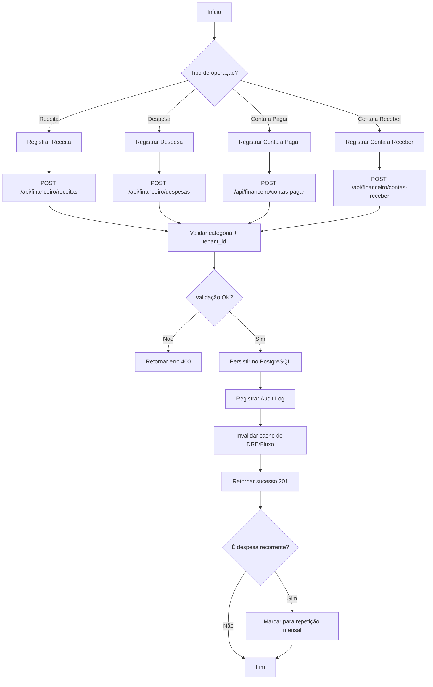

# Fluxo Financeiro — NEXO v1.0

**Versão:** 1.0
**Última Atualização:** 23/11/2025
**Status:** ✅ **90% IMPLEMENTADO** (Backend completo - 22/11/2025)
**Responsável:** Tech Lead + Produto

---

## 📋 Visão Geral

Módulo responsável pelo **cérebro financeiro** da barbearia: registrar receitas, despesas, DRE, projeções e dar visão real da lucratividade.

**Implementações Recentes (22/11/2025):**

- ✅ **Contas a Pagar** (6 endpoints)
- ✅ **Contas a Receber** (6 endpoints)
- ✅ **Compensação Bancária** (3 endpoints)
- ✅ **Fluxo de Caixa Compensado** (2 endpoints)
- ✅ **DRE Mensal** (2 endpoints)
- ✅ **Cron Job** - Geração automática de fluxo diário

---

## 🎯 Objetivos do Fluxo

1. ✅ Registrar receitas (serviços, produtos, assinaturas)
2. ✅ Registrar despesas (fixas, variáveis, recorrentes)
3. ✅ Controlar contas a pagar e receber
4. ✅ Gerar fluxo de caixa diário/mensal
5. ✅ Gerar DRE (Demonstrativo de Resultados)
6. ✅ Compensar lançamentos com extratos bancários
7. ✅ Calcular comissões como despesa operacional
8. ✅ Integrar com MRR/ARR de assinaturas
9. ✅ Suportar análises (mensal, trimestral, semestral, anual)

---

## 🔐 Regras de Negócio (RN)

### RN-FIN-001: Estrutura de Lançamentos

Todo lançamento pertence a:

- `tenant_id` (isolamento multi-tenant)
- `categoria` (Receita ou Despesa)
- `data de competência` (base para relatórios)
- `método de pagamento`

### RN-FIN-002: Comissões como Despesa

- ✅ Comissões são registradas como **despesa operacional**
- ✅ Categoria específica: "Comissões de Barbeiros"
- ✅ Cálculo automático baseado em serviços realizados

### RN-FIN-003: DRE Automático

- ✅ DRE monta automaticamente com base nos lançamentos
- ✅ Estrutura:
  - **Receita Bruta** = Soma de receitas
  - **(-) Deduções** = Impostos, devoluções
  - **= Receita Líquida**
  - **(-) Custos Operacionais** = Comissões, insumos
  - **(-) Despesas Fixas** = Aluguel, energia, etc
  - **= Lucro Operacional**

### RN-FIN-004: Status de Lançamentos

**Receitas:**

- `CONFIRMADO` - Confirmada mas não recebida
- `RECEBIDO` - Dinheiro em caixa
- `CANCELADO` - Cancelada

**Despesas:**

- `PENDENTE` - Aguardando pagamento
- `PAGO` - Paga
- `CANCELADO` - Cancelada

### RN-FIN-005: Compensação Bancária

- ✅ Permite marcar lançamentos como "compensados" via extrato
- ✅ Status: `PREVISTO`, `COMPENSADO`, `DIVERGENTE`, `CANCELADO`
- ✅ Rastreabilidade: data de compensação, valor compensado

### RN-FIN-006: Fluxo de Caixa

- ✅ Cron gera snapshot diário automaticamente (02:00)
- ✅ Calcula: saldo inicial + entradas - saídas = saldo final
- ✅ Permite projeções futuras (contas a pagar/receber)

---

## 📊 Diagrama de Fluxo Principal



---

## 🏗️ Arquitetura Técnica

### Backend (Go - Implementação Completa 22/11)

**Domain Layer:**

```go
// internal/domain/financial/conta_pagar.go
type ContaPagar struct {
    ID               string
    TenantID         string
    Descricao        string
    Valor            Money
    Fornecedor       string
    DataVencimento   time.Time
    DataPagamento    *time.Time
    Status           StatusContaPagar
    Categoria        string
    MetodoPagamento  string
    Recorrente       bool
    ParcelaAtual     int
    TotalParcelas    int
    CreatedAt        time.Time
    UpdatedAt        time.Time
}

type StatusContaPagar string
const (
    StatusPendente   StatusContaPagar = "PENDENTE"
    StatusPago       StatusContaPagar = "PAGO"
    StatusAtrasado   StatusContaPagar = "ATRASADO"
    StatusCancelado  StatusContaPagar = "CANCELADO"
)
```

**Repository (Implementado):**

```go
// internal/infrastructure/repository/conta_pagar_repository.go
type PostgresContaPagarRepository struct {
    db *sql.DB
}

func (r *PostgresContaPagarRepository) Save(ctx context.Context, tenantID string, conta *ContaPagar) error {
    query := `
        INSERT INTO contas_pagar (
            id, tenant_id, descricao, valor, fornecedor,
            data_vencimento, status, categoria, metodo_pagamento,
            recorrente, parcela_atual, total_parcelas
        ) VALUES ($1, $2, $3, $4, $5, $6, $7, $8, $9, $10, $11, $12)
    `
    _, err := r.db.ExecContext(ctx, query,
        conta.ID, tenantID, conta.Descricao, conta.Valor.Amount(),
        conta.Fornecedor, conta.DataVencimento, conta.Status,
        conta.Categoria, conta.MetodoPagamento, conta.Recorrente,
        conta.ParcelaAtual, conta.TotalParcelas,
    )
    return err
}

func (r *PostgresContaPagarRepository) MarkAsPaid(ctx context.Context, tenantID, id string) error {
    query := `
        UPDATE contas_pagar
        SET status = 'PAGO', data_pagamento = NOW(), updated_at = NOW()
        WHERE tenant_id = $1 AND id = $2
    `
    _, err := r.db.ExecContext(ctx, query, tenantID, id)
    return err
}
```

**Use Case:**

```go
// internal/application/usecase/financial/create_conta_pagar.go
type CreateContaPagarUseCase struct {
    repository domain.ContaPagarRepository
    validator  *validator.Validate
}

func (uc *CreateContaPagarUseCase) Execute(
    ctx context.Context,
    tenantID string,
    req *dto.CreateContaPagarRequest,
) (*dto.CreateContaPagarResponse, error) {
    // Validar
    if err := uc.validator.Struct(req); err != nil {
        return nil, fmt.Errorf("validation error: %w", err)
    }

    // Criar domain entity
    conta := &domain.ContaPagar{
        ID:              uuid.New().String(),
        TenantID:        tenantID,
        Descricao:       req.Descricao,
        Valor:           domain.NewMoney(req.Valor),
        Fornecedor:      req.Fornecedor,
        DataVencimento:  req.DataVencimento,
        Status:          domain.StatusPendente,
        Categoria:       req.Categoria,
        MetodoPagamento: req.MetodoPagamento,
        Recorrente:      req.Recorrente,
    }

    // Persistir
    if err := uc.repository.Save(ctx, tenantID, conta); err != nil {
        return nil, err
    }

    return mapper.ToContaPagarResponse(conta), nil
}
```

**HTTP Handler (Implementado):**

```go
// internal/infrastructure/http/handler/conta_pagar_handler.go
func (h *ContaPagarHandler) Create(c echo.Context) error {
    tenantID := c.Get("tenant_id").(string)

    var req dto.CreateContaPagarRequest
    if err := c.Bind(&req); err != nil {
        return c.JSON(400, ErrorResponse{Message: "Invalid request"})
    }

    resp, err := h.createUC.Execute(c.Request().Context(), tenantID, &req)
    if err != nil {
        return handleError(c, err)
    }

    return c.JSON(201, resp)
}

func (h *ContaPagarHandler) MarkAsPaid(c echo.Context) error {
    tenantID := c.Get("tenant_id").(string)
    id := c.Param("id")

    if err := h.repository.MarkAsPaid(c.Request().Context(), tenantID, id); err != nil {
        return handleError(c, err)
    }

    return c.JSON(200, map[string]string{"status": "paid"})
}
```

### Frontend (Next.js + React Query)

**Service:**

```typescript
// frontend/app/lib/services/financialService.ts
export const financialService = {
  createContaPagar: async (data: CreateContaPagarDTO) => {
    const response = await apiClient.post('/api/financeiro/contas-pagar', data);
    return CreateContaPagarResponseSchema.parse(response.data);
  },

  markContaPagarAsPaid: async (id: string) => {
    await apiClient.put(`/api/financeiro/contas-pagar/${id}/mark-paid`);
  },

  getDRE: async (month: number, year: number) => {
    const response = await apiClient.get(
      `/api/financeiro/dre/${month}/${year}`
    );
    return DREResponseSchema.parse(response.data);
  },

  getFluxoCaixa: async (dateFrom: string, dateTo: string) => {
    const response = await apiClient.get('/api/financeiro/fluxo-caixa', {
      params: { date_from: dateFrom, date_to: dateTo },
    });
    return FluxoCaixaResponseSchema.parse(response.data);
  },
};
```

**Hook:**

```typescript
// frontend/app/hooks/useFinancial.ts
export function useCreateContaPagar() {
  const queryClient = useQueryClient();

  return useMutation({
    mutationFn: financialService.createContaPagar,
    onSuccess: () => {
      toast.success('Conta a pagar criada!');
      queryClient.invalidateQueries(['contas-pagar']);
      queryClient.invalidateQueries(['fluxo-caixa']);
    },
  });
}

export function useDRE(month: number, year: number) {
  return useQuery({
    queryKey: ['dre', month, year],
    queryFn: () => financialService.getDRE(month, year),
    staleTime: 5 * 60 * 1000, // 5 minutos
  });
}
```

---

## 🗄️ Modelo de Dados

### Tabela: `contas_pagar`

```sql
CREATE TABLE contas_pagar (
    id UUID PRIMARY KEY DEFAULT gen_random_uuid(),
    tenant_id UUID NOT NULL REFERENCES tenants(id) ON DELETE CASCADE,
    descricao VARCHAR(255) NOT NULL,
    valor DECIMAL(15,2) NOT NULL CHECK (valor > 0),
    fornecedor VARCHAR(255),
    data_vencimento DATE NOT NULL,
    data_pagamento DATE,
    status VARCHAR(50) NOT NULL DEFAULT 'PENDENTE',
    categoria VARCHAR(100),
    metodo_pagamento VARCHAR(50),
    recorrente BOOLEAN DEFAULT false,
    parcela_atual INT,
    total_parcelas INT,
    created_at TIMESTAMP DEFAULT NOW(),
    updated_at TIMESTAMP DEFAULT NOW()
);

CREATE INDEX idx_contas_pagar_tenant_status ON contas_pagar(tenant_id, status);
CREATE INDEX idx_contas_pagar_vencimento ON contas_pagar(data_vencimento);
```

### Tabela: `contas_receber`

```sql
CREATE TABLE contas_receber (
    id UUID PRIMARY KEY DEFAULT gen_random_uuid(),
    tenant_id UUID NOT NULL REFERENCES tenants(id) ON DELETE CASCADE,
    descricao VARCHAR(255) NOT NULL,
    valor DECIMAL(15,2) NOT NULL CHECK (valor > 0),
    cliente VARCHAR(255),
    data_vencimento DATE NOT NULL,
    data_recebimento DATE,
    status VARCHAR(50) NOT NULL DEFAULT 'PENDENTE',
    categoria VARCHAR(100),
    metodo_pagamento VARCHAR(50),
    created_at TIMESTAMP DEFAULT NOW(),
    updated_at TIMESTAMP DEFAULT NOW()
);

CREATE INDEX idx_contas_receber_tenant_status ON contas_receber(tenant_id, status);
```

### Tabela: `compensacoes_bancarias`

```sql
CREATE TABLE compensacoes_bancarias (
    id UUID PRIMARY KEY DEFAULT gen_random_uuid(),
    tenant_id UUID NOT NULL REFERENCES tenants(id) ON DELETE CASCADE,
    receita_id UUID REFERENCES receitas(id) ON DELETE SET NULL,
    despesa_id UUID REFERENCES despesas(id) ON DELETE SET NULL,
    data_prevista DATE NOT NULL,
    data_compensada DATE,
    valor_previsto DECIMAL(15,2) NOT NULL,
    valor_compensado DECIMAL(15,2),
    status VARCHAR(50) DEFAULT 'PREVISTO',
    created_at TIMESTAMP DEFAULT NOW(),
    updated_at TIMESTAMP DEFAULT NOW()
);

CREATE INDEX idx_compensacoes_tenant_status ON compensacoes_bancarias(tenant_id, status);
```

### Tabela: `dre_mensal`

```sql
CREATE TABLE dre_mensal (
    id UUID PRIMARY KEY DEFAULT gen_random_uuid(),
    tenant_id UUID NOT NULL REFERENCES tenants(id) ON DELETE CASCADE,
    mes INT NOT NULL CHECK (mes BETWEEN 1 AND 12),
    ano INT NOT NULL CHECK (ano >= 2020),
    receita_bruta DECIMAL(15,2) NOT NULL DEFAULT 0,
    deducoes DECIMAL(15,2) NOT NULL DEFAULT 0,
    receita_liquida DECIMAL(15,2) NOT NULL DEFAULT 0,
    custos_operacionais DECIMAL(15,2) NOT NULL DEFAULT 0,
    despesas_fixas DECIMAL(15,2) NOT NULL DEFAULT 0,
    despesas_variaveis DECIMAL(15,2) NOT NULL DEFAULT 0,
    lucro_bruto DECIMAL(15,2) NOT NULL DEFAULT 0,
    lucro_operacional DECIMAL(15,2) NOT NULL DEFAULT 0,
    margem_bruta DECIMAL(5,2) NOT NULL DEFAULT 0,
    margem_operacional DECIMAL(5,2) NOT NULL DEFAULT 0,
    created_at TIMESTAMP DEFAULT NOW(),
    updated_at TIMESTAMP DEFAULT NOW(),
    UNIQUE(tenant_id, mes, ano)
);

CREATE INDEX idx_dre_tenant_periodo ON dre_mensal(tenant_id, ano DESC, mes DESC);
```

---

## 📡 Endpoints da API (Implementados 22/11/2025)

### Contas a Pagar (6 endpoints)

- `POST /api/financeiro/contas-pagar` - Criar
- `GET /api/financeiro/contas-pagar` - Listar (com filtros)
- `GET /api/financeiro/contas-pagar/:id` - Detalhes
- `PUT /api/financeiro/contas-pagar/:id` - Atualizar
- `PUT /api/financeiro/contas-pagar/:id/mark-paid` - Marcar como pago
- `DELETE /api/financeiro/contas-pagar/:id` - Deletar

### Contas a Receber (6 endpoints)

- `POST /api/financeiro/contas-receber` - Criar
- `GET /api/financeiro/contas-receber` - Listar
- `GET /api/financeiro/contas-receber/:id` - Detalhes
- `PUT /api/financeiro/contas-receber/:id` - Atualizar
- `PUT /api/financeiro/contas-receber/:id/mark-received` - Marcar como recebido
- `DELETE /api/financeiro/contas-receber/:id` - Deletar

### Compensação Bancária (3 endpoints)

- `GET /api/financeiro/compensacao` - Listar compensações
- `GET /api/financeiro/compensacao/list` - Lista com filtros avançados
- `DELETE /api/financeiro/compensacao/:id` - Deletar

### Fluxo de Caixa (2 endpoints)

- `GET /api/financeiro/fluxo-caixa/:date` - Fluxo de uma data
- `GET /api/financeiro/fluxo-caixa/list` - Lista por período

### DRE (2 endpoints)

- `GET /api/financeiro/dre/:month/:year` - DRE de um mês
- `GET /api/financeiro/dre/list` - Lista DREs (comparativo)

### Cron Job (1 endpoint interno)

- `POST /internal/cron/generate-daily-cash-flow` - Geração automática

---

## 🔄 Fluxos Alternativos

### Fluxo 2: Pagamento de Conta a Pagar

```
[Usuário acessa Contas a Pagar]
   ↓
[Seleciona conta pendente]
   ↓
[Clica em "Marcar como Pago"]
   ↓
[PUT /api/financeiro/contas-pagar/:id/mark-paid]
   ↓
[Atualizar status: PAGO]
   ↓
[Marcar data_pagamento = NOW()]
   ↓
[Registrar despesa correspondente]
   ↓
[Atualizar fluxo de caixa]
   ↓
[Invalidar cache de DRE]
   ↓
[Fim]
```

### Fluxo 3: Geração Automática de DRE (Cron)

```
[Cron executa diariamente 03:00]
   ↓
[Buscar receitas e despesas do mês]
   ↓
[Agrupar por categoria]
   ↓
[Calcular:
  - Receita Bruta = SUM(receitas)
  - Deduções = SUM(impostos)
  - Receita Líquida = Bruta - Deduções
  - Custos Operacionais = SUM(comissões + insumos)
  - Despesas Fixas = SUM(aluguel, salários, etc)
  - Lucro Bruto = Líquida - Custos
  - Lucro Operacional = Lucro Bruto - Despesas Fixas]
   ↓
[Calcular margens percentuais]
   ↓
[Upsert em dre_mensal]
   ↓
[Fim]
```

---

## ✅ Critérios de Aceite

Para considerar o módulo **PRONTO** na v1.0:

- [x] ✅ Backend completo (20 endpoints implementados)
- [x] ✅ Contas a Pagar/Receber funcionais
- [x] ✅ Compensação bancária ativa
- [x] ✅ Fluxo de caixa com cron automático
- [x] ✅ DRE mensal gerado automaticamente
- [ ] 🟡 Frontend para todos os módulos (pendente)
- [ ] 🟡 Testes E2E cobrindo fluxos principais
- [x] ✅ Multi-tenant isolamento garantido
- [x] ✅ Audit logs em operações críticas
- [ ] 🟡 Exportação CSV/Excel de relatórios

---

## 📊 Métricas de Sucesso

**Negócio:**

- DRE fechado até dia 5 do mês seguinte
- Margem operacional > 20%
- Inadimplência < 5%

**Técnicas:**

- Latência API < 200ms
- Cron job executado sem falhas > 99%
- Queries otimizadas (< 100ms)

---

## 📚 Referências

- `/Tarefas/01-BLOQUEIOS-BASE/VERTICAL_SLICE_ALL_MODULES.md` - Implementação completa
- `docs/02-arquitetura/MODELO_DE_DADOS.md` - Schema detalhado
- `docs/07-produto-e-funcionalidades/CATALOGO_FUNCIONALIDADES.md` - Novos módulos
- `PRD-NEXO.md` - Requisitos de produto

---

**Status:** ✅ **Backend 100% Completo** | 🟡 Frontend Pendente
**Próximo Marco:** UI Financeiro (Milestone 1.2 - 30/11/2025)
**Última Revisão:** 23/11/2025
