# Fluxo de Login e Autenticação — NEXO v1.0

**Versão:** 1.0
**Última Atualização:** 24/11/2025
**Status:** ⚠️ Não Implementado (Bloqueador MVP)
**Responsável:** Tech Lead + Segurança

---

## 📋 Visão Geral

Módulo responsável pela **autenticação de usuários** e **gerenciamento de sessões** via JWT (RS256), garantindo acesso seguro ao sistema com isolamento multi-tenant e auditoria completa.

**Diferencial:**

- JWT RS256 (chave assimétrica) - segurança de nível enterprise
- Access Token (15 min) + Refresh Token (7 dias) - sessões seguras
- Rate limiting (5 tentativas/5min) - proteção contra brute force
- Audit log completo (IP, user-agent, timestamp) - rastreabilidade total
- Cookies HttpOnly para refresh token - zero exposição a XSS
- Multi-tenant by design - isolamento desde o login

**Prioridade:** 🔴 CRÍTICA (MVP 1.0 - Bloqueador Total)

---

## 🎯 Objetivos do Fluxo

1. ✅ Autenticar usuário via email + senha
2. ✅ Gerar tokens JWT (access + refresh)
3. ✅ Validar credenciais com bcrypt/argon2
4. ✅ Bloquear tentativas de brute force (rate limiting)
5. ✅ Registrar audit log de login/logout
6. ✅ Renovar sessão via refresh token
7. ✅ Invalidar tokens no logout
8. ✅ Garantir isolamento multi-tenant desde o login
9. ✅ Retornar mensagens de erro específicas (UX)
10. ✅ Validar tenant ativo + usuário ativo

---

## 🔐 Regras de Negócio (RN)

### RN-LOGIN-001: Validação de Credenciais

- ✅ Email deve existir no banco de dados
- ✅ Senha validada com **bcrypt** (custo 12) ou **argon2id**
- ✅ Usuário deve estar **ativo** (`users.ativo = true`)
- ✅ Tenant deve estar **ativo** (`tenants.ativo = true`)
- ✅ Email verificado (se regra `email_verified = true` estiver ativa)
- ❌ **Nunca** retornar erro genérico - sempre específico:
  - "Email não encontrado"
  - "Senha incorreta"
  - "Conta desativada"
  - "Empresa inativa - entre em contato com suporte"

### RN-LOGIN-002: Tokens JWT (RS256)

**Access Token:**

- ✅ Algoritmo: **RS256** (chave assimétrica)
- ✅ Validade: **15 minutos**
- ✅ Payload:
  ```json
  {
    "user_id": "uuid",
    "tenant_id": "uuid",
    "role": "owner|manager|recepcionista|barbeiro|contador",
    "email": "usuario@email.com",
    "iat": 1700000000,
    "exp": 1700000900
  }
  ```
- ✅ Enviado no response JSON
- ✅ Frontend armazena **apenas em memória** (Zustand/Context)

**Refresh Token:**

- ✅ Algoritmo: **RS256**
- ✅ Validade: **7 dias**
- ✅ Payload:
  ```json
  {
    "user_id": "uuid",
    "tenant_id": "uuid",
    "token_id": "uuid",
    "iat": 1700000000,
    "exp": 1700604800
  }
  ```
- ✅ Armazenado no banco: `refresh_tokens` table
- ✅ Enviado via **cookie HttpOnly** (não acessível via JS)
- ✅ Usado apenas no endpoint `/auth/refresh`

### RN-LOGIN-003: Rate Limiting

- ✅ **5 tentativas** de login por IP/email a cada **5 minutos**
- ✅ Bloqueio temporário por **15 minutos** após exceder
- ✅ Retornar HTTP 429 Too Many Requests
- ✅ Header: `Retry-After: 900` (em segundos)
- ✅ Registrar tentativas em audit log

### RN-LOGIN-004: Audit Log

- ✅ **Toda tentativa de login** gera registro:
  - `action`: LOGIN
  - `result`: ALLOWED | DENIED
  - `ip_address`: IP do cliente
  - `user_agent`: navegador/device
  - `timestamp`: data/hora exata
- ✅ Logs de falha incluem motivo (email inválido, senha errada, conta inativa)
- ✅ Retenção: 90 dias (compliance LGPD)

### RN-LOGIN-005: Refresh Token Flow

- ✅ Quando access token expira (15 min):
  1. Frontend intercepta erro 401
  2. Chama `POST /auth/refresh` (cookie HttpOnly automático)
  3. Backend valida refresh token no banco
  4. Gera novo access token
  5. Retorna access token novo
  6. Frontend retenta request original
- ✅ Refresh token único por sessão
- ✅ Reutilização detectada = invalidação imediata (segurança)

### RN-LOGIN-006: Logout Seguro

- ✅ Endpoint: `POST /auth/logout`
- ✅ Invalida refresh token no banco (`deleted_at = NOW()`)
- ✅ Remove cookie HttpOnly do navegador
- ✅ Frontend limpa access token da memória
- ✅ Registra audit log: `action=LOGOUT, result=ALLOWED`
- ✅ Usuário redirecionado para `/login`

---

## 📊 Diagrama de Fluxo (Mermaid)

```mermaid
flowchart TD
    A[Início: Usuário acessa /login] --> B[Frontend: Formulário de Login]

    B --> C[Usuário preenche email + senha]
    C --> D{Validação Frontend}

    D -->|Email inválido| E[❌ Erro: formato de email inválido]
    D -->|Senha vazia| F[❌ Erro: senha obrigatória]
    D -->|OK| G[POST /auth/login]

    G --> H[Backend: Rate Limit Check]
    H --> I{Tentativas > 5/5min?}

    I -->|Sim| J[❌ HTTP 429 Too Many Requests]
    I -->|Não| K[Buscar usuário por email]

    K --> L{Email existe?}
    L -->|Não| M[Audit Log: DENIED - email inexistente]
    M --> N[❌ 401: Email não encontrado]

    L -->|Sim| O[Validar senha com bcrypt]
    O --> P{Senha correta?}

    P -->|Não| Q[Audit Log: DENIED - senha incorreta]
    Q --> R[Incrementar contador rate limit]
    R --> S[❌ 401: Senha incorreta]

    P -->|Sim| T{Usuário ativo?}
    T -->|Não| U[Audit Log: DENIED - conta inativa]
    U --> V[❌ 403: Conta desativada]

    T -->|Sim| W{Tenant ativo?}
    W -->|Não| X[Audit Log: DENIED - tenant inativo]
    X --> Y[❌ 403: Empresa inativa]

    W -->|Sim| Z[Gerar Access Token - JWT RS256 - 15min]
    Z --> AA[Gerar Refresh Token - JWT RS256 - 7 dias]

    AA --> AB[Salvar Refresh Token no banco]
    AB --> AC[Audit Log: LOGIN - ALLOWED]
    AC --> AD[Atualizar users.ultimo_login]

    AD --> AE[Response JSON com Access Token]
    AE --> AF[Set-Cookie: refresh_token - HttpOnly]

    AF --> AG[✅ 200 OK - Login Success]
    AG --> AH[Frontend: Armazena Access Token em memória]
    AH --> AI[Frontend: Armazena User em Context/Zustand]

    AI --> AJ[Redirecionar para /dashboard]

    E --> AK[Fim]
    F --> AK
    J --> AK
    N --> AK
    S --> AK
    V --> AK
    Y --> AK
    AJ --> AK

    style A fill:#e1f5e1
    style AG fill:#e1f5e1
    style AJ fill:#e1f5e1
    style AK fill:#e1f5e1
    style E fill:#ffe1e1
    style F fill:#ffe1e1
    style J fill:#fff4e1
    style N fill:#ffe1e1
    style S fill:#ffe1e1
    style V fill:#ffe1e1
    style Y fill:#ffe1e1
```



---

## 🏗️ Arquitetura (Clean Architecture)

### Domain Layer

**1. Entity: User (Autenticação)**

```go
// backend/internal/domain/entity/user.go
package entity

type User struct {
    ID           uuid.UUID
    TenantID     uuid.UUID
    Email        string
    PasswordHash string
    Nome         string
    Role         Role
    Ativo        bool
    EmailVerified bool
    UltimoLogin  *time.Time
    CreatedAt    time.Time
    UpdatedAt    time.Time
}

// ValidatePassword - Verifica senha com bcrypt
func (u *User) ValidatePassword(password string) error {
    err := bcrypt.CompareHashAndPassword([]byte(u.PasswordHash), []byte(password))
    if err != nil {
        return fmt.Errorf("invalid password")
    }
    return nil
}

// CanLogin - Valida se usuário pode fazer login
func (u *User) CanLogin() error {
    if !u.Ativo {
        return fmt.Errorf("user account is inactive")
    }
    return nil
}

// UpdateLastLogin - Atualiza timestamp de último login
func (u *User) UpdateLastLogin() {
    now := time.Now()
    u.UltimoLogin = &now
}
```

**2. Entity: RefreshToken**

```go
// backend/internal/domain/entity/refresh_token.go
package entity

type RefreshToken struct {
    ID        uuid.UUID
    UserID    uuid.UUID
    TenantID  uuid.UUID
    Token     string    // JWT refresh token
    ExpiresAt time.Time
    CreatedAt time.Time
    DeletedAt *time.Time // Soft delete para invalidação
}

// IsValid - Verifica se token ainda é válido
func (rt *RefreshToken) IsValid() bool {
    return rt.DeletedAt == nil && time.Now().Before(rt.ExpiresAt)
}

// Invalidate - Marca token como inválido
func (rt *RefreshToken) Invalidate() {
    now := time.Now()
    rt.DeletedAt = &now
}
```

**3. Value Object: LoginAttempt (Rate Limiting)**

```go
// backend/internal/domain/valueobject/login_attempt.go
package valueobject

type LoginAttempt struct {
    IP           string
    Email        string
    Attempts     int
    LastAttempt  time.Time
    BlockedUntil *time.Time
}

const (
    MaxAttempts     = 5
    AttemptWindow   = 5 * time.Minute
    BlockDuration   = 15 * time.Minute
)

// CanAttemptLogin - Verifica se pode tentar login
func (la *LoginAttempt) CanAttemptLogin() bool {
    // Se bloqueado, verifica se bloqueio expirou
    if la.BlockedUntil != nil && time.Now().Before(*la.BlockedUntil) {
        return false
    }

    // Se passou janela de tempo, resetar contador
    if time.Since(la.LastAttempt) > AttemptWindow {
        la.Attempts = 0
    }

    return la.Attempts < MaxAttempts
}

// RecordAttempt - Registra tentativa de login
func (la *LoginAttempt) RecordAttempt() {
    la.Attempts++
    la.LastAttempt = time.Now()

    // Se excedeu limite, bloquear
    if la.Attempts >= MaxAttempts {
        blockUntil := time.Now().Add(BlockDuration)
        la.BlockedUntil = &blockUntil
    }
}

// Reset - Reseta tentativas após login bem-sucedido
func (la *LoginAttempt) Reset() {
    la.Attempts = 0
    la.BlockedUntil = nil
}
```

---

### Application Layer (Use Cases)

**1. Use Case: Login**

```go
// backend/internal/application/usecase/login_usecase.go
package usecase

type LoginUseCase struct {
    userRepo         domain.UserRepository
    refreshTokenRepo domain.RefreshTokenRepository
    auditLogRepo     domain.AuditLogRepository
    jwtService       infra.JWTService
    rateLimiter      infra.RateLimiter
}

func (uc *LoginUseCase) Execute(ctx context.Context, input LoginInput) (*LoginOutput, error) {
    // 1. Rate Limiting
    canAttempt := uc.rateLimiter.CanAttemptLogin(input.IP, input.Email)
    if !canAttempt {
        uc.auditLogRepo.Create(ctx, entity.NewAuditLog(
            uuid.Nil, uuid.Nil,
            entity.AuditActionLogin,
            "auth",
            entity.AuditResultDenied,
            input.IP, input.UserAgent,
        ))
        return nil, fmt.Errorf("too many login attempts - try again in 15 minutes")
    }

    // 2. Buscar usuário por email
    user, err := uc.userRepo.FindByEmail(ctx, input.Email)
    if err != nil {
        uc.rateLimiter.RecordAttempt(input.IP, input.Email)
        uc.auditLogRepo.Create(ctx, newDeniedAuditLog(uuid.Nil, input.IP, input.UserAgent))
        return nil, fmt.Errorf("email não encontrado")
    }

    // 3. Validar senha
    if err := user.ValidatePassword(input.Password); err != nil {
        uc.rateLimiter.RecordAttempt(input.IP, input.Email)
        uc.auditLogRepo.Create(ctx, newDeniedAuditLog(user.TenantID, input.IP, input.UserAgent))
        return nil, fmt.Errorf("senha incorreta")
    }

    // 4. Validar se usuário pode logar
    if err := user.CanLogin(); err != nil {
        uc.auditLogRepo.Create(ctx, newDeniedAuditLog(user.TenantID, input.IP, input.UserAgent))
        return nil, fmt.Errorf("conta desativada")
    }

    // 5. Validar tenant ativo
    tenant, err := uc.tenantRepo.FindByID(ctx, user.TenantID)
    if err != nil || !tenant.Ativo {
        uc.auditLogRepo.Create(ctx, newDeniedAuditLog(user.TenantID, input.IP, input.UserAgent))
        return nil, fmt.Errorf("empresa inativa - entre em contato com suporte")
    }

    // 6. Gerar Access Token (15 min)
    accessToken, err := uc.jwtService.GenerateAccessToken(user)
    if err != nil {
        return nil, err
    }

    // 7. Gerar Refresh Token (7 dias)
    refreshToken, err := uc.jwtService.GenerateRefreshToken(user)
    if err != nil {
        return nil, err
    }

    // 8. Salvar Refresh Token no banco
    refreshTokenEntity := &entity.RefreshToken{
        ID:        uuid.New(),
        UserID:    user.ID,
        TenantID:  user.TenantID,
        Token:     refreshToken,
        ExpiresAt: time.Now().Add(7 * 24 * time.Hour),
        CreatedAt: time.Now(),
    }
    if err := uc.refreshTokenRepo.Create(ctx, refreshTokenEntity); err != nil {
        return nil, err
    }

    // 9. Atualizar último login
    user.UpdateLastLogin()
    if err := uc.userRepo.Update(ctx, user); err != nil {
        return nil, err
    }

    // 10. Registrar audit log: LOGIN SUCCESS
    uc.auditLogRepo.Create(ctx, entity.NewAuditLog(
        user.TenantID, user.ID,
        entity.AuditActionLogin,
        "auth",
        entity.AuditResultAllowed,
        input.IP, input.UserAgent,
    ))

    // 11. Resetar rate limiter
    uc.rateLimiter.Reset(input.IP, input.Email)

    return &LoginOutput{
        AccessToken:  accessToken,
        RefreshToken: refreshToken,
        User: UserDTO{
            ID:       user.ID,
            Nome:     user.Nome,
            Email:    user.Email,
            Role:     string(user.Role),
            TenantID: user.TenantID,
        },
    }, nil
}
```

**2. Use Case: Refresh Token**

```go
// backend/internal/application/usecase/refresh_token_usecase.go
package usecase

func (uc *RefreshTokenUseCase) Execute(ctx context.Context, input RefreshTokenInput) (*RefreshTokenOutput, error) {
    // 1. Validar JWT do refresh token
    claims, err := uc.jwtService.ValidateRefreshToken(input.RefreshToken)
    if err != nil {
        return nil, fmt.Errorf("invalid refresh token")
    }

    // 2. Buscar refresh token no banco
    refreshTokenEntity, err := uc.refreshTokenRepo.FindByToken(ctx, input.RefreshToken)
    if err != nil || !refreshTokenEntity.IsValid() {
        return nil, fmt.Errorf("refresh token not found or expired")
    }

    // 3. Buscar usuário
    user, err := uc.userRepo.FindByID(ctx, refreshTokenEntity.UserID)
    if err != nil {
        return nil, err
    }

    // 4. Validar se usuário ainda pode logar
    if err := user.CanLogin(); err != nil {
        // Invalidar token se usuário foi desativado
        refreshTokenEntity.Invalidate()
        uc.refreshTokenRepo.Update(ctx, refreshTokenEntity)
        return nil, fmt.Errorf("user account is inactive")
    }

    // 5. Gerar novo Access Token (15 min)
    accessToken, err := uc.jwtService.GenerateAccessToken(user)
    if err != nil {
        return nil, err
    }

    return &RefreshTokenOutput{
        AccessToken: accessToken,
    }, nil
}
```

**3. Use Case: Logout**

```go
// backend/internal/application/usecase/logout_usecase.go
package usecase

func (uc *LogoutUseCase) Execute(ctx context.Context, input LogoutInput) error {
    // 1. Buscar refresh token no banco
    refreshTokenEntity, err := uc.refreshTokenRepo.FindByToken(ctx, input.RefreshToken)
    if err != nil {
        return nil // Ignorar se não encontrar (já expirado)
    }

    // 2. Invalidar refresh token
    refreshTokenEntity.Invalidate()
    if err := uc.refreshTokenRepo.Update(ctx, refreshTokenEntity); err != nil {
        return err
    }

    // 3. Registrar audit log: LOGOUT
    uc.auditLogRepo.Create(ctx, entity.NewAuditLog(
        refreshTokenEntity.TenantID,
        refreshTokenEntity.UserID,
        entity.AuditActionLogout,
        "auth",
        entity.AuditResultAllowed,
        input.IP, input.UserAgent,
    ))

    return nil
}
```

---

### Infrastructure Layer (HTTP Handlers)

**1. Handler: POST /auth/login**

```go
// backend/internal/infra/http/handler/auth_handler.go
package handler

func (h *AuthHandler) Login(c echo.Context) error {
    var req dto.LoginRequest
    if err := c.Bind(&req); err != nil {
        return c.JSON(http.StatusBadRequest, dto.ErrorResponse{
            Error: "invalid request body",
        })
    }

    // Validação
    if err := c.Validate(&req); err != nil {
        return c.JSON(http.StatusBadRequest, dto.ErrorResponse{
            Error: err.Error(),
        })
    }

    // Use case
    output, err := h.loginUseCase.Execute(c.Request().Context(), usecase.LoginInput{
        Email:     req.Email,
        Password:  req.Password,
        IP:        c.RealIP(),
        UserAgent: c.Request().UserAgent(),
    })

    if err != nil {
        // Retornar erro específico
        return c.JSON(http.StatusUnauthorized, dto.ErrorResponse{
            Error: err.Error(),
        })
    }

    // Set cookie HttpOnly com refresh token
    c.SetCookie(&http.Cookie{
        Name:     "refresh_token",
        Value:    output.RefreshToken,
        Path:     "/",
        MaxAge:   7 * 24 * 60 * 60, // 7 dias
        HttpOnly: true,
        Secure:   true, // HTTPS only
        SameSite: http.SameSiteStrictMode,
    })

    return c.JSON(http.StatusOK, dto.LoginResponse{
        AccessToken: output.AccessToken,
        User:        output.User,
    })
}
```

**2. Handler: POST /auth/refresh**

```go
func (h *AuthHandler) Refresh(c echo.Context) error {
    // Extrair refresh token do cookie
    cookie, err := c.Cookie("refresh_token")
    if err != nil {
        return c.JSON(http.StatusUnauthorized, dto.ErrorResponse{
            Error: "refresh token not found",
        })
    }

    output, err := h.refreshTokenUseCase.Execute(c.Request().Context(), usecase.RefreshTokenInput{
        RefreshToken: cookie.Value,
    })

    if err != nil {
        return c.JSON(http.StatusUnauthorized, dto.ErrorResponse{
            Error: err.Error(),
        })
    }

    return c.JSON(http.StatusOK, dto.RefreshTokenResponse{
        AccessToken: output.AccessToken,
    })
}
```

**3. Handler: POST /auth/logout**

```go
func (h *AuthHandler) Logout(c echo.Context) error {
    cookie, err := c.Cookie("refresh_token")
    if err != nil {
        // Ignorar se não tiver cookie
        return c.NoContent(http.StatusNoContent)
    }

    err = h.logoutUseCase.Execute(c.Request().Context(), usecase.LogoutInput{
        RefreshToken: cookie.Value,
        IP:           c.RealIP(),
        UserAgent:    c.Request().UserAgent(),
    })

    if err != nil {
        return c.JSON(http.StatusInternalServerError, dto.ErrorResponse{
            Error: "logout failed",
        })
    }

    // Remover cookie
    c.SetCookie(&http.Cookie{
        Name:     "refresh_token",
        Value:    "",
        Path:     "/",
        MaxAge:   -1,
        HttpOnly: true,
    })

    return c.NoContent(http.StatusNoContent)
}
```

---

## 📊 Modelo de Dados (SQL)

```sql
-- Tabela: refresh_tokens
CREATE TABLE IF NOT EXISTS refresh_tokens (
    id UUID PRIMARY KEY DEFAULT gen_random_uuid(),
    user_id UUID NOT NULL REFERENCES users(id) ON DELETE CASCADE,
    tenant_id UUID NOT NULL REFERENCES tenants(id) ON DELETE CASCADE,

    token TEXT NOT NULL UNIQUE,
    expires_at TIMESTAMP NOT NULL,

    created_at TIMESTAMP NOT NULL DEFAULT NOW(),
    deleted_at TIMESTAMP, -- Soft delete para invalidação

    CONSTRAINT refresh_tokens_user_tenant_fk
        FOREIGN KEY (user_id, tenant_id)
        REFERENCES users(id, tenant_id)
);

CREATE INDEX idx_refresh_tokens_user ON refresh_tokens(user_id, deleted_at);
CREATE INDEX idx_refresh_tokens_token ON refresh_tokens(token) WHERE deleted_at IS NULL;
CREATE INDEX idx_refresh_tokens_expires ON refresh_tokens(expires_at) WHERE deleted_at IS NULL;

-- Cleanup automático de tokens expirados (cron)
-- DELETE FROM refresh_tokens WHERE expires_at < NOW() - INTERVAL '7 days';

-- Tabela: login_attempts (Rate Limiting em memória - Redis recomendado)
-- Se usar banco de dados:
CREATE TABLE IF NOT EXISTS login_attempts (
    id UUID PRIMARY KEY DEFAULT gen_random_uuid(),
    ip_address VARCHAR(45) NOT NULL,
    email VARCHAR(255) NOT NULL,
    attempts INT NOT NULL DEFAULT 1,
    last_attempt TIMESTAMP NOT NULL DEFAULT NOW(),
    blocked_until TIMESTAMP,

    created_at TIMESTAMP NOT NULL DEFAULT NOW(),
    updated_at TIMESTAMP NOT NULL DEFAULT NOW()
);

CREATE INDEX idx_login_attempts_ip_email ON login_attempts(ip_address, email);
CREATE INDEX idx_login_attempts_blocked ON login_attempts(blocked_until) WHERE blocked_until IS NOT NULL;
```

---

## 🔄 Fluxos Alternativos

### FA-01: Senha Incorreta (Rate Limiting)

**Cenário:** Usuário erra senha 3 vezes seguidas.

**Ação:**

1. Backend incrementa contador de tentativas
2. Retorna HTTP 401: "Senha incorreta (3/5 tentativas)"
3. Registra audit log: `result=DENIED, motivo=senha_incorreta`
4. Após 5 tentativas → bloquear por 15 min
5. Retornar HTTP 429: "Muitas tentativas - tente novamente em 15 minutos"

---

### FA-02: Token Expirado (Auto-Refresh)

**Cenário:** Access token expirou (15 min).

**Ação:**

1. Frontend faz request → recebe 401 Unauthorized
2. Axios interceptor detecta erro 401
3. Chama automaticamente `POST /auth/refresh`
4. Backend valida refresh token do cookie HttpOnly
5. Gera novo access token
6. Frontend retenta request original com novo token
7. Usuário não percebe interrupção (seamless)

---

### FA-03: Refresh Token Expirado

**Cenário:** Refresh token expirou (7 dias sem usar sistema).

**Ação:**

1. Frontend tenta refresh → recebe 401
2. Backend retorna: "Sessão expirada - faça login novamente"
3. Frontend limpa estado da memória
4. Redireciona para `/login`
5. Exibe mensagem: "Sua sessão expirou por inatividade"

---

### FA-04: Conta Desativada Durante Sessão

**Cenário:** Owner desativa usuário enquanto ele está logado.

**Ação:**

1. Usuário tenta acessar recurso protegido
2. Middleware valida JWT (ainda válido)
3. Mas handler verifica `users.ativo = false`
4. Retorna HTTP 403: "Sua conta foi desativada"
5. Frontend força logout
6. Redireciona para `/login`

---

### FA-05: Múltiplas Sessões (Mesmo Usuário)

**Cenário:** Usuário faz login em 2 dispositivos.

**Ação:**

1. Login no desktop → gera `refresh_token_1`
2. Login no mobile → gera `refresh_token_2`
3. Ambos tokens válidos simultaneamente
4. Logout no desktop → invalida apenas `refresh_token_1`
5. Mobile continua funcionando com `refresh_token_2`

**Opção Alternativa (Single Session):**

- Invalidar todos tokens anteriores ao gerar novo
- Forçar logout em outros dispositivos

---

## 📱 Frontend (Next.js + TypeScript)

### 1. Login Page

```typescript
// frontend/app/(auth)/login/page.tsx
'use client';

import { useState } from 'react';
import { useRouter } from 'next/navigation';
import { useAuth } from '@/hooks/useAuth';
import { VFormProvider, VTextField } from '@/components/form';
import { Button, Alert } from '@mui/material';

export default function LoginPage() {
  const router = useRouter();
  const { login } = useAuth();
  const [error, setError] = useState<string | null>(null);
  const [loading, setLoading] = useState(false);

  const handleSubmit = async (data: { email: string; password: string }) => {
    setLoading(true);
    setError(null);

    try {
      await login(data.email, data.password);
      router.push('/dashboard');
    } catch (err: any) {
      // Exibir erro específico retornado pelo backend
      setError(err.response?.data?.error || 'Erro ao fazer login');
    } finally {
      setLoading(false);
    }
  };

  return (
    <div className="min-h-screen flex items-center justify-center">
      <div className="max-w-md w-full space-y-8">
        <h1 className="text-3xl font-bold">Login - NEXO</h1>

        {error && <Alert severity="error">{error}</Alert>}

        <VFormProvider onSubmit={handleSubmit}>
          <VTextField name="email" label="Email" type="email" required />
          <VTextField name="password" label="Senha" type="password" required />

          <Button
            type="submit"
            variant="contained"
            fullWidth
            disabled={loading}
          >
            {loading ? 'Entrando...' : 'Entrar'}
          </Button>
        </VFormProvider>
      </div>
    </div>
  );
}
```

### 2. Auth Context (Zustand)

```typescript
// frontend/store/authStore.ts
import { create } from 'zustand';
import { authService } from '@/services/authService';

interface User {
  id: string;
  nome: string;
  email: string;
  role: string;
  tenant_id: string;
}

interface AuthState {
  user: User | null;
  accessToken: string | null;
  isAuthenticated: boolean;
  login: (email: string, password: string) => Promise<void>;
  logout: () => Promise<void>;
  setAccessToken: (token: string) => void;
}

export const useAuthStore = create<AuthState>((set) => ({
  user: null,
  accessToken: null,
  isAuthenticated: false,

  login: async (email, password) => {
    const response = await authService.login(email, password);
    set({
      user: response.user,
      accessToken: response.access_token,
      isAuthenticated: true,
    });
  },

  logout: async () => {
    await authService.logout();
    set({
      user: null,
      accessToken: null,
      isAuthenticated: false,
    });
  },

  setAccessToken: (token) => set({ accessToken: token }),
}));
```

### 3. Axios Interceptor (Auto-Refresh)

```typescript
// frontend/lib/apiClient.ts
import axios from 'axios';
import { useAuthStore } from '@/store/authStore';

const apiClient = axios.create({
  baseURL: process.env.NEXT_PUBLIC_API_URL,
  withCredentials: true, // Envia cookies HttpOnly
});

// Request interceptor: adicionar access token
apiClient.interceptors.request.use((config) => {
  const token = useAuthStore.getState().accessToken;
  if (token) {
    config.headers.Authorization = `Bearer ${token}`;
  }
  return config;
});

// Response interceptor: auto-refresh em 401
apiClient.interceptors.response.use(
  (response) => response,
  async (error) => {
    const originalRequest = error.config;

    if (error.response?.status === 401 && !originalRequest._retry) {
      originalRequest._retry = true;

      try {
        // Chamar /auth/refresh (cookie HttpOnly automático)
        const response = await axios.post(
          `${process.env.NEXT_PUBLIC_API_URL}/auth/refresh`,
          {},
          { withCredentials: true }
        );

        const newAccessToken = response.data.access_token;
        useAuthStore.getState().setAccessToken(newAccessToken);

        // Retentar request original com novo token
        originalRequest.headers.Authorization = `Bearer ${newAccessToken}`;
        return apiClient(originalRequest);
      } catch (refreshError) {
        // Refresh token expirado → logout
        useAuthStore.getState().logout();
        window.location.href = '/login';
        return Promise.reject(refreshError);
      }
    }

    return Promise.reject(error);
  }
);

export default apiClient;
```

### 4. Middleware de Proteção de Rotas

```typescript
// frontend/middleware.ts
import { NextResponse } from 'next/server';
import type { NextRequest } from 'next/server';

export function middleware(request: NextRequest) {
  const accessToken = request.cookies.get('access_token')?.value;
  const isAuthPage = request.nextUrl.pathname.startsWith('/login');
  const isProtectedPage = request.nextUrl.pathname.startsWith('/dashboard');

  // Se tentar acessar página protegida sem token → login
  if (isProtectedPage && !accessToken) {
    return NextResponse.redirect(new URL('/login', request.url));
  }

  // Se tentar acessar login com token → dashboard
  if (isAuthPage && accessToken) {
    return NextResponse.redirect(new URL('/dashboard', request.url));
  }

  return NextResponse.next();
}

export const config = {
  matcher: ['/dashboard/:path*', '/login'],
};
```

---

## ✅ Critérios de Aceitação

### Backend

- [ ] Endpoint `POST /auth/login` implementado e testado
- [ ] Endpoint `POST /auth/refresh` implementado
- [ ] Endpoint `POST /auth/logout` implementado
- [ ] JWT RS256 configurado (chave pública/privada)
- [ ] Bcrypt com custo 12 para hash de senhas
- [ ] Rate limiting: 5 tentativas/5min por IP+email
- [ ] Refresh tokens armazenados em banco com soft delete
- [ ] Audit log registrando LOGIN/LOGOUT (ALLOWED/DENIED)
- [ ] Cookies HttpOnly para refresh token
- [ ] Validação de tenant ativo + usuário ativo
- [ ] Mensagens de erro específicas (nunca genéricas)
- [ ] Testes E2E para fluxo completo de autenticação

### Frontend

- [ ] Página `/login` com formulário de email + senha
- [ ] AuthContext/Zustand para gerenciar sessão
- [ ] Access token armazenado **apenas em memória**
- [ ] Axios interceptor para auto-refresh de token
- [ ] Middleware Next.js para proteção de rotas
- [ ] Logout limpa estado e redireciona para login
- [ ] Mensagens de erro amigáveis (email inexistente, senha errada, etc.)
- [ ] Loading states durante login/logout
- [ ] Redirecionamento após login bem-sucedido

### Segurança

- [ ] JWT RS256 (nunca aceitar algoritmo `none`)
- [ ] Chaves privadas em variáveis de ambiente (.env)
- [ ] HTTPS obrigatório em produção (cookies Secure)
- [ ] Refresh token em cookie HttpOnly + SameSite=Strict
- [ ] Access token **nunca** em localStorage
- [ ] Rate limiting ativo (5 tentativas/5min)
- [ ] Audit logs armazenados por 90 dias
- [ ] Cleanup automático de tokens expirados (cron job)

---

## 📈 Métricas de Sucesso

1. **Segurança:** 0 incidentes de acesso não autorizado em produção
2. **Auditoria:** 100% das tentativas de login registradas em audit log
3. **Performance:** Tempo de login < 300ms (P95)
4. **Confiabilidade:** 99.9% de uptime do serviço de autenticação
5. **UX:** Taxa de abandono < 5% na tela de login
6. **Rate Limiting:** 100% de ataques de brute force bloqueados

---

## 🔗 Referências

- [FLUXO_RBAC.md](./FLUXO_RBAC.md) - Permissões e roles
- [ARQUITETURA_SEGURANCA.md](../06-seguranca/ARQUITETURA_SEGURANCA.md) - JWT RS256
- [COMPLIANCE_LGPD.md](../06-seguranca/COMPLIANCE_LGPD.md) - Audit logs
- [PRD-NEXO.md](../../PRD-NEXO.md) - Requisitos de autenticação
- [MODELO_MULTI_TENANT.md](../02-arquitetura/MODELO_MULTI_TENANT.md) - Isolamento de tenants

---

**Status:** ⚠️ Não Implementado (Bloqueador Crítico para MVP 1.0)
**Prioridade:** 🔴 CRÍTICA (Sistema não funciona sem autenticação)
**Próximos Passos:**

1. Implementar backend (endpoints + use cases + JWT service)
2. Criar tabelas no banco (refresh_tokens, login_attempts)
3. Configurar chaves RS256 em produção
4. Implementar frontend (login page + auth context + interceptor)
5. Testes E2E do fluxo completo
6. Deploy e monitoramento
