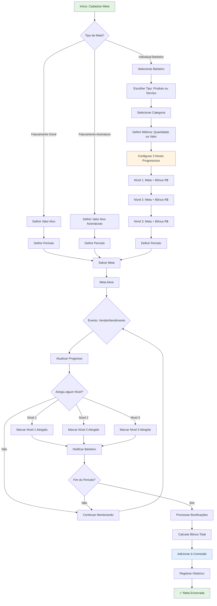
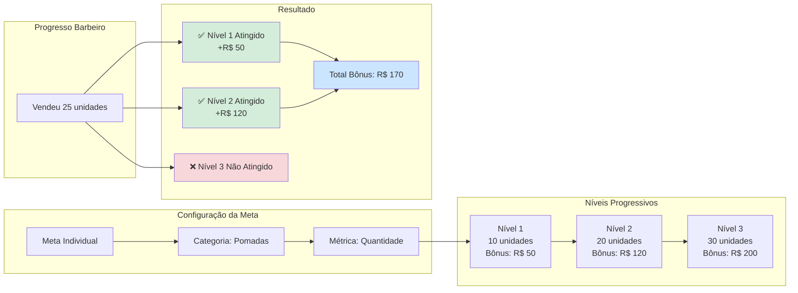

# Fluxo de Metas — NEXO v1.0

**Versão:** 1.0  
**Última Atualização:** 27/11/2025  
**Status:** 🟢 Pronto para Implementação  
**Responsável:** Product + Tech Lead

---

## 📋 Visão Geral

Módulo responsável pelo **cadastro, acompanhamento e bonificação de metas** para a barbearia. Suporta metas gerais (faturamento da empresa), metas de assinaturas e metas individuais por barbeiro com sistema de bonificação progressiva em 3 níveis.

**Diferencial:**

- Metas de faturamento geral da empresa
- Metas de faturamento por assinaturas
- Metas individuais por barbeiro com bonificação progressiva (3 níveis)
- Bonificação automática integrada ao cálculo de comissão
- Filtro por categoria de produtos ou serviços
- Dashboard de acompanhamento em tempo real
- Gamificação para engajamento dos profissionais

**Prioridade:** 🔴 ALTA (v1.0.0 - MVP Core)

---

## 🎯 Objetivos do Fluxo

1. ✅ Cadastrar metas de faturamento geral da empresa (mensal/anual)
2. ✅ Cadastrar metas de faturamento de assinaturas
3. ✅ Cadastrar metas individuais por barbeiro
4. ✅ Permitir metas por categoria (produtos ou serviços)
5. ✅ Implementar sistema de bonificação progressiva (3 níveis)
6. ✅ Integrar bonificação automaticamente no cálculo de comissão
7. ✅ Acompanhar progresso em tempo real
8. ✅ Gerar relatórios de atingimento
9. ✅ Notificar quando meta está próxima de ser atingida
10. ✅ Respeitar isolamento multi-tenant

---

## 🔐 Regras de Negócio (RN)

### RN-META-001: Tipos de Meta

Existem **3 tipos principais** de metas:

| Tipo | Escopo | Descrição |
|------|--------|-----------|
| `FATURAMENTO_GERAL` | Empresa | Meta de faturamento total da barbearia |
| `FATURAMENTO_ASSINATURA` | Empresa | Meta específica de receita com assinaturas |
| `INDIVIDUAL_BARBEIRO` | Profissional | Meta individual com bonificação |

### RN-META-002: Metas de Faturamento Geral

- ✅ Define valor mínimo de faturamento esperado (mensal ou anual)
- ✅ Considera **todas as receitas** (serviços + produtos + assinaturas)
- ✅ Apenas **Dono/Gerente** pode cadastrar
- ✅ Acompanhamento via dashboard principal
- ✅ Não gera bonificação direta (apenas indicador de saúde do negócio)

### RN-META-003: Metas de Faturamento de Assinaturas

- ✅ Define valor mínimo de receita recorrente esperada
- ✅ Considera apenas receitas de **assinaturas ativas**
- ✅ Apenas **Dono/Gerente** pode cadastrar
- ✅ Útil para acompanhar crescimento de base recorrente
- ✅ Não gera bonificação direta

### RN-META-004: Metas Individuais por Barbeiro

- ✅ Definida por barbeiro específico
- ✅ Pode ser por **quantidade** (ex: vender 50 produtos) ou **valor** (ex: faturar R$ 5.000)
- ✅ **Filtro por categoria:** escolher categoria de produtos OU serviços
- ✅ **Progressiva em 3 níveis** com bonificações diferentes
- ✅ Bonificação em **valor monetário fixo** (R$)
- ✅ Bonificação é **somada automaticamente** na comissão do período

### RN-META-005: Sistema de Bonificação Progressiva (3 Níveis)

Cada meta individual possui **3 níveis de atingimento**:

| Nível | Descrição | Exemplo |
|-------|-----------|---------|
| **Nível 1** | Meta mínima | Vender 10 produtos → Bônus R$ 50,00 |
| **Nível 2** | Meta intermediária | Vender 20 produtos → Bônus R$ 120,00 |
| **Nível 3** | Meta máxima (stretch) | Vender 30 produtos → Bônus R$ 200,00 |

**Regras de bonificação:**
- ✅ Ao atingir um nível, o bônus correspondente é **acumulado**
- ✅ Se atingir Nível 2, recebe bônus do Nível 1 + Nível 2
- ✅ Se atingir Nível 3, recebe bônus dos 3 níveis
- ✅ Bônus é **creditado automaticamente** na comissão do barbeiro
- ✅ Período de apuração: **mensal** (dia 1 ao último dia do mês)

### RN-META-006: Filtro por Categoria

- ✅ Ao criar meta individual, é **obrigatório** escolher:
  - Tipo: `PRODUTO` ou `SERVICO`
  - Categoria: qual categoria específica (ex: "Pomadas", "Cortes Premium")
- ✅ Sistema contabiliza apenas vendas/atendimentos da categoria escolhida
- ✅ Se escolher "Todas as categorias", considera tudo do tipo selecionado

### RN-META-007: Cálculo de Progresso

```
progresso_percentual = (realizado / meta_valor) * 100
```

- ✅ Atualizado em **tempo real** (a cada venda/atendimento)
- ✅ Considera apenas transações **confirmadas/pagas**
- ✅ Vendas canceladas são **descontadas** do progresso

### RN-META-008: Integração com Comissões

- ✅ Ao final do mês, sistema verifica metas atingidas
- ✅ Para cada meta atingida, calcula bônus total do nível
- ✅ Bônus é adicionado como `bonus_meta` na tabela de comissões
- ✅ Registro de auditoria: qual meta gerou qual bônus
- ✅ **Trigger:** Job diário (ou ao fechar mês) processa bonificações

### RN-META-009: Permissões

| Role | Permissões |
|------|-----------|
| **Dono** | CRUD completo de todas as metas |
| **Gerente** | CRUD de metas, visualizar relatórios |
| **Barbeiro** | Visualizar **apenas suas próprias** metas e progresso |
| **Recepcionista** | Sem acesso |

### RN-META-010: Período e Vigência

- ✅ Meta tem **data de início** e **data de fim**
- ✅ Metas mensais: 1º ao último dia do mês
- ✅ Metas podem ser **recorrentes** (repetir todo mês)
- ✅ Meta expirada não gera mais bonificação
- ✅ Histórico de metas é preservado para relatórios

---

## 📊 Diagrama de Fluxo Principal (Mermaid)


```mermaid
flowchart TD
    A[Início: Cadastrar Meta] --> B{Tipo de Meta?}
    
    B -->|Faturamento Geral| C1[Definir Valor Alvo]
    B -->|Faturamento Assinatura| C2[Definir Valor Alvo Assinaturas]
    B -->|Individual Barbeiro| C3[Selecionar Barbeiro]
    
    C1 --> D1[Definir Período]
    C2 --> D2[Definir Período]
    C3 --> E[Escolher Tipo: Produto ou Serviço]
    
    E --> F[Selecionar Categoria]
    F --> G[Definir Métrica: Quantidade ou Valor]
    
    G --> H[Configurar 3 Níveis Progressivos]
    
    H --> I1[Nível 1: Meta + Bônus R$]
    I1 --> I2[Nível 2: Meta + Bônus R$]
    I2 --> I3[Nível 3: Meta + Bônus R$]
    
    I3 --> D3[Definir Período]
    
    D1 --> J[Salvar Meta]
    D2 --> J
    D3 --> J
    
    J --> K[Meta Ativa]
    
    K --> L{Evento: Venda/Atendimento}
    L --> M[Atualizar Progresso]
    
    M --> N{Atingiu algum Nível?}
    N -->|Não| O[Continuar Monitorando]
    N -->|Nível 1| P1[Marcar Nível 1 Atingido]
    N -->|Nível 2| P2[Marcar Nível 2 Atingido]
    N -->|Nível 3| P3[Marcar Nível 3 Atingido]
    
    P1 --> Q[Notificar Barbeiro]
    P2 --> Q
    P3 --> Q
    
    Q --> R{Fim do Período?}
    R -->|Não| O
    R -->|Sim| S[Processar Bonificações]
    
    S --> T[Calcular Bônus Total]
    T --> U[Adicionar à Comissão]
    U --> V[Registrar Histórico]
    
    V --> W[✅ Meta Encerrada]
    O --> L
    
    style A fill:#e1f5e1
    style W fill:#e1f5e1
    style H fill:#fff4e1
    style U fill:#e1f0ff
```

---

## 📊 Diagrama de Níveis Progressivos


```mermaid
flowchart LR
    subgraph Configuração da Meta
        A[Meta Individual] --> B[Categoria: Pomadas]
        B --> C[Métrica: Quantidade]
    end
    
    subgraph Níveis Progressivos
        D[Nível 1<br/>10 unidades<br/>Bônus: R$ 50] --> E[Nível 2<br/>20 unidades<br/>Bônus: R$ 120]
        E --> F[Nível 3<br/>30 unidades<br/>Bônus: R$ 200]
    end
    
    subgraph Progresso Barbeiro
        G[Vendeu 25 unidades]
    end
    
    subgraph Resultado
        H[✅ Nível 1 Atingido<br/>+R$ 50]
        I[✅ Nível 2 Atingido<br/>+R$ 120]
        J[❌ Nível 3 Não Atingido]
        K[Total Bônus: R$ 170]
    end
    
    C --> D
    G --> H
    G --> I
    G --> J
    H --> K
    I --> K
    
    style H fill:#d4edda
    style I fill:#d4edda
    style J fill:#f8d7da
    style K fill:#cce5ff
```

---

## 🏗️ Arquitetura (Clean Architecture)

### Domain Layer

**1. Entity: Meta**

```go
// backend/internal/domain/entity/meta.go
package entity

import (
    "time"
    "github.com/google/uuid"
    "barber-analytics-pro/backend/internal/domain/valueobject"
)

type TipoMeta string

const (
    TipoMetaFaturamentoGeral      TipoMeta = "FATURAMENTO_GERAL"
    TipoMetaFaturamentoAssinatura TipoMeta = "FATURAMENTO_ASSINATURA"
    TipoMetaIndividualBarbeiro    TipoMeta = "INDIVIDUAL_BARBEIRO"
)

type TipoItemMeta string

const (
    TipoItemProduto TipoItemMeta = "PRODUTO"
    TipoItemServico TipoItemMeta = "SERVICO"
)

type MetricaMeta string

const (
    MetricaQuantidade MetricaMeta = "QUANTIDADE"
    MetricaValor      MetricaMeta = "VALOR"
)

type StatusMeta string

const (
    StatusMetaAtiva    StatusMeta = "ATIVA"
    StatusMetaEncerrada StatusMeta = "ENCERRADA"
    StatusMetaCancelada StatusMeta = "CANCELADA"
)

type Meta struct {
    ID          uuid.UUID
    TenantID    uuid.UUID
    Tipo        TipoMeta
    Nome        string
    Descricao   string
    
    // Escopo (para metas individuais)
    BarbeiroID  *uuid.UUID       // Null se for meta geral
    TipoItem    *TipoItemMeta    // PRODUTO ou SERVICO
    CategoriaID *uuid.UUID       // Categoria específica (null = todas)
    Metrica     MetricaMeta      // QUANTIDADE ou VALOR
    
    // Níveis Progressivos (apenas para INDIVIDUAL_BARBEIRO)
    Nivel1Meta     valueobject.Money // ou quantidade
    Nivel1Bonus    valueobject.Money
    Nivel2Meta     valueobject.Money
    Nivel2Bonus    valueobject.Money
    Nivel3Meta     valueobject.Money
    Nivel3Bonus    valueobject.Money
    
    // Para metas gerais (sem níveis)
    ValorAlvo      valueobject.Money
    
    // Período
    DataInicio     time.Time
    DataFim        time.Time
    Recorrente     bool
    
    // Progresso
    ValorRealizado valueobject.Money
    Nivel1Atingido bool
    Nivel2Atingido bool
    Nivel3Atingido bool
    
    // Controle
    Status         StatusMeta
    CriadoPor      uuid.UUID
    
    CreatedAt      time.Time
    UpdatedAt      time.Time
}

// NewMetaFaturamentoGeral - Factory para meta de faturamento geral
func NewMetaFaturamentoGeral(
    tenantID uuid.UUID,
    nome string,
    valorAlvo valueobject.Money,
    dataInicio, dataFim time.Time,
    criadoPor uuid.UUID,
) (*Meta, error) {
    if valorAlvo.Value().Sign() <= 0 {
        return nil, ErrValorAlvoInvalido
    }
    
    if dataFim.Before(dataInicio) {
        return nil, ErrPeriodoInvalido
    }
    
    now := time.Now()
    
    return &Meta{
        ID:             uuid.New(),
        TenantID:       tenantID,
        Tipo:           TipoMetaFaturamentoGeral,
        Nome:           nome,
        ValorAlvo:      valorAlvo,
        DataInicio:     dataInicio,
        DataFim:        dataFim,
        ValorRealizado: valueobject.NewMoney(0),
        Status:         StatusMetaAtiva,
        CriadoPor:      criadoPor,
        CreatedAt:      now,
        UpdatedAt:      now,
    }, nil
}

// NewMetaIndividualBarbeiro - Factory para meta individual com bonificação
func NewMetaIndividualBarbeiro(
    tenantID, barbeiroID uuid.UUID,
    nome string,
    tipoItem TipoItemMeta,
    categoriaID *uuid.UUID,
    metrica MetricaMeta,
    nivel1Meta, nivel1Bonus valueobject.Money,
    nivel2Meta, nivel2Bonus valueobject.Money,
    nivel3Meta, nivel3Bonus valueobject.Money,
    dataInicio, dataFim time.Time,
    criadoPor uuid.UUID,
) (*Meta, error) {
    // Validar níveis progressivos
    if nivel2Meta.LessThanOrEqual(nivel1Meta) {
        return nil, ErrNivel2DeveSerMaiorQueNivel1
    }
    if nivel3Meta.LessThanOrEqual(nivel2Meta) {
        return nil, ErrNivel3DeveSerMaiorQueNivel2
    }
    
    now := time.Now()
    
    return &Meta{
        ID:             uuid.New(),
        TenantID:       tenantID,
        Tipo:           TipoMetaIndividualBarbeiro,
        Nome:           nome,
        BarbeiroID:     &barbeiroID,
        TipoItem:       &tipoItem,
        CategoriaID:    categoriaID,
        Metrica:        metrica,
        Nivel1Meta:     nivel1Meta,
        Nivel1Bonus:    nivel1Bonus,
        Nivel2Meta:     nivel2Meta,
        Nivel2Bonus:    nivel2Bonus,
        Nivel3Meta:     nivel3Meta,
        Nivel3Bonus:    nivel3Bonus,
        DataInicio:     dataInicio,
        DataFim:        dataFim,
        ValorRealizado: valueobject.NewMoney(0),
        Status:         StatusMetaAtiva,
        CriadoPor:      criadoPor,
        CreatedAt:      now,
        UpdatedAt:      now,
    }, nil
}

// AtualizarProgresso - Atualiza o valor realizado e verifica níveis
func (m *Meta) AtualizarProgresso(novoValor valueobject.Money) {
    m.ValorRealizado = novoValor
    m.UpdatedAt = time.Now()
    
    // Verificar níveis atingidos (apenas para metas individuais)
    if m.Tipo == TipoMetaIndividualBarbeiro {
        if m.ValorRealizado.GreaterThanOrEqual(m.Nivel1Meta) && !m.Nivel1Atingido {
            m.Nivel1Atingido = true
        }
        if m.ValorRealizado.GreaterThanOrEqual(m.Nivel2Meta) && !m.Nivel2Atingido {
            m.Nivel2Atingido = true
        }
        if m.ValorRealizado.GreaterThanOrEqual(m.Nivel3Meta) && !m.Nivel3Atingido {
            m.Nivel3Atingido = true
        }
    }
}

// CalcularBonusTotal - Retorna o bônus total atingido
func (m *Meta) CalcularBonusTotal() valueobject.Money {
    total := valueobject.NewMoney(0)
    
    if m.Nivel1Atingido {
        total = total.Add(m.Nivel1Bonus)
    }
    if m.Nivel2Atingido {
        total = total.Add(m.Nivel2Bonus)
    }
    if m.Nivel3Atingido {
        total = total.Add(m.Nivel3Bonus)
    }
    
    return total
}

// GetProgressoPercentual - Retorna % de progresso em relação ao maior nível
func (m *Meta) GetProgressoPercentual() float64 {
    if m.Tipo == TipoMetaIndividualBarbeiro {
        if m.Nivel3Meta.Value().Sign() == 0 {
            return 0
        }
        return m.ValorRealizado.Value().Div(m.Nivel3Meta.Value()).InexactFloat64() * 100
    }
    
    if m.ValorAlvo.Value().Sign() == 0 {
        return 0
    }
    return m.ValorRealizado.Value().Div(m.ValorAlvo.Value()).InexactFloat64() * 100
}

// Encerrar - Marca meta como encerrada
func (m *Meta) Encerrar() {
    m.Status = StatusMetaEncerrada
    m.UpdatedAt = time.Now()
}
```

---

### Application Layer

**Use Case: CriarMetaIndividualUseCase**

```go
// backend/internal/application/usecase/metas/criar_meta_individual_usecase.go
package metas

type CriarMetaIndividualInput struct {
    TenantID    uuid.UUID
    BarbeiroID  uuid.UUID
    Nome        string
    Descricao   string
    TipoItem    string // "PRODUTO" ou "SERVICO"
    CategoriaID *uuid.UUID
    Metrica     string // "QUANTIDADE" ou "VALOR"
    
    // Níveis progressivos
    Nivel1Meta  string // "10" ou "500.00"
    Nivel1Bonus string // "50.00"
    Nivel2Meta  string
    Nivel2Bonus string
    Nivel3Meta  string
    Nivel3Bonus string
    
    // Período
    DataInicio  string // "2025-12-01"
    DataFim     string // "2025-12-31"
    Recorrente  bool
    
    CriadoPor   uuid.UUID
}

type CriarMetaIndividualOutput struct {
    ID   uuid.UUID
    Nome string
}

type CriarMetaIndividualUseCase struct {
    metaRepo     MetaRepository
    barbeiroRepo BarbeiroRepository
    categoriaRepo CategoriaRepository
}

func (uc *CriarMetaIndividualUseCase) Execute(
    ctx context.Context,
    input CriarMetaIndividualInput,
) (*CriarMetaIndividualOutput, error) {
    // 1. Validar barbeiro existe
    barbeiro, err := uc.barbeiroRepo.FindByID(ctx, input.TenantID, input.BarbeiroID)
    if err != nil {
        return nil, fmt.Errorf("barbeiro não encontrado: %w", err)
    }
    
    // 2. Validar categoria (se informada)
    if input.CategoriaID != nil {
        _, err := uc.categoriaRepo.FindByID(ctx, input.TenantID, *input.CategoriaID)
        if err != nil {
            return nil, fmt.Errorf("categoria não encontrada: %w", err)
        }
    }
    
    // 3. Converter valores
    nivel1Meta, _ := valueobject.NewMoneyFromString(input.Nivel1Meta)
    nivel1Bonus, _ := valueobject.NewMoneyFromString(input.Nivel1Bonus)
    nivel2Meta, _ := valueobject.NewMoneyFromString(input.Nivel2Meta)
    nivel2Bonus, _ := valueobject.NewMoneyFromString(input.Nivel2Bonus)
    nivel3Meta, _ := valueobject.NewMoneyFromString(input.Nivel3Meta)
    nivel3Bonus, _ := valueobject.NewMoneyFromString(input.Nivel3Bonus)
    
    dataInicio, _ := time.Parse("2006-01-02", input.DataInicio)
    dataFim, _ := time.Parse("2006-01-02", input.DataFim)
    
    tipoItem := entity.TipoItemMeta(input.TipoItem)
    metrica := entity.MetricaMeta(input.Metrica)
    
    // 4. Criar entidade
    meta, err := entity.NewMetaIndividualBarbeiro(
        input.TenantID,
        input.BarbeiroID,
        input.Nome,
        tipoItem,
        input.CategoriaID,
        metrica,
        nivel1Meta, nivel1Bonus,
        nivel2Meta, nivel2Bonus,
        nivel3Meta, nivel3Bonus,
        dataInicio, dataFim,
        input.CriadoPor,
    )
    if err != nil {
        return nil, err
    }
    
    meta.Descricao = input.Descricao
    meta.Recorrente = input.Recorrente
    
    // 5. Persistir
    if err := uc.metaRepo.Create(ctx, meta); err != nil {
        return nil, fmt.Errorf("erro ao criar meta: %w", err)
    }
    
    return &CriarMetaIndividualOutput{
        ID:   meta.ID,
        Nome: meta.Nome,
    }, nil
}
```

**Use Case: ProcessarBonificacaoMetasUseCase**

```go
// backend/internal/application/usecase/metas/processar_bonificacao_metas_usecase.go
package metas

// Executado por cron job ao final do mês
type ProcessarBonificacaoMetasUseCase struct {
    metaRepo     MetaRepository
    comissaoRepo ComissaoRepository
}

func (uc *ProcessarBonificacaoMetasUseCase) Execute(ctx context.Context, tenantID uuid.UUID, mesAno string) error {
    // 1. Buscar todas as metas individuais do período
    metas, err := uc.metaRepo.ListIndividuaisByPeriodo(ctx, tenantID, mesAno)
    if err != nil {
        return err
    }
    
    for _, meta := range metas {
        if meta.Tipo != entity.TipoMetaIndividualBarbeiro {
            continue
        }
        
        // 2. Calcular bônus total atingido
        bonusTotal := meta.CalcularBonusTotal()
        
        if bonusTotal.Value().Sign() == 0 {
            continue // Nenhum nível atingido
        }
        
        // 3. Buscar comissão do barbeiro no período
        comissao, err := uc.comissaoRepo.FindByBarbeiroMesAno(ctx, tenantID, *meta.BarbeiroID, mesAno)
        if err != nil {
            // Criar nova comissão de bônus se não existir
            comissao = &entity.ComissaoBonus{
                TenantID:   tenantID,
                BarbeiroID: *meta.BarbeiroID,
                MesAno:     mesAno,
                BonusMeta:  bonusTotal,
            }
        } else {
            // Adicionar ao bônus existente
            comissao.BonusMeta = comissao.BonusMeta.Add(bonusTotal)
        }
        
        // 4. Registrar origem do bônus (auditoria)
        comissao.AddOrigemBonus(entity.OrigemBonus{
            MetaID:    meta.ID,
            MetaNome:  meta.Nome,
            Valor:     bonusTotal,
            NiveisAtingidos: []int{
                btoi(meta.Nivel1Atingido),
                btoi(meta.Nivel2Atingido),
                btoi(meta.Nivel3Atingido),
            },
        })
        
        // 5. Persistir
        if err := uc.comissaoRepo.UpsertBonus(ctx, comissao); err != nil {
            return err
        }
        
        // 6. Encerrar meta
        meta.Encerrar()
        uc.metaRepo.Update(ctx, meta)
    }
    
    return nil
}
```

---

## 📊 Modelo de Dados (SQL)

```sql
-- Tabela: metas
CREATE TABLE IF NOT EXISTS metas (
    id UUID PRIMARY KEY DEFAULT gen_random_uuid(),
    tenant_id UUID NOT NULL REFERENCES tenants(id) ON DELETE CASCADE,
    
    -- Identificação
    tipo VARCHAR(30) NOT NULL CHECK (tipo IN ('FATURAMENTO_GERAL', 'FATURAMENTO_ASSINATURA', 'INDIVIDUAL_BARBEIRO')),
    nome VARCHAR(100) NOT NULL,
    descricao TEXT,
    
    -- Escopo (para metas individuais)
    barbeiro_id UUID REFERENCES users(id) ON DELETE CASCADE,
    tipo_item VARCHAR(20) CHECK (tipo_item IN ('PRODUTO', 'SERVICO')),
    categoria_id UUID REFERENCES categorias(id) ON DELETE SET NULL,
    metrica VARCHAR(20) DEFAULT 'QUANTIDADE' CHECK (metrica IN ('QUANTIDADE', 'VALOR')),
    
    -- Níveis Progressivos (para INDIVIDUAL_BARBEIRO)
    nivel1_meta NUMERIC(15,2) DEFAULT 0,
    nivel1_bonus NUMERIC(15,2) DEFAULT 0,
    nivel2_meta NUMERIC(15,2) DEFAULT 0,
    nivel2_bonus NUMERIC(15,2) DEFAULT 0,
    nivel3_meta NUMERIC(15,2) DEFAULT 0,
    nivel3_bonus NUMERIC(15,2) DEFAULT 0,
    
    -- Para metas gerais
    valor_alvo NUMERIC(15,2) DEFAULT 0,
    
    -- Período
    data_inicio DATE NOT NULL,
    data_fim DATE NOT NULL,
    recorrente BOOLEAN DEFAULT false,
    
    -- Progresso
    valor_realizado NUMERIC(15,2) DEFAULT 0,
    nivel1_atingido BOOLEAN DEFAULT false,
    nivel2_atingido BOOLEAN DEFAULT false,
    nivel3_atingido BOOLEAN DEFAULT false,
    
    -- Controle
    status VARCHAR(20) DEFAULT 'ATIVA' CHECK (status IN ('ATIVA', 'ENCERRADA', 'CANCELADA')),
    criado_por UUID NOT NULL REFERENCES users(id),
    
    created_at TIMESTAMP NOT NULL DEFAULT NOW(),
    updated_at TIMESTAMP NOT NULL DEFAULT NOW(),
    
    -- Constraints
    CONSTRAINT metas_periodo_valido CHECK (data_fim >= data_inicio),
    CONSTRAINT metas_niveis_progressivos CHECK (
        (tipo != 'INDIVIDUAL_BARBEIRO') OR 
        (nivel2_meta >= nivel1_meta AND nivel3_meta >= nivel2_meta)
    )
);

-- Índices
CREATE INDEX idx_metas_tenant ON metas(tenant_id);
CREATE INDEX idx_metas_tipo ON metas(tenant_id, tipo);
CREATE INDEX idx_metas_barbeiro ON metas(tenant_id, barbeiro_id) WHERE barbeiro_id IS NOT NULL;
CREATE INDEX idx_metas_status ON metas(tenant_id, status);
CREATE INDEX idx_metas_periodo ON metas(tenant_id, data_inicio, data_fim);

-- Tabela: metas_historico_bonus (auditoria de bônus aplicados)
CREATE TABLE IF NOT EXISTS metas_historico_bonus (
    id UUID PRIMARY KEY DEFAULT gen_random_uuid(),
    tenant_id UUID NOT NULL REFERENCES tenants(id) ON DELETE CASCADE,
    meta_id UUID NOT NULL REFERENCES metas(id) ON DELETE CASCADE,
    barbeiro_id UUID NOT NULL REFERENCES users(id) ON DELETE CASCADE,
    
    mes_ano VARCHAR(7) NOT NULL, -- "2025-12"
    nivel1_atingido BOOLEAN DEFAULT false,
    nivel2_atingido BOOLEAN DEFAULT false,
    nivel3_atingido BOOLEAN DEFAULT false,
    bonus_total NUMERIC(15,2) NOT NULL,
    
    aplicado_em TIMESTAMP NOT NULL DEFAULT NOW(),
    
    created_at TIMESTAMP NOT NULL DEFAULT NOW()
);

CREATE INDEX idx_metas_historico_tenant ON metas_historico_bonus(tenant_id);
CREATE INDEX idx_metas_historico_barbeiro ON metas_historico_bonus(tenant_id, barbeiro_id);
CREATE INDEX idx_metas_historico_mes ON metas_historico_bonus(tenant_id, mes_ano);
```

---

## 🌐 Endpoints da API

### 1. POST /api/v1/metas

Criar nova meta (qualquer tipo).

**Request (Meta Faturamento Geral):**

```json
{
  "tipo": "FATURAMENTO_GERAL",
  "nome": "Meta Dezembro 2025",
  "descricao": "Faturamento total esperado",
  "valor_alvo": "50000.00",
  "data_inicio": "2025-12-01",
  "data_fim": "2025-12-31",
  "recorrente": false
}
```

**Request (Meta Individual Barbeiro):**

```json
{
  "tipo": "INDIVIDUAL_BARBEIRO",
  "nome": "Meta Pomadas - João",
  "descricao": "Vender pomadas para ganhar bônus",
  "barbeiro_id": "uuid-barbeiro",
  "tipo_item": "PRODUTO",
  "categoria_id": "uuid-categoria-pomadas",
  "metrica": "QUANTIDADE",
  "nivel1_meta": "10",
  "nivel1_bonus": "50.00",
  "nivel2_meta": "20",
  "nivel2_bonus": "120.00",
  "nivel3_meta": "30",
  "nivel3_bonus": "200.00",
  "data_inicio": "2025-12-01",
  "data_fim": "2025-12-31",
  "recorrente": true
}
```

**Response 201:**

```json
{
  "id": "uuid",
  "nome": "Meta Pomadas - João",
  "status": "ATIVA"
}
```

---

### 2. GET /api/v1/metas

Listar metas (com filtros).

**Query Params:**

- `tipo` (opcional): "FATURAMENTO_GERAL" | "FATURAMENTO_ASSINATURA" | "INDIVIDUAL_BARBEIRO"
- `barbeiro_id` (opcional): UUID
- `status` (opcional): "ATIVA" | "ENCERRADA"
- `mes_ano` (opcional): "2025-12"

**Response 200:**

```json
{
  "data": [
    {
      "id": "uuid",
      "tipo": "INDIVIDUAL_BARBEIRO",
      "nome": "Meta Pomadas - João",
      "barbeiro": {
        "id": "uuid",
        "nome": "João Silva"
      },
      "categoria": {
        "id": "uuid",
        "nome": "Pomadas"
      },
      "tipo_item": "PRODUTO",
      "metrica": "QUANTIDADE",
      "niveis": {
        "nivel1": { "meta": 10, "bonus": "50.00", "atingido": true },
        "nivel2": { "meta": 20, "bonus": "120.00", "atingido": true },
        "nivel3": { "meta": 30, "bonus": "200.00", "atingido": false }
      },
      "valor_realizado": 25,
      "progresso_percentual": 83.33,
      "bonus_acumulado": "170.00",
      "data_inicio": "2025-12-01",
      "data_fim": "2025-12-31",
      "status": "ATIVA"
    }
  ],
  "total": 1
}
```

---

### 3. GET /api/v1/metas/:id

Buscar meta específica com detalhes.

**Response 200:**

```json
{
  "id": "uuid",
  "tipo": "INDIVIDUAL_BARBEIRO",
  "nome": "Meta Pomadas - João",
  "descricao": "Vender pomadas para ganhar bônus",
  "barbeiro": {
    "id": "uuid",
    "nome": "João Silva"
  },
  "categoria": {
    "id": "uuid",
    "nome": "Pomadas"
  },
  "tipo_item": "PRODUTO",
  "metrica": "QUANTIDADE",
  "niveis": {
    "nivel1": { "meta": 10, "bonus": "50.00", "atingido": true },
    "nivel2": { "meta": 20, "bonus": "120.00", "atingido": true },
    "nivel3": { "meta": 30, "bonus": "200.00", "atingido": false }
  },
  "valor_realizado": 25,
  "progresso_percentual": 83.33,
  "bonus_acumulado": "170.00",
  "periodo": {
    "data_inicio": "2025-12-01",
    "data_fim": "2025-12-31"
  },
  "recorrente": true,
  "status": "ATIVA",
  "created_at": "2025-11-27T10:00:00Z"
}
```

---

### 4. PUT /api/v1/metas/:id

Atualizar meta (apenas se ainda estiver ATIVA).

**Request:**

```json
{
  "nome": "Meta Pomadas Atualizada",
  "nivel3_meta": "35",
  "nivel3_bonus": "250.00"
}
```

**Response 200:**

```json
{
  "id": "uuid",
  "nome": "Meta Pomadas Atualizada",
  "status": "ATIVA"
}
```

---

### 5. DELETE /api/v1/metas/:id

Cancelar meta.

**Response 200:**

```json
{
  "id": "uuid",
  "status": "CANCELADA"
}
```

---

### 6. GET /api/v1/metas/dashboard

Dashboard consolidado de metas (Dono/Gerente).

**Query Params:**

- `mes_ano`: "2025-12"

**Response 200:**

```json
{
  "periodo": "2025-12",
  "faturamento_geral": {
    "meta": "50000.00",
    "realizado": "35000.00",
    "progresso_percentual": 70.0
  },
  "faturamento_assinaturas": {
    "meta": "10000.00",
    "realizado": "8500.00",
    "progresso_percentual": 85.0
  },
  "metas_individuais": {
    "total": 5,
    "ativas": 4,
    "encerradas": 1,
    "bonus_total_potencial": "1500.00",
    "bonus_total_atingido": "750.00"
  },
  "ranking_barbeiros": [
    {
      "barbeiro_id": "uuid",
      "nome": "João Silva",
      "metas_ativas": 2,
      "niveis_atingidos": 5,
      "bonus_acumulado": "320.00"
    }
  ]
}
```

---

### 7. GET /api/v1/metas/barbeiro/:barbeiro_id

Metas do barbeiro (visão individual).

**Response 200:**

```json
{
  "barbeiro": {
    "id": "uuid",
    "nome": "João Silva"
  },
  "metas_ativas": [
    {
      "id": "uuid",
      "nome": "Meta Pomadas",
      "categoria": "Pomadas",
      "niveis": {
        "nivel1": { "meta": 10, "bonus": "50.00", "atingido": true },
        "nivel2": { "meta": 20, "bonus": "120.00", "atingido": false },
        "nivel3": { "meta": 30, "bonus": "200.00", "atingido": false }
      },
      "valor_realizado": 15,
      "progresso_percentual": 50.0,
      "dias_restantes": 15
    }
  ],
  "bonus_mes_atual": "50.00",
  "historico_bonus": [
    {
      "mes_ano": "2025-11",
      "total_bonus": "200.00",
      "metas_atingidas": 2
    }
  ]
}
```

---

### 8. POST /api/v1/metas/processar-bonificacoes

Processar bonificações do mês (admin/cron).

**Request:**

```json
{
  "mes_ano": "2025-11"
}
```

**Response 200:**

```json
{
  "processadas": 5,
  "bonus_total_aplicado": "750.00",
  "barbeiros_beneficiados": 3
}
```

---

## 🔄 Fluxos Alternativos

### FA-01: Venda Cancelada

**Cenário:** Produto vendido foi devolvido/cancelado.

**Ação:**

1. Decrementar `valor_realizado` da meta
2. Se nível já estava atingido e valor caiu abaixo, manter flag (não "desatingir")
3. Bônus só é processado no fechamento do mês

---

### FA-02: Meta Recorrente

**Cenário:** Meta configurada para repetir todo mês.

**Ação:**

1. Ao encerrar mês, criar nova meta para próximo período
2. Copiar configuração (níveis, bônus, categoria)
3. Zerar progresso
4. Status = ATIVA

---

### FA-03: Barbeiro Inativo

**Cenário:** Barbeiro demitido/inativo durante meta.

**Ação:**

1. Metas do barbeiro são marcadas como CANCELADA
2. Bônus acumulado até o momento é processado (proporcional)
3. Não criar novas metas para este barbeiro

---

## ✅ Critérios de Aceitação

### Backend

- [ ] Entidade `Meta` com suporte a 3 tipos e 3 níveis progressivos
- [ ] Use Cases:
  - [ ] CriarMetaFaturamentoGeralUseCase
  - [ ] CriarMetaAssinaturaUseCase
  - [ ] CriarMetaIndividualUseCase
  - [ ] AtualizarProgressoMetaUseCase
  - [ ] ProcessarBonificacaoMetasUseCase
  - [ ] ListarMetasUseCase
- [ ] Repositório PostgreSQL (8 endpoints mínimo)
- [ ] Job/Cron para processar bonificações mensais
- [ ] Integração com módulo de Comissões
- [ ] Testes unitários (coverage > 80%)

### Frontend

- [ ] Tela "Metas" com listagem filtrada
- [ ] Modal/Página para criar meta geral
- [ ] Modal/Página para criar meta individual (3 níveis)
- [ ] Seletor de categoria (produtos ou serviços)
- [ ] Cards de progresso com barras visuais
- [ ] Dashboard consolidado
- [ ] Visão individual do barbeiro
- [ ] Notificações de nível atingido

---

## 📈 Métricas de Sucesso

1. **Engajamento:** ≥70% dos barbeiros com metas ativas
2. **Atingimento:** ≥50% das metas atingem pelo menos Nível 1
3. **Performance:** Atualização de progresso < 200ms
4. **Precisão:** 100% dos bônus calculados corretamente

---

## 🔗 Referências

- [PRD-NEXO.md](../PRD-NEXO.md) - Seção 4.6 (Metas e Gamificação)
- [FLUXO_COMISSOES.md](./FLUXO_COMISSOES.md) - Integração de bônus
- [FLUXO_FINANCEIRO.md](./FLUXO_FINANCEIRO.md) - Impacto no DRE
- [MODELO_DE_DADOS.md](../02-arquitetura/MODELO_DE_DADOS.md) - Schema completo

---

**Status:** 🟢 Pronto para Implementação  
**Prioridade:** ALTA (v1.0.0 - MVP Core)  
**Próximo:** Implementar frontend P3.1
