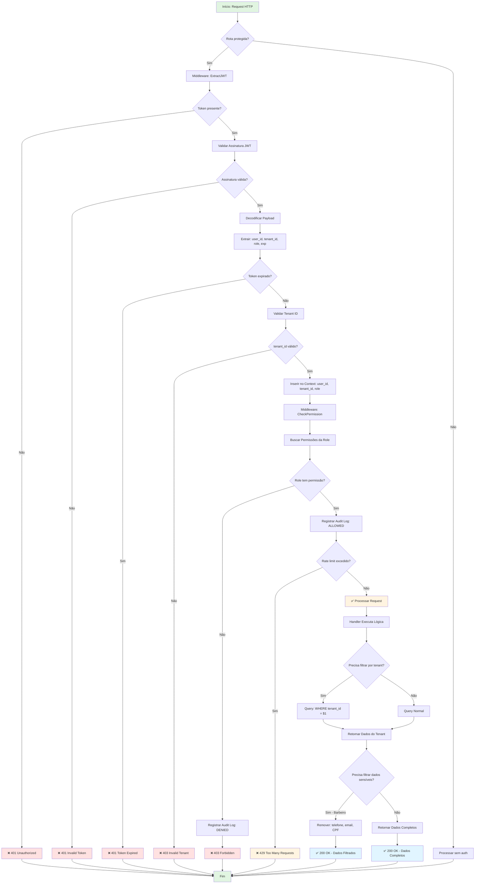

# Fluxo de Permissões (RBAC) — NEXO v1.0

**Versão:** 1.0
**Última Atualização:** 24/11/2025
**Status:** ✅ Implementado (MVP 1.0)
**Responsável:** Tech Lead + Segurança

---

## 📋 Visão Geral

Módulo responsável pelo **controle de acesso baseado em papéis (RBAC - Role-Based Access Control)**, garantindo que cada usuário tenha acesso apenas aos recursos e funcionalidades apropriados ao seu perfil.

**Diferencial:**

- Controle granular por endpoint/recurso
- 5 perfis predefinidos (Owner, Manager, Recepcionista, Barbeiro, Contador)
- Middleware de autenticação JWT RS256
- Auditoria completa de acessos
- Multi-tenant com isolamento garantido
- Privacy by design (barbeiro não vê dados sensíveis)

**Prioridade:** 🟢 ALTA (MVP 1.0 - Módulo Core de Segurança)

---

## 🎯 Objetivos do Fluxo

1. ✅ Autenticar usuário via JWT (RS256)
2. ✅ Identificar papel (role) do usuário
3. ✅ Validar permissões por endpoint
4. ✅ Bloquear acesso não autorizado (403 Forbidden)
5. ✅ Garantir isolamento multi-tenant
6. ✅ Auditar todas tentativas de acesso
7. ✅ Permitir mudança de papel (apenas Owner)
8. ✅ Refresh token para renovação de sessão
9. ✅ Rate limiting por usuário
10. ✅ Logout seguro (invalidação de token)

---

## 🔐 Regras de Negócio (RN)

### RN-RBAC-001: Papéis Disponíveis

Sistema possui **5 papéis fixos**:

1. **Owner (Proprietário)**

   - Acesso total ao tenant
   - Pode criar/editar/deletar tudo
   - Pode gerenciar usuários e permissões
   - Vê todos os dados financeiros/operacionais

2. **Manager (Gerente)**

   - Gerenciar operações diárias
   - Pode criar/editar (mas não deletar)
   - Vê dados de todas unidades atribuídas
   - Sem acesso a audit logs

3. **Recepcionista**

   - Focada em agendamento e atendimento
   - Cria/edita agendamentos
   - Cadastra clientes (dados básicos)
   - Opera lista da vez
   - Vê estoque (somente leitura)

4. **Barbeiro**

   - Vê apenas **próprios dados**
   - Agenda própria
   - Comissões próprias
   - Metas próprias
   - **Não vê** dados sensíveis de clientes

5. **Contador**
   - Acesso **somente leitura** financeiro
   - Vê DRE, fluxo de caixa, receitas/despesas
   - Não pode criar/editar/deletar

### RN-RBAC-002: Autenticação JWT

- ✅ Algoritmo: **RS256** (chave assimétrica)
- ✅ Access Token: validade 15 minutos
- ✅ Refresh Token: validade 7 dias
- ✅ Payload JWT inclui: `user_id`, `tenant_id`, `role`, `exp`, `iat`
- ✅ Chaves privadas armazenadas em variáveis de ambiente
- ❌ **Não** aceitar tokens com algoritmo `none`

### RN-RBAC-003: Validação de Permissões

- ✅ Toda rota protegida tem middleware de validação
- ✅ Middleware extrai `role` do JWT
- ✅ Valida se role tem permissão para o recurso
- ✅ Se não autorizado → HTTP 403 Forbidden
- ✅ Se token inválido/expirado → HTTP 401 Unauthorized

### RN-RBAC-004: Isolamento Multi-Tenant

- ✅ Todo request valida `tenant_id` do JWT
- ✅ Queries sempre filtram por `tenant_id`
- ✅ Usuário **nunca** acessa dados de outro tenant
- ✅ Constraint no banco: todas tabelas têm FK `tenant_id`

### RN-RBAC-005: Matriz de Permissões

**Financeiro:**

| Recurso         | Owner | Manager | Recepcionista | Barbeiro | Contador |
| --------------- | ----- | ------- | ------------- | -------- | -------- |
| Criar Receita   | ✅    | ✅      | ❌            | ❌       | ❌       |
| Ver Receita     | ✅    | ✅      | ❌            | ❌       | ✅       |
| Editar Receita  | ✅    | ✅      | ❌            | ❌       | ❌       |
| Deletar Receita | ✅    | ❌      | ❌            | ❌       | ❌       |
| Criar Despesa   | ✅    | ✅      | ❌            | ❌       | ❌       |
| Ver Despesa     | ✅    | ✅      | ❌            | ❌       | ✅       |
| Ver DRE         | ✅    | ✅      | ❌            | ❌       | ✅       |
| Ver Fluxo Caixa | ✅    | ✅      | ❌            | ❌       | ✅       |

**Agendamento:**

| Recurso              | Owner | Manager | Recepcionista | Barbeiro | Contador |
| -------------------- | ----- | ------- | ------------- | -------- | -------- |
| Criar Agendamento    | ✅    | ✅      | ✅            | ❌       | ❌       |
| Ver Agendamentos     | ✅    | ✅      | ✅            | ✅\*     | ❌       |
| Editar Agendamento   | ✅    | ✅      | ✅            | ❌       | ❌       |
| Cancelar Agendamento | ✅    | ✅      | ✅            | ❌       | ❌       |

\*Barbeiro vê **apenas própria agenda**

**CRM/Clientes:**

| Recurso              | Owner | Manager | Recepcionista | Barbeiro | Contador |
| -------------------- | ----- | ------- | ------------- | -------- | -------- |
| Criar Cliente        | ✅    | ✅      | ✅            | ❌       | ❌       |
| Ver Cliente Completo | ✅    | ✅      | ✅            | ❌\*\*   | ❌       |
| Editar Cliente       | ✅    | ✅      | ✅            | ❌       | ❌       |
| Ver Telefone/Email   | ✅    | ✅      | ✅            | ❌       | ❌       |

\*\*Barbeiro vê apenas: nome + serviços realizados

**Comissões:**

| Recurso                | Owner | Manager | Recepcionista | Barbeiro | Contador |
| ---------------------- | ----- | ------- | ------------- | -------- | -------- |
| Ver Todas Comissões    | ✅    | ✅      | ❌            | ❌       | ❌       |
| Ver Próprias Comissões | ✅    | ✅      | ❌            | ✅       | ❌       |
| Configurar % Comissão  | ✅    | ✅      | ❌            | ❌       | ❌       |
| Marcar Como Paga       | ✅    | ✅      | ❌            | ❌       | ❌       |

**Usuários:**

| Recurso         | Owner | Manager | Recepcionista | Barbeiro | Contador |
| --------------- | ----- | ------- | ------------- | -------- | -------- |
| Criar Usuário   | ✅    | ❌      | ❌            | ❌       | ❌       |
| Ver Usuários    | ✅    | ✅      | ❌            | ❌       | ❌       |
| Editar Usuário  | ✅    | ❌      | ❌            | ❌       | ❌       |
| Deletar Usuário | ✅    | ❌      | ❌            | ❌       | ❌       |
| Mudar Papel     | ✅    | ❌      | ❌            | ❌       | ❌       |

### RN-RBAC-006: Auditoria de Acessos

- ✅ Toda tentativa de acesso negado gera log
- ✅ Audit log registra: `user_id`, `tenant_id`, `resource`, `action`, `resultado`, `timestamp`
- ✅ Logs armazenados em tabela `audit_logs` (retenção 90 dias)
- ✅ Owner pode visualizar audit logs

### RN-RBAC-007: Mudança de Papel

- ✅ **Apenas Owner** pode alterar papel de usuários
- ✅ Não pode alterar próprio papel (prevenir lock-out)
- ✅ Mudança de papel registrada em audit log
- ✅ Novo papel efetivo no próximo login (ou forçar logout)

### RN-RBAC-008: Rate Limiting

- ✅ Limite por usuário: 100 req/min (configurável)
- ✅ Limite de login: 5 tentativas/5min
- ✅ Bloqueio temporário após exceder limite (15min)
- ✅ Retorna HTTP 429 Too Many Requests

---

## 📊 Diagrama de Fluxo (Mermaid)



---

## 🏗️ Arquitetura (Clean Architecture)

### Domain Layer

**1. Entity: User (com Role)**

```go
// backend/internal/domain/entity/user.go
package entity

import (
    "time"
    "github.com/google/uuid"
)

type Role string

const (
    RoleOwner         Role = "owner"
    RoleManager       Role = "manager"
    RoleRecepcionista Role = "recepcionista"
    RoleBarbeiro      Role = "barbeiro"
    RoleContador      Role = "contador"
)

type User struct {
    ID           uuid.UUID
    TenantID     uuid.UUID
    Email        string
    PasswordHash string
    Nome         string
    Role         Role
    Ativo        bool
    UltimoLogin  *time.Time
    CreatedAt    time.Time
    UpdatedAt    time.Time
}

// HasPermission - Verifica se role tem permissão
func (u *User) HasPermission(permission Permission) bool {
    permissions := RolePermissions[u.Role]
    for _, p := range permissions {
        if p == permission {
            return true
        }
    }
    return false
}

// IsOwner
func (u *User) IsOwner() bool {
    return u.Role == RoleOwner
}

// IsManager
func (u *User) IsManager() bool {
    return u.Role == RoleManager
}

// CanAccessResource - Validação genérica
func (u *User) CanAccessResource(resource string, action string) bool {
    permission := Permission(resource + ":" + action)
    return u.HasPermission(permission)
}
```

**2. Value Object: Permission**

```go
// backend/internal/domain/valueobject/permission.go
package valueobject

type Permission string

const (
    // Financeiro
    PermissionReceitaCreate Permission = "receita:create"
    PermissionReceitaRead   Permission = "receita:read"
    PermissionReceitaUpdate Permission = "receita:update"
    PermissionReceitaDelete Permission = "receita:delete"

    PermissionDespesaCreate Permission = "despesa:create"
    PermissionDespesaRead   Permission = "despesa:read"
    PermissionDespesaUpdate Permission = "despesa:update"
    PermissionDespesaDelete Permission = "despesa:delete"

    PermissionCashflowRead  Permission = "cashflow:read"

    // Agendamento
    PermissionAgendamentoCreate Permission = "agendamento:create"
    PermissionAgendamentoRead   Permission = "agendamento:read"
    PermissionAgendamentoUpdate Permission = "agendamento:update"
    PermissionAgendamentoDelete Permission = "agendamento:delete"

    // CRM
    PermissionClienteCreate Permission = "cliente:create"
    PermissionClienteRead   Permission = "cliente:read"
    PermissionClienteUpdate Permission = "cliente:update"
    PermissionClienteDelete Permission = "cliente:delete"

    // Comissões
    PermissionComissaoReadAll Permission = "comissao:read_all"
    PermissionComissaoReadOwn Permission = "comissao:read_own"
    PermissionComissaoConfig  Permission = "comissao:config"
    PermissionComissaoPagar   Permission = "comissao:pagar"

    // Usuários
    PermissionUserCreate Permission = "user:create"
    PermissionUserRead   Permission = "user:read"
    PermissionUserUpdate Permission = "user:update"
    PermissionUserDelete Permission = "user:delete"

    // Admin
    PermissionAuditLogRead Permission = "audit_log:read"
)

// RolePermissions - Matriz de permissões por role
var RolePermissions = map[entity.Role][]Permission{
    entity.RoleOwner: {
        // Financeiro (CRUD completo)
        PermissionReceitaCreate, PermissionReceitaRead, PermissionReceitaUpdate, PermissionReceitaDelete,
        PermissionDespesaCreate, PermissionDespesaRead, PermissionDespesaUpdate, PermissionDespesaDelete,
        PermissionCashflowRead,

        // Agendamento (CRUD completo)
        PermissionAgendamentoCreate, PermissionAgendamentoRead, PermissionAgendamentoUpdate, PermissionAgendamentoDelete,

        // CRM (CRUD completo)
        PermissionClienteCreate, PermissionClienteRead, PermissionClienteUpdate, PermissionClienteDelete,

        // Comissões (CRUD completo)
        PermissionComissaoReadAll, PermissionComissaoConfig, PermissionComissaoPagar,

        // Usuários (CRUD completo)
        PermissionUserCreate, PermissionUserRead, PermissionUserUpdate, PermissionUserDelete,

        // Admin
        PermissionAuditLogRead,
    },

    entity.RoleManager: {
        // Financeiro (sem delete)
        PermissionReceitaCreate, PermissionReceitaRead, PermissionReceitaUpdate,
        PermissionDespesaCreate, PermissionDespesaRead, PermissionDespesaUpdate,
        PermissionCashflowRead,

        // Agendamento (sem delete)
        PermissionAgendamentoCreate, PermissionAgendamentoRead, PermissionAgendamentoUpdate,

        // CRM (sem delete)
        PermissionClienteCreate, PermissionClienteRead, PermissionClienteUpdate,

        // Comissões (sem delete)
        PermissionComissaoReadAll, PermissionComissaoConfig, PermissionComissaoPagar,

        // Usuários (apenas leitura)
        PermissionUserRead,
    },

    entity.RoleRecepcionista: {
        // Agendamento (CRUD completo)
        PermissionAgendamentoCreate, PermissionAgendamentoRead, PermissionAgendamentoUpdate, PermissionAgendamentoDelete,

        // CRM (CRUD completo)
        PermissionClienteCreate, PermissionClienteRead, PermissionClienteUpdate, PermissionClienteDelete,
    },

    entity.RoleBarbeiro: {
        // Agendamento (apenas ler própria agenda)
        PermissionAgendamentoRead, // Filtrado por barbeiro_id

        // Comissões (apenas próprias)
        PermissionComissaoReadOwn,
    },

    entity.RoleContador: {
        // Financeiro (somente leitura)
        PermissionReceitaRead, PermissionDespesaRead, PermissionCashflowRead,
    },
}
```

**3. Entity: AuditLog**

```go
// backend/internal/domain/entity/audit_log.go
package entity

type AuditAction string

const (
    AuditActionCreate AuditAction = "CREATE"
    AuditActionRead   AuditAction = "READ"
    AuditActionUpdate AuditAction = "UPDATE"
    AuditActionDelete AuditAction = "DELETE"
    AuditActionLogin  AuditAction = "LOGIN"
    AuditActionLogout AuditAction = "LOGOUT"
)

type AuditResult string

const (
    AuditResultAllowed AuditResult = "ALLOWED"
    AuditResultDenied  AuditResult = "DENIED"
)

type AuditLog struct {
    ID         uuid.UUID
    TenantID   uuid.UUID
    UserID     uuid.UUID
    Action     AuditAction
    Resource   string // "receita", "despesa", "user"
    ResourceID *uuid.UUID
    Result     AuditResult
    IPAddress  string
    UserAgent  string
    CreatedAt  time.Time
}

func NewAuditLog(
    tenantID, userID uuid.UUID,
    action AuditAction,
    resource string,
    result AuditResult,
    ipAddress, userAgent string,
) *AuditLog {
    return &AuditLog{
        ID:        uuid.New(),
        TenantID:  tenantID,
        UserID:    userID,
        Action:    action,
        Resource:  resource,
        Result:    result,
        IPAddress: ipAddress,
        UserAgent: userAgent,
        CreatedAt: time.Now(),
    }
}
```

---

### Infrastructure Layer (Middleware)

**1. Middleware: ExtractJWT**

```go
// backend/internal/infra/http/middleware/auth_middleware.go
package middleware

import (
    "context"
    "net/http"
    "strings"
    "github.com/golang-jwt/jwt/v5"
)

type contextKey string

const (
    UserIDKey   contextKey = "user_id"
    TenantIDKey contextKey = "tenant_id"
    RoleKey     contextKey = "role"
)

func ExtractJWT(jwtSecret string) func(http.Handler) http.Handler {
    return func(next http.Handler) http.Handler {
        return http.HandlerFunc(func(w http.ResponseWriter, r *http.Request) {
            // 1. Extrair token do header Authorization
            authHeader := r.Header.Get("Authorization")
            if authHeader == "" {
                http.Error(w, "Missing authorization header", http.StatusUnauthorized)
                return
            }

            tokenString := strings.TrimPrefix(authHeader, "Bearer ")

            // 2. Validar e decodificar JWT
            token, err := jwt.Parse(tokenString, func(token *jwt.Token) (interface{}, error) {
                // Validar algoritmo
                if _, ok := token.Method.(*jwt.SigningMethodRSA); !ok {
                    return nil, fmt.Errorf("unexpected signing method: %v", token.Header["alg"])
                }
                return jwtSecret, nil
            })

            if err != nil || !token.Valid {
                http.Error(w, "Invalid token", http.StatusUnauthorized)
                return
            }

            // 3. Extrair claims
            claims, ok := token.Claims.(jwt.MapClaims)
            if !ok {
                http.Error(w, "Invalid token claims", http.StatusUnauthorized)
                return
            }

            userID := claims["user_id"].(string)
            tenantID := claims["tenant_id"].(string)
            role := claims["role"].(string)

            // 4. Inserir no contexto
            ctx := context.WithValue(r.Context(), UserIDKey, userID)
            ctx = context.WithValue(ctx, TenantIDKey, tenantID)
            ctx = context.WithValue(ctx, RoleKey, role)

            // 5. Passar para próximo handler
            next.ServeHTTP(w, r.WithContext(ctx))
        })
    }
}

// GetUserIDFromContext
func GetUserIDFromContext(ctx context.Context) (uuid.UUID, error) {
    userID, ok := ctx.Value(UserIDKey).(string)
    if !ok {
        return uuid.Nil, fmt.Errorf("user_id not found in context")
    }
    return uuid.Parse(userID)
}

// GetTenantIDFromContext
func GetTenantIDFromContext(ctx context.Context) (uuid.UUID, error) {
    tenantID, ok := ctx.Value(TenantIDKey).(string)
    if !ok {
        return uuid.Nil, fmt.Errorf("tenant_id not found in context")
    }
    return uuid.Parse(tenantID)
}

// GetRoleFromContext
func GetRoleFromContext(ctx context.Context) (entity.Role, error) {
    role, ok := ctx.Value(RoleKey).(string)
    if !ok {
        return "", fmt.Errorf("role not found in context")
    }
    return entity.Role(role), nil
}
```

**2. Middleware: RequirePermission**

```go
// backend/internal/infra/http/middleware/permission_middleware.go
package middleware

func RequirePermission(permission valueobject.Permission) func(http.Handler) http.Handler {
    return func(next http.Handler) http.Handler {
        return http.HandlerFunc(func(w http.ResponseWriter, r *http.Request) {
            ctx := r.Context()

            // 1. Buscar role do contexto
            role, err := GetRoleFromContext(ctx)
            if err != nil {
                http.Error(w, "Unauthorized", http.StatusUnauthorized)
                return
            }

            // 2. Validar permissão
            permissions := valueobject.RolePermissions[role]
            hasPermission := false
            for _, p := range permissions {
                if p == permission {
                    hasPermission = true
                    break
                }
            }

            if !hasPermission {
                // Registrar audit log: DENIED
                userID, _ := GetUserIDFromContext(ctx)
                tenantID, _ := GetTenantIDFromContext(ctx)

                auditLog := entity.NewAuditLog(
                    tenantID, userID,
                    entity.AuditActionRead,
                    string(permission),
                    entity.AuditResultDenied,
                    r.RemoteAddr,
                    r.UserAgent(),
                )

                // TODO: Persistir audit log (async)

                http.Error(w, "Forbidden: insufficient permissions", http.StatusForbidden)
                return
            }

            // 3. Permitir acesso
            next.ServeHTTP(w, r)
        })
    }
}
```

**3. Middleware: RequireRole**

```go
func RequireRole(allowedRoles ...entity.Role) func(http.Handler) http.Handler {
    return func(next http.Handler) http.Handler {
        return http.HandlerFunc(func(w http.ResponseWriter, r *http.Request) {
            ctx := r.Context()

            role, err := GetRoleFromContext(ctx)
            if err != nil {
                http.Error(w, "Unauthorized", http.StatusUnauthorized)
                return
            }

            allowed := false
            for _, allowedRole := range allowedRoles {
                if role == allowedRole {
                    allowed = true
                    break
                }
            }

            if !allowed {
                http.Error(w, "Forbidden", http.StatusForbidden)
                return
            }

            next.ServeHTTP(w, r)
        })
    }
}
```

---

## 🌐 Uso nos Endpoints

### Exemplo 1: Endpoint Protegido por Permissão

```go
// Apenas usuários com permissão de deletar receitas
r.Route("/receitas", func(r chi.Router) {
    r.Use(middleware.ExtractJWT(jwtSecret))

    r.Get("/", receitaHandler.List)
    r.Post("/", receitaHandler.Create)

    // DELETE protegido por permissão específica
    r.With(middleware.RequirePermission(valueobject.PermissionReceitaDelete)).
        Delete("/{id}", receitaHandler.Delete)
})
```

### Exemplo 2: Endpoint Protegido por Role

```go
// Apenas Owner pode criar usuários
r.Route("/users", func(r chi.Router) {
    r.Use(middleware.ExtractJWT(jwtSecret))

    r.Get("/", userHandler.List) // Owner e Manager

    // POST protegido apenas para Owner
    r.With(middleware.RequireRole(entity.RoleOwner)).
        Post("/", userHandler.Create)
})
```

### Exemplo 3: Filtro por Tenant + Role

```go
// Handler: Listar Comissões
func (h *ComissaoHandler) List(w http.ResponseWriter, r *http.Request) {
    ctx := r.Context()

    tenantID, _ := middleware.GetTenantIDFromContext(ctx)
    userID, _ := middleware.GetUserIDFromContext(ctx)
    role, _ := middleware.GetRoleFromContext(ctx)

    // RN-RBAC-005: Barbeiro vê apenas próprias comissões
    if role == entity.RoleBarbeiro {
        comissoes, err := h.useCase.ListByBarbeiro(ctx, tenantID, userID)
        // ...
    } else {
        // Owner/Manager veem todas
        comissoes, err := h.useCase.ListAll(ctx, tenantID)
        // ...
    }
}
```

---

## 📊 Modelo de Dados (SQL)

```sql
-- Tabela: users (já existente, com coluna role)
ALTER TABLE users ADD COLUMN IF NOT EXISTS role VARCHAR(50) NOT NULL DEFAULT 'barbeiro';
ALTER TABLE users ADD CONSTRAINT users_role_check CHECK (role IN ('owner', 'manager', 'recepcionista', 'barbeiro', 'contador'));

CREATE INDEX idx_users_role ON users(tenant_id, role);

-- Tabela: audit_logs
CREATE TABLE IF NOT EXISTS audit_logs (
    id UUID PRIMARY KEY DEFAULT gen_random_uuid(),
    tenant_id UUID NOT NULL REFERENCES tenants(id) ON DELETE CASCADE,
    user_id UUID NOT NULL REFERENCES users(id) ON DELETE CASCADE,

    action VARCHAR(50) NOT NULL CHECK (action IN ('CREATE', 'READ', 'UPDATE', 'DELETE', 'LOGIN', 'LOGOUT')),
    resource VARCHAR(100) NOT NULL,
    resource_id UUID,
    result VARCHAR(20) NOT NULL CHECK (result IN ('ALLOWED', 'DENIED')),

    ip_address VARCHAR(45),
    user_agent TEXT,

    created_at TIMESTAMP NOT NULL DEFAULT NOW()
);

CREATE INDEX idx_audit_logs_tenant ON audit_logs(tenant_id, created_at DESC);
CREATE INDEX idx_audit_logs_user ON audit_logs(user_id, created_at DESC);
CREATE INDEX idx_audit_logs_result ON audit_logs(tenant_id, result) WHERE result = 'DENIED';

-- Retenção: deletar logs > 90 dias (cron)
-- DELETE FROM audit_logs WHERE created_at < NOW() - INTERVAL '90 days';
```

---

## 🔄 Fluxos Alternativos

### FA-01: Token Expirado

**Cenário:** Access token expirou (15 min).

**Ação:**

1. Middleware retorna HTTP 401 Token Expired
2. Frontend intercepta erro
3. Chama endpoint `/auth/refresh` com refresh token
4. Backend valida refresh token (7 dias)
5. Gera novo access token
6. Frontend reexecuta request original

---

### FA-02: Tentativa de Acesso Negado

**Cenário:** Contador tenta criar receita.

**Ação:**

1. Middleware `RequirePermission(PermissionReceitaCreate)`
2. Valida: `RoleContador` não tem permissão
3. Registra audit log: `action=CREATE, resource=receita, result=DENIED`
4. Retorna HTTP 403 Forbidden
5. Frontend exibe: "Você não tem permissão para esta ação"

---

### FA-03: Barbeiro Tenta Acessar Dados Sensíveis

**Cenário:** Barbeiro acessa endpoint `/clientes/:id`.

**Ação:**

1. Middleware valida: `RoleBarbeiro` tem `PermissionClienteRead`
2. Handler verifica role no contexto
3. Se `role == barbeiro` → filtrar dados:
   - Retornar apenas: `nome`, `servicos_realizados`
   - Remover: `telefone`, `email`, `cpf`, `endereco`
4. Retorna HTTP 200 com dados filtrados

---

### FA-04: Owner Muda Papel de Usuário

**Cenário:** Owner altera barbeiro para gerente.

**Ação:**

1. Endpoint: `PUT /users/:id/role`
2. Middleware valida: `RequireRole(RoleOwner)`
3. Use case valida:
   - `user_id` != `current_user_id` (não pode mudar próprio papel)
   - Novo role é válido
4. Atualiza `users.role`
5. Registra audit log: `action=UPDATE, resource=user_role, result=ALLOWED`
6. Força logout do usuário afetado (invalidar tokens)

---

### FA-05: Rate Limit Excedido

**Cenário:** Usuário faz 120 req/min (limite: 100).

**Ação:**

1. Middleware de rate limit conta requests por `user_id`
2. Ao exceder 100 req/min → bloquear por 15 min
3. Retornar HTTP 429 Too Many Requests
4. Header: `Retry-After: 900` (15 min em segundos)
5. Registrar audit log: `action=RATE_LIMIT_EXCEEDED`

---

## ✅ Critérios de Aceitação

### Backend

- [x] Middleware `ExtractJWT` implementado e testado
- [x] Middleware `RequirePermission` implementado
- [x] Middleware `RequireRole` implementado
- [x] Matriz de permissões `RolePermissions` completa
- [x] Entity `AuditLog` criada
- [x] Repositório `AuditLogRepository` (CRUD)
- [x] Endpoints `/auth/login`, `/auth/refresh`, `/auth/logout`
- [x] Rate limiting por usuário (100 req/min)
- [x] Testes unitários para validação de permissões (coverage > 90%)
- [x] Testes E2E para 403 Forbidden

### Frontend

- [ ] Interceptor Axios para renovação automática de token
- [ ] Armazenamento seguro de tokens (httpOnly cookies ou localStorage)
- [ ] Logout automático ao receber 401
- [ ] Mensagens de erro amigáveis para 403
- [ ] Componentes condicionais por role (ex: botão "Deletar" só para Owner)

### Segurança

- [ ] JWT RS256 (nunca aceitar `none`)
- [ ] Chaves privadas em variáveis de ambiente
- [ ] HTTPS obrigatório em produção
- [ ] Audit logs armazenados por 90 dias
- [ ] Rate limiting ativo em todas rotas

---

## 📈 Métricas de Sucesso

1. **Segurança:** 0 acessos não autorizados em produção
2. **Auditoria:** 100% das tentativas de acesso negado registradas
3. **Performance:** Validação de permissão < 5ms
4. **Confiabilidade:** 99.9% de uptime do serviço de autenticação
5. **Compliance:** 100% de conformidade com LGPD (audit logs)

---

## 🔗 Referências

- [RBAC.md](../06-seguranca/RBAC.md) - Especificação completa de RBAC
- [ARQUITETURA_SEGURANCA.md](../06-seguranca/ARQUITETURA_SEGURANCA.md) - JWT RS256
- [COMPLIANCE_LGPD.md](../06-seguranca/COMPLIANCE_LGPD.md) - Privacidade de dados
- [FLUXO_CRM.md](./FLUXO_CRM.md) - Filtro de dados sensíveis para barbeiro
- [FLUXO_COMISSOES.md](./FLUXO_COMISSOES.md) - Permissões de comissões
- [PRD-NEXO.md](../../PRD-NEXO.md) - Seção 2.2 (Níveis de Acesso)

---

**Status:** ✅ Implementado (MVP 1.0)
**Prioridade:** ALTA (Módulo Core de Segurança)
**Dependências:** Nenhuma (módulo fundamental)
