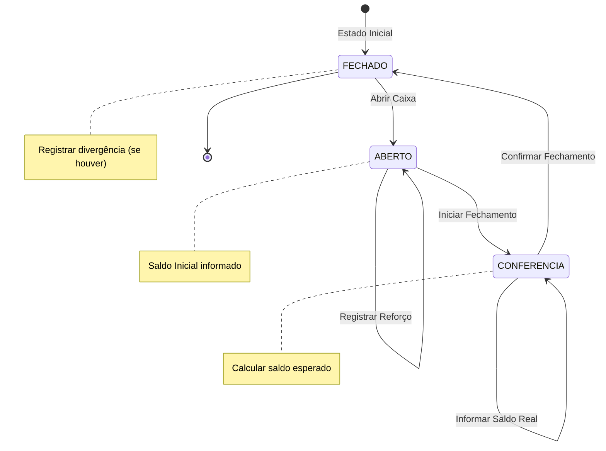
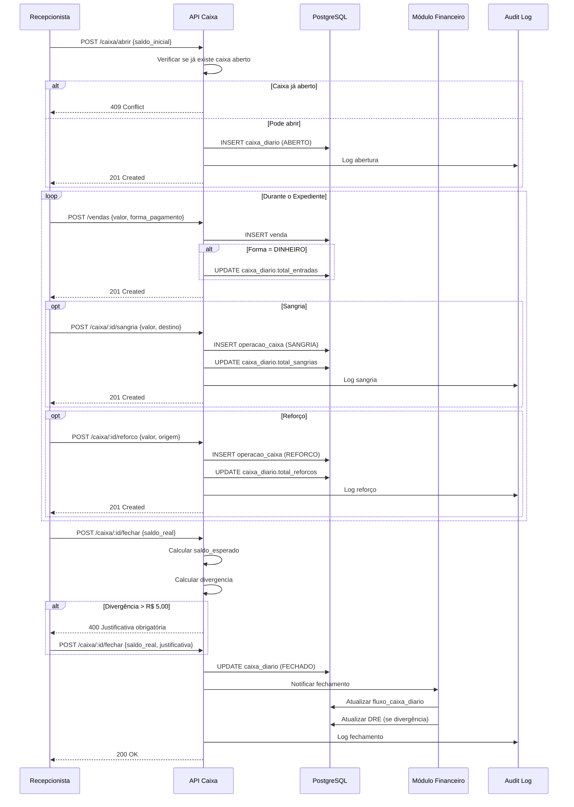
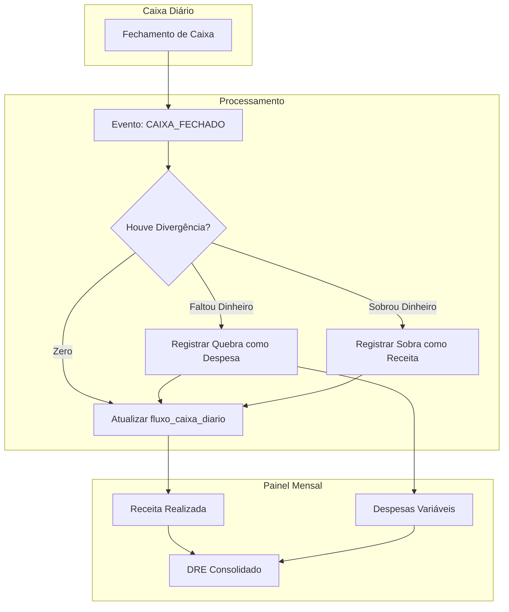

# Fluxo de Caixa Diário — NEXO v3.0

**Versão:** 3.0  
**Última Atualização:** 28/11/2025  
**Status:** 🟡 **EM DESENVOLVIMENTO**  
**Responsável:** Tech Lead + Produto  
**PRD Referência:** `Tarefas/03-FINANCEIRO/PRD_FINANCEIRO.md`

---

## 📋 Sumário Executivo

O Caixa Diário é o **ponto operacional** onde acontece o controle físico de numerário (gaveta de dinheiro). Ele é uma das **fontes de dados** que alimentam o Painel Mensal e o DRE.

### 🔄 Relação com Outros Módulos

```
┌──────────────────────────────────────────────────────────────────┐
│                       MÓDULO FINANCEIRO                          │
├──────────────────────────────────────────────────────────────────┤
│                                                                  │
│   ┌─────────────┐    ┌─────────────┐    ┌─────────────┐         │
│   │   Caixa     │    │  Contas a   │    │ Assinaturas │         │
│   │   Diário    │    │   Pagar     │    │ Recorrentes │         │
│   │  (Gaveta)   │    │  (Boletos)  │    │   (MRR)     │         │
│   └──────┬──────┘    └──────┬──────┘    └──────┬──────┘         │
│          │                  │                  │                 │
│          └──────────────────┼──────────────────┘                 │
│                             ▼                                    │
│                  ┌─────────────────────┐                         │
│                  │   Fluxo de Caixa    │                         │
│                  │      Diário         │                         │
│                  └──────────┬──────────┘                         │
│                             ▼                                    │
│                  ┌─────────────────────┐                         │
│                  │    DRE Mensal       │                         │
│                  └──────────┬──────────┘                         │
│                             ▼                                    │
│                  ┌─────────────────────┐                         │
│                  │   Painel Mensal     │◄── Despesas Fixas       │
│                  │   (Dashboard)       │◄── Projeções            │
│                  └─────────────────────┘                         │
│                                                                  │
└──────────────────────────────────────────────────────────────────┘
```

### 📍 Diferença Crucial

| Componente | Foco | Escopo |
|------------|------|--------|
| **Caixa Diário** (este fluxo) | Operacional | Abertura, Sangria, Reforço, Fechamento |
| **Painel Mensal** (FLUXO_FINANCEIRO) | Estratégico | Lucro, Metas, Projeções |

---

## 🎯 Objetivos do Fluxo

1. **Segurança:** Garantir que todo dinheiro seja contabilizado.
2. **Rastreabilidade:** Saber quem abriu, quem movimentou e quem fechou.
3. **Alimentação:** Enviar dados de vendas realizadas para o DRE/Painel.
4. **Controle de Quebras:** Identificar e justificar divergências.
5. **Auditoria:** Log completo de todas as operações.

---

## 🔐 Regras de Negócio (RN)

### RN-CAI-001: Ciclo de Vida do Caixa

| Regra | Descrição | Criticidade |
|-------|-----------|-------------|
| Abertura Única | Somente 1 caixa aberto por vez por unidade | 🔴 Crítica |
| Saldo Inicial | Deve informar saldo de abertura (conferência) | 🔴 Crítica |
| Vendas Bloqueadas | Não é possível vender em dinheiro sem caixa aberto | 🔴 Crítica |
| Fechamento Irreversível | Após fechado, não pode ser reaberto | 🔴 Crítica |
| Operador Registrado | Quem abriu/fechou fica registrado | 🔴 Crítica |

### RN-CAI-002: Sangrias (Retiradas)

| Regra | Descrição | Criticidade |
|-------|-----------|-------------|
| Destino Obrigatório | Sangria deve ter destino claro | 🔴 Crítica |
| Justificativa | Motivo obrigatório para toda sangria | 🔴 Crítica |
| Impacto Financeiro | Depósito → previsão bancária; Pagamento → vincula despesa | 🟡 Média |
| Limite de Valor | Sangrias > R$ 500 exigem aprovação de gerente | 🟡 Média |

### RN-CAI-003: Reforços (Adições)

| Regra | Descrição | Criticidade |
|-------|-----------|-------------|
| Origem Obrigatória | Reforço deve ter origem clara | 🔴 Crítica |
| Justificativa | Motivo obrigatório para todo reforço | 🔴 Crítica |
| Tipos Válidos | Troco, Capital de Giro, Transferência Interna | 🟡 Média |

### RN-CAI-004: Fechamento e Divergências

| Regra | Descrição | Criticidade |
|-------|-----------|-------------|
| Saldo Esperado | Sistema calcula: `Inicial + Vendas - Sangrias + Reforços` | 🔴 Crítica |
| Saldo Real | Usuário informa (contagem física) | 🔴 Crítica |
| Divergência | Se `Real ≠ Esperado`, exige justificativa | 🔴 Crítica |
| Tolerância | Divergência ≤ R$ 5,00 não exige justificativa | 🟡 Média |
| Registro DRE | Quebra → Despesa; Sobra → Receita Outros | 🔴 Crítica |

### RN-CAI-005: Permissões (RBAC)

| Papel | Abrir | Operar | Sangria | Fechar | Histórico |
|-------|:-----:|:------:|:-------:|:------:|:---------:|
| Dono | ✅ | ✅ | ✅ | ✅ | ✅ |
| Gerente | ✅ | ✅ | ✅ | ✅ | ✅ |
| Recepção | ✅ | ✅ | 🟡* | ✅ | 🟡 |
| Barbeiro | ❌ | ❌ | ❌ | ❌ | ❌ |
| Contador | ❌ | ❌ | ❌ | ❌ | ✅ |

*Recepção pode fazer sangrias até R$ 200,00

---

## 📊 Diagramas de Fluxo

### 1. Fluxo Principal: Ciclo do Caixa



### 2. Fluxo Operacional Detalhado



### 3. Integração com Painel Mensal



---

## 🛠️ Detalhamento Técnico (Backend)

### 1. Modelo de Dados: `caixa_diario`

```sql
CREATE TABLE caixa_diario (
    id UUID PRIMARY KEY DEFAULT gen_random_uuid(),
    tenant_id UUID NOT NULL REFERENCES tenants(id) ON DELETE CASCADE,
    unidade_id UUID REFERENCES units(id) ON DELETE SET NULL,
    
    -- Operadores
    usuario_abertura_id UUID NOT NULL REFERENCES users(id),
    usuario_fechamento_id UUID REFERENCES users(id),
    
    -- Timestamps
    data_abertura TIMESTAMP NOT NULL DEFAULT NOW(),
    data_fechamento TIMESTAMP,
    
    -- Valores
    saldo_inicial DECIMAL(15,2) NOT NULL CHECK (saldo_inicial >= 0),
    total_entradas DECIMAL(15,2) DEFAULT 0,
    total_saidas DECIMAL(15,2) DEFAULT 0,
    total_sangrias DECIMAL(15,2) DEFAULT 0,
    total_reforcos DECIMAL(15,2) DEFAULT 0,
    saldo_esperado DECIMAL(15,2) GENERATED ALWAYS AS (
        saldo_inicial + total_entradas - total_saidas - total_sangrias + total_reforcos
    ) STORED,
    saldo_real DECIMAL(15,2),
    divergencia DECIMAL(15,2),
    
    -- Status
    status VARCHAR(20) NOT NULL DEFAULT 'ABERTO' CHECK (status IN ('ABERTO', 'FECHADO')),
    justificativa_divergencia TEXT,
    
    -- Auditoria
    created_at TIMESTAMP DEFAULT NOW(),
    updated_at TIMESTAMP DEFAULT NOW()
);

-- Índices
CREATE INDEX idx_caixa_tenant_status ON caixa_diario(tenant_id, status);
CREATE INDEX idx_caixa_tenant_data ON caixa_diario(tenant_id, DATE(data_abertura) DESC);
CREATE UNIQUE INDEX idx_caixa_aberto_unico ON caixa_diario(tenant_id, unidade_id)
    WHERE status = 'ABERTO';

-- RLS
ALTER TABLE caixa_diario ENABLE ROW LEVEL SECURITY;
CREATE POLICY caixa_tenant_isolation ON caixa_diario
    USING (tenant_id = current_setting('app.current_tenant')::uuid);
```

### 2. Modelo de Dados: `operacoes_caixa`

```sql
CREATE TABLE operacoes_caixa (
    id UUID PRIMARY KEY DEFAULT gen_random_uuid(),
    caixa_id UUID NOT NULL REFERENCES caixa_diario(id) ON DELETE CASCADE,
    tenant_id UUID NOT NULL REFERENCES tenants(id) ON DELETE CASCADE,
    
    -- Tipo e Valor
    tipo VARCHAR(20) NOT NULL CHECK (tipo IN ('VENDA', 'SANGRIA', 'REFORCO', 'DESPESA')),
    valor DECIMAL(15,2) NOT NULL CHECK (valor > 0),
    
    -- Detalhes
    descricao TEXT NOT NULL,
    destino VARCHAR(100), -- Para sangrias: DEPOSITO, PAGAMENTO, COFRE
    origem VARCHAR(100),  -- Para reforços: TROCO, CAPITAL_GIRO, TRANSFERENCIA
    
    -- Operador
    usuario_id UUID NOT NULL REFERENCES users(id),
    
    -- Auditoria
    created_at TIMESTAMP DEFAULT NOW()
);

-- Índices
CREATE INDEX idx_operacoes_caixa_id ON operacoes_caixa(caixa_id);
CREATE INDEX idx_operacoes_tenant_tipo ON operacoes_caixa(tenant_id, tipo);
```

### 3. DTOs (Conforme Padrão NEXO)

```go
// internal/application/dto/caixa_dto.go

// Request - Abrir Caixa
type AbrirCaixaRequest struct {
    SaldoInicial string `json:"saldo_inicial" validate:"required"` // Money como string
    UnidadeID    string `json:"unidade_id,omitempty"`
}

// Request - Registrar Sangria
type SangriaRequest struct {
    Valor       string `json:"valor" validate:"required"`
    Destino     string `json:"destino" validate:"required,oneof=DEPOSITO PAGAMENTO COFRE OUTROS"`
    Descricao   string `json:"descricao" validate:"required,min=5"`
}

// Request - Registrar Reforço
type ReforcoRequest struct {
    Valor     string `json:"valor" validate:"required"`
    Origem    string `json:"origem" validate:"required,oneof=TROCO CAPITAL_GIRO TRANSFERENCIA OUTROS"`
    Descricao string `json:"descricao" validate:"required,min=5"`
}

// Request - Fechar Caixa
type FecharCaixaRequest struct {
    SaldoReal              string `json:"saldo_real" validate:"required"`
    JustificativaDivergencia string `json:"justificativa_divergencia,omitempty"`
}

// Response - Caixa Diário
type CaixaDiarioResponse struct {
    ID                string `json:"id"`
    Status            string `json:"status"`
    SaldoInicial      string `json:"saldo_inicial"`
    TotalEntradas     string `json:"total_entradas"`
    TotalSangrias     string `json:"total_sangrias"`
    TotalReforcos     string `json:"total_reforcos"`
    SaldoEsperado     string `json:"saldo_esperado"`
    SaldoReal         string `json:"saldo_real,omitempty"`
    Divergencia       string `json:"divergencia,omitempty"`
    DataAbertura      string `json:"data_abertura"`
    DataFechamento    string `json:"data_fechamento,omitempty"`
    UsuarioAbertura   string `json:"usuario_abertura"`
    UsuarioFechamento string `json:"usuario_fechamento,omitempty"`
}

// Response - Lista de Operações
type OperacaoCaixaResponse struct {
    ID        string `json:"id"`
    Tipo      string `json:"tipo"`
    Valor     string `json:"valor"`
    Descricao string `json:"descricao"`
    Destino   string `json:"destino,omitempty"`
    Origem    string `json:"origem,omitempty"`
    Usuario   string `json:"usuario"`
    CriadoEm  string `json:"criado_em"`
}
```

### 4. Endpoints da API

| Método | Endpoint | Descrição |
|--------|----------|-----------|
| `POST` | `/api/v1/caixa/abrir` | Abrir caixa do dia |
| `GET` | `/api/v1/caixa/aberto` | Buscar caixa aberto (hoje) |
| `GET` | `/api/v1/caixa/:id` | Detalhes do caixa |
| `POST` | `/api/v1/caixa/:id/sangria` | Registrar sangria |
| `POST` | `/api/v1/caixa/:id/reforco` | Registrar reforço |
| `POST` | `/api/v1/caixa/:id/fechar` | Fechar caixa |
| `GET` | `/api/v1/caixa/:id/operacoes` | Listar operações do caixa |
| `GET` | `/api/v1/caixa/historico` | Histórico de caixas fechados |

### 5. Use Case: Fechar Caixa (com integração)

```go
// internal/application/usecase/caixa/fechar_caixa.go

func (uc *FecharCaixaUseCase) Execute(
    ctx context.Context,
    tenantID, userID, caixaID string,
    req *dto.FecharCaixaRequest,
) (*dto.FecharCaixaResponse, error) {
    // 1. Buscar caixa
    caixa, err := uc.caixaRepo.FindByID(ctx, tenantID, caixaID)
    if err != nil {
        return nil, ErrCaixaNotFound
    }
    
    if caixa.Status != domain.StatusAberto {
        return nil, ErrCaixaJaFechado
    }
    
    // 2. Calcular saldo esperado (já é campo computado, mas recalcular para segurança)
    saldoEsperado := caixa.SaldoInicial.
        Add(caixa.TotalEntradas).
        Sub(caixa.TotalSangrias).
        Add(caixa.TotalReforcos)
    
    // 3. Calcular divergência
    saldoReal, _ := domain.NewMoney(req.SaldoReal)
    divergencia := saldoReal.Sub(saldoEsperado)
    
    // 4. Validar justificativa
    if divergencia.Abs().GreaterThan(domain.NewMoney("5.00")) {
        if req.JustificativaDivergencia == "" {
            return nil, ErrJustificativaObrigatoria
        }
    }
    
    // 5. Atualizar caixa
    caixa.Status = domain.StatusFechado
    caixa.SaldoReal = saldoReal
    caixa.Divergencia = divergencia
    caixa.JustificativaDivergencia = req.JustificativaDivergencia
    caixa.UsuarioFechamentoID = userID
    caixa.DataFechamento = time.Now()
    
    if err := uc.caixaRepo.Update(ctx, tenantID, caixa); err != nil {
        return nil, err
    }
    
    // 6. Registrar divergência no financeiro (se houver)
    if !divergencia.IsZero() {
        if divergencia.IsNegative() {
            // Faltou dinheiro → Registrar como despesa (Quebra de Caixa)
            uc.financeiroSvc.RegistrarDespesa(ctx, tenantID, &RegistrarDespesaInput{
                Descricao: "Quebra de Caixa - " + time.Now().Format("02/01/2006"),
                Valor:     divergencia.Abs(),
                Categoria: "QUEBRA_CAIXA",
            })
        } else {
            // Sobrou dinheiro → Registrar como receita (Sobra de Caixa)
            uc.financeiroSvc.RegistrarReceita(ctx, tenantID, &RegistrarReceitaInput{
                Descricao: "Sobra de Caixa - " + time.Now().Format("02/01/2006"),
                Valor:     divergencia,
                Categoria: "SOBRA_CAIXA",
            })
        }
    }
    
    // 7. Atualizar fluxo de caixa diário
    uc.fluxoCaixaSvc.AtualizarDia(ctx, tenantID, time.Now(), caixa)
    
    // 8. Audit log
    uc.auditLog.Record(ctx, audit.Event{
        TenantID: tenantID,
        UserID:   userID,
        Action:   "CAIXA_FECHADO",
        EntityID: caixaID,
        Metadata: map[string]interface{}{
            "saldo_inicial":  caixa.SaldoInicial.String(),
            "saldo_esperado": saldoEsperado.String(),
            "saldo_real":     saldoReal.String(),
            "divergencia":    divergencia.String(),
        },
    })
    
    return mapper.ToFecharCaixaResponse(caixa), nil
}
```

---

## 🖥️ Interface (Frontend)

### 1. Tela: Operação de Caixa

**Localização:** Sidebar → Caixa → Operação

**Layout:**

```
┌──────────────────────────────────────────────────────────────────┐
│  CAIXA DO DIA                                    🟢 ABERTO       │
│  Operador: Maria Silva | Abertura: 08:00                         │
├──────────────────────────────────────────────────────────────────┤
│                                                                  │
│  ┌────────────┐  ┌────────────┐  ┌────────────┐                 │
│  │  SALDO     │  │  SANGRIA   │  │  REFORÇO   │                 │
│  │  ATUAL     │  │            │  │            │                 │
│  │ R$ 1.850   │  │ R$ 500     │  │ R$ 200     │                 │
│  └────────────┘  └────────────┘  └────────────┘                 │
│                                                                  │
│  [📥 Sangria]  [📤 Reforço]  [🔒 Fechar Caixa]                  │
│                                                                  │
├──────────────────────────────────────────────────────────────────┤
│  EXTRATO DO DIA                                                  │
│  ─────────────────────────────────────────────────────────────   │
│  08:00  📂 Abertura         | + R$ 150,00  | Saldo Inicial       │
│  09:15  💰 Venda #1234      | + R$ 85,00   | Dinheiro            │
│  10:30  💰 Venda #1235      | + R$ 120,00  | Dinheiro            │
│  11:00  📥 Sangria          | - R$ 200,00  | Depósito Banco      │
│  14:20  💰 Venda #1236      | + R$ 45,00   | Dinheiro            │
│  ...                                                             │
│                                                                  │
│  ─────────────────────────────────────────────────────────────   │
│  SALDO ATUAL: R$ 1.850,00                                        │
└──────────────────────────────────────────────────────────────────┘
```

### 2. Modal: Fechamento de Caixa

```
┌────────────────────────────────────────────────┐
│  🔒 FECHAMENTO DE CAIXA                        │
│                                                │
│  Resumo do Dia:                                │
│  ├─ Saldo Inicial:     R$    150,00            │
│  ├─ (+) Entradas:      R$  2.100,00            │
│  ├─ (-) Sangrias:      R$    500,00            │
│  ├─ (+) Reforços:      R$    200,00            │
│  └─ (=) Esperado:      R$  1.950,00            │
│                                                │
│  ┌──────────────────────────────────────────┐  │
│  │ Valor Contado:  R$ [___________]         │  │
│  └──────────────────────────────────────────┘  │
│                                                │
│  ⚠️ Divergência: R$ -100,00                    │
│                                                │
│  ┌──────────────────────────────────────────┐  │
│  │ Justificativa: (obrigatório)             │  │
│  │ [________________________________]       │  │
│  └──────────────────────────────────────────┘  │
│                                                │
│  [Cancelar]              [Confirmar Fechamento]│
└────────────────────────────────────────────────┘
```

### 3. Componentes React

```typescript
// components/caixa/CaixaStatus.tsx
interface CaixaStatusProps {
  caixa: CaixaDiario | null;
}

export function CaixaStatus({ caixa }: CaixaStatusProps) {
  if (!caixa) {
    return (
      <Card variant="outlined">
        <CardContent>
          <Typography variant="h6">Caixa Fechado</Typography>
          <Button onClick={handleAbrirCaixa}>Abrir Caixa</Button>
        </CardContent>
      </Card>
    );
  }
  
  return (
    <Card>
      <CardContent>
        <Box display="flex" justifyContent="space-between">
          <Typography variant="h6">Caixa do Dia</Typography>
          <Chip label="ABERTO" color="success" />
        </Box>
        
        <Grid container spacing={2} mt={2}>
          <Grid item xs={4}>
            <StatCard 
              title="Saldo Atual" 
              value={formatCurrency(caixa.saldoEsperado)} 
            />
          </Grid>
          <Grid item xs={4}>
            <StatCard 
              title="Sangrias" 
              value={formatCurrency(caixa.totalSangrias)} 
              color="error"
            />
          </Grid>
          <Grid item xs={4}>
            <StatCard 
              title="Reforços" 
              value={formatCurrency(caixa.totalReforcos)} 
              color="success"
            />
          </Grid>
        </Grid>
        
        <Box mt={3} display="flex" gap={2}>
          <Button variant="outlined" color="error" onClick={handleSangria}>
            Sangria
          </Button>
          <Button variant="outlined" color="success" onClick={handleReforco}>
            Reforço
          </Button>
          <Button variant="contained" onClick={handleFechar}>
            Fechar Caixa
          </Button>
        </Box>
      </CardContent>
    </Card>
  );
}
```

---

## 🧪 Cenários de Teste (QA)

### Teste 1: Ciclo Completo
1. Abrir caixa com saldo inicial R$ 150
2. Registrar venda em dinheiro R$ 100
3. Registrar sangria R$ 50 (Depósito)
4. Fechar caixa informando R$ 200
5. ✅ Divergência = R$ 0 (sem justificativa)
6. ✅ Caixa fechado com sucesso

### Teste 2: Divergência com Justificativa
1. Abrir caixa com R$ 100
2. Registrar vendas totalizando R$ 500
3. Fechar informando R$ 580 (sobrou R$ -20)
4. ✅ Sistema exige justificativa
5. Informar: "Troco de R$ 20 do cliente 1234"
6. ✅ Caixa fechado, sobra registrada como receita

### Teste 3: Bloqueio de Segundo Caixa
1. Abrir caixa na Unidade Centro
2. Tentar abrir outro caixa na mesma unidade
3. ✅ Erro 409: "Já existe um caixa aberto"

### Teste 4: Vendas sem Caixa
1. Garantir que não há caixa aberto
2. Tentar registrar venda em dinheiro
3. ✅ Erro 400: "Caixa não está aberto"

---

## ✅ Checklist de Implementação

### Backend
- [ ] Migration: tabela `caixa_diario`
- [ ] Migration: tabela `operacoes_caixa`
- [ ] Domain: entities + repository interface
- [ ] Infra: repository PostgreSQL (sqlc)
- [ ] Application: use cases (Abrir, Sangria, Reforço, Fechar)
- [ ] HTTP: handlers + rotas
- [ ] Integração: evento CAIXA_FECHADO → Financeiro

### Frontend
- [ ] Tela: Operação de Caixa
- [ ] Modal: Abrir Caixa
- [ ] Modal: Sangria
- [ ] Modal: Reforço
- [ ] Modal: Fechar Caixa
- [ ] Componente: Extrato do Dia
- [ ] Hooks: React Query

### Validações
- [ ] RBAC: permissões por papel
- [ ] Multi-tenant: isolamento
- [ ] Audit log: todas operações
- [ ] Testes E2E

---

## 📚 Referências

- [PRD Financeiro](../../Tarefas/03-FINANCEIRO/PRD_FINANCEIRO.md)
- [Fluxo Financeiro (Painel Mensal)](./FLUXO_FINANCEIRO.md)
- [Arquitetura Backend](../../docs/04-backend/GUIA_DEV_BACKEND.md)
- [Design System](../../docs/03-frontend/DESIGN_SYSTEM.md)
- [RBAC](../../docs/06-seguranca/RBAC.md)

---

**Status:** 🟡 EM DESENVOLVIMENTO  
**Dependência:** Backend Financeiro Básico (Contas a Pagar/Receber)  
**Próximo Marco:** Implementação Backend (CRUD Caixa)  
**Última Revisão:** 28/11/2025
