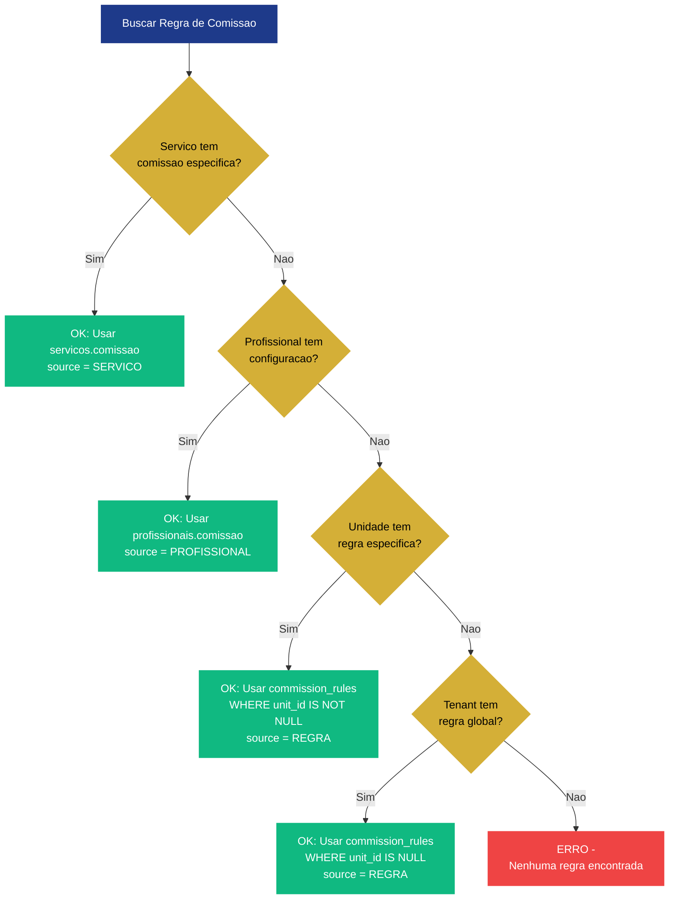
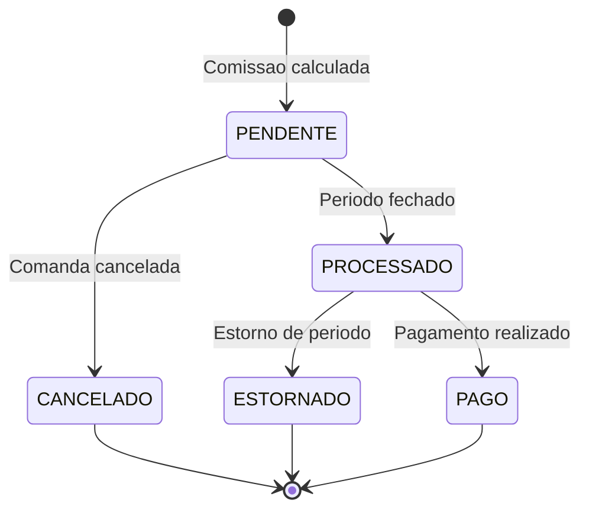
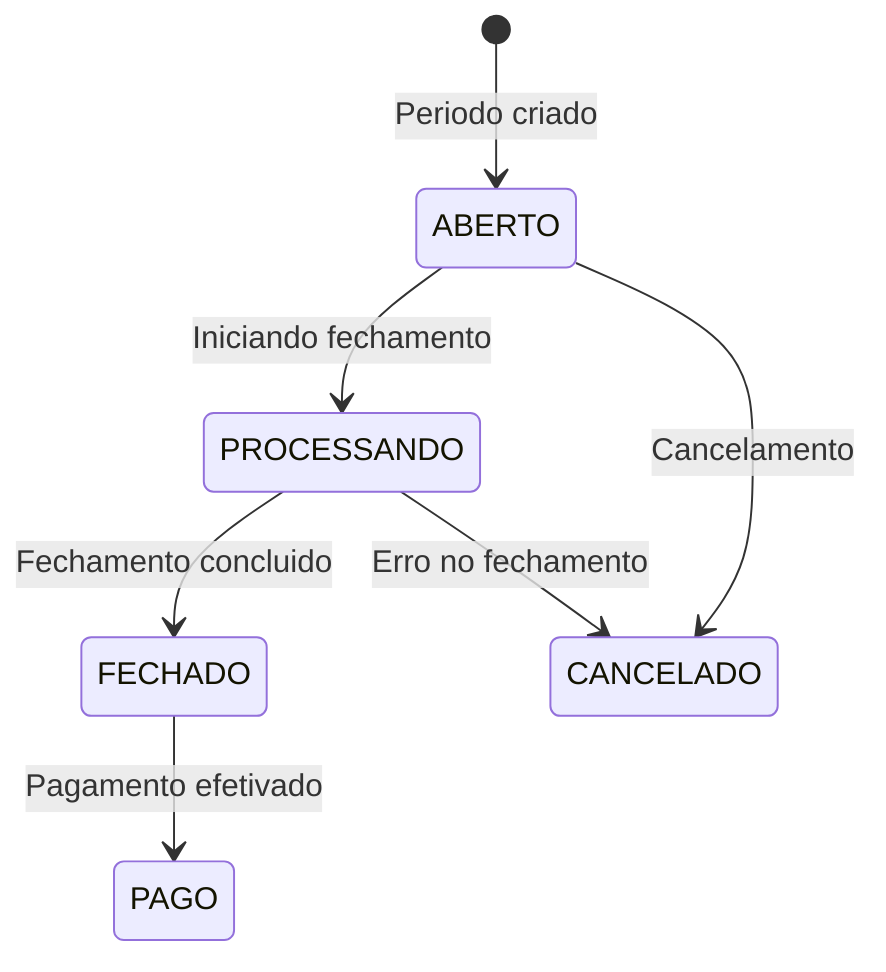
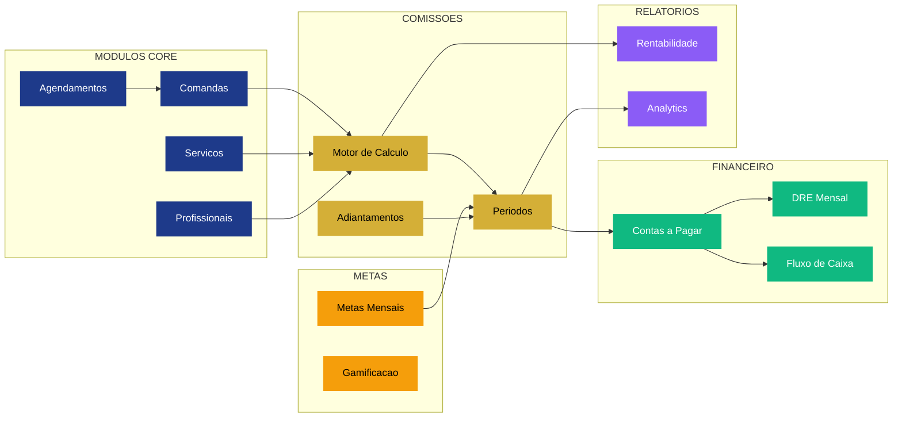

# Sistema de Comissoes - NEXO

> **Versão:** 2.1  
> **Sistema:** NEXO SaaS Barbershop  
> **Módulo:** Financeiro / Gestão de Profissionais  
> **Status:** Especificação Técnica - Alinhada com Código  
> **Atualização:** Dezembro/2025

---

## 1. Visão Geral

O sistema de comissões do NEXO automatiza todo o ciclo de vida das comissões dos profissionais, desde o cálculo no fechamento da comanda até o pagamento final com integração financeira completa.

### 1.1 Fluxo Principal

```mermaid
flowchart TD
    A[Comanda Fechada<br/>commands.status = CLOSED] --> B[Percorrer command_items<br/>tipo = SERVICO]
    
    B --> C{Identificar<br/>Profissional?}
    C -->|Nao Encontrado| C1[Marcar como<br/>PENDING_REVIEW]
    C -->|Identificado| D[Buscar Regra de Comissao<br/>Hierarquia 4 Niveis]
    
    D --> E{Regra do Servico<br/>servicos.comissao > 0?}
    E -->|Sim| F1[Usar Regra do Servico]
    E -->|Nao| F{Regra do Profissional<br/>profissionais.comissao?}
    
    F -->|Sim| F2[Usar Regra do Profissional]
    F -->|Nao| G{Regra da Unidade<br/>commission_rules + unit_id?}
    
    G -->|Sim| F3[Usar Regra da Unidade]
    G -->|Nao| H{Regra do Tenant<br/>commission_rules global?}
    
    H -->|Sim| F4[Usar Regra Global]
    H -->|Nao| H1[ERRO - Nenhuma<br/>Regra Encontrada]
    
    F1 --> I[Determinar Base de Calculo]
    F2 --> I
    F3 --> I
    F4 --> I
    
    I --> J{Base Mode?}
    J -->|BRUTO| J1[Base = command_item.preco_final]
    J -->|LIQUIDO| J2[Base = command_payment.valor_liquido]
    
    J1 --> K[Aplicar Modelo de Calculo]
    J2 --> K
    
    K --> L{Tipo de Modelo?}
    L -->|PERCENTUAL| L1[Valor = Base * (pct / 100)]
    L -->|FIXO| L2[Valor Fixo por Servico]
    
    L1 --> M[Validar Comissao <= Valor Servico]
    L2 --> M
    
    M --> N{Validacao OK?}
    N -->|Nao| N1[ERRO - Comissao<br/>Excede Valor Servico]
    N -->|Sim| O[Criar commission_items<br/>status = PENDENTE]
    
    O --> P[Audit Log:<br/>Comissao Calculada]
    P --> Q[Proximo Servico ou<br/>Finalizar Calculo]
    
    Q --> R[AGUARDAR FECHAMENTO<br/>DE PERIODO]
    
    subgraph PERIOD["FECHAMENTO DE PERIODO"]
        S[Gestor Seleciona<br/>Periodo + Profissional]
        T[Consolidar Comissoes<br/>status = PENDENTE]
        U[Verificar Metas Atingidas<br/>metas_mensais]
        V{Meta Batida?}
        V -->|Sim| V1[Calcular Bonus]
        V -->|Nao| V2[Sem Bonus]
        
        V1 --> W[Buscar Adiantamentos<br/>advances.status = APPROVED]
        V2 --> W
        
        W --> X[Calcular Valor Liquido:<br/>Total Comissoes + Bonus - Adiantamentos]
        X --> Y[Gerar commission_periods<br/>status = ABERTO]
        Y --> Z{Gestor Aprova?}
        Z -->|Nao| Z1[Ajustes Manuais<br/>com Justificativa]
        Z1 --> Y
        Z -->|Sim| AA[Fechar Periodo<br/>status = FECHADO]
    end
    
    R --> S
    
    subgraph FINANCIAL["INTEGRACAO FINANCEIRA"]
        BB[Gerar contas_a_pagar<br/>tipo = VARIAVEL<br/>categoria = Comissoes]
        CC[Atualizar DRE Mensal<br/>custo_comissoes<br/>regime = COMPETENCIA]
        DD[Registrar no<br/>fluxo_caixa_diario]
        
        BB --> CC --> DD
    end
    
    AA --> BB
    
    subgraph PAYMENT["FLUXO DE PAGAMENTO"]
        EE[Realizar Pagamento<br/>PIX/Transferencia/Dinheiro]
        FF[Registrar Pagamento<br/>contas_a_pagar.status = PAGO]
        GG[Atualizar Comissoes<br/>commission_items.status = PAGO]
        HH[Audit Log:<br/>Pagamento Realizado]
        
        EE --> FF --> GG --> HH
    end
    
    DD --> EE
    
    II[FIM -<br/>Comissao Paga e<br/>Contabilizada]
    
    HH --> II
    C1 --> II
    H1 --> II
    N1 --> II
    
    classDef processBox fill:#1E3A8A,stroke:#1E3A8A,stroke-width:2px,color:#fff
    classDef decisionBox fill:#D4AF37,stroke:#D4AF37,stroke-width:2px,color:#000
    classDef errorBox fill:#EF4444,stroke:#EF4444,stroke-width:2px,color:#fff
    classDef successBox fill:#10B981,stroke:#10B981,stroke-width:2px,color:#fff
    classDef criticalBox fill:#F59E0B,stroke:#F59E0B,stroke-width:2px,color:#000
    
    class A,B,D,I,K,O,P,Q,R,S,T,U,X,Y,AA,BB,CC,DD,EE,FF,GG,HH processBox
    class C,E,F,G,H,J,L,M,N,V,Z decisionBox
    class C1,H1,N1 errorBox
    class II successBox
    class F1,F2,F3,F4,J1,J2,L1,L2,V1,V2,W,Z1 criticalBox
```

---

## 2. Hierarquia de Regras de Comissao

O sistema busca regras em 4 níveis, parando na primeira encontrada:



### 2.1 Niveis de Prioridade

| Prioridade | Nível | Tabela | Condição | CommissionSource |
|:----------:|-------|--------|----------|------------------|
| 1 (Maior) | Servico | `servicos` | `comissao > 0` | `SERVICO` |
| 2 | Profissional | `profissionais` | `comissao IS NOT NULL` | `PROFISSIONAL` |
| 3 | Unidade | `commission_rules` | `unit_id IS NOT NULL` | `REGRA` |
| 4 (Menor) | Tenant | `commission_rules` | `unit_id IS NULL` | `REGRA` |
| Manual | - | - | Ajuste manual pelo gestor | `MANUAL` |

---

## 3. Modelos de Calculo Suportados

### 3.1 Tipos de Comissao (Implementados)

| Tipo | Código | Descricao | Fórmula | Exemplo |
|------|--------|-----------|---------|---------|
| **Percentual** | `PERCENTUAL` | Percentual sobre valor base | `Comissao = Base * (pct / 100)` | Corte R$ 50 × 40% = **R$ 20** |
| **Fixo** | `FIXO` | Valor fixo por serviço | `Comissao = ValorFixo` | R$ 15 por corte |

### 3.2 Tipos de Comissao (Roadmap Futuro)

| Tipo | Código | Descricao | Fórmula | Exemplo |
|------|--------|-----------|---------|---------|
| **Progressivo** | `PROGRESSIVE` | Faixas por volume | Tabela em `tiers` | 0-5k: 30%, 5k-10k: 40%, 10k+: 50% |
| **Híbrido** | `HYBRID` | Fixo + percentual | `Fixo + (Base × %)` | R$ 100 + (Vendas × 20%) |

### 3.3 Bases de Calculo

| Base | Código | Descricao | Quando Usar |
|------|--------|-----------|-------------|
| **Valor Bruto** | `BRUTO` | `command_item.preco_final` (apos descontos) | Padrão - maioria dos casos |
| **Valor Liquido** | `LIQUIDO` | `command_payment.valor_liquido` (apos taxas) | Para otimizar margem real |

### 3.4 Código de Calculo (Implementação Real)

```go
// entity/commission_item.go - NewCommissionItem()
var commissionValue decimal.Decimal
if commissionType == "PERCENTUAL" {
    commissionValue = grossValue.Mul(commissionRate).Div(decimal.NewFromInt(100))
} else {
    commissionValue = commissionRate // FIXO
}
```

---

## 4. Modelo de Dados

### 4.1 Tabelas Principais

#### `commission_items` - Itens Individuais de Comissao

```sql
CREATE TABLE commission_items (
    id UUID PRIMARY KEY,
    tenant_id UUID NOT NULL,
    unit_id UUID,
    
    -- Profissional
    professional_id UUID NOT NULL,
    
    -- Origem (comanda)
    command_id UUID,
    command_item_id UUID,
    appointment_id UUID,
    
    -- Servico
    service_id UUID,
    service_name VARCHAR(255),
    
    -- Valores
    gross_value NUMERIC(15,2) NOT NULL,         -- Valor bruto do serviço
    commission_rate NUMERIC(10,2) NOT NULL,     -- Taxa (% ou fixo)
    commission_type VARCHAR(20) NOT NULL,       -- PERCENTUAL | FIXO
    commission_value NUMERIC(15,2) NOT NULL,    -- Valor calculado
    
    -- Rastreabilidade
    commission_source VARCHAR(20) NOT NULL,     -- SERVICO | PROFISSIONAL | REGRA | MANUAL
    rule_id UUID,                               -- Regra aplicada
    
    -- Periodo
    reference_date DATE NOT NULL,
    status VARCHAR(20) DEFAULT 'PENDENTE',      -- PENDENTE | PROCESSADO | PAGO | CANCELADO | ESTORNADO
    period_id UUID,                             -- Periodo de fechamento
    
    -- Auditoria
    created_at TIMESTAMPTZ DEFAULT now(),
    updated_at TIMESTAMPTZ DEFAULT now(),
    processed_at TIMESTAMPTZ
);
```

#### `commission_rules` - Regras de Comissao

```sql
CREATE TABLE commission_rules (
    id UUID PRIMARY KEY,
    tenant_id UUID NOT NULL,
    unit_id UUID,                              -- NULL = regra global do tenant
    
    name VARCHAR(100) NOT NULL,
    description TEXT,
    type VARCHAR(20) NOT NULL,                 -- PERCENTUAL | FIXO
    default_rate NUMERIC(10,2) NOT NULL,       -- Taxa padrão
    
    min_amount NUMERIC(15,2),                  -- Valor mínimo (opcional)
    max_amount NUMERIC(15,2),                  -- Valor máximo (opcional)
    calculation_base VARCHAR(20),              -- BRUTO | LIQUIDO
    
    effective_from TIMESTAMPTZ NOT NULL,
    effective_to TIMESTAMPTZ,
    priority INT,
    is_active BOOLEAN DEFAULT true,
    
    created_at TIMESTAMPTZ DEFAULT now(),
    updated_at TIMESTAMPTZ DEFAULT now()
);
```

#### `commission_periods` - Periodos de Fechamento

```sql
CREATE TABLE commission_periods (
    id UUID PRIMARY KEY,
    tenant_id UUID NOT NULL,
    unit_id UUID,
    
    reference_month VARCHAR(7) NOT NULL,       -- YYYY-MM
    professional_id UUID,
    
    -- Totais
    total_gross NUMERIC(15,2) DEFAULT 0,       -- Σ gross_value
    total_commission NUMERIC(15,2) DEFAULT 0,  -- Σ commission_value
    total_advances NUMERIC(15,2) DEFAULT 0,    -- Σ adiantamentos
    total_adjustments NUMERIC(15,2) DEFAULT 0, -- Σ ajustes
    total_net NUMERIC(15,2) DEFAULT 0,         -- Liquido a pagar
    items_count INT DEFAULT 0,
    
    -- Status
    status VARCHAR(20) DEFAULT 'ABERTO',       -- ABERTO | PROCESSANDO | FECHADO | PAGO | CANCELADO
    period_start TIMESTAMPTZ NOT NULL,
    period_end TIMESTAMPTZ NOT NULL,
    
    -- Fechamento
    closed_at TIMESTAMPTZ,
    closed_by UUID,
    
    -- Pagamento
    paid_at TIMESTAMPTZ,
    paid_by UUID,
    conta_pagar_id UUID,                       -- Integração financeira
    
    notes TEXT,
    created_at TIMESTAMPTZ DEFAULT now(),
    updated_at TIMESTAMPTZ DEFAULT now()
);
```

#### `advances` - Adiantamentos

```sql
CREATE TABLE advances (
    id UUID PRIMARY KEY,
    tenant_id UUID NOT NULL,
    professional_id UUID NOT NULL,
    
    amount NUMERIC(15,2) NOT NULL,
    reason TEXT,
    request_date DATE NOT NULL,
    
    status VARCHAR(20) DEFAULT 'PENDENTE',     -- PENDENTE | APPROVED | REJECTED | DEDUCTED
    approved_by UUID,
    approved_at TIMESTAMPTZ,
    
    deducted_in UUID,                          -- commission_period_id onde foi deduzido
    
    created_at TIMESTAMPTZ DEFAULT now(),
    updated_at TIMESTAMPTZ DEFAULT now()
);
```

---

## 5. Estados e Transições

### 5.1 CommissionItem Status



| Status | Descricao | Acoes Permitidas |
|--------|-----------|------------------|
| `PENDENTE` | Aguardando fechamento de periodo | Cancelar, Processar |
| `PROCESSADO` | Incluido em periodo fechado | Estornar |
| `PAGO` | Pagamento efetivado | Nenhuma |
| `CANCELADO` | Cancelado (comanda cancelada) | Nenhuma |
| `ESTORNADO` | Estornado apos processamento | Nenhuma |

### 5.2 CommissionPeriod Status



| Status | Descricao | Proximo Status |
|--------|-----------|----------------|
| `ABERTO` | Periodo em edicao | PROCESSANDO, CANCELADO |
| `PROCESSANDO` | Calculando totais | FECHADO, CANCELADO |
| `FECHADO` | Aprovado, aguardando pagamento | PAGO |
| `PAGO` | Pagamento realizado | - |
| `CANCELADO` | Periodo cancelado | - |

---

## 6. Integração com Outros Módulos

### 6.1 Diagrama de Integração



### 6.2 Pontos de Integração

| Origem | Destino | Gatilho | Dados Transferidos |
|--------|---------|---------|-------------------|
| Comanda | commission_items | Fechamento comanda | Item, Profissional, Valor, Regra |
| commission_items | commission_periods | Fechamento periodo | Totais consolidados |
| commission_periods | contas_a_pagar | Periodo FECHADO | Valor líquido, Vencimento |
| contas_a_pagar | fluxo_caixa_diario | Pagamento | Saída de caixa |
| contas_a_pagar | dre_mensal | Competência | Custo de comissões |
| advances | commission_periods | Fechamento | Valor a deduzir |
| metas_mensais | commission_periods | Fechamento | Bonus por meta |

---

## 7. Use Cases Implementados

### 7.1 Calculo de Comissao (FinalizarComandaIntegrada)

**Arquivo:** `usecase/command/finalizar_comanda_integrada.go`

```go
// processarComissaoServico cria CommissionItem para um item do tipo SERVICO
func (uc *FinalizarComandaIntegradaUseCase) processarComissaoServico(
    ctx context.Context,
    tenantID uuid.UUID,
    professionalID string,
    command *entity.Command,
    item *entity.CommandItem,
    rule *entity.CommissionRule,
    output *FinalizarComandaIntegradaOutput,
) error {
    // 1. Valor bruto do serviço
    grossValue := decimal.NewFromFloat(item.PrecoFinal)
    
    // 2. Criar item de comissao (calcula automaticamente)
    commissionItem, _ := entity.NewCommissionItem(
        tenantID,
        professionalID,
        grossValue,
        rule.DefaultRate,
        rule.Type,        // PERCENTUAL ou FIXO
        "SERVICO",        // CommissionSource
        time.Now(),
    )
    
    // 3. Associar à comanda
    commissionItem.CommandID = &command.ID
    commissionItem.CommandItemID = &item.ID
    commissionItem.ServiceID = &item.ItemID
    commissionItem.RuleID = &rule.ID
    
    // 4. Persistir
    created, _ := uc.commissionItemRepo.Create(ctx, commissionItem)
    
    // 5. Atualizar output
    output.CommissionItems = append(output.CommissionItems, created.ID)
    output.TotalComissoes = output.TotalComissoes.Add(created.CommissionValue)
    
    return nil
}
```

### 7.2 Fechamento de Periodo (CloseCommissionPeriod)

**Arquivo:** `usecase/commission/close_commission_period.go`

```go
// Ao fechar periodo:
// 1. Consolidar todos os commission_items PENDENTES do profissional no periodo
// 2. Buscar adiantamentos APPROVED
// 3. Calcular: TotalNet = TotalCommission + Bonus - Advances - Adjustments
// 4. Criar ContaPagar com vencimento D+7
// 5. Atualizar status dos items para PROCESSADO
// 6. Atualizar periodo para FECHADO
```

---

## 8. Validações de Negócio

### 8.1 No Calculo da Comissao

| Validacao | Regra | Erro |
|-----------|-------|------|
| Valor bruto | `gross_value > 0` | `ErrValorDeveSerPositivo` |
| Tipo comissao | `IN ('PERCENTUAL', 'FIXO')` | `ErrTipoComissaoInvalido` |
| Percentual | Se PERCENTUAL, `rate <= 100` | `ErrPercentualInvalido` |
| Comissao <= Valor | `commission_value <= gross_value` | Validacao implícita |

### 8.2 No Fechamento de Periodo

| Validacao | Regra | Erro |
|-----------|-------|------|
| Periodo aberto | `status = 'ABERTO'` | `ErrPeriodoNaoAberto` |
| Data fim | `period_end >= period_start` | `ErrDataFimAntesInicio` |
| Profissional | `professional_id NOT NULL` | `ErrProfissionalObrigatorio` |
| Itens existem | `items_count > 0` | `ErrPeriodoSemItens` |

---

## 9. Diferencial NEXO vs Concorrentes

| Funcionalidade | NEXO | Trinks | AppBarber | BarberSystem | Salonist |
|----------------|:----:|:------:|:---------:|:------------:|:--------:|
| Hierarquia de Regras | OK: 4 níveis | ERRO: | ERRO: | ERRO: | ERRO: |
| Tipos de Calculo | OK: 2 tipos | 🟡 1 | 🟡 1 | ERRO: | 🟡 1 |
| Bases de Calculo | OK: 2 opções | 🟡 1 | 🟡 1 | 🟡 1 | 🟡 1 |
| Integração Financeira | OK: Nativa | ERRO: Manual | ERRO: Manual | ERRO: | 🟡 Parcial |
| Multi-Unidade | OK: Nativo | ERRO: | 🟡 | ERRO: | OK: |
| Adiantamentos | OK: Automático | ERRO: | ERRO: | ERRO: | ERRO: |
| Bonus por Metas | OK: Automático | ERRO: | ERRO: | ERRO: | ERRO: |
| Auditoria Completa | OK: | ERRO: | 🟡 | ERRO: | 🟡 |
| DRE Integrado | OK: Tempo Real | ERRO: | ERRO: | ERRO: | 🟡 Manual |

---

## 10. Roadmap de Evolução

### 10.1 Implementado OK:

- [x] Calculo automático ao fechar comanda (T-COM-001)
- [x] Hierarquia de 4 níveis para regras
- [x] Tipos PERCENTUAL e FIXO
- [x] Bases BRUTO e LIQUIDO
- [x] Geração de ContaPagar ao fechar periodo (T-COM-002)
- [x] Integração com DRE (custo_comissoes)
- [x] Adiantamentos com dedução automática

### 10.2 Planejado 🔜

- [ ] **PROGRESSIVE**: Faixas progressivas por volume
- [ ] **HYBRID**: Valor fixo + percentual variável
- [ ] Bonificação automática por metas
- [ ] Dashboard de rentabilidade por profissional
- [ ] Relatório de comissões exportável (PDF/Excel)
- [ ] Notificação push no fechamento de periodo

---

## 11. Referências de Código

| Arquivo | Responsabilidade |
|---------|------------------|
| `entity/commission_item.go` | Entidade CommissionItem |
| `entity/commission_rule.go` | Entidade CommissionRule |
| `entity/commission_period.go` | Entidade CommissionPeriod |
| `usecase/command/finalizar_comanda_integrada.go` | Calculo de comissao |
| `usecase/commission/close_commission_period.go` | Fechamento de periodo |
| `repository/postgres/commission_item_repository.go` | Persistência |
| `handler/commission_item_handler.go` | API REST |
| `migrations/045_commission_items.up.sql` | Schema DDL |

---

*Documento atualizado em 08/Dezembro/2025 - Alinhado com código fonte.*
