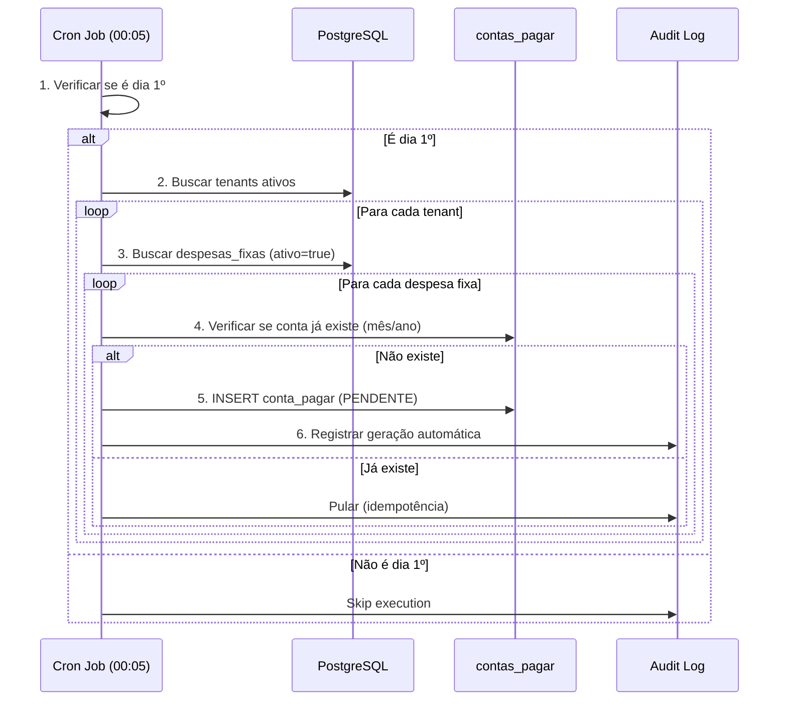
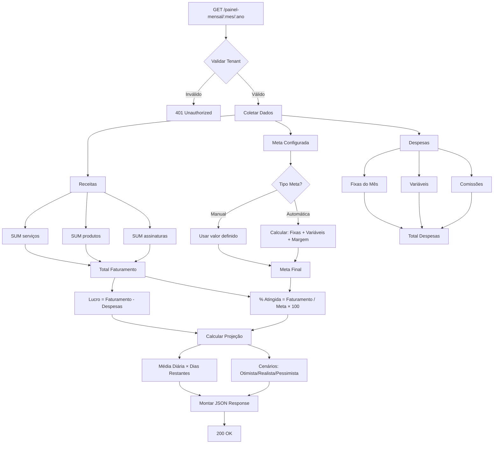
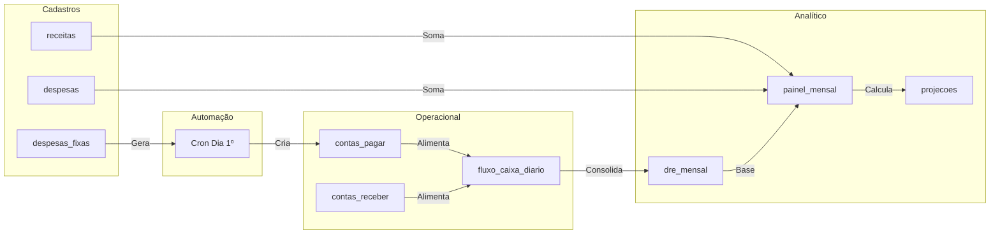

# Fluxo Financeiro — NEXO v3.0

**Versão:** 3.0  
**Última Atualização:** 28/11/2025  
**Status:** 🔴 **PRONTO PARA IMPLEMENTAÇÃO**  
**Responsável:** Tech Lead + Produto  
**PRD Referência:** `Tarefas/03-FINANCEIRO/PRD_FINANCEIRO.md`

---

## 📋 Sumário Executivo

O Módulo Financeiro é o **cérebro estratégico** do NEXO. Evoluiu de um sistema de registro para uma plataforma de **Inteligência Financeira** que:

1. **Automatiza o Básico:** Gera contas a pagar de despesas fixas automaticamente.
2. **Projeta o Futuro:** Calcula receita e lucro estimado até o fim do mês.
3. **Orienta Decisões:** Mostra meta inteligente baseada em custos reais.
4. **Centraliza Tudo:** Receitas (serviços, produtos, assinaturas) + Despesas (fixas, variáveis, comissões).

### 🏆 Diferencial Competitivo

| Funcionalidade | NEXO | Trinks | AppBarber | BarberSystem |
|----------------|:----:|:------:|:---------:|:------------:|
| Painel Financeiro Mensal | ✅ | ❌ | ❌ | ❌ |
| Meta Automática Inteligente | ✅ | ❌ | ❌ | ❌ |
| Projeção de Lucro | ✅ | ❌ | ❌ | ❌ |
| Despesas Fixas Recorrentes | ✅ | ❌ | 🟡 | ❌ |
| Integração Assinaturas + DRE | ✅ | ❌ | ❌ | ❌ |

---

## 🧩 Componentes do Módulo (PRD)

### A) Gestão de Despesas Fixas (Recorrentes)

Tela onde o dono cadastra despesas mensais fixas:
- Aluguel, Condomínio
- Energia, Água, Internet, Telefone
- Sistemas (NEXO, POS)
- Contador, Limpeza, Segurança
- Salários, Benefícios, Marketing
- Manutenção, Seguros, Impostos

**✨ Automação:** Cada despesa gera automaticamente uma conta a pagar todo **dia 1º do mês**.

### B) Painel Financeiro Mensal (Dashboard)

Dashboard completo com:
- 💰 **Faturamento:** Serviços + Produtos + Assinaturas
- 🎯 **Meta Mensal:** Manual ou automática + % atingida
- 📊 **Quanto Falta:** Valor necessário para bater meta
- 🔴 **Despesas Fixas:** Total mensal consolidado
- 🟠 **Despesas Variáveis:** Insumos, manutenção, comissões
- 🟢 **Lucro Operacional:** Resultado atual em tempo real

### C) Projeção Financeira (Até o Final do Mês)

O sistema calcula automaticamente:
- 📈 **Receita Projetada:** Até o último dia do mês
- 💵 **Lucro Previsto:** Cenário otimista, realista, pessimista
- 🔮 **Probabilidade:** Chance de bater a meta (%)

**Base de Cálculo:**
- Assinaturas confirmadas do mês
- Média móvel dos últimos 7 dias
- Sazonalidade (finais de semana pesam mais)

---

## 🔐 Regras de Negócio (RN)

### RN-FIN-001: Estrutura de Lançamentos
Todo lançamento financeiro deve respeitar:
- `tenant_id` (isolamento multi-tenant obrigatório)
- `categoria` (Receita ou Despesa)
- `competência` (mês/ano de referência)
- `regime` (Competência para DRE, Caixa para Fluxo)

### RN-FIN-002: Despesas Fixas Recorrentes
| ID | Regra | Criticidade |
|----|-------|-------------|
| RN-FX-001 | Despesas fixas DEVEM gerar lançamentos automáticos todo dia 1º do mês | 🔴 Crítica |
| RN-FX-002 | Lançamentos gerados podem ser editados individualmente | 🟡 Média |
| RN-FX-003 | Editar despesa fixa NÃO afeta lançamentos já criados | 🔴 Crítica |
| RN-FX-004 | Deletar despesa fixa NÃO deleta lançamentos já criados | 🔴 Crítica |
| RN-FX-005 | Despesa fixa pode ser temporariamente desabilitada (ativo=false) | 🟡 Média |

### RN-FIN-003: Painel Mensal e Metas
| ID | Regra | Criticidade |
|----|-------|-------------|
| RN-PNL-001 | Meta mensal pode ser MANUAL ou AUTOMÁTICA | 🔴 Crítica |
| RN-PNL-002 | Meta Automática = `(Despesas Fixas + Variáveis Estimadas) / (1 - Margem%)` | 🔴 Crítica |
| RN-PNL-003 | Painel DEVE usar regime de competência, não caixa | 🔴 Crítica |
| RN-PNL-004 | Comissões entram como **despesa operacional** | 🔴 Crítica |
| RN-PNL-005 | Faturamento = Serviços + Produtos + Assinaturas | 🔴 Crítica |
| RN-PNL-006 | Painel atualiza em tempo real a cada lançamento | 🟡 Média |

### RN-FIN-004: Projeções
| ID | Regra | Criticidade |
|----|-------|-------------|
| RN-PRJ-001 | Projeção DEVE recalcular diariamente às 00:00 | 🔴 Crítica |
| RN-PRJ-002 | Projeção considera assinaturas confirmadas do mês | 🔴 Crítica |
| RN-PRJ-003 | Projeção usa média móvel dos últimos 7 dias | 🟡 Média |
| RN-PRJ-004 | Projeção considera sazonalidade (fim de semana > dias úteis) | 🟢 Baixa |
| RN-PRJ-005 | Projeção DEVE mostrar cenário otimista/realista/pessimista | 🟢 Baixa |

### RN-FIN-005: Multi-Tenant
| ID | Regra | Criticidade |
|----|-------|-------------|
| RN-MT-001 | Todas as despesas fixas DEVEM ter tenant_id | 🔴 Crítica |
| RN-MT-002 | Painel mensal filtra apenas dados do tenant ativo | 🔴 Crítica |
| RN-MT-003 | Unidades diferentes podem ter despesas fixas diferentes | 🟡 Média |

---

## 📊 Diagramas de Fluxo

### 1. Fluxo de Despesas Fixas (Geração Automática)



### 2. Fluxo do Painel Mensal (Cálculo)



### 3. Fluxo de Integração Completo



---

## 🛠️ Detalhamento Técnico (Backend)

### 1. Modelo de Dados: `despesas_fixas`

```sql
CREATE TABLE despesas_fixas (
    id UUID PRIMARY KEY DEFAULT gen_random_uuid(),
    tenant_id UUID NOT NULL REFERENCES tenants(id) ON DELETE CASCADE,
    unidade_id UUID REFERENCES units(id) ON DELETE CASCADE,
    
    -- Dados da despesa
    nome VARCHAR(255) NOT NULL,
    descricao TEXT,
    valor DECIMAL(15,2) NOT NULL CHECK (valor >= 0),
    categoria VARCHAR(100) NOT NULL,
    
    -- Recorrência
    recorrente BOOLEAN DEFAULT true NOT NULL,
    dia_vencimento INT NOT NULL CHECK (dia_vencimento BETWEEN 1 AND 31),
    
    -- Configurações
    metodo_pagamento VARCHAR(50),
    ativo BOOLEAN DEFAULT true NOT NULL,
    
    -- Auditoria
    criado_em TIMESTAMP DEFAULT NOW() NOT NULL,
    atualizado_em TIMESTAMP DEFAULT NOW() NOT NULL,
    criado_por UUID REFERENCES users(id),
    atualizado_por UUID REFERENCES users(id)
);

-- Índices para performance
CREATE INDEX idx_despesas_fixas_tenant ON despesas_fixas(tenant_id);
CREATE INDEX idx_despesas_fixas_ativo ON despesas_fixas(tenant_id, ativo);
CREATE INDEX idx_despesas_fixas_unidade ON despesas_fixas(unidade_id);

-- RLS (Row Level Security)
ALTER TABLE despesas_fixas ENABLE ROW LEVEL SECURITY;
CREATE POLICY despesas_fixas_tenant_isolation ON despesas_fixas
    USING (tenant_id = current_setting('app.current_tenant')::uuid);
```

### 2. Categorias Predefinidas (Enum)

```go
// internal/domain/financial/categoria.go
type CategoriaDespesaFixa string

const (
    CategoriaAluguel     CategoriaDespesaFixa = "ALUGUEL"
    CategoriaCondominio  CategoriaDespesaFixa = "CONDOMINIO"
    CategoriaEnergia     CategoriaDespesaFixa = "ENERGIA"
    CategoriaAgua        CategoriaDespesaFixa = "AGUA"
    CategoriaInternet    CategoriaDespesaFixa = "INTERNET"
    CategoriaTelefone    CategoriaDespesaFixa = "TELEFONE"
    CategoriaSistemas    CategoriaDespesaFixa = "SISTEMAS"
    CategoriaContador    CategoriaDespesaFixa = "CONTADOR"
    CategoriaLimpeza     CategoriaDespesaFixa = "LIMPEZA"
    CategoriaSeguranca   CategoriaDespesaFixa = "SEGURANCA"
    CategoriaSalarios    CategoriaDespesaFixa = "SALARIOS"
    CategoriaBeneficios  CategoriaDespesaFixa = "BENEFICIOS"
    CategoriaMarketing   CategoriaDespesaFixa = "MARKETING"
    CategoriaManutencao  CategoriaDespesaFixa = "MANUTENCAO"
    CategoriaSeguros     CategoriaDespesaFixa = "SEGUROS"
    CategoriaImpostos    CategoriaDespesaFixa = "IMPOSTOS"
    CategoriaOutras      CategoriaDespesaFixa = "OUTRAS"
)
```

### 3. DTOs (Conforme Padrão NEXO)

```go
// internal/application/dto/despesa_fixa_dto.go

// Request - Criar Despesa Fixa
type CreateDespesaFixaRequest struct {
    Nome            string `json:"nome" validate:"required,min=3,max=255"`
    Descricao       string `json:"descricao,omitempty"`
    Valor           string `json:"valor" validate:"required"` // Sempre string para money
    Categoria       string `json:"categoria" validate:"required"`
    DiaVencimento   int    `json:"dia_vencimento" validate:"required,min=1,max=31"`
    MetodoPagamento string `json:"metodo_pagamento,omitempty"`
    UnidadeID       string `json:"unidade_id,omitempty"`
    Ativo           bool   `json:"ativo"`
}

// Response - Despesa Fixa
type DespesaFixaResponse struct {
    ID              string `json:"id"`
    Nome            string `json:"nome"`
    Descricao       string `json:"descricao,omitempty"`
    Valor           string `json:"valor"`
    Categoria       string `json:"categoria"`
    DiaVencimento   int    `json:"dia_vencimento"`
    MetodoPagamento string `json:"metodo_pagamento,omitempty"`
    UnidadeID       string `json:"unidade_id,omitempty"`
    Ativo           bool   `json:"ativo"`
    Recorrente      bool   `json:"recorrente"`
    CriadoEm        string `json:"criado_em"`
    AtualizadoEm    string `json:"atualizado_em"`
}

// Response - Lista de Despesas Fixas
type ListDespesasFixasResponse struct {
    Data        []DespesaFixaResponse `json:"data"`
    Total       int                   `json:"total"`
    TotalMensal string                `json:"total_mensal"`
}
```

### 4. Endpoints da API

#### **A. Gestão de Despesas Fixas**

| Método | Endpoint | Descrição |
|--------|----------|-----------|
| `POST` | `/api/v1/financeiro/despesas-fixas` | Criar despesa recorrente |
| `GET` | `/api/v1/financeiro/despesas-fixas` | Listar (filtros: ativo, categoria, unidade_id) |
| `GET` | `/api/v1/financeiro/despesas-fixas/:id` | Detalhar uma despesa |
| `PUT` | `/api/v1/financeiro/despesas-fixas/:id` | Atualizar |
| `DELETE` | `/api/v1/financeiro/despesas-fixas/:id` | Deletar (soft delete) |

#### **B. Painel Mensal**

| Método | Endpoint | Descrição |
|--------|----------|-----------|
| `GET` | `/api/v1/financeiro/painel-mensal/:mes/:ano` | Dashboard completo do mês |

**Response Exemplo:**

```json
{
  "mes": 11,
  "ano": 2025,
  "periodo": "2025-11-01 a 2025-11-30",
  
  "faturamento": {
    "total": "41500.00",
    "servicos": "28000.00",
    "produtos": "8500.00",
    "assinaturas": "5000.00",
    "detalhamento_diario": [
      {"dia": 1, "valor": "1200.00"},
      {"dia": 2, "valor": "1850.00"}
    ]
  },
  
  "meta": {
    "valor": "60000.00",
    "tipo": "AUTOMATICA",
    "porcentagem_atingida": 69.17,
    "falta_faturar": "18500.00",
    "base_calculo": {
      "despesas_fixas": "24500.00",
      "despesas_variaveis_estimadas": "15000.00",
      "margem_desejada": "20500.00"
    }
  },
  
  "despesas": {
    "fixas": {
      "total": "24500.00",
      "itens": [
        {"categoria": "ALUGUEL", "valor": "8500.00", "quantidade": 1}
      ]
    },
    "variaveis": {
      "total": "7800.00",
      "insumos": "3200.00",
      "manutencao": "4600.00"
    },
    "comissoes": {
      "total": "12000.00",
      "por_barbeiro": [
        {"barbeiro_id": "uuid", "nome": "João Silva", "valor": "4500.00"}
      ]
    }
  },
  
  "resultado": {
    "lucro_operacional": "18500.00",
    "margem": 44.58,
    "status": "POSITIVO"
  },
  
  "projecao": {
    "receita_projetada": "52700.00",
    "lucro_projetado": "21200.00",
    "probabilidade_bater_meta": 75,
    "dias_restantes": 15,
    "media_diaria_necessaria": "1233.33",
    "media_diaria_atual": "1383.33",
    "cenarios": {
      "otimista": "58000.00",
      "realista": "52700.00",
      "pessimista": "48000.00"
    }
  }
}
```

#### **C. Metas**

| Método | Endpoint | Descrição |
|--------|----------|-----------|
| `POST` | `/api/v1/financeiro/meta-mensal` | Definir meta manual |
| `PUT` | `/api/v1/financeiro/meta-mensal/configurar` | Configurar meta automática (margem %) |

### 5. Cron Job (Geração Automática)

```go
// cmd/cron/generate_fixed_expenses.go

func (c *FixedExpensesCronJob) Run(ctx context.Context) error {
    now := time.Now()
    
    // 1. Verificar se é dia 1º
    if now.Day() != 1 {
        c.logger.Info("Skipping: not day 1")
        return nil
    }
    
    // 2. Buscar todos os tenants ativos
    tenants, err := c.tenantRepo.FindAllActive(ctx)
    if err != nil {
        return fmt.Errorf("failed to fetch tenants: %w", err)
    }
    
    for _, tenant := range tenants {
        // 3. Buscar despesas fixas ativas do tenant
        despesas, err := c.despesaFixaRepo.FindActiveByTenant(ctx, tenant.ID)
        if err != nil {
            c.logger.Error("failed to fetch fixed expenses", "tenant", tenant.ID, "error", err)
            continue
        }
        
        for _, despesa := range despesas {
            // 4. Verificar se conta já existe (idempotência)
            exists, err := c.contaPagarRepo.ExistsByOrigemAndPeriodo(
                ctx, tenant.ID, despesa.ID, now.Month(), now.Year(),
            )
            if err != nil || exists {
                continue
            }
            
            // 5. Criar conta a pagar
            conta := &domain.ContaPagar{
                ID:             uuid.New().String(),
                TenantID:       tenant.ID,
                Descricao:      despesa.Nome,
                Valor:          despesa.Valor,
                Categoria:      despesa.Categoria,
                DataVencimento: time.Date(now.Year(), now.Month(), despesa.DiaVencimento, 0, 0, 0, 0, time.Local),
                Status:         domain.StatusPendente,
                Origem:         "AUTOMATICO",
                OrigemID:       despesa.ID,
            }
            
            if err := c.contaPagarRepo.Save(ctx, tenant.ID, conta); err != nil {
                c.logger.Error("failed to create conta pagar", "despesa", despesa.ID, "error", err)
                continue
            }
            
            // 6. Registrar log de auditoria
            c.auditLog.Record(ctx, audit.Event{
                TenantID: tenant.ID,
                Action:   "CONTA_PAGAR_GERADA_AUTOMATICAMENTE",
                EntityID: conta.ID,
                Metadata: map[string]interface{}{
                    "despesa_fixa_id": despesa.ID,
                    "valor":           conta.Valor.String(),
                },
            })
        }
    }
    
    return nil
}
```

**Schedule:** Diário às 00:05 (evita problemas de virada de dia)

---

## 🖥️ Interface (Frontend)

### 1. Tela: Contas Fixas

**Localização:** Sidebar → Financeiro → Contas Fixas

**Componentes:**
- 📊 **Header:** Total de custos fixos mensais
- 📋 **Tabela:** Lista com Nome, Categoria, Valor, Vencimento, Status
- ➕ **Botão:** "Nova Despesa Fixa"
- 🔧 **Ações:** Editar, Desativar, Excluir

**Modal de Criação/Edição:**
- Nome (text)
- Descrição (textarea, opcional)
- Valor (currency input)
- Categoria (select com enum)
- Dia de Vencimento (number 1-31)
- Método de Pagamento (select)
- Unidade (select, se multi-unidade)
- Ativo (toggle)

### 2. Tela: Painel Financeiro Mensal

**Localização:** Financeiro → Painel Mensal

**Layout (Grid 3x2):**

| Coluna 1 | Coluna 2 | Coluna 3 |
|----------|----------|----------|
| 💰 Faturamento | 🎯 Meta Mensal | 📊 Projeção |
| 🔴 Despesas Fixas | 🟠 Despesas Variáveis | 🟢 Resultado |

**Bloco 1 - Faturamento:**
- Card com total
- Breakdown: Serviços | Produtos | Assinaturas
- Gráfico de linha (faturamento diário)

**Bloco 2 - Meta Mensal:**
- Barra de progresso circular
- % Atingida
- Quanto falta faturar
- Toggle: Meta Manual / Automática

**Bloco 3 - Projeção:**
- Receita projetada até fim do mês
- Lucro projetado
- Probabilidade de bater meta (%)
- Cenários: Otimista | Realista | Pessimista

**Bloco 4 - Despesas Fixas:**
- Total consolidado
- Lista agrupada por categoria

**Bloco 5 - Despesas Variáveis:**
- Total variável
- Insumos | Comissões | Manutenção

**Bloco 6 - Resultado Operacional:**
- DRE Simplificado
- Receita Total - Despesas = Lucro/Prejuízo
- Indicador visual (verde/vermelho)

---

## 🧪 Cenários de Teste (QA)

### Teste 1: Geração Automática de Contas
1. Criar despesa fixa (ex: Aluguel R$ 5.000, vencimento dia 10)
2. Simular execução do cron (dia 1º)
3. ✅ Verificar que conta a pagar foi criada com status PENDENTE
4. Executar cron novamente no mesmo dia
5. ✅ Verificar que NÃO duplicou (idempotência)

### Teste 2: Cálculo de Meta Automática
1. Cadastrar R$ 10.000 de custos fixos
2. Configurar margem desejada de 20%
3. ✅ Verificar meta sugerida = R$ 12.500

### Teste 3: Cálculo de Projeção
1. Faturar R$ 10.000 em 10 dias úteis (média R$ 1.000/dia)
2. ✅ Verificar projeção para 30 dias ≈ R$ 30.000

### Teste 4: Multi-Tenant Isolamento
1. Criar despesa fixa no Tenant A
2. Logar como Tenant B
3. ✅ Verificar que despesa NÃO aparece

---

## ✅ Checklist de Implementação

### Backend
- [ ] Migration: tabela `despesas_fixas`
- [ ] Domain: entities + repository interface
- [ ] Infra: repository PostgreSQL (sqlc)
- [ ] Application: use cases CRUD
- [ ] HTTP: handlers + rotas
- [ ] Cron: geração automática dia 1º
- [ ] Painel: endpoint agregador

### Frontend
- [ ] Tela: Contas Fixas (CRUD)
- [ ] Tela: Painel Mensal (Dashboard)
- [ ] Componentes: Cards, Gráficos, Tabelas
- [ ] Hooks: React Query
- [ ] Validação: Zod schemas

### DevOps
- [ ] Cron job configurado (Kubernetes/Railway)
- [ ] Monitoramento de execução
- [ ] Alertas de falha

---

## 📚 Referências

- [PRD Financeiro](../../Tarefas/03-FINANCEIRO/PRD_FINANCEIRO.md)
- [Arquitetura Backend](../../docs/04-backend/GUIA_DEV_BACKEND.md)
- [Design System](../../docs/03-frontend/DESIGN_SYSTEM.md)
- [Modelo de Dados](../../docs/02-arquitetura/MODELO_DE_DADOS.md)
- [DTOs Padrão](../../docs/04-backend/DTOs.md)

---

**Status:** 🔴 PRONTO PARA IMPLEMENTAÇÃO  
**Próximo Marco:** Implementação Backend (Despesas Fixas)  
**Última Revisão:** 28/11/2025
