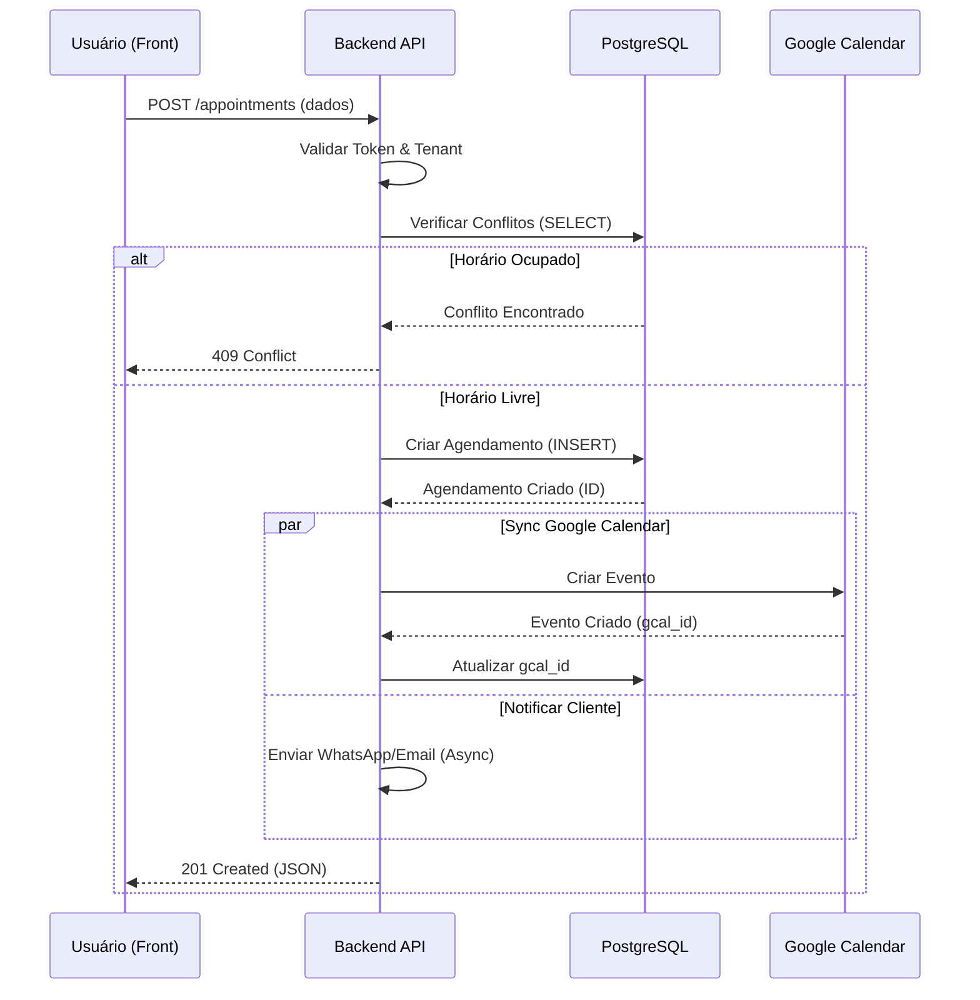
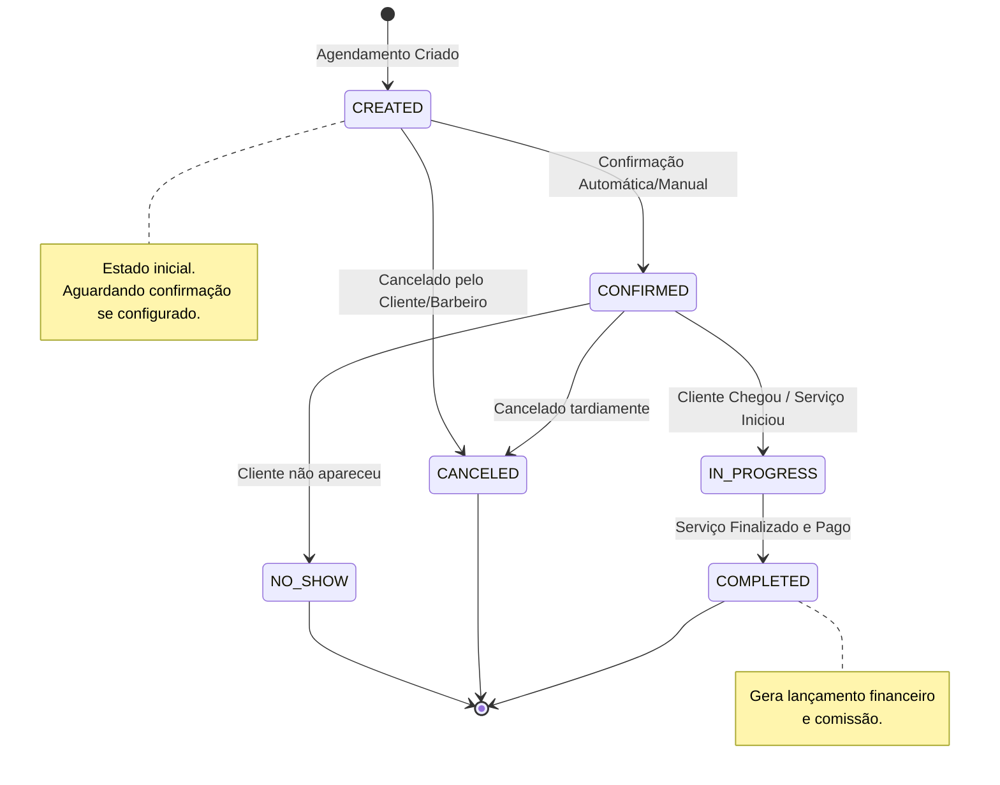
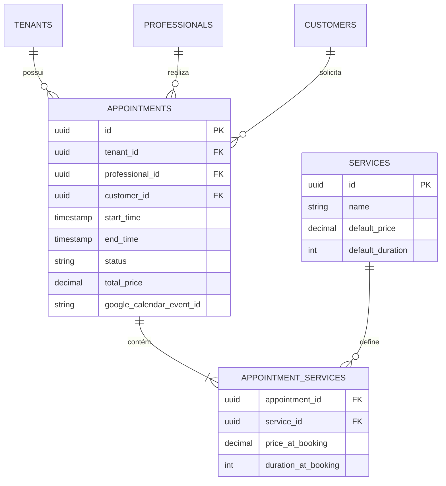
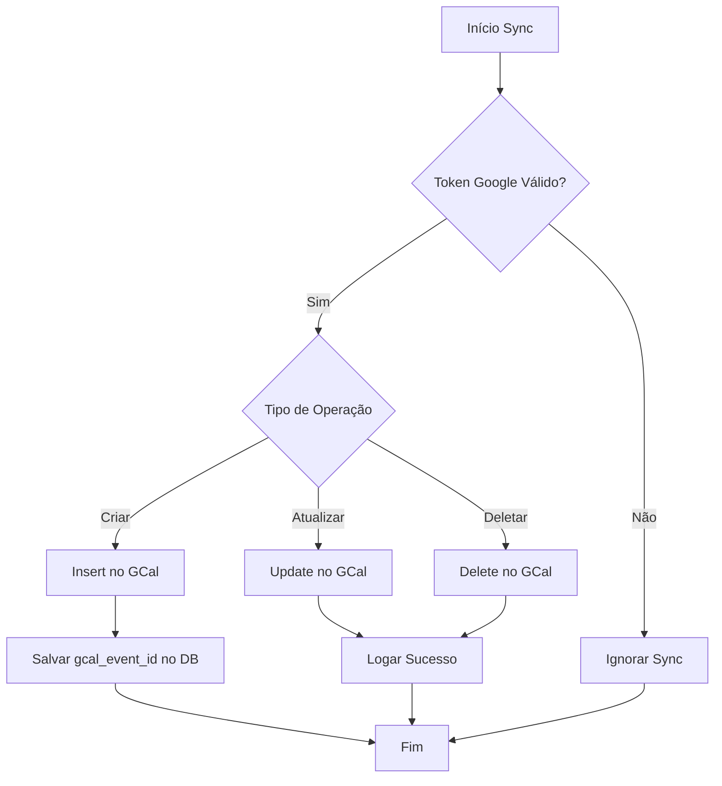

# Diagramas — Módulo de Agendamento | NEXO v1.0

Este documento contém os diagramas técnicos para o módulo de Agendamento, utilizando a sintaxe **Mermaid**.

---

## 1. Fluxo de Criação de Agendamento (Sequence Diagram)

Este diagrama ilustra a interação entre Frontend, API, Banco de Dados e Google Calendar durante a criação de um agendamento.

---

## 2. Máquina de Estados do Agendamento (State Diagram)

Estados possíveis para um agendamento e as transições permitidas.

---

## 3. Modelo de Dados Simplificado (ER Diagram)

Relacionamento entre as principais tabelas do módulo.

---

## 4. Fluxo de Sincronização Google Calendar (Flowchart)

Lógica de decisão para sincronização bidirecional (futuro) ou unidirecional (MVP).

---

**Responsável:** Tech Lead  
**Data:** 25/11/2025  
**Status:** ✅ COMPLETO
