# 🔍 Diagrama de Dependências Completo - Barber Analytics Pro v2.0

**Data:** 21/11/2025
**Tipo:** Auditoria Arquitetural
**Autor:** Auditor Técnico / Arquiteto Sênior

---

## ⚠️ ANÁLISE CRÍTICA DE ARQUITETURA

Este diagrama expõe **TODAS** as dependências reais do sistema, incluindo acoplamentos indevidos, camadas furadas e problemas arquiteturais detectados.

---

## 🗺️ Diagrama Mestre de Dependências

```mermaid
flowchart TB
    subgraph EXTERNAL["🌐 SISTEMAS EXTERNOS"]
        ASAAS[Asaas API v3<br/>Subscriptions/Invoices]
        NEON[Neon PostgreSQL<br/>Banco Principal]
        CERTBOT[Let's Encrypt<br/>Certificados SSL]
    end

    subgraph INFRA["⚙️ INFRAESTRUTURA"]
        NGINX[NGINX<br/>Reverse Proxy<br/>Rate Limit 100req/s]
        SYSTEMD[SystemD<br/>Cron Scheduler]
        PROMETHEUS[Prometheus<br/>Métricas]
        GRAFANA[Grafana<br/>Dashboards]
        SENTRY[Sentry<br/>APM/Errors]
    end

    subgraph BACKEND["🔧 BACKEND GO - CLEAN ARCHITECTURE"]
        direction TB

        subgraph HTTP_LAYER["📡 HTTP LAYER - Presentation"]
            ECHO[Echo Framework v4<br/>HTTP Server]
            MIDDLEWARES[Middleware Chain]
            LOGGER_MW[Logger Middleware]
            RECOVERY_MW[Recovery Middleware]
            AUTH_MW[Auth Middleware<br/>JWT RS256]
            TENANT_MW[Tenant Context Middleware]
            HANDLERS[HTTP Handlers]
            ROUTES[Route Definitions]
        end

        subgraph APP_LAYER["🎯 APPLICATION LAYER"]
            DTOS[DTOs Request/Response]
            MAPPERS[Domain ↔ DTO Mappers]
            USECASES[Use Cases]
            UC_FINANCIAL[Financial Use Cases<br/>Create/List Receitas/Despesas]
            UC_SUBSCRIPTION[Subscription Use Cases<br/>CRUD Assinaturas]
            UC_BARBER_TURN[Barber Turn Use Cases<br/>Lista da Vez]
            UC_AUDIT[Audit Use Cases<br/>Log Actions]
        end

        subgraph DOMAIN_LAYER["💎 DOMAIN LAYER - Core Business"]
            ENTITIES[Entities/Aggregates]
            ENT_TENANT[Tenant Entity]
            ENT_USER[User Entity]
            ENT_RECEITA[Receita Entity]
            ENT_DESPESA[Despesa Entity]
            ENT_SUBSCRIPTION[Subscription Entity]
            ENT_INVOICE[Invoice Entity]
            ENT_BARBER_TURN[BarberTurnList Entity]
            VALUE_OBJECTS[Value Objects<br/>Endereco, Money, etc]
            DOMAIN_SERVICES[Domain Services<br/>CalculoComissao, etc]
            REPOSITORY_PORTS[Repository Interfaces<br/>Ports]
        end

        subgraph INFRASTRUCTURE_LAYER["🏗️ INFRASTRUCTURE LAYER"]
            REPOSITORIES[PostgreSQL Repositories<br/>SQLC Type-Safe]
            REPO_TENANT[TenantRepository]
            REPO_USER[UserRepository]
            REPO_RECEITA[ReceitaRepository]
            REPO_DESPESA[DespesaRepository]
            REPO_SUBSCRIPTION[SubscriptionRepository]
            REPO_INVOICE[InvoiceRepository]
            REPO_BARBER[BarberTurnRepository]
            REPO_AUDIT[AuditLogRepository]

            EXTERNAL_INTEGRATIONS[External Integrations]
            ASAAS_CLIENT[Asaas API Client<br/>Timeout 30s]

            SCHEDULER[Cron Scheduler<br/>robfig/cron/v3]
            CRON_SYNC_ASAAS[SyncAsaasJob<br/>Faturas → DB]
            CRON_SNAPSHOT[FinancialSnapshotJob<br/>Agregações]
            CRON_TURN_RESET[TurnListResetJob<br/>Reset Mensal]
        end
    end

    subgraph FRONTEND["🎨 FRONTEND"]
        direction TB
        NEXTJS[Next.js 16 App Router<br/>React 19]
        TANSTACK[TanStack Query<br/>State Management]
        ZOD[Zod + React Hook Form<br/>Validação]
        SHADCN[shadcn/ui<br/>Components]
        TAILWIND[Tailwind CSS 4<br/>Styling]
    end

    subgraph PERSISTENCE["💾 PERSISTENCE"]
        DB_TENANTS[(tenants)]
        DB_USERS[(users)]
        DB_CATEGORIAS[(categorias)]
        DB_RECEITAS[(receitas)]
        DB_DESPESAS[(despesas)]
        DB_PLANOS[(planos_assinatura)]
        DB_SUBSCRIPTIONS[(assinaturas)]
        DB_INVOICES[(assinatura_invoices)]
        DB_BARBER_TURN[(barbers_turn_list)]
        DB_TURN_HISTORY[(barber_turn_history)]
        DB_AUDIT[(audit_logs)]
    end

    subgraph ALERTAS["⚠️ PROBLEMAS ARQUITETURAIS DETECTADOS"]
        A1[ACOPLAMENTO FORTE:<br/>UseCases → Repositories<br/>SEM abstração Port]
        A2[DEPENDÊNCIA BIDIRECIONAL:<br/>Handlers ←→ DTOs<br/>Quebra SRP]
        A3[CAMADA FURADA:<br/>Cron Jobs → DB direto<br/>Ignora Domain Layer]
        A4[ACOPLAMENTO EXTERNO:<br/>Infrastructure → Asaas<br/>SEM Circuit Breaker]
        A5[MULTI-TENANT FRÁGIL:<br/>Tenant Context via Middleware<br/>Risco de vazamento]
        A6[SCHEDULER HARDCODED:<br/>Cron em código<br/>Deveria ser config externa]
    end

    %% EXTERNAL CONNECTIONS
    ASAAS -.->|API Calls| ASAAS_CLIENT
    NEON -.->|Connection Pool| REPOSITORIES
    CERTBOT -.->|SSL Renew| NGINX

    %% INFRA CONNECTIONS
    NGINX --> ECHO
    SYSTEMD -.->|Trigger| SCHEDULER
    PROMETHEUS -.->|Scrape| ECHO
    GRAFANA -.->|Query| PROMETHEUS
    SENTRY -.->|Error Track| MIDDLEWARES

    %% HTTP FLOW
    ECHO --> MIDDLEWARES
    MIDDLEWARES --> LOGGER_MW
    LOGGER_MW --> RECOVERY_MW
    RECOVERY_MW --> AUTH_MW
    AUTH_MW --> TENANT_MW
    TENANT_MW --> HANDLERS
    HANDLERS --> ROUTES

    %% HANDLER → USE CASE (CORRETO)
    ROUTES --> USECASES
    HANDLERS --> DTOS
    DTOS --> MAPPERS
    MAPPERS --> USECASES

    %% USE CASES → DOMAIN (CORRETO)
    USECASES --> UC_FINANCIAL
    USECASES --> UC_SUBSCRIPTION
    USECASES --> UC_BARBER_TURN
    USECASES --> UC_AUDIT

    UC_FINANCIAL --> ENTITIES
    UC_SUBSCRIPTION --> ENTITIES
    UC_BARBER_TURN --> ENTITIES
    UC_AUDIT --> ENTITIES

    %% DOMAIN ENTITIES
    ENTITIES --> ENT_TENANT
    ENTITIES --> ENT_USER
    ENTITIES --> ENT_RECEITA
    ENTITIES --> ENT_DESPESA
    ENTITIES --> ENT_SUBSCRIPTION
    ENTITIES --> ENT_INVOICE
    ENTITIES --> ENT_BARBER_TURN

    ENTITIES --> VALUE_OBJECTS
    ENTITIES --> DOMAIN_SERVICES

    %% DOMAIN → PORTS (CORRETO Clean Arch)
    ENT_TENANT --> REPOSITORY_PORTS
    ENT_USER --> REPOSITORY_PORTS
    ENT_RECEITA --> REPOSITORY_PORTS
    ENT_DESPESA --> REPOSITORY_PORTS
    ENT_SUBSCRIPTION --> REPOSITORY_PORTS
    ENT_INVOICE --> REPOSITORY_PORTS
    ENT_BARBER_TURN --> REPOSITORY_PORTS

    %% PORTS → REPOSITORIES (Dependency Inversion)
    REPOSITORY_PORTS -.->|implements| REPOSITORIES

    %% REPOSITORIES → DB
    REPOSITORIES --> REPO_TENANT
    REPOSITORIES --> REPO_USER
    REPOSITORIES --> REPO_RECEITA
    REPOSITORIES --> REPO_DESPESA
    REPOSITORIES --> REPO_SUBSCRIPTION
    REPOSITORIES --> REPO_INVOICE
    REPOSITORIES --> REPO_BARBER
    REPOSITORIES --> REPO_AUDIT

    REPO_TENANT --> DB_TENANTS
    REPO_USER --> DB_USERS
    REPO_RECEITA --> DB_RECEITAS
    REPO_DESPESA --> DB_DESPESAS
    REPO_SUBSCRIPTION --> DB_SUBSCRIPTIONS
    REPO_INVOICE --> DB_INVOICES
    REPO_BARBER --> DB_BARBER_TURN
    REPO_BARBER --> DB_TURN_HISTORY
    REPO_AUDIT --> DB_AUDIT

    DB_CATEGORIAS -.->|FK| DB_RECEITAS
    DB_CATEGORIAS -.->|FK| DB_DESPESAS
    DB_PLANOS -.->|FK| DB_SUBSCRIPTIONS
    DB_SUBSCRIPTIONS -.->|FK| DB_INVOICES
    DB_TENANTS -.->|FK CASCADE| DB_USERS
    DB_TENANTS -.->|FK CASCADE| DB_RECEITAS
    DB_TENANTS -.->|FK CASCADE| DB_DESPESAS

    %% EXTERNAL INTEGRATIONS
    UC_SUBSCRIPTION --> ASAAS_CLIENT
    EXTERNAL_INTEGRATIONS --> ASAAS_CLIENT

    %% CRON JOBS (PROBLEMA: acessa Repository direto)
    SCHEDULER --> CRON_SYNC_ASAAS
    SCHEDULER --> CRON_SNAPSHOT
    SCHEDULER --> CRON_TURN_RESET

    CRON_SYNC_ASAAS -->|CAMADA FURADA| REPO_INVOICE
    CRON_SYNC_ASAAS -->|CAMADA FURADA| ASAAS_CLIENT
    CRON_SNAPSHOT -->|CAMADA FURADA| REPO_RECEITA
    CRON_TURN_RESET -->|CAMADA FURADA| REPO_BARBER

    %% FRONTEND → BACKEND
    NEXTJS --> NGINX
    TANSTACK -.->|HTTP Calls| ROUTES
    ZOD -.->|Validation Schema| DTOS

    %% ALERTAS
    TENANT_MW -.->|Risco| A5
    HANDLERS -.->|Bidirectional| A2
    CRON_SYNC_ASAAS -.->|Violação| A3
    ASAAS_CLIENT -.->|Sem Resiliência| A4
    SCHEDULER -.->|Hardcoded| A6
    USECASES -.->|Acoplamento Direto| A1

    classDef external fill:#ef4444,stroke:#dc2626,color:#fff
    classDef infra fill:#6366f1,stroke:#4f46e5,color:#fff
    classDef http fill:#10b981,stroke:#059669,color:#fff
    classDef app fill:#f59e0b,stroke:#d97706,color:#fff
    classDef domain fill:#8b5cf6,stroke:#7c3aed,color:#fff
    classDef infrastructure fill:#3b82f6,stroke:#2563eb,color:#fff
    classDef persistence fill:#06b6d4,stroke:#0891b2,color:#fff
    classDef frontend fill:#ec4899,stroke:#db2777,color:#fff
    classDef alert fill:#dc2626,stroke:#991b1b,color:#fff,stroke-width:4px

    class ASAAS,NEON,CERTBOT external
    class NGINX,SYSTEMD,PROMETHEUS,GRAFANA,SENTRY infra
    class ECHO,MIDDLEWARES,LOGGER_MW,RECOVERY_MW,AUTH_MW,TENANT_MW,HANDLERS,ROUTES http
    class DTOS,MAPPERS,USECASES,UC_FINANCIAL,UC_SUBSCRIPTION,UC_BARBER_TURN,UC_AUDIT app
    class ENTITIES,ENT_TENANT,ENT_USER,ENT_RECEITA,ENT_DESPESA,ENT_SUBSCRIPTION,ENT_INVOICE,ENT_BARBER_TURN,VALUE_OBJECTS,DOMAIN_SERVICES,REPOSITORY_PORTS domain
    class REPOSITORIES,REPO_TENANT,REPO_USER,REPO_RECEITA,REPO_DESPESA,REPO_SUBSCRIPTION,REPO_INVOICE,REPO_BARBER,REPO_AUDIT,EXTERNAL_INTEGRATIONS,ASAAS_CLIENT,SCHEDULER,CRON_SYNC_ASAAS,CRON_SNAPSHOT,CRON_TURN_RESET infrastructure
    class DB_TENANTS,DB_USERS,DB_CATEGORIAS,DB_RECEITAS,DB_DESPESAS,DB_PLANOS,DB_SUBSCRIPTIONS,DB_INVOICES,DB_BARBER_TURN,DB_TURN_HISTORY,DB_AUDIT persistence
    class NEXTJS,TANSTACK,ZOD,SHADCN,TAILWIND frontend
    class A1,A2,A3,A4,A5,A6 alert
```



---

## 🔴 PROBLEMAS ARQUITETURAIS IDENTIFICADOS

### 1. **ACOPLAMENTO FORTE** (A1)

**Severidade:** 🔴 CRÍTICA

**Problema:**

```go
// Use Case acessa Repository diretamente sem abstração de Port
type CreateReceitaUseCase struct {
    repository *PostgresReceitaRepository // ❌ ACOPLAMENTO CONCRETO
}
```

**Impacto:**

- Impossível testar sem banco de dados
- Impossível trocar implementação de persistência
- Viola Dependency Inversion Principle (SOLID)

**Solução:**

```go
// ✅ CORRETO: Depender de abstração
type CreateReceitaUseCase struct {
    repository domain.ReceitaRepository // Interface
}
```

---

### 2. **DEPENDÊNCIA BIDIRECIONAL** (A2)

**Severidade:** 🟡 MÉDIA

**Problema:**

```go
// Handler conhece DTO e DTO conhece Handler
type ReceitaHandler struct {
    dtos *ReceitaDTO // ❌ BIDIRECIONAL
}

type ReceitaDTO struct {
    handler *ReceitaHandler // ❌ CIRCULAR
}
```

**Impacto:**

- Quebra Single Responsibility Principle
- Dificulta testes unitários
- Acoplamento desnecessário

**Solução:**

```go
// ✅ CORRETO: Handlers usam DTOs, mas DTOs não conhecem Handlers
type ReceitaHandler struct {
    useCase application.CreateReceitaUseCase
}

// DTOs são estruturas puras
type ReceitaDTO struct {
    ID    string
    Valor float64
}
```

---

### 3. **CAMADA FURADA** (A3)

**Severidade:** 🔴 CRÍTICA

**Problema:**

```go
// Cron Job acessa Repository direto, pulando Domain Layer
func (j *SyncAsaasJob) Execute() {
    invoices := j.asaasClient.GetInvoices() // ❌
    j.repository.Save(invoices)             // ❌ PULA USE CASE
}
```

**Impacto:**

- Lógica de negócio espalhada
- Violação de Clean Architecture
- Regras de domínio não aplicadas

**Solução:**

```go
// ✅ CORRETO: Cron Job chama Use Case
func (j *SyncAsaasJob) Execute() {
    j.syncInvoicesUseCase.Execute()
}
```

---

### 4. **ACOPLAMENTO EXTERNO SEM RESILIÊNCIA** (A4)

**Severidade:** 🟡 MÉDIA

**Problema:**

```go
// Chamada Asaas sem Circuit Breaker, Retry ou Fallback
func (c *AsaasClient) GetInvoices() ([]*Invoice, error) {
    resp, err := http.Get(c.baseURL + "/invoices") // ❌ SEM RESILIÊNCIA
    return parseInvoices(resp)
}
```

**Impacto:**

- Sistema quebra se Asaas cair
- Não há retry automático
- Sem fallback para cache

**Solução:**

```go
// ✅ CORRETO: Usar resilience4go ou similar
func (c *AsaasClient) GetInvoices() ([]*Invoice, error) {
    return c.circuitBreaker.Execute(func() (interface{}, error) {
        return c.httpClient.Get(...)
    })
}
```

---

### 5. **MULTI-TENANT FRÁGIL** (A5)

**Severidade:** 🔴 CRÍTICA

**Problema:**

```go
// Tenant ID extraído de Middleware e armazenado em Context
func TenantMiddleware(next echo.HandlerFunc) echo.HandlerFunc {
    return func(c echo.Context) error {
        tenantID := extractFromJWT(c)
        c.Set("tenant_id", tenantID) // ❌ FRÁGIL
        return next(c)
    }
}

// Handler assume que existe
func (h *Handler) Create(c echo.Context) error {
    tenantID := c.Get("tenant_id").(string) // ❌ PANIC SE NÃO EXISTIR
}
```

**Impacto:**

- Risco de vazamento de dados entre tenants
- Possível panic em runtime
- Difícil rastrear erros

**Solução:**

```go
// ✅ CORRETO: Type-safe tenant context
type TenantContext struct {
    TenantID string
    Verified bool
}

func GetTenantContext(c echo.Context) (*TenantContext, error) {
    ctx, ok := c.Get("tenant").(*TenantContext)
    if !ok || !ctx.Verified {
        return nil, ErrUnauthorized
    }
    return ctx, nil
}
```

---

### 6. **SCHEDULER HARDCODED** (A6)

**Severidade:** 🟢 BAIXA

**Problema:**

```go
// Cron schedule hardcoded em código
scheduler.AddFunc("0 2 * * *", syncAsaasJob) // ❌ HARDCODED
```

**Impacto:**

- Não é possível alterar schedule sem rebuild
- Dificulta testes
- Não segue 12-factor app

**Solução:**

```yaml
# ✅ CORRETO: Config externa
jobs:
  sync_asaas:
    schedule: "0 2 * * *"
    enabled: true

  snapshot:
    schedule: "0 6 * * *"
    enabled: true
```

---

## 📊 LEGENDAS DO DIAGRAMA

### Tipos de Dependência

| Símbolo  | Significado                          | Exemplo           |
| -------- | ------------------------------------ | ----------------- |
| `-->`    | Dependência forte (direta)           | Handler → UseCase |
| `-.->`   | Dependência fraca (opcional/runtime) | Prometheus → Echo |
| `==X==>` | **Problema arquitetural**            | Cron → Repository |
| `<-->`   | **Dependência bidirecional**         | Handler ↔ DTO     |

### Cores por Camada

| Cor               | Camada               | Descrição                        |
| ----------------- | -------------------- | -------------------------------- |
| 🔴 Vermelho       | Sistemas Externos    | Asaas, Neon, Certbot             |
| 🔵 Azul Escuro    | Infraestrutura       | NGINX, Prometheus, Grafana       |
| 🟢 Verde          | HTTP Layer           | Echo, Middlewares, Handlers      |
| 🟠 Laranja        | Application Layer    | Use Cases, DTOs, Mappers         |
| 🟣 Roxo           | Domain Layer         | Entities, Value Objects, Ports   |
| 🔵 Azul Claro     | Infrastructure Layer | Repositories, Cron, Asaas Client |
| 🔵 Ciano          | Persistence          | Tabelas PostgreSQL               |
| 🟣 Rosa           | Frontend             | Next.js, React Query             |
| 🔴 Vermelho Forte | **ALERTAS**          | Problemas críticos               |

---

## ✅ PONTOS FORTES DA ARQUITETURA

1. **Clean Architecture Base:** Camadas bem definidas (Domain/Application/Infrastructure)
2. **DDD Aplicado:** Entities, Value Objects, Aggregates presentes
3. **Repository Pattern:** Abstração de persistência implementada
4. **Multi-Tenancy:** Column-based com tenant_id em todas as tabelas
5. **Type-Safe SQL:** Uso de SQLC para queries tipadas
6. **JWT RS256:** Autenticação assimétrica segura
7. **Middleware Chain:** Cross-cutting concerns bem separados

---

## 🔧 RECOMENDAÇÕES DE CORREÇÃO

### Prioridade CRÍTICA (2 semanas)

1. ✅ Refatorar Cron Jobs para usar Use Cases
2. ✅ Implementar Circuit Breaker para Asaas Client
3. ✅ Criar type-safe Tenant Context
4. ✅ Remover acoplamentos diretos Repository → UseCase

### Prioridade MÉDIA (1 mês)

5. ✅ Externalizar configuração de Cron
6. ✅ Implementar retry/backoff em integrações
7. ✅ Adicionar cache Redis para queries pesadas
8. ✅ Melhorar error handling com custom errors

### Prioridade BAIXA (futuro)

9. ⚪ Implementar Event Sourcing para audit
10. ⚪ Adicionar OpenTelemetry tracing
11. ⚪ Migrar para gRPC interno
12. ⚪ Implementar CQRS para leituras

---

## 📚 Referências

- **Clean Architecture:** Robert C. Martin
- **DDD:** Eric Evans - Domain-Driven Design
- **SOLID:** Uncle Bob - Agile Software Development
- **Resilience Patterns:** Microsoft Azure Architecture
- **Multi-Tenancy:** SaaS Architecture Best Practices

---

**Última Atualização:** 21/11/2025
**Próxima Revisão:** A cada sprint (2 semanas)
**Status:** 🔴 AÇÃO REQUERIDA
