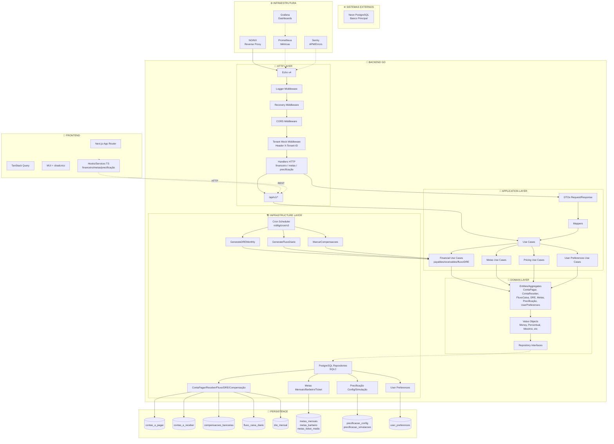
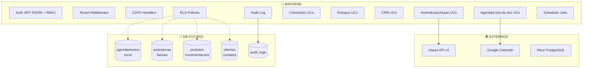

> Criado em: 21/11/2025 19:00 (America/Sao_Paulo)

# 🔍 Diagrama de Dependências Completo - Barber Analytics Pro v2.0

**Data:** 22/11/2025  
**Tipo:** Auditoria Arquitetural (estado atual vs planejado)  
**Autor:** Auditor Técnico / Arquiteto Sênior

---

## 🗺️ Diagrama Mestre de Dependências (Estado Atual)



---

## ⚠️ Gaps e Alertas (Estado Atual)

- **Auth/RBAC ausente:** TENANT_MW usa header mock; falta JWT RS256 e roles.
- **Validator não registrado:** handlers chamam `c.Validate`, mas o Echo não tem validator global configurado.
- **Repos financeiros incompletos:** `SumByPeriod` e agregações retornam zero, impactando Fluxo/DRE.
- **LGPD parcial:** `user_preferences` tem repo, mas handlers `/me/*` não expostos/completos.
- **Futuros não implementados:** Assinaturas/Asaas, Agenda/Lista da Vez, Comissões, Estoque, CRM.
- **RLS/auditoria:** sem RLS no Postgres; sem audit logs.

---

## 🧭 Diagrama Planejado (quando módulos forem adicionados)



---

## ✅ Próximos Passos Sugeridos

1. **Auth/RBAC + Tenant real:** adicionar middleware JWT RS256 e popular `tenant_id` a partir do token.
2. **Validator:** registrar `validator/v10` no Echo antes dos handlers.
3. **Repos financeiros:** implementar agregações/filtros em `conta_pagar/receber` para fluxos/DRE corretos.
4. **LGPD:** expor rotas `/me/preferences|export|delete` e completar use cases.
5. **Planejar módulos futuros:** agenda/lista da vez, assinaturas/Asaas, comissões, estoque, CRM — alinhar contratos e schemas.
6. **RLS/Auditoria:** ativar RLS por tabela e logar `tenant_id`/`user_id` em operações sensíveis.
```
